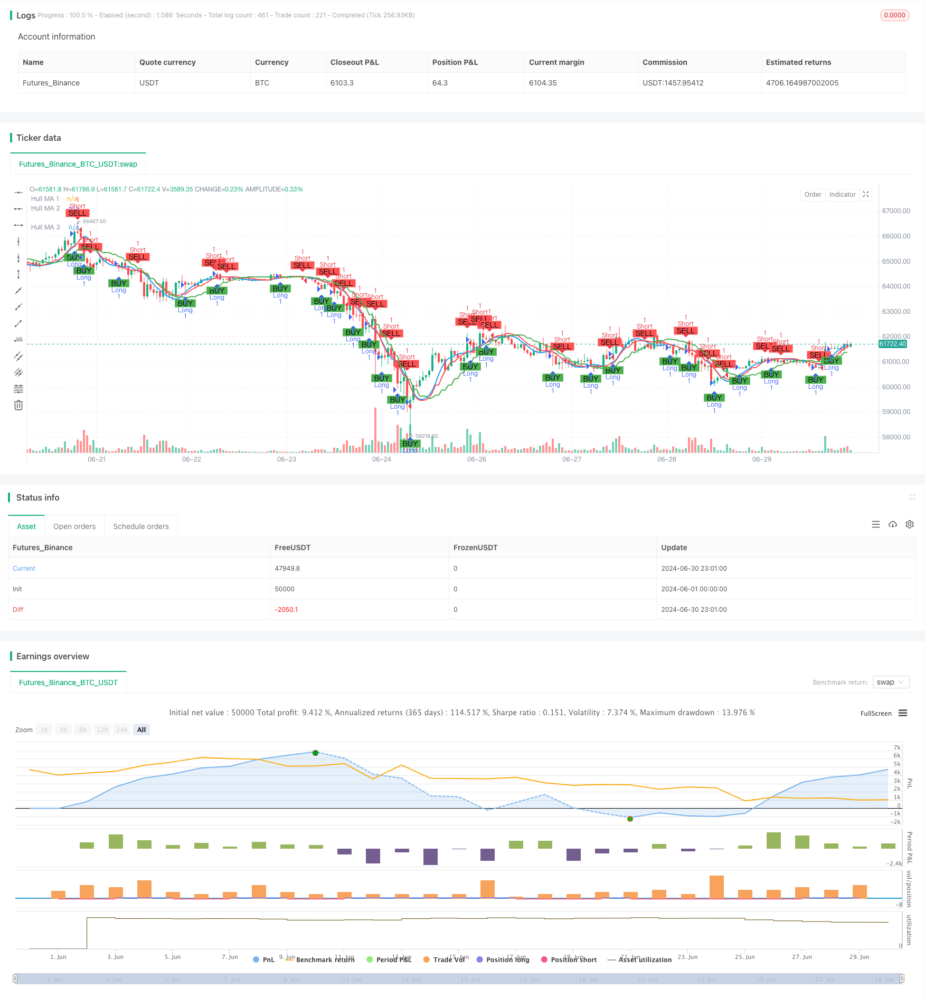

> Name

Multi-Timeframe-Hull-Moving-Average-Crossover-Strategy
> Author

ChaoZhang

> Strategy Description



[trans]
#### Overview
The multi-period Hull Moving Average crossover strategy is a quantitative trading strategy based on the Hull Moving Average (HMA). This strategy utilizes the HMA indicator on different time periods to identify market trends and generate trading signals. The core of the strategy is to determine the timing of entry and exit by observing the intersection of the short-term HMA and the mid-term HMA, while using the long-term HMA as a reference for the overall trend. This multi-period approach can effectively filter noise and improve the accuracy of trading decisions.
#### Strategy Principle
The core principle of this strategy is to take advantage of the fast response characteristics of the Hull Moving Average (HMA) and the advantages of multi-period analysis. The specific implementation is as follows:
1. Calculate HMA for three different periods:
   - HMA 1: 25 minute cycle
   - HMA 2: 75 minute cycle
   - HMA 3: 125 minute cycle
2. Trading signal generation:
   - Long signal: when HMA 1 crosses HMA 2
   - Short signal: when HMA 1 crosses HMA 2
3. As a long-term trend indicator, HMA 3 does not directly participate in signal generation, but it can be used to judge the overall market trend.
4. The strategy uses a fixed proportion of account equity (10%) as the amount of funds for each transaction.
5. Use the PlotShape function to mark buy and sell signals on the chart to enhance the visualization effect.
6. Alert conditions for long and short positions are set to facilitate real-time monitoring of market opportunities.
#### Strategic Advantages
1. Reduced hysteresis: Hull moving averages inherently have lower hysteresis and respond to price changes faster than traditional moving averages.
2. Multi-period analysis: By combining HMAs of different time periods, the strategy can capture short-term, mid-term and long-term trends at the same time, improving the accuracy and stability of trading.
3. Noise filtering: Using HMA with a longer period (75 minutes and 125 minutes) can effectively filter short-term market noise and reduce false signals.
4. Flexibility: The strategy allows users to customize the length and data source of each HMA to adapt to different market environments and trading styles.
5. Risk management: Using a fixed proportion of account equity for trading helps control risk exposure.
6. Visualization: Help traders better understand and verify the strategy logic by visually displaying buying and selling signals on the chart.
7. Real-time alerts: Trading signal alerts are set up to enable traders to seize market opportunities in a timely manner.
#### Strategy Risk
1. Trend reversal risk: In a strong trending market, the strategy may frequently generate signals, leading to over-trading and unnecessary costs.
2. Sideways market risk: In a market with no obvious trend, HMA crossover may generate a large number of false signals, affecting strategy performance.
3. Parameter sensitivity: Strategy performance is highly dependent on the selected HMA length and time period, and different parameter combinations may lead to completely different results.
4. Slippage and transaction costs: Frequent trading may result in higher slippage and transaction costs, especially in less liquid markets.
5. Technical dependence: Strategies that rely entirely on technical indicators, ignore fundamental factors, and may perform poorly when major news or events occur.
6. Overfitting risk: If parameters are over-optimized based on historical data, it may cause the strategy to perform poorly in real trading.
#### Strategy optimization direction
1. Introducing a trend filter: You can consider using HMA 3 as a trend filter to only open positions in the long-term trend direction to reduce counter-trend transactions.
2. Dynamically adjust parameters: Implement an adaptive mechanism to dynamically adjust the length and time period of HMA according to market volatility to adapt to different market environments.
3. Add stop-loss and take-profit mechanisms: Introduce stop-loss and take-profit rules based on ATR or fixed percentages to better control risks and lock in profits.
4. Optimize position management: Implement more complex position management strategies, such as dynamically adjusting position size based on volatility or account profit and loss.
5. Integrate other technical indicators: Combine with other technical indicators such as RSI, MACD and other technical indicators to build more comprehensive entry and exit conditions.
6. Backtesting and Optimization: Conduct extensive backtesting under different market conditions and time frames to find the optimal parameter combination.
7. Consider fundamental factors: Introduce consideration of important economic data releases or company events, and adjust strategic behaviors in specific periods.
8. Implement partial position trading: Allow the strategy to execute partial position trading based on signal strength, rather than entering and exiting the full position every time.
#### Summarize
The multi-period Hull moving average crossover strategy is a quantitative trading strategy that combines the fast response characteristics of the Hull moving average and the advantages of multi-period analysis. By observing the cross-relationship between HMAs in different time periods, the strategy can effectively identify market trends and generate trading signals. Its advantage is that it reduces the lag of traditional moving averages while improving the reliability of signals through multi-period analysis. However, the strategy also faces risks such as trend reversal and parameter sensitivity.
In order to further improve the robustness and profitability of the strategy, you can consider introducing trend filters, dynamic parameter adjustments, optimized position management and other improvements. At the same time, combined with other technical indicators and fundamental factors, a more comprehensive trading system that is more adaptable to different market environments can be constructed.
Overall, this strategy provides traders with a potential framework that, through continued optimization and improvement, is expected to become a powerful quantitative trading tool. However, in practical applications, traders still need to carefully assess market risks and make corresponding adjustments based on personal risk tolerance and trading goals.
||

#### Overview

The Multi-Timeframe Hull Moving Average Crossover Strategy is a quantitative trading strategy based on the Hull Moving Average (HMA) indicator. This strategy utilizes HMA indicators from different timeframes to identify market trends and generate trading signals. The core of the strategy is to determine entry and exit points by observing the crossovers between short-term and medium-term HMAs, while using a long-term HMA as a reference for the overall trend. This multi-timeframe approach effectively filters out noise and improves the accuracy of trading decisions.

#### Strategy Principles

The core principle of this strategy is to leverage the fast response characteristics of the Hull Moving Average (HMA) and the advantages of multi-timeframe analysis. The specific implementation is as follows:

1. Calculate three HMAs with different periods:
   - HMA 1: 25-minute timeframe
   - HMA 2: 75-minute timeframe
   - HMA 3: 125-minute timeframe

2. Trading signal generation:
   - Long signal: When HMA 1 crosses above HMA 2
   - Short signal: When HMA 1 crosses below HMA 2

3. HMA 3 serves as a long-term trend indicator, although it doesn't directly participate in signal generation, it can be used to judge the overall market trend.

4. The strategy uses a fixed percentage of account equity (10%) as the fund size for each trade.

5. Buy and sell signals are marked on the chart using the PlotShape function, enhancing visualization.

6. Alert conditions for long and short positions are set up, facilitating real-time monitoring of market opportunities.

#### Strategy Advantages

1. Reduced lag: The Hull Moving Average itself has lower lag and responds faster to price changes compared to traditional moving averages.

2. Multi-timeframe analysis: By combining HMAs from different timeframes, the strategy can capture short-term, medium-term, and long-term trends simultaneously, improving trading accuracy and stability.

3. Noise filtering: Using HMAs with longer periods (75 and 125 minutes) can effectively filter out short-term market noise, reducing false signals.

4. Flexibility: The strategy allows users to customize the length and data source of each HMA, adapting to different market environments and trading styles.

5. Risk management: Using a fixed percentage of account equity for trading helps control risk exposure.

6. Visualization: Displaying buy and sell signals directly on the chart helps traders better understand and verify the strategy logic.

7. Real-time alerts: Trading signal alerts are set up, enabling traders to seize market opportunities in a timely manner.

#### Strategy Risks

1. Trend reversal risk: In strong trending markets, the strategy may generate frequent signals, leading to overtrading and unnecessary costs.

2. Sideways market risk: In markets without clear trends, HMA crossovers may produce numerous false signals, affecting strategy performance.

3. Parameter sensitivity: Strategy performance highly depends on the chosen HMA lengths and timeframes; different parameter combinations may lead to drastically different results.

4. Slippage and trading costs: Frequent trading may result in higher slippage and trading costs, especially in markets with lower liquidity.

5. Technical dependency: The strategy relies entirely on technical indicators, ignoring fundamental factors, which may perform poorly when significant news or events occur.

6. Overfitting risk: Excessive optimization of parameters on historical data may lead to poor performance in live trading.

#### Strategy Optimization Directions

1. Introduce trend filter: Consider using HMA 3 as a trend filter, only opening positions in the direction of the long-term trend to reduce counter-trend trading.

2. Dynamic parameter adjustment: Implement an adaptive mechanism to dynamically adjust HMA lengths and timeframes based on market volatility, adapting to different market environments.

3. Add stop-loss and take-profit mechanisms: Introduce stop-loss and take-profit rules based on ATR or fixed percentages to better control risk and lock in profits.

4. Optimize position management: Implement more sophisticated position management strategies, such as dynamically adjusting position sizes based on volatility or account profit/loss.

5. Integrate other technical indicators: Combine other technical indicators such as RSI, MACD to build more comprehensive entry and exit conditions.

6. Backtesting and optimization: Conduct extensive backtesting under different market conditions and timeframes to find the optimal parameter combinations.

7. Consider fundamental factors: Introduce considerations for important economic data releases or company events, adjusting strategy behavior during specific periods.

8. Implement partial position trading: Allow the strategy to execute partial position trades based on signal strength, rather than always entering or exiting with full positions.

#### Conclusion

The Multi-Timeframe Hull Moving Average Crossover Strategy is a quantitative trading strategy that combines the fast response characteristics of the Hull Moving Average with the advantages of multi-timeframe analysis. By observing the crossover relationships between HMAs of different timeframes, the strategy can effectively identify market trends and generate trading signals. Its advantages lie in reducing the lag of traditional moving averages while improving signal reliability through multi-timeframe analysis. However, the strategy also faces risks such as trend reversals and parameter sensitivity.

To further improve the robustness and profitability of the strategy, considerations can be made to introduce trend filters, dynamic parameter adjustments, and optimize position management. Additionally, combining other technical indicators and fundamental factors can build a more comprehensive trading system that adapts to different market environments.

Overall, this strategy provides traders with a promising framework that, through continuous optimization and refinement, has the potential to become a powerful quantitative trading tool. However, in practical applications, traders still need to carefully assess market risks and make appropriate adjustments based on individual risk tolerance and trading objectives.

[/trans]


> Source (PineScript)

``` pinescript
/*backtest
start: 2024-06-01 00:00:00
end: 2024-06-30 23:59:59
period: 1h
basePeriod: 15m
exchanges: [{"eid":"Futures_Binance","currency":"BTC_USDT"}]
*/

//@version=5
strategy(title='Hull v2 Strategy', shorttitle='V2 HMA', overlay=true)

// Hull MA 1
length_1 = input.int(20, minval=1, title="Length 1")
src_1 = input(close, title='Source 1')
timeframe_1 = input.timeframe('25')
hullma_1 = request.security(syminfo.tickerid, timeframe_1, ta.wma(2 * ta.wma(src_1, length_1 / 2) - ta.wma(src_1, length_1), math.round(math.sqrt(length_1))))
plot(hullma_1, title='Hull MA 1', color=color.blue, linewidth=2)

// Hull MA 2
length_2 = input.int(20, minval=1, title="Length 2")
src_2 = input(close, title='Source 2')
timeframe_2 = input.timeframe('75')
hullma_2 = request.security(syminfo.tickerid, timeframe_2, ta.wma(2 * ta.wma(src_2, length_2 / 2) - ta.wma(src_2, length_2), math.round(math.sqrt(length_2))))
plot(hullma_2, title='Hull MA 2', color=color.red, linewidth=2)

// Hull MA 3
length_3 = input.int(20, minval=1, title="Length 3")
src_3 = input(close, title='Source 3')
timeframe_3 = input.timeframe('125')
hullma_3 = request.security(syminfo.tickerid, timeframe_3, ta.wma(2 * ta.wma(src_3, length_3 / 2) - ta.wma(src_3, length_3), math.round(math.sqrt(length_3))))
plot(hullma_3, title='Hull MA 3', color=color.green, linewidth=2)

// Cross Strategy
longCondition = ta.crossover(hullma_1, hullma_2)
shortCondition = ta.crossunder(hullma_1, hullma_2)
// Entry and Exit
if (longCondition)
    strategy.entry("Long", strategy.long)
if (shortCondition)
    strategy.entry("Short", strategy.short)

// Plot Buy/Sell Signals
plotshape(series=longCondition, location=location.belowbar, color=color.green, style=shape.labelup, title='Buy Signal', text='BUY')
plotshape(series=shortCondition, location=location.abovebar, color=color.red, style=shape.labeldown, title='Sell Signal', text='SELL')

// Alerts
alertcondition(longCondition, title='Long Alert', message='Long Condition Met')
alertcondition(shortCondition, title='Short Alert', message='Short Condition Met')

```

> Detail

https://www.fmz.com/strategy/458047

> Last Modified

2024-07-29 14:44:25
