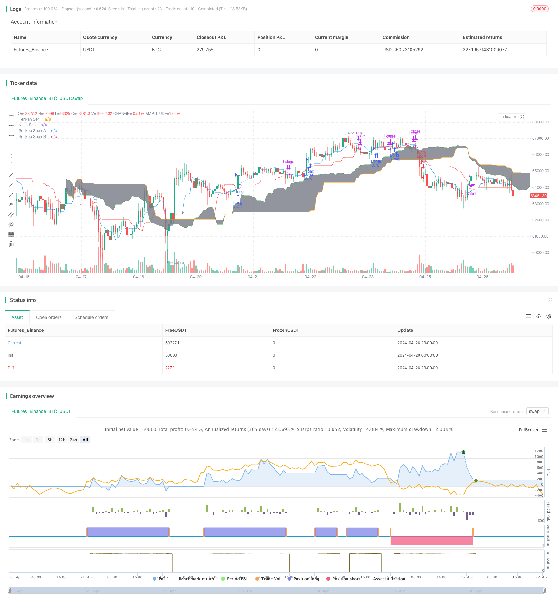

> Name

Quantitative-Trading-Strategy-Based-on-Modified-Hull-Moving-Average-and-Ichimoku-Kinko-Hyo
> Author

ChaoZhang

> Strategy Description



[trans]
#### Overview
This strategy combines two technical indicators, the modified Hull Moving Average (HMA) and the Ichimoku Kinko Hyo, to capture the market's mid- to long-term trends. The main idea of ​​the strategy is to use the cross signal between HMA and the baseline (Kijun Sen) in Ichimoku, and combine it with the cloud layer (Kumo) in Ichimoku as a filter condition to judge the trend direction of the market and conduct transactions.
#### Strategy Principle
1. Calculate the modified Hull Moving Average (HMA)
   - Calculate WMA (weighted moving average) and perform double smoothing to obtain a modified HMA
2. Calculate various indicators of Ichimoku Balance
   - Calculate the turning line (Tenkan Sen), base line (Kijun Sen), leading upper line (Senkou Span A) and leading lower line (Senkou Span B)
3. Generate trading signals
   - A long signal is generated when the HMA crosses above the base line and the closing price is above the clouds
   - A short signal is generated when the HMA crosses below the base line and the closing price is below the cloud.
4. Execute transactions
   - Carry out corresponding trading operations based on long or short signals
5. Exit a transaction
   - Exit the current position when HMA crosses the base line in the opposite direction
#### Strategic Advantages
1. It combines two effective trend tracking indicators, HMA and Ichimoku, to better capture market trends.
2. Using Ichimoku clouds as filtering conditions can effectively reduce false signals and improve the winning rate of transactions.
3. The modified HMA has a faster response speed and lower latency than the traditional moving average, and can reflect market changes in a timely manner.
4. The strategy logic is clear, easy to understand and implement, and is suitable for various markets and time periods.
#### Strategy Risk
1. When the market is volatile or the trend is unclear, this strategy may produce more false signals, leading to frequent transactions and capital losses.
2. The parameter settings of the strategy have a great impact on the trading results. Different parameter combinations may lead to different performances.
3. This strategy does not take into account market emergencies and irrational behaviors, and may face greater risks under extreme market conditions.
#### Strategy optimization direction
1. Introduce other technical indicators or market sentiment indicators to improve the reliability and stability of signals
2. Optimize strategy parameters, such as finding the optimal parameter combination through machine learning or genetic algorithms.
3. Consider adding risk management modules, such as setting stop loss and profit, position management, etc., to control the risk exposure of the strategy
4. Make targeted adjustments and optimizations to strategies based on the characteristics of different markets and time periods
#### Summary
This strategy builds a relatively robust trend-following trading system by combining the modified Hull Moving Average and Ichimoku Equilibrium. The strategy logic is clear and easy to implement, and it also has certain advantages. However, the performance of the strategy is still affected by market conditions and parameter settings, and requires further optimization and improvement. In practical applications, strategies should be appropriately adjusted and managed based on specific market characteristics and risk preferences in order to obtain better trading results.
|| 

#### Overview
This strategy combines two technical indicators: the modified Hull Moving Average (HMA) and Ichimoku Kinko Hyo (IKHS), aiming to capture medium to long-term market trends. The main idea is to utilize the crossover signals between the HMA and the Kijun Sen (baseline) of IKHS, while using the Kumo (cloud) of IKHS as a filtering condition to determine the trend direction and make trading decisions.

#### Strategy Principles
1. Calculate the modified Hull Moving Average (HMA)
   - Calculate the Weighted Moving Average (WMA) and apply double smoothing to obtain the modified HMA
2. Calculate the various indicators of Ichimoku Kinko Hyo
   - Calculate the Tenkan Sen (conversion line), Kijun Sen (baseline), Senkou Span A (leading span A), and Senkou Span B (leading span B)
3. Generate trading signals
   - When the HMA crosses above the Kijun Sen and the closing price is above the Kumo, generate a long signal
   - When the HMA crosses below the Kijun Sen and the closing price is below the Kumo, generate a short signal
4. Execute trades
   - Perform corresponding trading operations based on the long or short signals
5. Exit trades
   - When the HMA crosses the Kijun Sen in the opposite direction, exit the current position

#### Strategy Advantages
1. Combines two effective trend-following indicators, HMA and IKHS, to better capture market trends
2. Utilizes the Kumo of IKHS as a filtering condition to effectively reduce false signals and improve the win rate of trades
3. The modified HMA has a faster response speed and lower lag compared to traditional moving averages, enabling timely reflection of market changes
4. The strategy logic is clear, easy to understand, and implement, suitable for various markets and time frames

#### Strategy Risks
1. During market fluctuations or unclear trends, the strategy may generate more false signals, leading to frequent trading and capital losses
2. The parameter settings of the strategy have a significant impact on trading results, and different parameter combinations may lead to different performances
3. The strategy does not consider market emergencies and irrational behaviors, and may face greater risks under extreme market conditions

#### Strategy Optimization Directions
1. Introduce other technical indicators or market sentiment indicators to improve the reliability and stability of signals
2. Optimize strategy parameters, such as using machine learning or genetic algorithms to find the optimal parameter combination
3. Consider adding a risk management module, such as setting stop-loss and take-profit levels, position sizing, etc., to control the risk exposure of the strategy
4. Based on the characteristics of different markets and time frames, make targeted adjustments and optimizations to the strategy

#### Summary
By combining the modified Hull Moving Average and Ichimoku Kinko Hyo, this strategy constructs a relatively stable trend-following trading system. The strategy logic is clear and easy to implement, while also having certain advantages. However, the performance of the strategy is still affected by market conditions and parameter settings, requiring further optimization and improvement. In practical applications, it is necessary to make appropriate adjustments and management based on specific market characteristics and risk preferences to obtain better trading results.
[/trans]

> Strategy Arguments


|Argument|Default|Description|
|----|----|----|
|v_input_1|12|Double HullMA|
|v_input_2|9|Tenkan Sen Periods|
|v_input_3|26|Kijun Sen Periods|
|v_input_4|52|Senkou Span B Periods|
|v_input_5|26|Displacement|


> Source (PineScript)

``` pinescript
/*backtest
start: 2024-04-20 00:00:00
end: 2024-04-27 00:00:00
period: 1h
basePeriod: 15m
exchanges: [{"eid":"Futures_Binance","currency":"BTC_USDT"}]
*/

//@version=4
strategy("Hull MA_X + Ichimoku Kinko Hyo Strategy", shorttitle="HMX+IKHS", overlay=true, default_qty_type=strategy.percent_of_equity, default_qty_value=100, pyramiding=0)

// Hull Moving Average Parameters
keh = input(12, title="Double HullMA")
n2ma = 2 * wma(close, round(keh/2)) - wma(close, keh)
sqn = round(sqrt(keh))
hullMA = wma(n2ma, sqn)

// Ichimoku Kinko Hyo Parameters
tenkanSenPeriods = input(9, title="Tenkan Sen Periods")
kijunSenPeriods = input(26, title="Kijun Sen Periods")
senkouSpanBPeriods = input(52, title="Senkou Span B Periods")
displacement = input(26, title="Displacement")

// Ichimoku Calculations
highestHigh = highest(high, max(tenkanSenPeriods, kijunSenPeriods))
lowestLow = lowest(low, max(tenkanSenPeriods, kijunSenPeriods))
tenkanSen = (highest(high, tenkanSenPeriods) + lowest(low, tenkanSenPeriods)) / 2
kijunSen = (highestHigh + lowestLow) / 2
senkouSpanA = ((tenkanSen + kijunSen) / 2)
senkouSpanB = (highest(high, senkouSpanBPeriods) + lowest(low, senkouSpanBPeriods)) / 2

// Plot Ichimoku
p1 = plot(tenkanSen, color=color.blue, title="Tenkan Sen")
p2 = plot(kijunSen, color=color.red, title="Kijun Sen")
p3 = plot(senkouSpanA, color=color.green, title="Senkou Span A", offset=displacement)
p4 = plot(senkouSpanB, color=color.orange, title="Senkou Span B", offset=displacement)
fill(p3, p4, color=color.gray, title="Kumo Shadow")

// Trading Logic
longCondition = crossover(hullMA, kijunSen) and close > senkouSpanA[displacement] and close > senkouSpanB[displacement]
shortCondition = crossunder(hullMA, kijunSen) and close < senkouSpanA[displacement] and close < senkouSpanB[displacement]

// Strategy Execution
if (longCondition)
    strategy.entry("Long", strategy.long)
if (shortCondition)
    strategy.entry("Short", strategy.short)

// Exit Logic - Exit if HullMA crosses KijunSen in the opposite direction
exitLongCondition = crossunder(hullMA, kijunSen)
exitShortCondition = crossover(hullMA, kijunSen)

if (exitLongCondition)
    strategy.close("Long")
if (exitShortCondition)
    strategy.close("Short")

```

> Detail

https://www.fmz.com/strategy/449710

> Last Modified

2024-04-28 13:39:00
