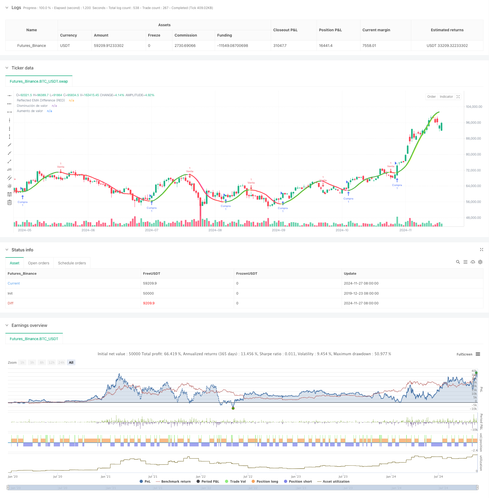

> Name

Reflected-EMA-Trend-Determination-Strategy-Based-on-Hull-Moving-Averages
> Author

ChaoZhang

> Strategy Description



[trans]
#### Overview
This strategy uses the reflective properties of the Hull Moving Average (HMA) to determine market trends. The core of the strategy is to calculate the difference between the short-term and long-term Hull moving averages, and predict the price trend through the reflection value of this difference. By setting adjustable percentage parameters, the strategy can adapt to different trading cycles, thereby providing more accurate trend judgment signals.
#### Strategy Principle
The strategy uses two Hull moving averages of 36 periods and 44 periods as basic indicators. By calculating the absolute difference between these two moving averages and calculating the reflection of the difference in combination with the current trend direction, the reflection value is finally obtained. The strategy also introduces a weighted moving average (WMA) to calculate the delta value, and the intersection of this delta value and the reflection value is used to determine the turning point of the trend. During the trend judgment process, the strategy sets an adjustable correction factor to control the sensitivity of trend reversal. When the price breaks through the preset trend limit line, the strategy will send out corresponding trading signals.
#### Strategic Advantages
1. The use of Hull moving average reduces the lag of traditional moving average and improves the strategy's response speed to market changes.
2. Introducing the concept of reflection value can more accurately capture trend turning points
3. An adjustable correction factor is designed to make the strategy highly adaptable.
4. Improve signal reliability through absolute difference calculation
5. Integrated risk control mechanism, including dynamic adjustment of trend limit lines
6. The system comes with visual components to facilitate traders to intuitively judge the market status.
#### Strategy Risk
1. Frequent false signals may occur in a sideways market
2. Improper parameter settings may cause signal lag or over-sensitivity.
3. In violently volatile markets, the trend limit line may not be adjusted in time.
4. Strategies rely on historical data calculations and may not respond quickly enough to market emergencies.
#### Strategy optimization direction
1. Introduce volatility indicators, dynamically adjust correction factors, and improve the strategy’s adaptability to market conditions.
2. Add a market status recognition mechanism and adopt different parameter settings in different market environments.
3. Develop an adaptive parameter optimization system to realize dynamic adjustment of parameters
4. Add a trading volume analysis module to improve signal reliability
5. Improve the risk control mechanism and add stop loss and fund management functions
#### Summary
This strategy builds a responsive and adaptable trend following system by innovatively combining the concepts of Hull moving averages and reflection values. The core advantage of the strategy lies in its ability to accurately capture trend turning points. At the same time, the adjustable parameter settings ensure the applicability of the strategy in different market environments. Although there are some inherent risks, through continued optimization and improvement, this strategy is expected to become a stable and reliable trading tool.
||
#### Overview
This strategy utilizes the reflective properties of Hull Moving Averages (HMA) to determine market trends. The core of the strategy involves calculating the difference between short-term and long-term Hull Moving Averages and using this reflected difference to predict price movements. Through adjustable percentage parameters, the strategy can adapt to different trading timeframes, providing more accurate trend determination signals.
#### Strategy Principles
The strategy employs two Hull Moving Averages with periods of 36 and 44 as base indicators. It calculates the absolute difference between these two moving averages and applies reflection calculations based on the current trend direction to obtain the reflection value. The strategy also incorporates Weighted Moving Average (WMA) to calculate delta values, using crossovers between delta and reflection values to identify trend turning points. During trend determination, the strategy uses an adjustable correction factor to control trend reversal sensitivity. Trading signals are generated when prices break through preset trend limitation lines.

#### Strategy Advantages
1. Uses Hull Moving Averages to reduce the lag typically associated with traditional moving averages
2. Incorporates reflection values for more accurate detection of trend turning points
3. Features adjustable correction factors for enhanced adaptability
4. Improves signal reliability through absolute difference calculations
5. Integrates risk control mechanisms including dynamic trend line adjustments
6. Includes visualization components for intuitive market state assessment

#### Strategy Risks
1. May generate frequent false signals in ranging markets
2. Improper parameter settings can lead to delayed signals or excessive sensitivity
3. Trend limitation lines may not adjust quickly enough in volatile markets
4. Strategy relies on historical data calculations, potentially limiting response to sudden market events

#### Strategy Optimization Directions
1. Introduce volatility indicators for dynamic correction factor adjustment
2. Implement market state recognition mechanisms for parameter adaptation
3. Develop self-adaptive parameter optimization systems
4. Add volume analysis modules to enhance signal reliability
5. Improve risk control mechanisms with stop-loss and money management features

#### Summary
This strategy innovatively combines Hull Moving Averages with reflection value concepts to create a responsive and adaptive trend following system. Its core strength lies in accurately capturing trend turning points while maintaining adaptability through adjustable parameters. While inherent risks exist, continuous optimization and refinement make this strategy a potentially stable and reliable trading tool.[/trans]


> Source (PineScript)

``` pinescript
/*backtest
start: 2019-12-23 08:00:00
end: 2024-11-28 00:00:00
period: 1d
basePeriod: 1d
exchanges: [{"eid":"Futures_Binance","currency":"BTC_USDT"}]
*/

//@version=5
strategy("Reflected EMA Difference (RED)", shorttitle="RED [by MarcosPna]", overlay=true) //mv30
// Análisis de Riesgo
// Risk Analysis
media_delta = ta.wma(2 * ta.wma(close, 8 / 2) - ta.wma(close, 8), math.floor(math.sqrt(8)))

// Calcular EMAs
// Calculate EMAs
ema_corta_delta = ta.hma(close, 36)
ema_larga_delta = ta.hma(close, 44)

// Calcular la diferencia entre las EMAs
// Calculate the difference between EMAs
diferencia_delta_ema = math.abs(ema_corta_delta - ema_larga_delta)

// Calcular el valor reflejado basado en la posición de la EMA corta
// Compute the reflected value based on the position of the short EMA
valor_reflejado_delta = ema_corta_delta + (ema_corta_delta > ema_larga_delta ? diferencia_delta_ema : -diferencia_delta_ema)

// Suavizar el valor reflejado
// Smooth the reflected value
periodo_suavizado_delta = input.int(2, title="Periodo extendido")
ema_suavizada_delta = ta.hma(valor_reflejado_delta, periodo_suavizado_delta)

// Ploteo de las EMAs y la línea reflejada
// Plot EMAs and the reflected line
plot(valor_reflejado_delta, title="Reflected EMA Difference (RED)", color=valor_reflejado_delta > ema_suavizada_delta ? color.rgb(253, 25, 238, 30) : color.rgb(183, 255, 30), linewidth=2, style=plot.style_line)

// Parámetros ajustables para la reversión de tendencia
// Adjustable parameters for trend reversal
factor_correccion_delta = input.float(title='Porcentaje de cambio', minval=0, maxval=100, step=0.1, defval=0.04)
tasa_correccion_delta = factor_correccion_delta * 0.01

// Variables para la reversión de tendencia
// Variables for trend reversal
var int direccion_delta_tendencia = 0
var float precio_maximo_delta = na
var float precio_minimo_delta = na
var float limite_tendencia_delta = na

// Inicializar precio máximo y mínimo con el primer valor de la EMA suavizada reflejada
// Initialize peak and trough prices with the first value of the smoothed reflected EMA
if na(precio_maximo_delta)
    precio_maximo_delta := ema_suavizada_delta
if na(precio_minimo_delta)
    precio_minimo_delta := ema_suavizada_delta

// Lógica de reversión de tendencia con la EMA suavizada reflejada
// Trend reversal logic with the smoothed reflected EMA
if direccion_delta_tendencia >= 0
    if ema_suavizada_delta > precio_maximo_delta
        precio_maximo_delta := ema_suavizada_delta
    limite_tendencia_delta := precio_maximo_delta - (precio_maximo_delta * tasa_correccion_delta)
    if ema_suavizada_delta <= limite_tendencia_delta
        direccion_delta_tendencia := -1
        precio_minimo_delta := ema_suavizada_delta
        strategy.entry("Venta", strategy.short)
else
    if ema_suavizada_delta < precio_minimo_delta
        precio_minimo_delta := ema_suavizada_delta
    limite_tendencia_delta := precio_minimo_delta + (precio_minimo_delta * tasa_correccion_delta)
    if ema_suavizada_delta >= limite_tendencia_delta
        direccion_delta_tendencia := 1
        precio_maximo_delta := ema_suavizada_delta
        strategy.entry("Compra", strategy.long)

// Ploteo y señales
// Plotting and signals
indice_delta_ascendente = plot(direccion_delta_tendencia == 1 ? limite_tendencia_delta : na, title="Aumento de valor", style=plot.style_linebr, linewidth=3, color=color.new(color.green, 0))
senal_compra_delta = direccion_delta_tendencia == 1 and direccion_delta_tendencia[1] == -1
plotshape(senal_compra_delta ? limite_tendencia_delta : na, title="Estilo señal alcista", location=location.absolute, style=shape.circle, size=size.tiny, color=color.new(color.green, 0))

indice_delta_descendente = plot(direccion_delta_tendencia == 1 ? na : limite_tendencia_delta, title="Disminución de valor", style=plot.style_linebr, linewidth=3, color=color.new(color.red, 0))
senal_venta_delta = direccion_delta_tendencia == -1 and direccion_delta_tendencia[1] == 1
plotshape(senal_venta_delta ? limite_tendencia_delta : na, title="Estilo señal bajista", location=location.absolute, style=shape.circle, size=size.tiny, color=color.new(color.red, 0))

// Variables para manejo de cajas
// Variables for box management
var box caja_tendencia_delta = na

// Condición: Cruce de HullMA hacia abajo
// Condition: HullMA crosses below reflected EMA value
cruce_bajista_delta = ta.crossunder(media_delta, valor_reflejado_delta)

// Condición: Cruce de HullMA hacia arriba
// Condition: HullMA crosses above reflected EMA value
cruce_alcista_delta = ta.crossover(media_delta, valor_reflejado_delta)

// Dibujar caja cuando HullMA cruza hacia abajo el valor reflejado de EMA
// Draw a box when HullMA crosses below the reflected EMA value
// if (cruce_bajista_delta) and direccion_delta_tendencia == 1
//     caja_tendencia_delta := box.new(left=bar_index, top=high, right=bar_index, bottom=low, text = "Critical Areas", text_color = color.white, border_width=2, border_color=color.rgb(254, 213, 31), bgcolor=color.new(color.red, 90))

// Cerrar caja cuando HullMA cruza hacia arriba el valor reflejado de EMA
// Close the box when HullMA crosses above the reflected EMA value
// if (cruce_alcista_delta and not na(caja_tendencia_delta))
//     box.set_right(caja_tendencia_delta, bar_index)
//     caja_tendencia_delta := na  // Remove the reference to create a new box at the next cross down


```

> Detail

https://www.fmz.com/strategy/473397

> Last Modified

2024-11-29 16:35:43
