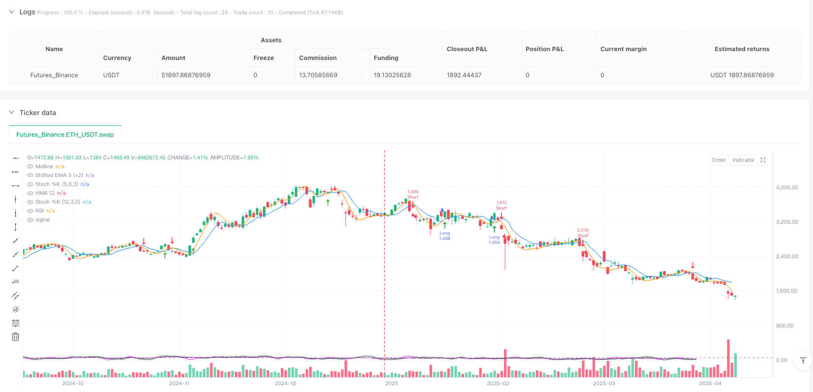
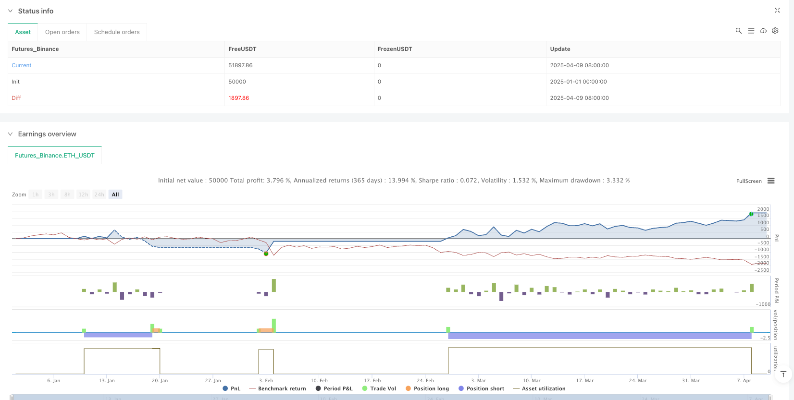

> Name

Multi-Indicator-Crossover-Momentum-Trend-Following-Strategy-Quantitative-Trading-System-Combining-Hull-with-EMA-RSI-and-Dual-Stochastic-Oscillators
> Author

ianzeng123

> Strategy Description




[trans]

#### Overview
The multi-indicator crossover momentum trend following strategy is a high-precision quantitative trading system that combines the Hull Moving Average (HMA) and the Shifted Exponential Moving Average (EMA), while integrating the Relative Strength Index (RSI) and the Dual Stochastic Oscillator as momentum filters. This strategy is designed to capture high-probability trend breakthrough points and achieve precise entry and exit while providing a strict risk management mechanism. The core logic of the strategy is based on moving average crossover signals and confirmed by multi-layered momentum indicators to reduce false breakouts and increase trade winning rates.
#### Strategy Principle
The strategy is based on several key technology components:
1. **Crossover of Hull Moving Average (HMA) and Shifted EMA**: The strategy uses the 12-period Hull Moving Average and the 5-period EMA shifted forward by 2 bars as the main signal generation mechanism. HMA is considered to react faster than traditional moving averages, while shifted EMA has predictive properties, and the combination of the two can capture trend changes earlier.
2. **Multi-layer Momentum Filter**: The strategy introduces RSI (14) and two stochastic oscillators with different parameter settings (12,3,3 and 5,3,3) as confirmation indicators. This multi-layered filtering mechanism ensures that trading signals are only triggered when the trend has sufficient momentum.
3. **Precise entry conditions**:
   - Long entry: Price closed above HMA and Shift EMA, RSI is above 50, %K values of two stochastic oscillators are above 50, and HMA crosses above Shift EMA.
   - Short entry: Price closed below HMA and Shift EMA, RSI is below 50, %K value of two stochastic oscillators is below 50, and HMA crosses below Shift EMA.
4. **Strict risk management**: The stop loss is set at the lowest point (long) or the highest point (short) of the first two K lines, and the stop profit point is set at 1.65 times the stop loss distance, forming a favorable risk-reward ratio.
The logic of the strategy is that only when price, moving averages, and multiple momentum indicators all confirm the same direction, a high-probability trading signal can be formed, thereby reducing the impact of market noise.
#### Strategic Advantages
1. **Synthetic Multiple Confirmations**: By combining moving average crossovers and confirmations from multiple momentum indicators, this strategy significantly reduces the probability of false signals and increases trading accuracy.
2. **Respond quickly to market changes**: The use of Hull Moving Averages allows the strategy to adapt to price changes faster than traditional moving averages, while the shifted EMA adds an element of predictability.
3. **Strong adaptability**: The combination of multiple indicators enables the strategy to adapt to different market environments, including trends and range-bound market conditions.
4. **Clear Risk Management**: Preset stop-loss and take-profit points provide clear risk control for each transaction, and the 1.65x risk-reward ratio contributes to long-term profitability.
5. **Visually intuitive**: The strategy provides clear buy and sell signal arrows, and displays the values ​​of RSI and stochastic oscillators in the strategy panel, allowing traders to intuitively understand and verify trading signals.
6. **Commission Consideration**: The strategy code includes the calculation of trading commissions, making the backtest results closer to the actual trading situation.
#### Strategy Risk
1. **Over-optimization risk**: The combination of multiple indicators may cause the strategy to overfit on specific historical data, which may cause poor performance in the future market. It is recommended to use longer backtest periods and different market environments for verification.
2. **Lagging Risk**: Although Hull Moving Averages and Shift EMAs can reduce lag, all technical indicators inherently have a certain delay, which may lead to missing important turning points in rapidly reversing markets.
3. **Parameter Sensitivity**: The strategy uses multiple fixed parameters (such as 12 periods for HMA, 5 periods for EMA, etc.), and the selection of these parameters may have a significant impact on performance in different markets and time frames. It is recommended to perform parameter sensitivity analysis.
4. **Market Condition Dependence**: This strategy may perform better in clear trending markets, but may produce more false signals in sideways and volatile markets. Traders need to adjust their decisions about using strategies based on the current market environment.
5. **Stop loss trigger risk**: Using the extreme value of the first two K lines as stop loss may lead to an excessively wide stop loss point in a high-volatility market, increasing the risk exposure of a single transaction.
Solutions include using adaptive parameters to adjust for market volatility, adding market environment filters to avoid trading in unsuitable market conditions, and considering implementing dynamic stop-loss mechanisms.
#### Strategy optimization direction
1. **Adaptive parameter adjustment**: An adaptive mechanism can be introduced to automatically adjust the periods of HMA and EMA according to market volatility. For example, shorter periods can be used in low-volatility markets and longer periods in high-volatility markets to accommodate different market conditions.
2. **Market environment filtering**: Increase the judgment logic of the market environment, such as using ATR (true fluctuation range) or volatility indicators to identify market conditions, and only trade in market environments that are suitable for the strategy.
3. **Dynamic Risk Management**: Change the fixed 1.65x risk-reward ratio to a mechanism that dynamically adjusts based on market volatility, such as using a higher risk-return ratio in low-volatility markets and using more conservative settings in high-volatility markets.
4. **Add trend strength filter**: Introduce trend strength indicators such as ADX (Average Directional Index), only trade when the trend is strong enough, and avoid frequent trading in weak trends or volatile markets.
5. **Time Filter**: Add time filtering function to avoid the release of important economic data or periods of low liquidity, and reduce false signals caused by irregular market fluctuations.
6. **Partial Position Management**: Implementing a batch entry and exit mechanism instead of all entry and exit at once can reduce the risk of timing selection and optimize the overall risk return performance.
7. **Machine Learning Enhancement**: Consider using simple machine learning algorithms to optimize parameter selection or increase predictive power, such as using regression models to predict optimal parameter combinations.
The core goal of these optimization directions is to improve the adaptability and robustness of the strategy and reduce dependence on specific parameters and market conditions, thereby creating a trading system that can maintain stable performance in different market environments.
#### Summarize
The multi-indicator cross momentum trend following strategy is a well-designed quantitative trading system that achieves efficient trend capture and strict risk management by combining Hull Moving Average, Shift EMA and multi-layer momentum indicators. The key advantages of the strategy are that the multiple confirmation mechanism reduces false signals, while clear risk management rules provide a consistent trading framework.
However, all trading strategies face inherent challenges, such as parameter optimization and market adaptability issues. By introducing optimization measures such as adaptive parameters, market environment filtering and dynamic risk management, the robustness and long-term performance of the strategy can be further improved.
Ultimately, this strategy provides trend following traders with the basis for a trading system with sufficient technical indicators and clear logic. By understanding its principles and adapting it appropriately to specific trading needs, traders can develop it into a personalized, efficient trading tool. Successful quantitative trading not only relies on the technical design of the strategy, but also requires strict execution discipline and continuous optimization and improvement. ||
#### Overview

The Multi-Indicator Crossover Momentum Trend-Following Strategy is a high-precision quantitative trading system that combines the Hull Moving Average (HMA) with a shifted Exponential Moving Average (EMA), integrated with the Relative Strength Index (RSI) and dual Stochastic Oscillators as momentum filters. This strategy aims to capture high-probability trend breakouts, achieve precise entries and exits, while providing strict risk management mechanisms. The core logic is based on moving average crossover signals, confirmed by multiple momentum indicators to reduce false breakouts and improve trading win rates.

#### Strategy Principles

This strategy is built on several key technical components:

1. **Hull Moving Average (HMA) and Shifted EMA Crossover**: The strategy uses a 12-period Hull Moving Average and a 5-period EMA shifted forward by 2 bars as the primary signal generation mechanism. HMA is known to react faster than traditional moving averages, while the shifted EMA adds a predictive quality, allowing earlier detection of trend changes.

2. **Multi-layer Momentum Filtering**: The strategy incorporates RSI(14) and two Stochastic Oscillators with different parameter settings (12,3,3 and 5,3,3) as confirmation indicators. This multi-layer filtering mechanism ensures that trade signals are triggered only when the trend has sufficient momentum.

3. **Precise Entry Conditions**:
   - Long Entry: Price closes above both HMA and shifted EMA, RSI is above 50, both Stochastic Oscillators' %K values are above 50, and HMA crosses above the shifted EMA.
   - Short Entry: Price closes below both HMA and shifted EMA, RSI is below 50, both Stochastic Oscillators' %K values are below 50, and HMA crosses below the shifted EMA.

4. **Strict Risk Management**: Stop-loss is set at the lowest point (for longs) or highest point (for shorts) of the previous 2 candles, with take-profit set at 1.65 times the stop-loss distance, creating a favorable risk-reward ratio.

The logic behind the strategy is that high-probability trading signals form only when price, moving averages, and multiple momentum indicators all confirm the same direction, thus reducing the impact of market noise.

#### Strategy Advantages

1. **Comprehensive Multi-Confirmation**: By combining moving average crossovers with confirmation from multiple momentum indicators, the strategy significantly reduces the probability of false signals, improving trading precision.

2. **Quick Response to Market Changes**: The use of Hull Moving Average allows the strategy to adapt to price movements faster than traditional moving averages, while the shifted EMA adds a predictive element.

3. **Strong Adaptability**: The combination of multiple indicators enables the strategy to adapt to different market environments, including trending and range-bound conditions.

4. **Clear Risk Management**: Predefined stop-loss and take-profit levels provide clear risk control for each trade, with the 1.65 risk-reward ratio supporting long-term profitability.

5. **Visual Intuitiveness**: The strategy provides clear buy and sell signal arrows and displays RSI and Stochastic Oscillator values in the strategy panel, allowing traders to visually understand and verify trading signals.

6. **Commission Consideration**: The strategy code includes commission calculations, making backtesting results closer to actual trading conditions.

#### Strategy Risks

1. **Over-Optimization Risk**: The combination of multiple indicators may lead to overfitting on specific historical data, potentially performing poorly in future markets. It is recommended to validate with longer backtesting periods and different market environments.

2. **Lag Risk**: Despite the reduced lag from Hull Moving Average and shifted EMA, all technical indicators inherently have some delay, which may cause missed crucial turning points in rapidly reversing markets.

3. **Parameter Sensitivity**: The strategy uses multiple fixed parameters (such as HMA's 12-period, EMA's 5-period), which may significantly impact performance across different markets and timeframes. Parameter sensitivity analysis is recommended.

4. **Market Condition Dependency**: This strategy may perform better in clear trending markets but might generate more false signals in sideways, consolidating markets. Traders need to adjust their use of the strategy based on current market conditions.

5. **Stop-Loss Trigger Risk**: Using the extremes of the previous 2 candles as stop-loss points might lead to overly wide stops in highly volatile markets, increasing risk exposure per trade.

Solutions include: using adaptive parameters based on market volatility, adding market environment filters to avoid trading in unsuitable market conditions, and considering dynamic stop-loss mechanisms.

#### Strategy Optimization Directions

1. **Adaptive Parameter Adjustment**: Introduce adaptive mechanisms to automatically adjust HMA and EMA periods based on market volatility. For example, use shorter periods in low-volatility markets and longer periods in high-volatility markets to adapt to different market conditions.

2. **Market Environment Filtering**: Add market environment assessment logic, such as using ATR (Average True Range) or volatility indicators to identify market states and only trade in environments suitable for the strategy.

3. **Dynamic Risk Management**: Replace the fixed 1.65 risk-reward ratio with a mechanism that dynamically adjusts based on market volatility, such as using higher risk-reward ratios in low-volatility markets and more conservative settings in high-volatility markets.

4. **Add Trend Strength Filtering**: Introduce trend strength indicators like ADX (Average Directional Index) and only trade when the trend is strong enough, avoiding frequent trading in weak trend or range-bound markets.

5. **Time Filters**: Add time filtering functionality to avoid important economic data release periods or low-liquidity sessions, reducing false signals caused by irregular market movements.

6. **Partial Position Management**: Implement a mechanism for scaling in and out of positions rather than entering and exiting all at once, which can reduce timing risk and optimize overall risk-reward performance.

7. **Machine Learning Enhancement**: Consider using simple machine learning algorithms to optimize parameter selection or enhance predictive capabilities, such as using regression models to predict optimal parameter combinations.

The core objective of these optimization directions is to improve the strategy's adaptability and robustness, reducing dependence on specific parameters and market conditions, thereby creating a trading system that maintains stable performance across different market environments.

#### Summary

The Multi-Indicator Crossover Momentum Trend-Following Strategy is a well-designed quantitative trading system that achieves efficient trend capture and strict risk management through the combination of Hull Moving Average, shifted EMA, and multi-layer momentum indicators. The strategy's main advantages lie in its multiple confirmation mechanisms that reduce false signals, while clear risk management rules provide a consistent trading framework.

However, like all trading strategies, it faces inherent challenges such as parameter optimization and market adaptability issues. By introducing adaptive parameters, market environment filtering, and dynamic risk management optimizations, the strategy's robustness and long-term performance can be further enhanced.

Ultimately, this strategy provides trend-following traders with a trading system foundation that is technically comprehensive and logically clear. By understanding its principles and making appropriate adjustments for specific trading needs, traders can develop it into a personalized, efficient trading tool. Successful quantitative trading depends not only on the technical design of the strategy but also on strict execution discipline and continuous optimization improvements.[/trans]


> Source (PineScript)

``` pinescript
/*backtest
start: 2025-01-01 00:00:00
end: 2025-04-10 00:00:00
period: 1d
basePeriod: 1d
exchanges: [{"eid":"Futures_Binance","currency":"ETH_USDT"}]
*/

//@version=5
strategy("TrendTwisterV1.5 (Forex Ready + Indicators)", overlay=true, default_qty_type=strategy.percent_of_equity, default_qty_value=10, commission_type=strategy.commission.percent, commission_value=0.01)

// === Parameters ===
hmaLength = 12
emaLength = 5
rsiLength = 14
profitFactor = 1.65

// === Indicators ===
hma = ta.hma(close, hmaLength)
ema = ta.ema(close, emaLength)
emaShifted = ema[2]
rsi = ta.rsi(close, rsiLength)

// === Stochastic Oscillators ===
k1 = ta.stoch(close, high, low, 12)
k1Smooth = ta.sma(k1, 3)

k2 = ta.stoch(close, high, low, 5)
k2Smooth = ta.sma(k2, 3)

// === Plots: Main Strategy Indicators ===
plot(hma, color=color.orange, title="HMA 12")
plot(emaShifted, color=color.blue, title="Shifted EMA 5 (+2)")

// === Stop Loss & Take Profit ===
longStop = ta.lowest(low[1], 2)
shortStop = ta.highest(high[1], 2)

longSL_pips = close - longStop
shortSL_pips = shortStop - close

pip = syminfo.mintick
longTP = close + (longSL_pips * profitFactor)
shortTP = close - (shortSL_pips * profitFactor)

// === Crossover Conditions ===
hmaCrossesAbove = ta.crossover(hma, emaShifted)
hmaCrossesBelow = ta.crossunder(hma, emaShifted)

// === Entry Conditions ===
longCondition = close > hma and close > emaShifted and rsi > 50 and k1Smooth > 50 and k2Smooth > 50 and hmaCrossesAbove
shortCondition = close < hma and close < emaShifted and rsi < 50 and k1Smooth < 50 and k2Smooth < 50 and hmaCrossesBelow

// === Entries & Exits ===
if (longCondition)
    strategy.entry("Long", strategy.long)
    strategy.exit("Long Exit", from_entry="Long", stop=longStop, limit=longTP)

if (shortCondition)
    strategy.entry("Short", strategy.short)
    strategy.exit("Short Exit", from_entry="Short", stop=shortStop, limit=shortTP)

// === Signal Arrows ===
plotshape(longCondition, title="Buy Signal", location=location.belowbar, color=color.green, style=shape.arrowup, size=size.small)
plotshape(shortCondition, title="Sell Signal", location=location.abovebar, color=color.red, style=shape.arrowdown, size=size.small)

// === Overlay RSI + Stochs in strategy panel ===
rsiPlot = plot(rsi, title="RSI", color=color.purple, linewidth=1, offset=-10)
k1Plot = plot(k1Smooth, title="Stoch %K (12,3,3)", color=color.green, linewidth=1, offset=-10)
k2Plot = plot(k2Smooth, title="Stoch %K (5,3,3)", color=color.fuchsia, linewidth=1, offset=-10)
hline(50, "Midline", color=color.gray, linestyle=hline.style_dashed)

```

> Detail

https://www.fmz.com/strategy/490060

> Last Modified

2025-04-11 11:13:55
