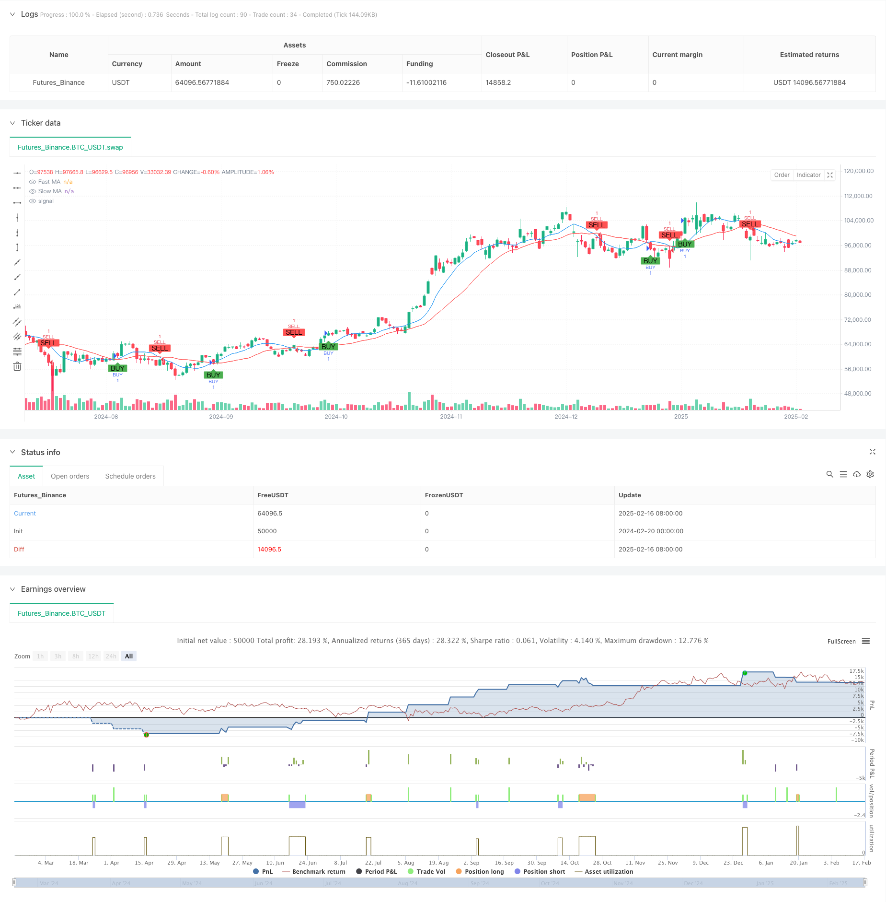

> Name

Hybrid-Fibonacci Momentum-MA-Crossover-Strategy
> Author

ChaoZhang

> Strategy Description



[trans]
#### Overview
This strategy is a comprehensive trading system that combines Fibonacci retracement levels, moving average crossovers, and momentum trend judgment. It generates trading signals through the intersection of fast moving averages and slow moving averages, uses Fibonacci retracement levels as important price reference points, and combines trend judgment to optimize trading timing. The system also integrates percentage stop loss and take profit settings for risk management.
#### Strategy Principle
The core logic of the strategy is based on the following key elements:
1. The moving average crossover system uses the 9-day and 21-day simple moving averages (SMA) as signal indicators.
2. Fibonacci retracement levels (23.6%, 38.2%, 50%, 61.8%) calculated over 100 periods for market structure analysis
3. Determine the market trend through the position relationship between price and fast moving average
4. The signal to open a position is triggered by the fast moving average crossing the slow moving average (going long) or falling below the slow moving average (going short).
5. The system automatically sets percentage stop loss and take profit levels based on the entry price
#### Strategic Advantages
1. Multi-dimensional analysis: Combining the three most recognized elements in technical analysis (trend, momentum, price level)
2. Perfect risk management: adopt preset stop-loss and take-profit ratios to protect the safety of funds
3. High degree of visualization: all key price levels and trading signals are clearly displayed on the chart
4. Strong adaptability: can adapt to different market environments through parameter adjustment
5. Clear operating rules: clear signal generation conditions to avoid subjective judgments
#### Strategy Risk
1. Moving average systems may produce false signals in volatile markets
2. Fixed percentage stop loss and take profit settings may not be suitable for all market environments
3. In high-volatility markets, prices may quickly breach stop-loss levels
4. The effectiveness of Fibonacci levels may change as market conditions change
5. Trend judgment may lag at market turning points
#### Strategy optimization direction
1. Introduce volatility indicators to dynamically adjust the stop-loss and take-profit ratios
2. Add volume analysis to confirm trading signals
3. Consider confirmation at different time periods to improve signal reliability
4. Add market environment screening conditions and trade under suitable market conditions
5. Develop an adaptive parameter optimization system
#### Summary
This is a comprehensive trading strategy that combines multiple classic technical analysis tools. By combining moving averages, Fibonacci retracements and trend analysis, strategies can capture potential trading opportunities in the market. At the same time, the complete risk management system and clear visual interface make it highly practical. Although there are some inherent risks, through continuous optimization and improvement, this strategy is expected to achieve better performance in actual trading. ||
#### Overview
This strategy is a comprehensive trading system that combines Fibonacci retracement levels, moving average crossovers, and momentum trend analysis. It generates trading signals through the intersection of fast and slow moving averages, while utilizing Fibonacci retracement levels as important price reference points and incorporating trend judgment to optimize trading timing. The system also integrates percentage-based stop-loss and take-profit settings for risk management.

#### Strategy Principle
The core logic of the strategy is based on the following key elements:
1. Moving average crossover system using 9-day and 21-day Simple Moving Averages (SMA) as signal indicators
2. Fibonacci retracement levels (23.6%, 38.2%, 50%, 61.8%) calculated over 100 periods for market structure analysis
3. Market trend determination through price position relative to the fast moving average
4. Entry signals triggered by fast MA crossing above slow MA (long) or below slow MA (short)
5. Automatic percentage-based stop-loss and take-profit levels based on entry price

#### Strategy Advantages
1. Multi-dimensional analysis: Combines three most recognized elements in technical analysis (trend, momentum, price levels)
2. Comprehensive risk management: Uses preset stop-loss and take-profit ratios to protect capital
3. High visualization: Clearly displays all key price levels and trading signals on the chart
4. Strong adaptability: Can be adjusted through parameters to adapt to different market environments
5. Clear operational rules: Signal generation conditions are explicit, avoiding subjective judgment

#### Strategy Risks
1. Moving average system may generate false signals in ranging markets
2. Fixed percentage stop-loss and take-profit settings may not suit all market environments
3. Price may quickly breach stop-loss levels in highly volatile markets
4. Effectiveness of Fibonacci levels may vary with market conditions
5. Trend determination may lag at market turning points

#### Strategy Optimization Directions
1. Introduce volatility indicators for dynamic adjustment of stop-loss and take-profit ratios
2. Add volume analysis to confirm trading signals
3. Consider confirmation across different timeframes to improve signal reliability
4. Include market environment filtering conditions to trade in suitable market conditions
5. Develop adaptive parameter optimization system

#### Summary
This is a comprehensive trading strategy that integrates multiple classic technical analysis tools. By combining moving averages, Fibonacci retracements, and trend analysis, the strategy can capture potential trading opportunities in the market. Additionally, its comprehensive risk management system and clear visualization interface make it highly practical. While there are some inherent risks, through continuous optimization and improvement, this strategy has the potential to achieve better performance in actual trading.[/trans]


> Source (PineScript)

``` pinescript
/*backtest
start: 2024-02-20 00:00:00
end: 2025-02-17 08:00:00
period: 1d
basePeriod: 1d
exchanges: [{"eid":"Futures_Binance","currency":"BTC_USDT"}]
*/

//@version=5
strategy("Buy/Sell Strategy with TP, SL, Fibonacci Levels, and Trend", overlay=true)

// Input for stop loss and take profit percentages
stopLossPercentage = input.int(2, title="Stop Loss (%)") // Stop loss percentage
takeProfitPercentage = input.int(4, title="Take Profit (%)") // Take profit percentage

// Example of a moving average crossover strategy
fastLength = input.int(9, title="Fast MA Length")
slowLength = input.int(21, title="Slow MA Length")

fastMA = ta.sma(close, fastLength)
slowMA = ta.sma(close, slowLength)

// Entry conditions (Buy when fast MA crosses above slow MA, Sell when fast MA crosses below slow MA)
longCondition = ta.crossover(fastMA, slowMA)
shortCondition = ta.crossunder(fastMA, slowMA)

// Plot moving averages for visual reference
plot(fastMA, color=color.blue, title="Fast MA")
plot(slowMA, color=color.red, title="Slow MA")

// Fibonacci Retracement Levels
lookback = input.int(100, title="Lookback Period for Fibonacci Levels")
highLevel = ta.highest(high, lookback)
lowLevel = ta.lowest(low, lookback)

fib236 = lowLevel + (highLevel - lowLevel) * 0.236
fib382 = lowLevel + (highLevel - lowLevel) * 0.382
fib50 = lowLevel + (highLevel - lowLevel) * 0.5
fib618 = lowLevel + (highLevel - lowLevel) * 0.618

// Display Fibonacci levels as text on the chart near price panel (left of candle)
label.new(bar_index, fib236, text="Fib 23.6%: " + str.tostring(fib236, "#.##"), style=label.style_label_left, color=color.purple, textcolor=color.white, size=size.small, xloc=xloc.bar_index, yloc=yloc.price)
label.new(bar_index, fib382, text="Fib 38.2%: " + str.tostring(fib382, "#.##"), style=label.style_label_left, color=color.blue, textcolor=color.white, size=size.small, xloc=xloc.bar_index, yloc=yloc.price)
label.new(bar_index, fib50, text="Fib 50%: " + str.tostring(fib50, "#.##"), style=label.style_label_left, color=color.green, textcolor=color.white, size=size.small, xloc=xloc.bar_index, yloc=yloc.price)
label.new(bar_index, fib618, text="Fib 61.8%: " + str.tostring(fib618, "#.##"), style=label.style_label_left, color=color.red, textcolor=color.white, size=size.small, xloc=xloc.bar_index, yloc=yloc.price)

// Trend condition: Price uptrend or downtrend
trendCondition = close > fastMA ? "Uptrending" : close < fastMA ? "Downtrending" : "Neutral"

// Remove previous trend label and add new trend label
var label trendLabel = na
if (not na(trendLabel))
    label.delete(trendLabel)

// Create a new trend label based on the current trend
trendLabel := label.new(bar_index, close, text="Trend: " + trendCondition, style=label.style_label_left, color=color.blue, textcolor=color.white, size=size.small, xloc=xloc.bar_index, yloc=yloc.price)

// Buy and Sell orders with Stop Loss and Take Profit
if (longCondition)
    // Set the Stop Loss and Take Profit levels based on entry price
    stopLossLevel = close * (1 - stopLossPercentage / 100)
    takeProfitLevel = close * (1 + takeProfitPercentage / 100)
    // Enter long position with stop loss and take profit levels
    strategy.entry("BUY", strategy.long)
    strategy.exit("Sell", "BUY", stop=stopLossLevel, limit=takeProfitLevel)
    
    // Display TP, SL, and Entry price labels on the chart near price panel (left of candle)
    label.new(bar_index, takeProfitLevel, text="TP\n" + str.tostring(takeProfitLevel, "#.##"), style=label.style_label_left, color=color.green, textcolor=color.white, size=size.small, xloc=xloc.bar_index, yloc=yloc.price)
    label.new(bar_index, stopLossLevel, text="SL\n" + str.tostring(stopLossLevel, "#.##"), style=label.style_label_left, color=color.red, textcolor=color.white, size=size.small, xloc=xloc.bar_index, yloc=yloc.price)
    label.new(bar_index, close, text="BUY\n" + str.tostring(close, "#.##"), style=label.style_label_left, color=color.blue, textcolor=color.white, size=size.small, xloc=xloc.bar_index, yloc=yloc.price)

if (shortCondition)
    // Set the Stop Loss and Take Profit levels based on entry price
    stopLossLevel = close * (1 + stopLossPercentage / 100)
    takeProfitLevel = close * (1 - takeProfitPercentage / 100)
    // Enter short position with stop loss and take profit levels
    strategy.entry("SELL", strategy.short)
    strategy.exit("Cover", "SELL", stop=stopLossLevel, limit=takeProfitLevel)
    
    // Display TP, SL, and Entry price labels on the chart near price panel (left of candle)
    label.new(bar_index, takeProfitLevel, text="TP\n" + str.tostring(takeProfitLevel, "#.##"), style=label.style_label_left, color=color.green, textcolor=color.white, size=size.small, xloc=xloc.bar_index, yloc=yloc.price)
    label.new(bar_index, stopLossLevel, text="SL\n" + str.tostring(stopLossLevel, "#.##"), style=label.style_label_left, color=color.red, textcolor=color.white, size=size.small, xloc=xloc.bar_index, yloc=yloc.price)
    label.new(bar_index, close, text="SELL\n" + str.tostring(close, "#.##"), style=label.style_label_left, color=color.orange, textcolor=color.white, size=size.small, xloc=xloc.bar_index, yloc=yloc.price)

// Plot Buy/Sell labels on chart
plotshape(series=longCondition, title="BUY Signal", location=location.belowbar, color=color.green, style=shape.labelup, text="BUY")
plotshape(series=shortCondition, title="SELL Signal", location=location.abovebar, color=color.red, style=shape.labeldown, text="SELL")

```

> Detail

https://www.fmz.com/strategy/482594

> Last Modified

2025-02-19 11:02:16
