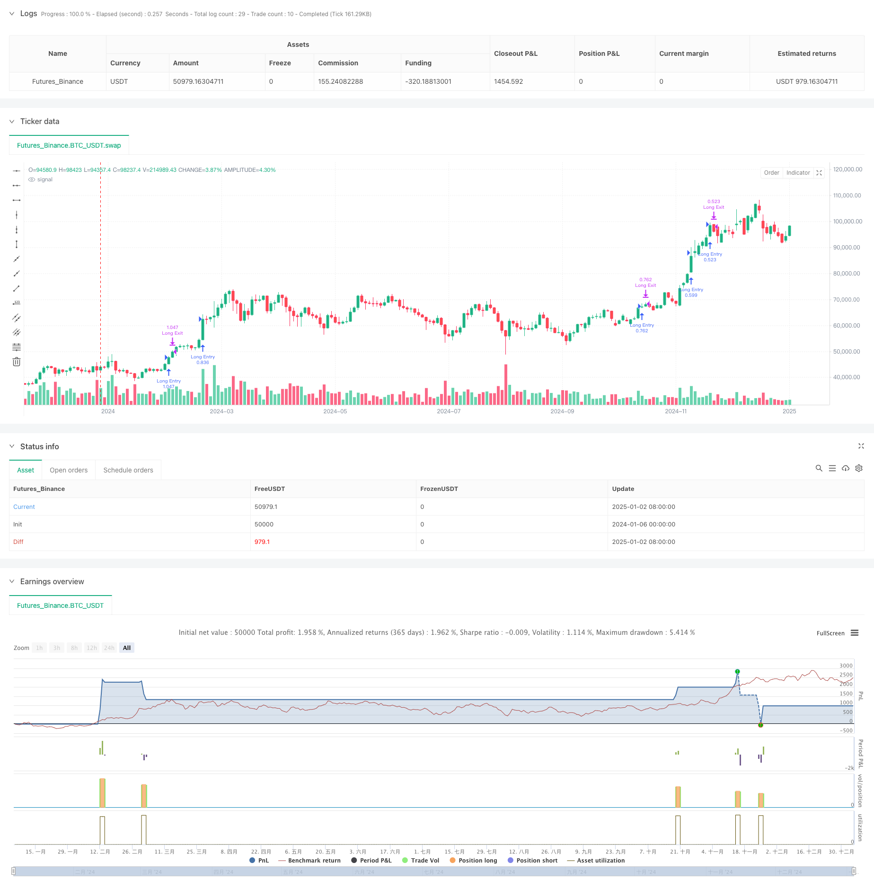

> Name

ICT Smart Structure Breakthrough Strategy for Multi-Time Period Dynamic Signal Combination-Multi-Period-Dynamic-Signal-Integration-ICT-Smart-Structure-Breakthrough-Strategy
> Author

ChaoZhang

> Strategy Description



[trans]
#### Overview
This strategy is a comprehensive trading system that combines multiple technical indicators and ICT (Institutional Trading Concept). It integrates traditional technical analysis indicators (RSI, stochastic indicator, MACD, EMA) and modern ICT trading concepts (fair value gap, structural breakthrough, high time period bias analysis) on different time periods, and achieves precise market access control through strict trading period filtering.
#### Strategy Principle
The strategy operates based on the synergy of five core components:
1. High time period bias analysis: Use the 200 moving average to determine the market trend direction of higher time periods
2. Trading session filtering: restrict trading to a specific "kill zone" (07:00-10:00)
3. Fair value gap (FVG) identification: identify market structural gaps through three K-line patterns
4. Structural Breakthrough (BOS) Determination: Breakthroughs based on key price levels confirm directional changes.
5. Low time period indicator confirmation: multiple verification using RSI, stochastic indicator, MACD and 200 moving average
#### Strategic Advantages
1. Multi-dimensional signal integration: improve signal reliability by combining multiple independent technical indicators and ICT concepts
2. Time period coordination: The coordination of high and low time periods enhances the stability of the signal.
3. Structural opportunity capture: Focus on high-probability structural trading opportunities through the identification of FVG and BOS
4. Improved risk control: including stop-loss and stop-profit mechanisms and standardized fund management
5. Trading time optimization: reducing interference during non-trading hours through time filtering
#### Strategy Risk
1. Signal lag: the combination of multiple indicators may lead to delayed entry timing
2. Volatile market performance: Frequent false signals may occur in sideways markets
3. Parameter sensitivity: The setting of multiple indicator parameters requires sufficient historical data verification.
4. Execution risk: Complex combinations of conditions may miss some trading opportunities in real trading
5. Dependence on market environment: The performance of strategies in different market environments may be quite different.
#### Strategy optimization direction
1. Dynamic parameter adjustment: adaptively adjust each indicator parameter according to market volatility
2. Market environment classification: Add a market environment identification module and use different parameter combinations for different market states.
3. Signal weight optimization: Introduce machine learning methods to optimize the weight distribution of each indicator
4. Time period expansion: Add more time period analysis to improve signal reliability
5. Enhanced risk control: Introducing a dynamic stop-loss mechanism and optimizing fund management strategies
#### Summary
This strategy builds a comprehensive trading system by integrating traditional technical analysis and modern ICT concepts. Its advantages lie in multi-dimensional signal confirmation and strict risk control, but it also faces challenges in parameter optimization and market adaptability. Through continuous optimization and improvement, the strategy is expected to maintain stable performance in different market environments. ||
#### Overview
This strategy is a comprehensive trading system that combines multiple technical indicators with ICT (Institutional Trading Concepts). It integrates traditional technical analysis indicators (RSI, Stochastic, MACD, EMA) with modern ICT trading concepts (Fair Value Gap, Break of Structure, Higher Timeframe Bias Analysis) across different timeframes, implementing precise market entry control through strict trading session filtering.

#### Strategy Principles
The strategy operates based on five core components working in synergy:
1. Higher Timeframe Bias Analysis: Using 200 EMA to determine market trend direction on higher timeframes
2. Trading Session Filter: Trading restricted to specific "Kill Zone" (07:00-10:00)
3. Fair Value Gap (FVG) Identification: Recognizing market structural gaps through three-candle patterns
4. Break of Structure (BOS) Determination: Confirming directional changes based on key price levels
5. Lower Timeframe Indicator Confirmation: Multiple verification using RSI, Stochastic, MACD, and 200 EMA

#### Strategy Advantages
1. Multi-dimensional Signal Integration: Enhances signal reliability through combination of multiple independent technical indicators and ICT concepts
2. Timeframe Synergy: Higher and lower timeframe coordination improves signal stability
3. Structural Opportunity Capture: Focuses on high-probability structural trading opportunities through FVG and BOS identification
4. Comprehensive Risk Control: Includes stop-loss and take-profit mechanisms, standardized money management
5. Trading Time Optimization: Reduces interference from non-trading sessions through time filtering

#### Strategy Risks
1. Signal Lag: Multiple indicator combination may lead to delayed entry timing
2. Sideways Market Performance: May generate frequent false signals in ranging markets
3. Parameter Sensitivity: Multiple indicator parameters require thorough historical data validation
4. Execution Risk: Complex condition combinations may miss some trading opportunities in live trading
5. Market Environment Dependency: Strategy performance may vary significantly across different market conditions

#### Strategy Optimization Directions
1. Dynamic Parameter Adjustment: Adaptive adjustment of indicator parameters based on market volatility
2. Market Environment Classification: Adding market environment recognition module for different parameter combinations
3. Signal Weight Optimization: Introducing machine learning methods to optimize indicator weight distribution
4. Timeframe Extension: Including more timeframe analyses to improve signal reliability
5. Risk Control Enhancement: Introducing dynamic stop-loss mechanisms and optimizing money management strategies

#### Summary
The strategy constructs a comprehensive trading system by integrating traditional technical analysis with modern ICT concepts. Its strengths lie in multi-dimensional signal confirmation and strict risk control, while facing challenges in parameter optimization and market adaptability. Through continuous optimization and improvement, the strategy shows promise in maintaining stable performance across different market environments.[/trans]


> Source (PineScript)

``` pinescript
/*backtest
start: 2024-01-06 00:00:00
end: 2025-01-04 08:00:00
period: 2d
basePeriod: 2d
exchanges: [{"eid":"Futures_Binance","currency":"BTC_USDT"}]
*/

// -----------------------------------------------------
// Multi-Signal Conservative Strategy (Pine Script v5)
// + More ICT Concepts (HTF Bias, FVG, Killzone, BOS)
// -----------------------------------------------------
//
// Combines:
// - RSI, Stochastic, MACD, 200 EMA (lower TF)
// - Higher Timeframe (HTF) bias check via 200 EMA
// - Kill Zone time filter
// - Fair Value Gap (FVG) detection (simplified 3-candle approach)
// - Break of Structure (BOS) using pivot highs/lows
// - Only trade markers on chart (no extra indicator plots).
//
// Use on lower timeframes: 1m to 15m
// Always backtest thoroughly and manage risk properly.
//
// -----------------------------------------------------
//@version=5
strategy(title="Multi-Signal + ICT Concepts (HTF/FVG/Killzone/BOS)", shorttitle="ICTStrategyExample",overlay=true, pyramiding=0, initial_capital=10000, default_qty_type=strategy.percent_of_equity, default_qty_value=100)

// -----------------------------------------------------
// User Inputs
// -----------------------------------------------------
/////////////// Lower TF Inputs ///////////////
emaLength       = input.int(200,   "LTF EMA Length",           group="Lower TF")
rsiLength       = input.int(14,    "RSI Length",               group="Lower TF")
rsiUpper        = input.int(60,    "RSI Overbought Thresh",    group="Lower TF", minval=50, maxval=80)
rsiLower        = input.int(40,    "RSI Oversold Thresh",      group="Lower TF", minval=20, maxval=50)
stochLengthK    = input.int(14,    "Stoch K Length",           group="Lower TF")
stochLengthD    = input.int(3,     "Stoch D Smoothing",        group="Lower TF")
stochSmooth     = input.int(3,     "Stoch Smoothing",          group="Lower TF")
macdFast        = input.int(12,    "MACD Fast Length",         group="Lower TF")
macdSlow        = input.int(26,    "MACD Slow Length",         group="Lower TF")
macdSignal      = input.int(9,     "MACD Signal Length",       group="Lower TF")

/////////////// ICT Concepts Inputs ///////////////
htfTimeframe    = input.timeframe("60", "HTF for Bias (e.g. 60, 240)", group="ICT Concepts")
htfEmaLen       = input.int(200,  "HTF EMA Length",                   group="ICT Concepts")
sessionInput    = input("0700-1000:1234567", "Kill Zone Window", group="ICT Concepts")
fvgLookbackBars = input.int(2,    "FVG Lookback Bars (3-candle check)",  group="ICT Concepts", minval=1, maxval=10)

/////////////// Risk Management ///////////////
stopLossPerc    = input.float(0.5, "Stop-Loss %",  step=0.1, group="Risk")
takeProfitPerc  = input.float(1.0, "Take-Profit %", step=0.1, group="Risk")

// -----------------------------------------------------
// 1) Higher Timeframe Bias
// -----------------------------------------------------
//
// We'll request the HTF close, then compute the HTF EMA on that data
// to decide if it's bullish or bearish overall.

htfClose       = request.security(syminfo.tickerid, htfTimeframe, close)
htfEma         = request.security(syminfo.tickerid, htfTimeframe, ta.ema(close, htfEmaLen))
isBullHTF      = htfClose > htfEma
isBearHTF      = htfClose < htfEma

// -----------------------------------------------------
// 2) Kill Zone / Session Filter
// -----------------------------------------------------
//
// We'll only consider trades if the current bar is within
// the user-defined session time (e.g., 07:00 to 10:00 local or exchange time).

isInKillZone = time(timeframe.period, sessionInput) != 0

// -----------------------------------------------------
// 3) Fair Value Gap (FVG) Detection (Simplified)
//
// For a "Bullish FVG" among bars [2], [1], [0]:
//     high[2] < low[0] => there's a gap that bar [1] didn't fill
// For a "Bearish FVG":
//     low[2] > high[0] => there's a gap that bar [1] didn't fill
//
// Real ICT usage might check partial fill, candle bodies vs wicks, etc.
// This is just a minimal example for demonstration.

fvgBarsAgo = fvgLookbackBars // default = 2
bullFVG = high[fvgBarsAgo] < low  // e.g. high[2] < low[0]
bearFVG = low[fvgBarsAgo]  > high // e.g. low[2]  > high[0]

// -----------------------------------------------------
// 4) Break of Structure (BOS)
// -----------------------------------------------------
// Using pivot detection from previous example:

swingLen = 2  // pivot detection length (bars on each side)
// Identify a pivot high at bar [1]
swingHigh = high[1] > high[2] and high[1] > high[0]
// Identify a pivot low at bar [1]
swingLow  = low[1]  < low[2]  and low[1]  < low[0]

// Track the most recent pivot high & low
var float lastPivotHigh = na
var float lastPivotLow  = na

if swingHigh
    lastPivotHigh := high[1]

if swingLow
    lastPivotLow := low[1]

bosUp   = not na(lastPivotHigh) and (close > lastPivotHigh)
bosDown = not na(lastPivotLow)  and (close < lastPivotLow)

// -----------------------------------------------------
// 5) Lower TF Indicator Calculations
// -----------------------------------------------------
ema200      = ta.ema(close, emaLength)  // 200 EMA on LTF
rsiValue    = ta.rsi(close, rsiLength)
kValue      = ta.stoch(high, low, close, stochLengthK)
dValue      = ta.sma(kValue, stochLengthD)
stochSignal = ta.sma(dValue, stochSmooth)
[macdLine, signalLine, histLine] = ta.macd(close, macdFast, macdSlow, macdSignal)

// LTF trend filter
isBullTrend = close > ema200
isBearTrend = close < ema200

// -----------------------------------------------------
// Combine All Conditions
// -----------------------------------------------------
//
// We'll require that all filters line up for a long or short:
//  - HTF bias
//  - kill zone
//  - bullish/bearish FVG
//  - BOS up/down
//  - RSI, Stoch, MACD alignment
//  - Price above/below LTF 200 EMA

longCondition = isInKillZone                     // must be in session
 and isBullHTF                                   // HTF bias bullish
 and bullFVG                                     // bullish FVG
 and bosUp                                       // BOS up
 and (rsiValue > rsiUpper)                       // RSI > threshold
 and (kValue > dValue)                           // stoch K above D
 and (macdLine > signalLine)                     // MACD bullish
 and isBullTrend                                 // above LTF 200 EMA

shortCondition = isInKillZone                    // must be in session
 and isBearHTF                                   // HTF bias bearish
 and bearFVG                                     // bearish FVG
 and bosDown                                     // BOS down
 and (rsiValue < rsiLower)                       // RSI < threshold
 and (kValue < dValue)                           // stoch K below D
 and (macdLine < signalLine)                     // MACD bearish
 and isBearTrend                                 // below LTF 200 EMA

// -----------------------------------------------------
// Strategy Entries
// -----------------------------------------------------
if longCondition
    strategy.entry("Long Entry", strategy.long)

if shortCondition
    strategy.entry("Short Entry", strategy.short)

// -----------------------------------------------------
// Risk Management (Stop-Loss & Take-Profit)
// -----------------------------------------------------
if strategy.position_size > 0
    // Long position exit
    strategy.exit("Long Exit", stop  = strategy.position_avg_price * (1.0 - stopLossPerc/100.0), limit = strategy.position_avg_price * (1.0 + takeProfitPerc/100.0))

if strategy.position_size < 0
    // Short position exit
    strategy.exit("Short Exit",  stop  = strategy.position_avg_price * (1.0 + stopLossPerc/100.0), limit = strategy.position_avg_price * (1.0 - takeProfitPerc/100.0))

// -----------------------------------------------------
// Hide All Indicator Plots
// (We only show trade markers for entry & exit)
// -----------------------------------------------------
// Comment out or remove any plot() calls so chart stays clean.
//
// Example (commented out):
// plot(ema200, title="EMA 200", color=color.new(color.yellow, 0), linewidth=2)
// plot(rsiValue, title="RSI", color=color.new(color.blue, 0))
// plot(macdLine, title="MACD", color=color.new(color.teal, 0))
// plot(signalLine, title="Signal", color=color.new(color.purple, 0))

```

> Detail

https://www.fmz.com/strategy/477565

> Last Modified

2025-01-06 14:09:05
