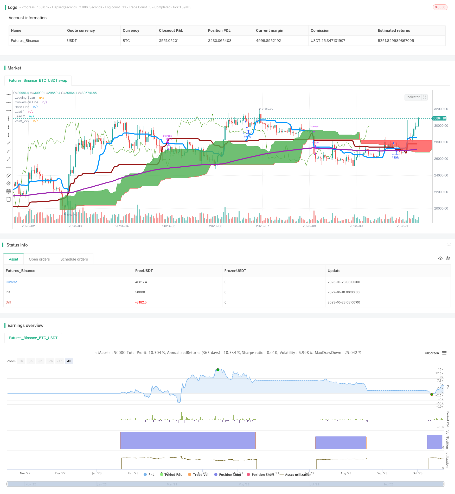

> Name

Ichimoku-Balance-Line-trend-following-Strategy
> Author

ChaoZhang

> Strategy Description



[trans]


### Overview
The Ichimoku strategy is a trend following strategy that combines the Conversion line and Base line of the Ichimoku cloud indicator, as well as the moving average EMA to determine the trend direction, and enter the market based on the signal of price breakthrough. Go long when the Conversion line crosses the Base line and the price is above the 200-day EMA; close the position when the Conversion line crosses the Base line below. This strategy integrates multiple indicators to determine the trend direction, which can effectively track the trend and obtain excess returns.
### Strategy Principles
This strategy mainly uses the following indicators:
1. Conversion line: The middle value of the Donchian channel represents the shortest trend of price, which is equivalent to the 9-day moving average.
2. Base line: the middle value of the Donchian channel, which represents the mid-term trend of prices and is equivalent to the 26-day moving average.
3. Lagging Span: Closes the moving average line of price, with a moving period of 120 days, used to determine support and resistance.
4. Lead 1: The average of the Conversion line and the Base line represents the long-term trend of prices.
5. Lead 2: The middle value of the 120-day Donchian channel, which represents the longest-term trend of prices.
6. EMA200: 200-day exponential moving average to determine the direction of the general trend.
When the Conversion line crosses the Base line, it means that the short-term moving average crosses the long-term moving average, which is a golden cross signal, indicating that the price trend has begun to become stronger and you can go long. At this time, if the price is still higher than the 200-day EMA, it means that it is in a long-term bull market and the long signal is more reliable.
When the Conversion line crosses the Base line, it is a dead cross signal, indicating that the price trend has begun to weaken, and the position should be closed and the loss stopped.
Combining the cross signals of multiple moving averages can effectively determine the turning point of price trends and achieve trend tracking. At the same time, combined with long-term moving average filtering, false signals caused by short-term market fluctuations can be avoided.
### Advantage Analysis
1. Use multiple moving averages to determine the trend direction and improve the accuracy of judgment. The intersection of the Conversion line and the Base line is the core trading signal, and the long and short arrangement of Lead 1 and Lead 2 is used to verify the reliability of the signal.
2. Lagging Span can be used to confirm support and resistance levels to further improve the timing of entry.
3. Use EMA200 to determine the direction of the general trend and avoid wrong transactions due to short-term adjustments. Only when the general trend is upward, the long signal will be considered.
4. Through parameter optimization, the periodic combination of conversion line and baseline can grasp the trend conversion points of different periods.
5. The strategic ideas are clear and easy to understand, and easy to reproduce in real time.
### Risk Analysis
1. When the Conversion line and the Base line cross, pay attention to the arrangement of Lead 1 and Lead 2 to confirm the signal. If the order is abnormal, it may be a false breakthrough, and trading should be avoided at this time.
2. Longer-period indicators such as EMA200 must be used to determine the general trend. If the general trend is downward, avoid long signals even if they appear.
3. This strategy relies more on trends and can easily generate false signals in volatile markets, leading to stop loss. Risks should be controlled in conjunction with indicators such as volatility.
4. Parameter settings require testing and optimization. If the parameters are set improperly, the conversion line and baseline will be too sensitive or slow, resulting in missed orders or wrong orders.
### Optimization direction
1. You can test and add other moving average indicators, such as EMA 50, EMA 100, etc. to assist in judging the trend.
2. Trading volume indicators can be combined to confirm trend turning points to avoid invalid breakthroughs. For example, a breakthrough requires an increase in trading volume.
3. You can use volatility indicators such as ATR to dynamically adjust stop loss levels and profit targets. When volatility expands, the stop loss can be relaxed appropriately; when volatility shrinks, the stop loss can be tightened to lock in profits.
4. The parameter combination of the conversion line and the baseline can be optimized based on historical data backtesting to obtain more stable trading signals.
5. You can establish a position management strategy, increase long positions when the general trend is upward, and reduce positions during volatile market conditions.
### Summarize
The Ichimoku equilibrium strategy uses multiple moving average indicators to determine the trend direction, enter the market at the trend transition point, and then follow the trend to effectively grasp the medium and long-term trends. Compared with a single indicator, this strategy can filter out false signals and improve the accuracy of entry. However, parameters still need to be optimized and supplemented by other indicators to ensure the reliability of signals and control risks. If the parameters are set appropriately, the trading frequency will not be too high, and the trend band can be held for a long time to achieve excess returns.
||


### Overview

The Ichimoku Balance Line strategy is a trend following strategy that combines the Conversion Line and Base Line from the Ichimoku Cloud indicator and the moving average EMA to determine the trend direction. It enters long positions when the Conversion Line crosses above the Base Line and the price is above the 200-day EMA; closes positions when the Conversion Line crosses below the Base Line. This strategy incorporates multiple indicators to determine the trend direction, which allows effectively following the trend and achieving excess returns.

### Strategy Logic

The strategy primarily uses the following indicators:

1. Conversion Line: The midpoint of the Donchian Channel, representing the shortest-term trend of the price, similar to a 9-day moving average.

2. Base Line: The midpoint of the Donchian Channel, representing the medium-term trend of the price, similar to a 26-day moving average.

3. Lagging Span: The displaced moving average of the closing price, displacement period is 120 days, used to determine support and resistance.

4. Lead 1: The average of the Conversion Line and the Base Line, representing the long-term trend. 

5. Lead 2: The midpoint of the 120-day Donchian Channel, representing the longest-term trend.

6. EMA200: The 200-day exponential moving average judging the major trend direction.

When the Conversion Line crosses above the Base Line, it signals the short-term moving average is crossing above the long-term moving average, which is a bullish golden cross signal indicating the trend is strengthening for going long. If the price is also above the 200-day EMA, it indicates the major trend is upward, making the long signal more reliable.

When the Conversion Line crosses below the Base Line, it is a death cross signal indicating the trend is turning weak, and positions should be closed for stop loss.

By combining crossover signals of multiple moving averages, the strategy can effectively determine trend reversal points for trend following. Using the long-term moving average filter avoids incorrect signals caused by short-term market fluctuations.

### Advantage Analysis 

1. Using multiple moving averages to determine the trend direction improves accuracy. The Conversion and Base Line crossovers are the core trading signals, while the alignment of Lead 1 and 2 validates the reliability of the signals.

2. The Lagging Span can be used to confirm support and resistance levels, further improving entry timing.

3. Applying the EMA200 to gauge the major trend avoids incorrect trades due to short-term corrections. Only long signals are considered in a major uptrend.

4. The periods of the Conversion and Base Lines can be optimized to capture trend reversal points across different timeframes.

5. The strategy logic is straightforward and easy to implement for live trading.

### Risk Analysis

1. When the Conversion and Base Lines cross, watch for the alignment of Lead 1 and 2 to confirm the signal. If the alignment is anomalous, it may be a false breakout, in which case trades should be avoided.

2. Longer-term indicators like the EMA200 must be incorporated to determine the major trend. Long signals should be avoided if the major trend is down.

3. The strategy relies more on trends, so can generate incorrect signals and stop loss in ranging markets. Volatility measures should be added to control risk.

4. Parameter tuning through backtesting optimization is needed to avoid oversensitive or lagging signals from improper Conversion and Base Line periods. 

5. Optimization is needed on the number of moving average periods used. Too many may lead to excessive curve fitting.

### Enhancement Opportunities

1. Other moving averages like the EMA 50 and EMA 100 can be tested to corroborate the trend.

2. Volume indicators should confirm trend reversal points and avoid false breakouts. For example, require rising volume on breakouts.

3. Volatility measures like ATR can be used to dynamically adjust stop loss and take profit levels. Widen stops and targets when volatility expands, and tighten them to lock in profits when volatility contracts.

4. Backtest to find the optimal parameter combinations for the Conversion and Base Line periods for more consistent signals. 

5. Build a position sizing rule to increase long exposure in uptrends and decrease exposure in choppy conditions.

### Summary

The Ichimoku Balance Line strategy captures mid- to long-term trends by entering on trend reversal signals from multiple moving average crossovers. Compared to single indicator strategies, it can filter out false signals and improve entry accuracy. But parameters need to be optimized, and additional indicators incorporated to ensure reliable signals and manage risk. With well-tuned settings, trade frequency should not be too high, allowing riding long swings for excess returns.

[/trans]

> Strategy Arguments


|Argument|Default|Description|
|----|----|----|
|v_input_1|20|Conversion Line Periods|
|v_input_2|60|Base Line Periods|
|v_input_3|120|Lagging Span 2 Periods|
|v_input_4|30|Displacement|


> Source (PineScript)

``` pinescript
/*backtest
start: 2022-10-18 00:00:00
end: 2023-10-24 00:00:00
period: 1d
basePeriod: 1h
exchanges: [{"eid":"Futures_Binance","currency":"BTC_USDT"}]
*/

//@version=3
strategy(title="TK Cross > EMA200 Strat", shorttitle="TK Cross > EMA200 Strat", overlay=true)

ema200 = ema(close, 200)
conversionPeriods = input(20, minval=1, title="Conversion Line Periods"),
basePeriods = input(60, minval=1, title="Base Line Periods")
laggingSpan2Periods = input(120, minval=1, title="Lagging Span 2 Periods"),
displacement = input(30, minval=1, title="Displacement")

donchian(len) => avg(lowest(len), highest(len))

conversionLine = donchian(conversionPeriods)
baseLine = donchian(basePeriods)
leadLine1 = avg(conversionLine, baseLine)
leadLine2 = donchian(laggingSpan2Periods)

plot(conversionLine, color=#0496ff, title="Conversion Line", linewidth=4)
plot(baseLine, color=#991515, title="Base Line", linewidth=4)
plot(close, offset = -displacement, color=#459915, title="Lagging Span")

p1 = plot(leadLine1, offset = displacement, color=green,
 title="Lead 1")
p2 = plot(leadLine2, offset = displacement, color=red, 
 title="Lead 2")
fill(p1, p2, color = leadLine1 > leadLine2 ? green : red)

plot(ema200, color=purple, linewidth=4)
strategy.initial_capital = 50000
strategy.entry('tkcross', strategy.long, strategy.initial_capital / close, when=conversionLine>baseLine and close > ema200)
strategy.close('tkcross', when=conversionLine<baseLine)

```

> Detail

https://www.fmz.com/strategy/430142

> Last Modified

2023-10-25 14:32:23
