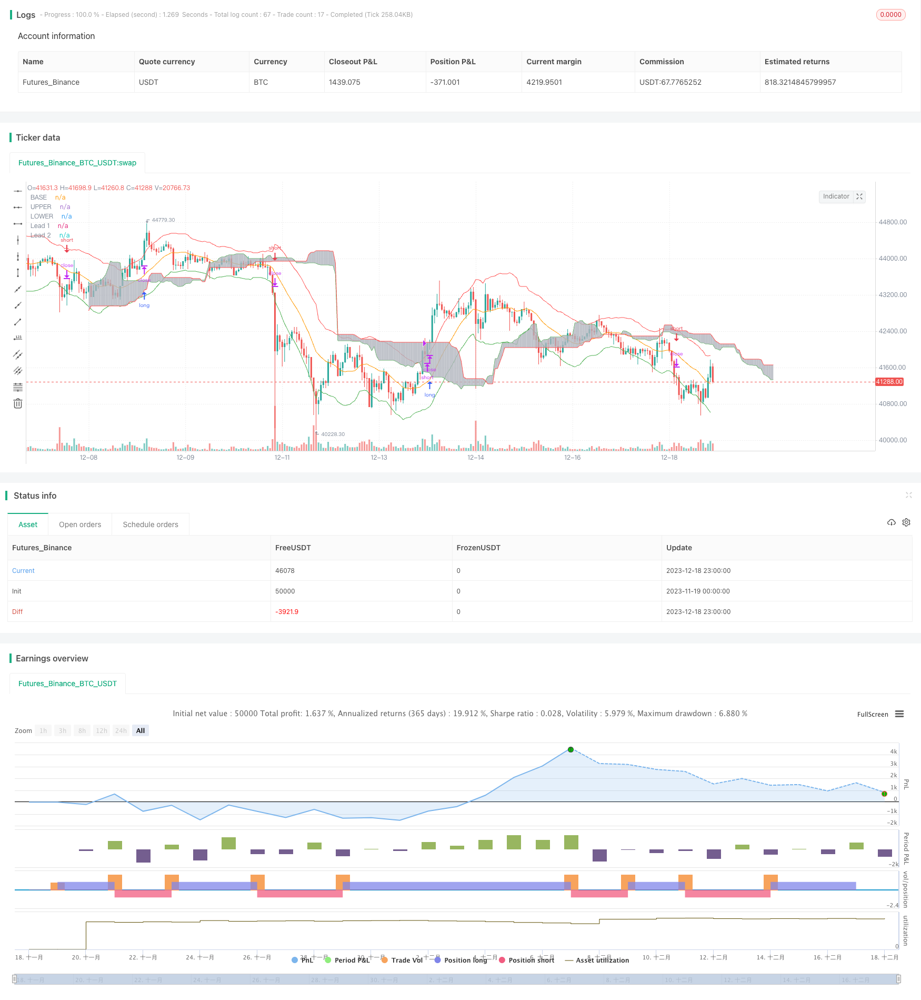

> Name

Integrated-Ichimoku-Keltner-Trading-System-Based-on-Moving-Average-Strategy
> Author

ChaoZhang

> Strategy Description


 [trans]

### Overview
This strategy integrates the moving average strategy, Ichimoku cloud chart and Keltner channel technical indicators to realize trend tracking and breakthrough trading, and is suitable for high-frequency algorithmic trading.
### Strategy Principles
1. Use the Keltner channel to determine whether the stock price exceeds the upper and lower rails of the channel as a signal to open a position.
2. Ichimoku cloud chart to determine trend direction, used in conjunction with Keltner channel
3. The moving average strategy sends a closing signal
### Advantage Analysis
1. Integrate multiple technical indicators, make comprehensive judgments, and improve decision-making accuracy
2. Keltner channel determines overbought and oversold conditions to avoid opening positions to chase highs and sell lows.
3. Ichimoku cloud chart to determine the general trend and avoid counter-trend trading
4. The moving average strategy filters out shocks and prevents over-sensitivity.
### Risk Analysis
1. Multi-indicator integration, parameter settings are complex and require careful testing.
2. Conversion cloud and base line crossings are not always reliable trading signals
3. Keltner channel parameters need to be adjusted to adapt to the characteristics of different stocks.
### Optimization direction
1. Evaluate server performance, appropriately shorten the moving average period, and increase transaction frequency
2. Test the sensitivity of different stocks to parameters and set adaptive parameters
3. Add stop loss strategy to reduce single loss
### Summarize
This strategy integrates multiple technical indicators such as Ichimoku cloud chart, Keltner channel and moving average strategy to achieve trend tracking and efficient breakthrough trading. Compared with a single indicator, this strategy's judgment is more comprehensive and accurate, avoiding certain false signals. At the same time, there is also the problem that parameter settings are relatively complex and need to be optimized for individual stocks. Overall, this strategy is suitable for high-frequency algorithmic trading and has significant effects.
||


## Overview

This strategy integrates moving average strategy, Ichimoku cloud charts and Keltner channel technical indicators to achieve trend following and breakthrough trading, which is suitable for high-frequency algorithmic trading.

## Strategy Principle 

1. Use Keltner channel to judge whether the stock price exceeds the upper and lower rails of the channel as a signal for opening positions
2. Ichimoku cloud charts judge the trend direction and use with Keltner channel
3. Moving average strategy sends closing signals

## Advantage Analysis

1. Integrate multiple technical indicators for comprehensive judgment to improve decision accuracy
2. Keltner channel judges overbought and oversold conditions to avoid chasing highs and killing lows when opening positions 
3. Ichimoku cloud charts judge major trends to avoid trading against the trend
4. Moving average strategy filters shocks and prevents excessive sensitivity

## Risk Analysis

1. The integration of multiple indicators makes parameter settings more complex and requires careful testing
2. The crossing of conversion line and baseline of cloud charts is not always a reliable trading signal
3. The Keltner channel needs to adjust parameters to adapt to the characteristics of different stocks

## Optimization Directions

1. Evaluate server performance and appropriately shorten moving average cycles to increase trading frequency
2. Test the sensitivity of different stocks to parameters and set adaptive parameters
3. Increase stop loss strategy to reduce single loss

## Summary

This strategy integrates Ichimoku cloud charts, Keltner channels and moving average strategies with multiple technical indicators to achieve trend tracking and efficient breakthrough trading. Compared with a single indicator, the judgment of this strategy is more comprehensive and accurate, avoiding certain false signals. At the same time, there are also problems that the parameter settings are more complex and need to be optimized for individual stocks. In general, this strategy is suitable for high-frequency algorithmic trading with significant effects.

[/trans]

> Strategy Arguments


|Argument|Default|Description|
|----|----|----|
|v_input_1|true|useTrueRange|
|v_input_2|18|length|
|v_input_3|1.8|mult|
|v_input_4|200|ATRlength|
|v_input_5|2.272|ATRMult|
|v_input_6|26|EMA Length|
|v_input_7_close|0|Source: close|high|low|open|hl2|hlc3|hlcc4|ohlc4|
|v_input_8|15|conversionPeriods|
|v_input_9|35|basePeriods|
|v_input_10|52|laggingSpan2Periods|
|v_input_11|26|displacement|


> Source (PineScript)

``` pinescript
/*backtest
start: 2023-11-19 00:00:00
end: 2023-12-19 00:00:00
period: 1h
basePeriod: 15m
exchanges: [{"eid":"Futures_Binance","currency":"BTC_USDT"}]
*/

//@version=3
// Author: Persio Flexa
// Description: Ichimoku Clouds with Keltner Channel, perfect for margin trading 
strategy("Ichimoku Keltner Strategy", overlay=true) 

// -- Keltner ------------------------------------------------------------------
source = close

useTrueRange = input(true)
length = input(18, minval=1) 
mult = input(1.8)

ma = sma(source, length)
range = useTrueRange ? tr : high - low
rangema = sma(range, length)
upper = ma + rangema * mult
lower = ma - rangema * mult

plot(ma, title="BASE", color=orange,transp=85)
plot(upper, title="UPPER", color=red)
plot(lower, title="LOWER", color=green)

//crossUpper = crossover(source, upper)
//crossLower = crossunder(source, lower)
crossUpper = source > upper
crossLower = source  < lower

bprice = 0.0
bprice := crossUpper ? high+syminfo.mintick : nz(bprice[1])

sprice = 0.0
sprice := crossLower ? low -syminfo.mintick : nz(sprice[1]) 

crossBcond = false
crossBcond := crossUpper ? true 
 : na(crossBcond[1]) ? false : crossBcond[1]

crossScond = false
crossScond := crossLower ? true 
 : na(crossScond[1]) ? false : crossScond[1]

cancelBcond = crossBcond and (source < ma or high >= bprice )
cancelScond = crossScond and (source > ma or low <= sprice )

// ---------------------------------------------------------------------


// -- Ichimoku

ATRlength = input(200, minval=1)
ATRMult = input(2.272, minval=1)

ATR = rma(tr(true), ATRlength)

len = input(26, minval=1, title="EMA Length")
src = input(close, title="Source")
out = ema(src, len)

emaup = out+(ATR*ATRMult)
emadw = out-(ATR*ATRMult)

conversionPeriods = input(15, minval=1),
basePeriods = input(35, minval=1)
laggingSpan2Periods = input(52, minval=1),
displacement = input(26, minval=1)

donchian(len) => avg(lowest(len), highest(len))

conversionLine = donchian(conversionPeriods)
baseLine = donchian(basePeriods)
leadLine1 = avg(conversionLine, baseLine)
leadLine2 = donchian(laggingSpan2Periods)

p1 = plot(leadLine1, offset = displacement, color=green,transp=85, title="Lead 1")
p2 = plot(leadLine2, offset = displacement, color=red,transp=85, title="Lead 2")
fill(p1, p2,silver) 

longCond    = crossover(conversionLine, baseLine)
shortCond   = crossunder(conversionLine, baseLine)
// -------------------------------------------------------------------------

if (crossUpper and (conversionLine > baseLine))
    strategy.entry("long", strategy.long, stop=bprice, comment="LONG")

if (crossLower and (conversionLine < baseLine))
    strategy.entry("short", strategy.short, stop=sprice, comment="SHORT")
    
strategy.close("long", when = (shortCond and source < lower))
strategy.close("short", when = (longCond and source > upper))
```

> Detail

https://www.fmz.com/strategy/435950

> Last Modified

2023-12-20 13:40:08
