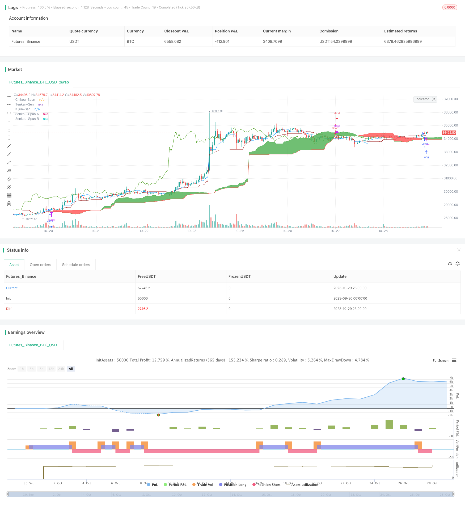

> Name

Ichimoku-Kinko-Hyo-Cross-Strategy
> Author

ChaoZhang

> Strategy Description


[trans]


### Overview
Ichimoku's similarity and difference crossover trading strategy calculates the intersection of Ichimoku's Tiantan line and the baseline, and combines the relationship between price and cloud disk to form a trading signal and achieve profits. This strategy combines the advantages of trend trading and reversal trading. It can not only follow the trend but also capture reversal opportunities. It is a very versatile and practical trading strategy.
### Strategy Principles
1. Calculate the components of Ichimoku Balance:
-Tenkan-Sen: the midpoint of the last 9 K-lines
- Baseline (Kijun-Sen): the midpoint of the last 26 K lines
- Leading line (Senkou Span A): the average of Tiantan line and base line
- Senkou Span B: the midpoint of the last 52 candlesticks
2. Observe the following combinations of trading signals:
- The intersection of Tiantan line and base line (golden cross and death cross)
- The closing price above or below the cloud (composed of leading and late moving lines)
- The direction of the 26-period delayed K-line (Chikou Span) compared to the current K-line
3. When the following trading signals are observed, you can open a position:
- Bull signal: Tiantan line crosses the baseline (golden cross) and the closing price is higher than the cloud disk and Chikou Span is higher than the closing price delayed by 26 periods
- Short signal: Tiantan line crosses below the base line (death cross) and the closing price is lower than the cloud and Chikou Span is lower than the closing price delayed by 26 periods
4. When a trading signal in the opposite direction is observed, the position can be closed.
### Strategic Advantages
1. Combining the advantages of trend trading and reversal trading, you can follow the trend and capture reversals.
2. Using the intersection of moving averages to form trading signals can enhance the reliability of the signal and avoid false breakthroughs.
3. Combining multiple trading signals can effectively filter market noise and lock in high-probability opportunities.
4. The extension line Chikou Span can avoid falling into a violent market correction.
5. The cloud disk area provides support and resistance, which can more accurately determine the entry and take-profit positions.
### Strategy Risk
1. Improper parameter settings may lead to excessive trading frequency or unclear signals.
2. When the trend changes suddenly, large losses may occur.
3. During the difficult period of shock and consolidation, trading signals are significantly reduced, making it more difficult to achieve profitability.
4. When the cloud disk area is too wide, the entry signal may lag.
5. Comprehensive judgment of multiple factors increases the difficulty of judgment, and the actual operation is more difficult.
Risks can be controlled by optimizing parameters, reasonably controlling position size, setting stop loss positions, and selecting trading varieties with good liquidity.
### Strategy optimization direction
1. Optimize the moving average parameters to achieve optimal trading frequency and profitability.
2. Add trend judgment indicators to avoid losses caused by sudden trends.
3. Add volatility indicators to control trading risks.
4. Optimize the opening position size and stop loss position.
5. Add trading volume energy indicator to ensure sufficient liquidity.
6. Test parameter settings for different varieties.
7. Add machine learning algorithms to automatically optimize parameters based on backtest data.
### Summarize
The Ichimoku Equilibrium Similarity and Divergence Crossover strategy comprehensively uses a variety of technical indicators such as moving average crossovers, delay lines, and cloud disk areas to form trading signals. It can effectively identify the trend direction and open positions in important support and resistance areas. It is a relatively stable and reliable trading strategy. Through parameter optimization and strict fund management, the stability and profitability of the strategy can be further improved. This strategy is easy to understand and implement, and is worthy of real-time verification and application.
||


### Overview

The Ichimoku Kinko Hyo Cross strategy generates trading signals by observing the crossovers between Tenkan-Sen and Kijun-Sen lines of the Ichimoku system, combined with the price level versus the Cloud. This strategy incorporates both trend following and reversal trading, making it a versatile and practical trading strategy.

### Strategy Logic

1. Calculate the Ichimoku components:

    - Tenkan-Sen: Midpoint of last 9 bars

    - Kijun-Sen: Midpoint of last 26 bars

    - Senkou Span A: Average of Tenkan-Sen and Kijun-Sen

    - Senkou Span B: Midpoint of last 52 bars

2. Observe the combination of following trading signals:

    - Crossover between Tenkan-Sen and Kijun-Sen (Golden Cross and Death Cross)

    - Close price above or below the Cloud (Senkou Span A and B)

    - Chikou Span compared to close price 26 bars ago

3. Entry signals:

    - Long: Tenkan-Sen crosses above Kijun-Sen (Golden Cross) and close above Cloud and Chikou Span above close 26 bars ago

    - Short: Tenkan-Sen crosses below Kijun-Sen (Death Cross) and close below Cloud and Chikou Span below close 26 bars ago
    
4. Exit signals when opposite signal occurs.

### Advantages

1. Combines trend following and reversal trading.

2. Crossovers ensure signal reliability and avoid false breakouts. 

3. Multiple signal confirmation filters out market noise.

4. Chikou Span avoids whipsaws.

5. Cloud provides support and resistance for entries and exits.

### Risks

1. Improper parameters may cause overtrading or unclear signals.

2. Trend reversals can lead to large losses.  

3. Fewer trading opportunities during range-bound markets.

4. Delayed entry signals if Cloud is too wide. 

5. High signal complexity increases implementation difficulty.

Risks can be mitigated through parameter optimization, position sizing, stop losses, liquid products, etc.

### Enhancements

1. Optimize moving average periods for ideal frequency and profitability.

2. Add trend filter to avoid trend reversal losses.

3. Add volatility filter to control risk. 

4. Optimize entry size and stop loss placement.

5. Add volume filter to ensure liquidity.

6. Test parameters across different products.

7. Employ machine learning to auto-optimize parameters based on backtests.

### Conclusion

The Ichimoku Kinko Hyo Cross strategy combines various technical analysis tools like moving average crossovers, delayed lines, and Cloud bands to identify high-probability entries in trending or reversal scenarios. Proper optimization and risk management can further improve its stability and profitability. The strategy is easy to understand and implement, making it worth live testing and application.

[/trans]

> Strategy Arguments


|Argument|Default|Description|
|----|----|----|
|v_input_1|9|Tenkan-Sen Bars|
|v_input_2|26|Kijun-Sen Bars|
|v_input_3|52|Senkou-Span B Bars|
|v_input_4|26|Chikou-Span Offset|
|v_input_5|26|Senkou-Span Offset|
|v_input_6|true|Long Entry|
|v_input_7|true|Short Entry|


> Source (PineScript)

``` pinescript
/*backtest
start: 2023-09-30 00:00:00
end: 2023-10-30 00:00:00
period: 1h
basePeriod: 15m
exchanges: [{"eid":"Futures_Binance","currency":"BTC_USDT"}]
*/

//@version=4
strategy("Ichimoku Kinko Hyo: Basic Strategy", overlay=true)

//Inputs
ts_bars = input(9, minval=1, title="Tenkan-Sen Bars")
ks_bars = input(26, minval=1, title="Kijun-Sen Bars")
ssb_bars = input(52, minval=1, title="Senkou-Span B Bars")
cs_offset = input(26, minval=1, title="Chikou-Span Offset")
ss_offset = input(26, minval=1, title="Senkou-Span Offset")
long_entry = input(true, title="Long Entry")
short_entry = input(true, title="Short Entry")

middle(len) => avg(lowest(len), highest(len))

// Ichimoku Components
tenkan = middle(ts_bars)
kijun = middle(ks_bars)
senkouA = avg(tenkan, kijun)
senkouB = middle(ssb_bars)

// Plot Ichimoku Kinko Hyo
plot(tenkan, color=#0496ff, title="Tenkan-Sen")
plot(kijun, color=#991515, title="Kijun-Sen")
plot(close, offset=-cs_offset+1, color=#459915, title="Chikou-Span")
sa=plot(senkouA, offset=ss_offset-1, color=green, title="Senkou-Span A")
sb=plot(senkouB, offset=ss_offset-1, color=red, title="Senkou-Span B")
fill(sa, sb, color = senkouA > senkouB ? green : red, title="Cloud color")

ss_high = max(senkouA[ss_offset-1], senkouB[ss_offset-1])
ss_low = min(senkouA[ss_offset-1], senkouB[ss_offset-1])

// Entry/Exit Signals
tk_cross_bull = tenkan > kijun
tk_cross_bear = tenkan < kijun
cs_cross_bull = mom(close, cs_offset-1) > 0
cs_cross_bear = mom(close, cs_offset-1) < 0
price_above_kumo = close > ss_high
price_below_kumo = close < ss_low

bullish = tk_cross_bull and cs_cross_bull and price_above_kumo
bearish = tk_cross_bear and cs_cross_bear and price_below_kumo

strategy.entry("Long", strategy.long, when=bullish and long_entry)
strategy.entry("Short", strategy.short, when=bearish and short_entry)

strategy.close("Long", when=bearish and not short_entry)
strategy.close("Short", when=bullish and not long_entry)
```

> Detail

https://www.fmz.com/strategy/430672

> Last Modified

2023-10-31 15:00:43
