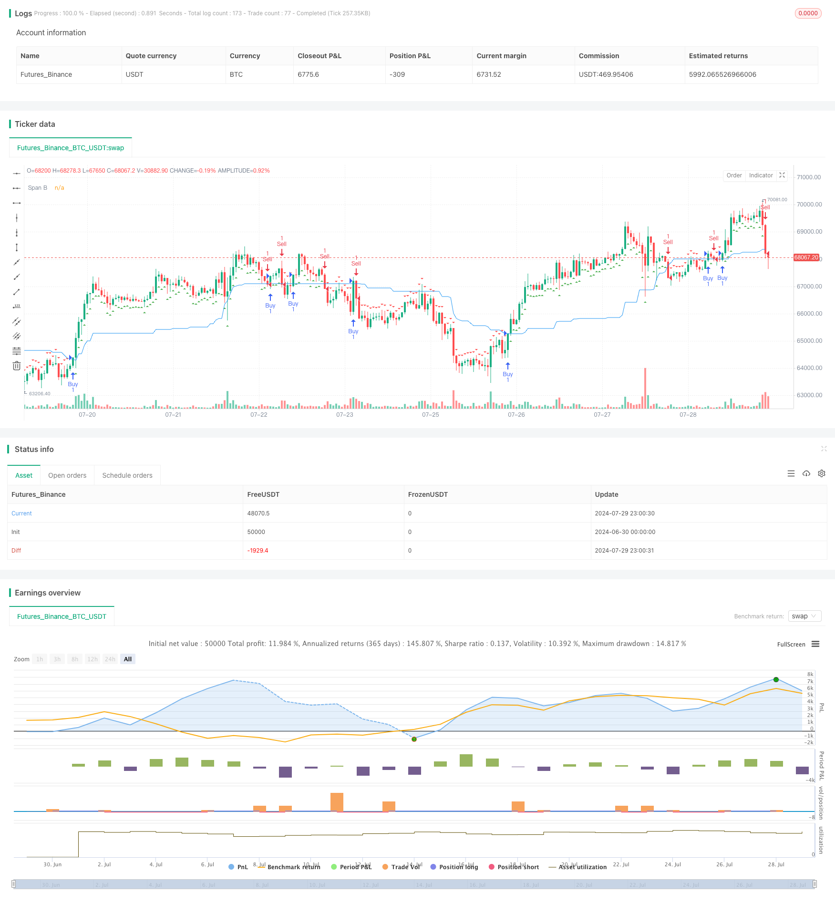

> Name

Ichimoku-Kinko-Hyo-Trend-Following-and-Support-Resistance-Strategy
> Author

ChaoZhang

> Strategy Description



[trans]
#### Overview
This strategy is based on the Ichimoku Kinko Hyo technical indicator, specifically using the Span B line to make trading decisions. The core idea of ​​the strategy is to buy when the price is above the Span B line and sell when the price falls below the Span B line. This approach takes full advantage of the Ichimoku chart's ability to identify market trends and support/resistance levels.
The strategy uses 52 periods as the calculation basis of the Span B line. This setting is designed to capture the mid- to long-term market equilibrium. By observing the relative position of the price and the Span B line, traders can determine whether the current market is in an upward trend or a downward trend, and thus make corresponding trading decisions.
#### Strategy Principle
The core logic of the strategy is as follows:
1. Span B line calculation: Use the average of the highest price and lowest price within 52 periods to calculate the Span B line. This setting is intended to reflect the longer-term state of market equilibrium.
2. Buy signal: When the closing price breaks above the Span B line, a buy signal is generated. This indicates that the market may be entering an uptrend.
3. Sell signal: When the closing price falls below the Span B line, a sell signal is generated. This could signal the beginning of a downtrend.
4. Trade execution: The strategy opens a long position when a buy signal is detected, and a short position when a sell signal is detected.
5. Visualization: The strategy draws the Span B line on the chart, and uses green triangles to mark buy signals and red triangles to mark sell signals, so that traders can intuitively judge market conditions and trading opportunities.
#### Strategic Advantages
1. Trend Following: This strategy is essentially a trend following strategy that helps capture major market movements. By following price relative to the Span B line, traders can enter early in a trend and exit when the trend reverses.
2. Simplicity: Compared with the complete Ichimoku balance chart system, this strategy only focuses on the Span B line, which greatly simplifies the decision-making process and makes the strategy easier to understand and implement. This simplification not only reduces the complexity of the strategy, but also reduces the risk of overfitting.
3. Flexibility: The parameters of the strategy (such as the calculation period of Span B) can be adjusted according to different markets and time frames. This flexibility allows the strategy to be adapted to a variety of trading instruments and market environments.
4. Objectivity: Based on clear mathematical calculations and rules, strategies eliminate the influence of subjective judgment and help maintain consistency and discipline in transactions.
5. Support and resistance identification: Span B lines are not only used to generate trading signals, but also serve as dynamic support and resistance levels. This provides traders with additional insight into market structure.
#### Strategy Risk
1. False breakouts: In a sideways market, the price may frequently cross the Span B line, resulting in too many false signals. This can trigger frequent trading, increase transaction costs and reduce the overall performance of the strategy.
2. Lagging: Since the Span B line is calculated based on a 52-period lookback, it may react slower in a rapidly changing market. This lag can result in missing important entry or exit opportunities.
3. Insufficient confirmation: Relying solely on Span B lines may not be comprehensive enough. The lack of confirmation from other technical indicators or fundamental analysis may increase the risk of misjudgment.
4. Sensitivity to market conditions: The strategy performs better in strong trending markets, but may perform poorly under the influence of volatile markets or emergencies.
5. Over-reliance on a single indicator: Using only the Span B line as a basis for decision-making may ignore other important market information and increase the vulnerability of the strategy.
#### Strategy optimization direction
1. Signal filtering: Introduce additional conditions to filter trading signals, such as combining volume confirmation or other technical indicators. This can be achieved by adding indicators such as RSI or MACD to increase the reliability of the signal.
2. Dynamic parameter adjustment: Realize dynamic adjustment of Span B calculation cycle to adapt to different market fluctuations. Consider using adaptive algorithms to automatically adjust parameters based on market volatility.
3. Multi-timeframe analysis: Combine longer and shorter timeframes to get a more comprehensive view of the market. For example, you can use this strategy on the daily line while referring to the weekly trend as an additional filter.
4. Stop loss and take profit optimization: Introduce dynamic stop loss and take profit mechanisms, such as stop loss settings based on ATR (Average True Range), or use trailing stop loss to protect profits.
5. Market status classification: Develop a market status classification system and adopt different trading rules in different market environments (such as trending markets and volatile markets).
6. Machine learning integration: Use machine learning algorithms to optimize parameter selection and signal generation processes to improve the adaptive ability and performance of the strategy.
#### Summarize
The trend following and support-resistance strategy based on the Ichimoku Span B-line provides traders with a simple yet effective way to capture market trends and identify key support and resistance levels. By observing the position of price relative to the Span B line, traders can make clear buy and sell decisions.
The strength of the strategy is its simplicity, objectivity and sensitivity to trends, which makes it particularly suitable for beginners and experienced traders looking for a simplified trading system. However, like all trading strategies, it faces risks such as false breakouts, lag, and over-reliance on a single indicator.
In order to improve the robustness and adaptability of the strategy, traders are recommended to consider introducing additional filtering conditions, optimizing parameter settings, combining multi-time frame analysis, and implementing a dynamic risk management mechanism. Through these optimizations, strategies can better adapt to different market environments, improve profitability and reduce risks.
Ultimately, successfully applying this strategy requires traders to deeply understand the principles of the Ichimoku equilibrium chart, continuously monitor and evaluate the strategy's performance, and flexibly adjust according to market changes. Through continuous learning and optimization, traders can transform this simple yet powerful tool into a reliable trading system.
|| 

#### Overview

This strategy is based on the Ichimoku Kinko Hyo technical indicator, specifically utilizing its Span B line for trading decisions. The core idea is to buy when the price is above the Span B line and sell when it falls below. This approach leverages the Ichimoku's strengths in identifying market trends and support/resistance levels.

The strategy uses a 52-period calculation for the Span B line, aiming to capture medium to long-term market equilibrium. By observing the price's position relative to the Span B line, traders can determine whether the market is in an uptrend or downtrend and make trading decisions accordingly.

#### Strategy Principles

The core logic of the strategy is as follows:

1. Span B Calculation: The Span B line is calculated using the average of the highest high and lowest low over the past 52 periods. This setting is designed to reflect longer-term market equilibrium.

2. Buy Signal: A buy signal is generated when the closing price crosses above the Span B line. This suggests that the market may be entering an uptrend.

3. Sell Signal: A sell signal is generated when the closing price crosses below the Span B line. This may indicate the beginning of a downtrend.

4. Trade Execution: The strategy opens a long position when a buy signal is detected and a short position when a sell signal is detected.

5. Visualization: The strategy plots the Span B line on the chart and marks buy signals with green triangles and sell signals with red triangles, allowing traders to visually assess market conditions and trading opportunities.

#### Strategy Advantages

1. Trend Following: This strategy is inherently trend-following, helping to capture major market moves. By following the price's position relative to the Span B line, traders can enter trends early and exit when trends reverse.

2. Simplicity: Compared to the full Ichimoku system, this strategy focuses only on the Span B line, greatly simplifying the decision-making process. This simplification not only reduces strategy complexity but also minimizes the risk of overfitting.

3. Flexibility: The strategy's parameters (such as the calculation period for Span B) can be adjusted for different markets and timeframes. This flexibility allows the strategy to adapt to various trading instruments and market environments.

4. Objectivity: Based on clear mathematical calculations and rules, the strategy eliminates the impact of subjective judgment, helping to maintain consistency and discipline in trading.

5. Support and Resistance Identification: The Span B line serves not only to generate trading signals but also as a dynamic support and resistance level. This provides traders with additional insights into market structure.

#### Strategy Risks

1. False Breakouts: In ranging markets, price may frequently cross the Span B line, leading to excessive false signals. This can result in frequent trading, increasing transaction costs and reducing overall strategy performance.

2. Lag: As the Span B line is calculated based on a 52-period lookback, it may be slow to react in rapidly changing markets. This lag can cause missed entry or exit opportunities.

3. Lack of Confirmation: Relying solely on the Span B line may not be comprehensive enough. The absence of confirmation from other technical indicators or fundamental analysis may increase the risk of misjudgment.

4. Market Condition Sensitivity: The strategy may perform well in strong trend markets but could struggle in choppy markets or during sudden event-driven price moves.

5. Over-reliance on a Single Indicator: Using only the Span B line for decision-making may ignore other important market information, increasing the strategy's vulnerability.

#### Strategy Optimization Directions

1. Signal Filtering: Introduce additional conditions to filter trading signals, such as volume confirmation or other technical indicators. This can be achieved by adding indicators like RSI or MACD to improve signal reliability.

2. Dynamic Parameter Adjustment: Implement dynamic adjustment of the Span B calculation period to adapt to different market volatility conditions. Consider using adaptive algorithms to automatically adjust parameters based on market volatility.

3. Multi-Timeframe Analysis: Incorporate longer and shorter timeframes to gain a more comprehensive market perspective. For example, use the strategy on daily charts while referencing weekly trends as an additional filter.

4. Stop Loss and Take Profit Optimization: Introduce dynamic stop loss and take profit mechanisms, such as ATR (Average True Range) based stop losses or trailing stops to protect profits.

5. Market State Classification: Develop a market state classification system to apply different trading rules in various market environments (e.g., trending markets, ranging markets).

6. Machine Learning Integration: Utilize machine learning algorithms to optimize parameter selection and signal generation processes, enhancing the strategy's adaptability and performance.

#### Conclusion

The Ichimoku Kinko Hyo Trend Following and Support Resistance Strategy based on the Span B line offers traders a simple yet effective method to capture market trends and identify key support and resistance levels. By observing the price's position relative to the Span B line, traders can make clear buy and sell decisions.

The strategy's strengths lie in its simplicity, objectivity, and sensitivity to trends, making it particularly suitable for beginners and experienced traders seeking to simplify their trading systems. However, like all trading strategies, it faces risks such as false breakouts, lag, and over-reliance on a single indicator.

To enhance the strategy's robustness and adaptability, traders are advised to consider introducing additional filtering conditions, optimizing parameter settings, incorporating multi-timeframe analysis, and implementing dynamic risk management mechanisms. Through these optimizations, the strategy can better adapt to different market environments, improve profitability, and reduce risk.

Ultimately, successful application of this strategy requires traders to deeply understand the principles of Ichimoku Kinko Hyo, continuously monitor and evaluate strategy performance, and flexibly adjust according to market changes. Through ongoing learning and optimization, traders can transform this simple yet powerful tool into a reliable trading system.

[/trans]


> Source (PineScript)

``` pinescript
/*backtest
start: 2024-06-30 00:00:00
end: 2024-07-30 00:00:00
period: 1h
basePeriod: 15m
exchanges: [{"eid":"Futures_Binance","currency":"BTC_USDT"}]
*/

//@version=5
strategy("Ichimoku-based Strategy", overlay=true)

// Ichimoku 参数
conversionPeriods = input(9, "Conversion Line Periods")
basePeriods = input(26, "Base Line Periods")
laggingSpan2Periods = input(52, "Lagging Span 2 Periods")
displacement = input(26, "Displacement")

// 计算一目均衡表的组件
donchian(len) => math.avg(ta.lowest(len), ta.highest(len))
conversionLine = donchian(conversionPeriods)
baseLine = donchian(basePeriods)
leadLine1 = math.avg(conversionLine, baseLine)
leadLine2 = donchian(laggingSpan2Periods)

// 获取当前收盘价
currentClose = close

// 生成买卖信号
buySignal = currentClose > leadLine2
sellSignal = currentClose < leadLine2

// 执行交易
if (buySignal)
    strategy.entry("Buy", strategy.long)
if (sellSignal)
    strategy.entry("Sell", strategy.short)

// 绘制买卖信号
plotshape(buySignal, title="Buy Signal", location=location.belowbar, color=color.green, style=shape.triangleup, size=size.small)
plotshape(sellSignal, title="Sell Signal", location=location.abovebar, color=color.red, style=shape.triangledown, size=size.small)

// 显示一目均衡表的主要线条
plot(leadLine2, color=color.blue, title="Span B")

```

> Detail

https://www.fmz.com/strategy/458269

> Last Modified

2024-07-31 14:25:48
