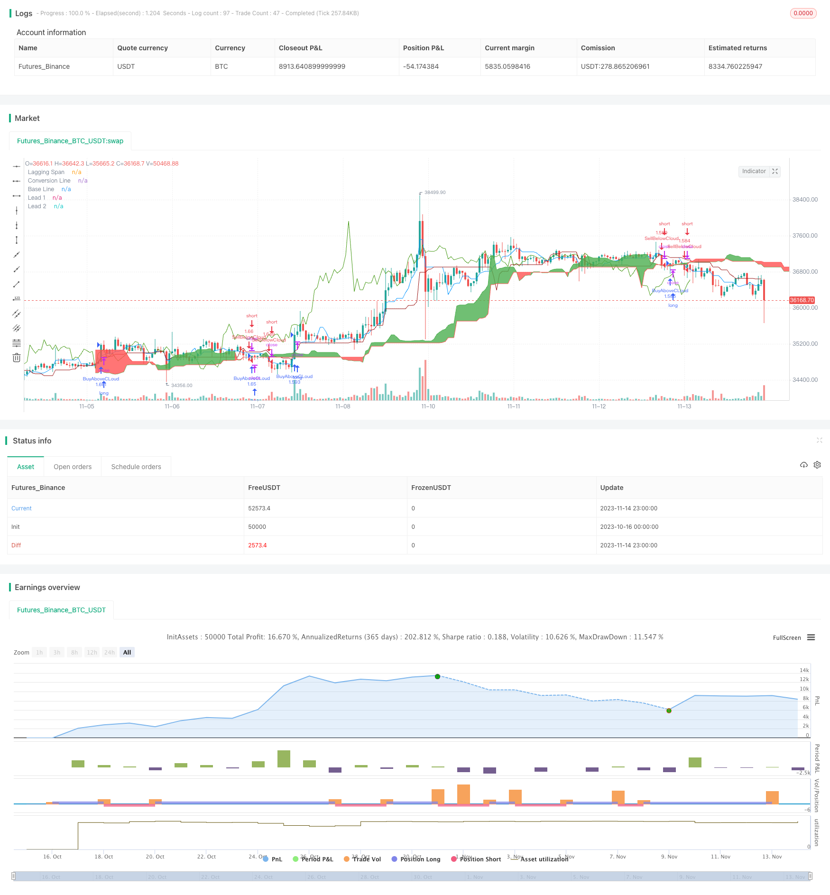

> Name

Ichimoku-Kinko-Hyo Trading StrategyIchimoku-Kinko-Hyo-Trading-Strategy
> Author

ChaoZhang

> Strategy Description


[trans]

### Overview
The Ichimoku Kinko Hyo trading strategy is a trend following strategy based on the Ichimoku technical indicator. This strategy uses Ichimoku's conversion line, baseline, leading line 1, leading line 2 and other indicators to determine the trend direction, as well as the timing of entry and stop loss.
### Strategy Principles
This strategy mainly judges the following four conditions to determine the trading direction:
1. When the closing price crosses the 26-period average above the baseline, go long
2. When the closing price crosses the 26-period average below the baseline, go short.
3. Take profit condition: 3.5%
4. Stop loss condition: 1.5%
Specifically, the strategy first calculates the conversion line, baseline line, leading line 1 and leading line 2. Then judge whether the closing price breaks through the upper or lower edge of the cloud chart to decide whether to go long or short.
If the closing price goes above the upper edge of the cloud chart, that is, when it goes above the 26-period average of the larger value of leading line 1 and leading line 2, it means that the stock price has entered an upward trend, and you can go long at this time.
If the closing price crosses the lower edge of the cloud chart, that is, when it crosses the 26-period average of the smaller value of leading line 1 and leading line 2, it means that the stock price has entered a downward trend, and it is time to go short.
Set take profit and stop loss conditions after entering the market. The take-profit condition is 3.5% of the entry price, and the stop-loss condition is 1.5% of the entry price.
### Advantage Analysis
The Ichimoku Kinko Hyo trading strategy offers the following advantages:
1. Ability to identify changes in trends and enter trends early
2. Use the cloud chart to determine the support and resistance areas and enter the market more accurately.
3. Consider both price and trading volume to avoid being misled by false breakthroughs
4. The take-profit and stop-loss conditions are clear and trading risks can be controlled.
### Risk Analysis
There are also some risks associated with the Ichimoku Kinko Hyo trading strategy:
1. In consolidation market conditions, multiple small losses are likely to occur.
2. If the general trend changes, the stop loss may be larger
3. You need to meet multiple conditions at the same time to enter the market, so there are few opportunities.
4. Improper parameter settings may lead to misinterpretation of indicator signals.
Countermeasures:
1. Entry conditions can be appropriately relaxed to increase trading opportunities
2. Optimize parameters to make them more in line with market characteristics
3. Combine with other indicators to filter false signals
### Optimization direction
The Ichimoku Kinko Hyo trading strategy can be optimized from the following aspects:
1. Optimize conversion lines, baselines and other parameters to make them more suitable for market conditions in different cycles
2. Optimize entry conditions to avoid missing out on better opportunities
3. Optimize take-profit and stop-loss strategies to achieve higher risk-adjusted returns
4. Combine with other indicators for signal filtering to reduce the number of arbitrage
5. Dynamically adjust positions and determine the specific amount of funds to invest according to the degree of market fluctuations.
### Summarize
Ichimoku Kinko Hyo trading strategy overall relatively good strategy that can capture potential trends in a timely manner. But it still needs further optimization and combination with other indicators to form a robust trading system. By adjusting parameters, improving entry and exit techniques, and controlling risks, Ichimoku strategy can achieve higher risk-adjusted returns in trending markets.
||


### Overview

The Ichimoku Kinko Hyo trading strategy is a trend-following strategy based on the Ichimoku technical indicator. It uses the conversion line, base line, leading span 1, leading span 2 and other indicators of the Ichimoku system to determine trend direction and timing of entry and exit.

### Strategy Logic

The strategy mainly judges the following four conditions to decide the trading direction:

1. Go long when the closing price crosses above the 26-period average of the top of the cloud 
2. Go short when the closing price crosses below the 26-period average of the bottom of the cloud
3. Take profit condition: 3.5%
4. Stop loss condition: 1.5%

Specifically, the strategy first calculates the conversion line, base line, leading span 1 and leading span 2. It then determines whether to go long or short based on if the closing price breaks through the top or bottom of the cloud. 

If the closing price crosses above the top of the cloud, i.e. above the 26-period average of the greater value between leading span 1 and leading span 2, it indicates an upward trend and goes long.

If the closing price crosses below the bottom of the cloud, i.e. below the 26-period average of the lower value between leading span 1 and leading span 2, it indicates a downward trend and goes short.

After entry, take profit and stop loss conditions are set. Take profit is set at 3.5% of entry price and stop loss is 1.5% of entry price.

### Advantage Analysis

The Ichimoku Kinko Hyo trading strategy has the following advantages:

1. Ability to identify trend changes early and enter trends in a timely manner
2. Using the cloud to determine support and resistance areas makes entries more accurate
3. Considers both price and volume to avoid false breakouts
4. Clear profit taking and stop loss conditions to control trading risk

### Risk Analysis 

The Ichimoku Kinko Hyo trading strategy also has some risks:

1. It can produce multiple small losses in range-bound markets
2. Stop loss can be large if the major trend reverses
3. Needs multiple conditions to be met which reduces opportunities
4. Incorrect parameter settings may misinterpret indicator signals

Solutions:

1. Relax entry conditions to increase opportunities
2. Optimize parameters to fit market characteristics better
3. Add filters with other indicators to avoid false signals

### Optimization Directions

The Ichimoku Kinko Hyo trading strategy can be optimized in the following aspects:

1. Optimize conversion line, base line and other parameters to fit different period market conditions
2. Optimize entry conditions to capitalize on more opportunities  
3. Optimize take profit and stop loss strategies for higher risk-adjusted returns
4. Add filters with other indicators to reduce whipsaws
5. Dynamically adjust position sizing based on market volatility

### Summary 

The Ichimoku Kinko Hyo trading strategy is an overall relatively good strategy that can capture potential trends in a timely manner. But it still needs further optimization and combination with other indicators to form a robust trading system. By adjusting parameters, improving entry and exit techniques, and controlling risks, Ichimoku strategy can achieve higher risk-adjusted returns in trending markets.

[/trans]

> Strategy Arguments


|Argument|Default|Description|
|----|----|----|
|v_input_1|false|only shows buying Trade|
|v_input_2|9|Conversion Line Periods|
|v_input_3|26|Base Line Periods|
|v_input_4|52|Lagging Span 2 Periods|
|v_input_5|26|Displacement|
|v_input_6|3.5|enter target in % after entry|
|v_input_7|1.5|enter Stoploss in % after entry|


> Source (PineScript)

``` pinescript
/*backtest
start: 2023-10-16 00:00:00
end: 2023-11-15 00:00:00
period: 1h
basePeriod: 15m
exchanges: [{"eid":"Futures_Binance","currency":"BTC_USDT"}]
*/

//@version=4
strategy("Ichimoku system", overlay=true, initial_capital = 100000, default_qty_type = strategy.percent_of_equity, default_qty_value=100)

buyOnly = input(false, "only shows buying Trade", type = input.bool)


conversionPeriods = input(9, minval=1, title="Conversion Line Periods"),
basePeriods = input(26, minval=1, title="Base Line Periods")
laggingSpan2Periods = input(52, minval=1, title="Lagging Span 2 Periods"),
displacement = input(26, minval=1, title="Displacement")

donchian(len) => avg(lowest(len), highest(len))

conversionLine = donchian(conversionPeriods)
baseLine = donchian(basePeriods)
leadLine1 = avg(conversionLine, baseLine)
leadLine2 = donchian(laggingSpan2Periods)

plot(conversionLine, color=#0496ff, title="Conversion Line")
plot(baseLine, color=#991515, title="Base Line")
plot(close, offset = -displacement + 1, color=#459915, title="Lagging Span")

p1 = plot(leadLine1, offset = displacement - 1, color=color.green,
 title="Lead 1")
p2 = plot(leadLine2, offset = displacement - 1, color=color.red, 
 title="Lead 2")
fill(p1, p2, color = leadLine1 > leadLine2 ? color.green : color.red)


profit = input(3.5, "enter target in % after entry", step = 0.5)

stoploss = input(1.5, "enter Stoploss in % after entry", step = 0.5)


sl = stoploss /100 * strategy.position_avg_price / syminfo.mintick

profitt = profit /100 * strategy.position_avg_price / syminfo.mintick


abovecloud =  max(leadLine1, leadLine2)

belowcloud = min(leadLine1, leadLine2)


buying = close > abovecloud[26] and close[1] < abovecloud[27]

selling = close < belowcloud[26] and close[1] > belowcloud[27]

strategy.entry("BuyAboveCLoud", true, when = buying)

if buyOnly
    strategy.close("BuyAboveCLoud", when = selling)
else
    strategy.entry("SellBelowCloud", false, when = selling)

//strategy.exit("Exit Position", "BuyAboveCLoud", profit = profitt, loss = sl)

    
//strategy.exit("Exit Position", "SellBelowCloud", profit = profitt, loss = sl)


```

> Detail

https://www.fmz.com/strategy/432358

> Last Modified

2023-11-16 17:31:56
