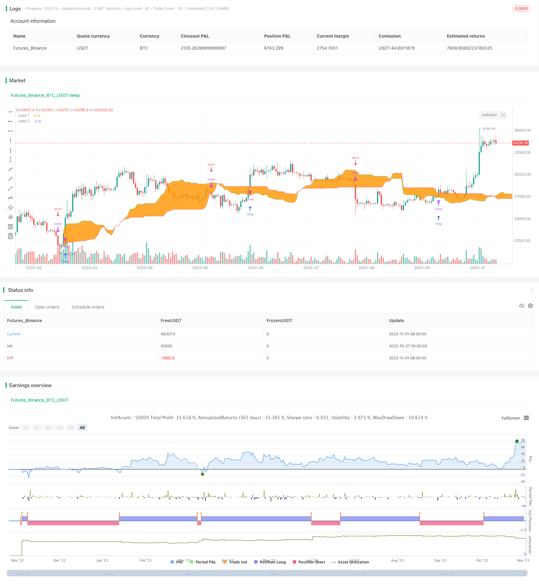

> Name

Ichimoku-Stop-Loss-Strategy based on Ichimoku Balance Sheet
> Author

ChaoZhang

> Strategy Description



[trans]


## Overview
This strategy is a trend following strategy developed based on the Ichimoku Balance Sheet indicator and combined with stop loss orders. Use the cloud belt formed by the three curves of the Ichimoku Balance Sheet: the conversion line, the baseline line and the delay line to determine the direction of the price trend, and use the upper and lower edges of the cloud belt as stop loss positions to set stop loss orders for trend tracking.
## Strategy Principle
This strategy is mainly based on the following principles:
1. The conversion line in the Ichimoku balance sheet is the average of the highest and lowest prices in the past 9 days, reflecting the average change in the most recent price.
2. The baseline is the average of the highest and lowest prices in the past 26 days, reflecting the average change in price over the medium term.
3. The delay line is the average of the highest and lowest prices in the past 52 days, reflecting the average change in long-term prices.
4. The average of the conversion line and the baseline constitutes the leading line 1, and the delay line constitutes the leading line 2. A cloud band is formed between the two leading lines. The upper and lower edges of the cloud band can determine the trend direction.
5. When the price crosses the cloud band above, open a long position; when the price crosses the cloud band below, open a short position.
6. Use the upper and lower edges of the cloud band as stop loss levels, set stop loss orders, and track the price trend.
Specifically, three curves of the Ichimoku Balance Table are defined in the strategy, and leading line 1 and leading line 2 are obtained by calculating their mean values. Then judge the trend direction based on the price breaking through the upper and lower boundaries of the cloud band. After opening a long or short position, set a stop-loss order at the stop-loss position at the upper and lower boundary prices of the cloud belt to achieve trend-following stop-loss.
## Advantage Analysis
This strategy has the following advantages:
1. Use the Ichimoku balance meter to judge the trend direction accurately and reliably. The Ichimoku balance table integrates price information from multiple periods and can effectively filter market noise and determine trends.
2. The stop loss level is set appropriately. Using the upper and lower boundaries of the cloud band as the stop loss level can not only ensure a reasonable stop loss range, but also fully track the trend.
3. The strategy is stable and reliable. The Ichimoku Balance Sheet itself has the ability to filter noise, and combined with stop loss orders, it can effectively control risks.
4. Parameters can be flexibly adjusted as needed. The conversion line, baseline and delay line cycles can be adjusted according to the market to adapt to different cycles.
5. The strategic ideas are clear and easy to understand. Designed based on trend tracking ideas, it is easy to master and use.
## Risk Analysis
This strategy also has the following risks:
1. Risk of breaking stop loss. When prices fluctuate violently, stop-loss orders may be triggered to exit original profitable positions.
2. Not applicable to volatile market conditions. When the price fluctuates for a long time, stop-loss orders are easily triggered frequently, resulting in too intensive transactions.
3. Parameter setting risks. Improper setting of the conversion line, baseline and delay line periods may result in the stop loss range being too large or too small.
4. Slippage cost risk in futures trading. Slippage costs caused by frequent opening and closing of positions may affect trading profits.
5. Programmed trading risks. Downtime, network interruptions, program bugs, etc. may affect transaction execution.
In response to the above risks, the following countermeasures can be taken: optimize parameter settings, adjust stop loss algorithms, improve server stability, do risk control, and strictly test procedures.
## Optimization direction
This strategy can be optimized from the following aspects:
1. Optimize parameter settings. Combinations of different cycle parameters can be tested to find the best parameters.
2. Optimize the stop loss algorithm. You can study algorithms such as trailing stop loss and oscillating stop loss to reduce the probability of the stop loss being triggered.
3. Judgment based on multiple indicators. More indicators can be added, such as MACD, KDJ, etc., to improve the accuracy of decision-making.
4. Added the function of automatically closing loss orders. Avoid losses from expanding.
5. Add a re-entry mechanism. After exiting with stop loss, you can consider re-entering.
6. Optimize fund management. Dynamic position adjustments can be studied to make profits work better.
## Summarize
Generally speaking, this strategy has a clear idea. It uses the Ichimoku Balance Sheet to determine the trend direction and uses the upper and lower boundaries of the cloud belt to follow the trend and stop loss. It can effectively control risks and has strong practicality. However, there are also certain risks. It is necessary to optimize parameter settings, stop loss algorithms, etc., and do a good job in risk control, in order to obtain stable profits in the real market. This strategy provides us with a good example of designing a stop-loss strategy based on trend following ideas.


||


## Overview

This strategy is a trend following strategy developed using Ichimoku Cloud and stop orders. It utilizes the conversion line, base line and lagging span of the Ichimoku Cloud to determine the trend direction and sets stop orders at the upper and lower edges of the cloud bands for stop loss.

## Strategy Logic

The strategy is based on the following principles:

1. The conversion line is the average of the highest and lowest prices over the past 9 days, reflecting recent average price changes. 

2. The base line is the average of the highest and lowest prices over the past 26 days, reflecting medium-term average price changes.

3. The lagging span is the average of the highest and lowest prices over the past 52 days, reflecting long-term average price changes.

4. The average of the conversion and base lines forms the leading span 1, and the lagging span forms the leading span 2. The area between the two leading spans forms the cloud bands. The upper and lower edges of the cloud bands indicate trend direction.

5. When price breaks above the cloud bands, go long. When price breaks below the cloud bands, go short.

6. Set stop loss orders at the upper and lower edges of the cloud bands to follow the trend.

Specifically, the strategy defines the three Ichimoku lines, calculates their averages to get the leading span 1 and 2. It then determines the trend direction based on price breaking through the upper or lower cloud band boundaries. After taking long or short positions, it sets stop loss orders based on the cloud band prices to follow the trend with stop loss in place.

## Advantage Analysis 

The advantages of this strategy are:

1. Ichimoku Cloud reliably determines trend direction by incorporating price information from multiple timeframes, filtering out market noise.

2. Stop loss placement is reasonable. Using the cloud band edges allows for proper stop loss range and good trend following.

3. The strategy is stable and reliable. Ichimoku Cloud filters noise and stop loss controls risk. 

4. Flexible parameter adjustment. Conversion, base, and lagging span periods can be adjusted for market adaptation.

5. Clear logic and easy to understand. Trend following approach makes it easy to grasp.

## Risk Analysis

The risks of the strategy include:

1. Stop loss breakout risk. Volatile price moves may trigger stop loss and exit profitable positions.

2. Whipsaws in ranging markets. Frequent stop loss triggers lead to overtrading. 

3. Parameter risk. Improper settings of conversion, base and lagging spans may cause stop loss range to be too wide or narrow.

4. Slippage cost in futures. Frequent orders may lead to excessive slippage costs affecting profits.

5. Algorithmic trading risks. Downtime, network issues, bugs may affect trade execution.

To address these risks, optimization of parameters, stop loss algorithms, improving server stability, proper risk management, and thorough strategy testing should be undertaken.

## Optimization Directions

The strategy can be optimized in the following aspects:

1. Optimize parameter settings by testing different period combinations to find optimal values.

2. Improve stop loss algorithms with trailing stops, volatility stops etc to reduce stop loss triggers.

3. Incorporate additional indicators like MACD, KDJ to improve decision making. 

4. Add automatic loss closure functionality to limit losses.

5. Implement re-entry mechanism after stop loss exit.

6. Optimize money management through dynamic position sizing.

## Conclusion

Overall, the strategy has clear logic, uses Ichimoku Cloud for trend direction and cloud bands for stop loss trailing, effectively controlling risk and having practical utility. But risks exist so parameters, stop loss algorithms must be optimized and proper risk controls implemented for stable live trading profits. It provides a good example of designing stop loss strategies based on trend following principles.

[/trans]

> Strategy Arguments


|Argument|Default|Description|
|----|----|----|
|v_input_1|true|Long|
|v_input_2|true|Short|
|v_input_3|9|Conversion Periods|
|v_input_4|26|Base Periods|
|v_input_5|52|Lagging Span|
|v_input_6|1900|From Year|
|v_input_7|2100|To Year|
|v_input_8|true|From Month|
|v_input_9|12|To Month|
|v_input_10|true|From day|
|v_input_11|31|To day|


> Source (PineScript)

``` pinescript
/*backtest
start: 2022-10-27 00:00:00
end: 2023-11-02 00:00:00
period: 1d
basePeriod: 1h
exchanges: [{"eid":"Futures_Binance","currency":"BTC_USDT"}]
*/

//@version=4
strategy(title = "Noro's Ichimoku Stop Strategy", shorttitle = "Ichimoku Stop Strategy", overlay = true, default_qty_type = strategy.percent_of_equity, default_qty_value = 100, pyramiding = 0)

//Settings
needlong = input(true, defval = true, title = "Long")
needshort = input(true, defval = true, title = "Short")
conversionPeriods = input(9, minval = 1, title = "Conversion Periods")
basePeriods = input(26, minval = 1, title = "Base Periods")
laggingSpan2Periods = input(52, minval = 1, title = "Lagging Span")
fromyear = input(1900, defval = 1900, minval = 1900, maxval = 2100, title = "From Year")
toyear = input(2100, defval = 2100, minval = 1900, maxval = 2100, title = "To Year")
frommonth = input(01, defval = 01, minval = 01, maxval = 12, title = "From Month")
tomonth = input(12, defval = 12, minval = 01, maxval = 12, title = "To Month")
fromday = input(01, defval = 01, minval = 01, maxval = 31, title = "From day")
today = input(31, defval = 31, minval = 01, maxval = 31, title = "To day")

//Ichimoku
donchian(len) => avg(lowest(len), highest(len))
conversionLine = donchian(conversionPeriods)
baseLine = donchian(basePeriods)
leadLine1 = avg(conversionLine, baseLine)
leadLine2 = donchian(laggingSpan2Periods)

//Cloud
p1 = plot(leadLine1, offset = basePeriods, color=color.green, title="Lead 1", transp = 100)
p2 = plot(leadLine2, offset = basePeriods, color=color.red, title="Lead 2", transp = 100)
fill(p1, p2)

//Signals
max = max(leadLine1[basePeriods], leadLine2[basePeriods])
min = min(leadLine1[basePeriods], leadLine2[basePeriods])
up = low > max
dn = high < min

if max > 0
    strategy.entry("Long", strategy.long, needlong ? na : 0, stop = max)
    strategy.entry("Short", strategy.short, needshort ? na : 0, stop = min)
```

> Detail

https://www.fmz.com/strategy/431007

> Last Modified

2023-11-03 17:05:40
