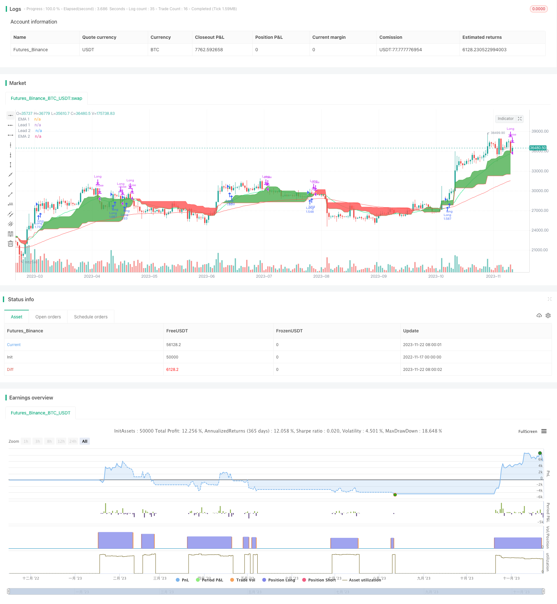

> Name

Ichimoku Cloud Quant Strategy Ichimoku-Cloud-Quant-Strategy
> Author

ChaoZhang

> Strategy Description


[trans]
### Overview
This is a long-only Ichimoku cloud quant strategy. The strategy uses the Ichimoku indicator to determine the direction of the trend, and uses K-line patterns, moving averages and Stochastic RSI indicators to filter signals, and choose a better entry point to go long when the trend is upward.
### Strategy Principles
The main judgment criteria for this strategy are as follows:
1. The Ichimoku leading line 1 crosses the leading line 2, indicating that the trend has turned bullish.
2. The closing price of the K line crosses the leading line 1, which meets the conditions for tracking the trend.
3. The K line is a positive line and the trend is upward.
4. When the moving average is enabled, the fast line is required to cross the slow line.
5. When Stochastic RSI is enabled, the K line is required to cross the D line
When the above conditions are met at the same time, the strategy will open a long position; when the price falls below the leading line 1, the strategy will close the position and leave the market.
This strategy mainly uses the Ichimoku cloud chart to determine the main trend direction, and then combines it with auxiliary indicators to filter signals and choose a better point to enter when the trend is upward.
### Strategic Advantages
1. Use the Ichimoku cloud chart to determine the main trend. Backtesting shows that its accuracy is very high.
2. Combining a variety of auxiliary indicators to filter entry points can significantly increase profitability.
3. Long-only strategy, suitable for currencies judged to be in a long market
4. There is a large space for parameter optimization, and the index parameters can be adjusted for further optimization.
### Strategy Risk
1. There is a probability of failure in Ichimoku cloud chart judgment, and the trend direction may be misjudged.
2. When the market changes suddenly, the stop loss point may be breached, resulting in expanded losses.
3. Designed for the bullish market and not suitable for currencies with hidden signs of market trends.
4. Improper parameter settings may lead to too aggressive entry or too conservative entry
Countermeasures:
1. Combine more indicators to judge trends and improve judgment accuracy.
2. Set reasonable stop loss points and strictly control single losses
3. Choose applicable strategies according to the market conditions of different currencies
4. Carefully test and optimize parameters to make the strategy more stable
### Strategy optimization direction
1. Optimize auxiliary indicator parameter settings to further improve strategy stability
2. Add stop loss mechanisms, such as trailing stop loss, exponential moving average stop loss, etc.
3. Increase position management, such as fixed positions, position averaging, etc.
4. Adjust and optimize parameters for specific currencies
### Summarize
The Ichimoku Cloud Quantitative Strategy achieves a long-only strategy with a high winning rate and controllable risk by judging the trend direction. The strategic advantages are obvious and the effect is outstanding in the long market. The next step can be to improve the indicators optimization, stop loss mechanism, position management and other aspects to make the strategy more complete and stable.
||
### Overview

This is a long-only Ichimoku cloud quant strategy. The strategy judges the trend direction through the Ichimoku indicator, combined with K-line patterns, moving averages and the Stochastic RSI indicator to filter signals and go long at better entry points when the trend goes up.

### Strategy Principle  

The main judgment criteria of the strategy are:

1. Ichimoku lead line 1 crosses above lead line 2, indicating an upward trend
2. K-line close price crosses above lead line 1, meeting the condition to follow the trend
3. K-line is a green candle, the trend goes up 
4. When moving averages are enabled, fast MA crosses above slow MA
5. When Stochastic RSI is enabled, %K line crosses above %D line

When all the above conditions are met at the same time, the strategy will open long positions. When the price drops below lead line 1, the strategy will close positions.

The strategy mainly uses the Ichimoku cloud to determine the main trend direction, combined with auxiliary indicators to filter signals and go long at better points when the trend goes up.

### Advantages of the Strategy  

1. Use Ichimoku cloud to determine main trend, backtest shows high accuracy
2. Combined with multiple auxiliary indicators to filter entry points, can significantly improve profit rate  
3. Long-only strategy, suitable for currencies judged to be in a bull market
4. Large space for parameter optimization, can adjust indicator parameters for further optimization

### Risks of the Strategy

1. There is a probability of Ichimoku cloud judging the trend wrongly  
2. Stop loss point may be broken during sudden market changes, leading to enlarged losses
3. Designed for bull markets, not suitable for currencies with hidden signs of trend reversal
4. Improper parameter settings may lead to over-aggressive entries or over-conservative actions

Countermeasures:

1. Combine more indicators to judge the trend, improve accuracy
2. Set reasonable stop loss points to strictly control single loss
3. Select suitable strategies according to market conditions of different currencies  
4. Carefully test and optimize parameters to make the strategy more stable

### Directions for Strategy Optimization  

1. Optimize parameter settings of auxiliary indicators to further improve stability
2. Add stop loss mechanisms such as trailing stop loss, exponential moving average stop loss, etc.
3. Add position management like fixed position sizing, position averaging, etc.  
4. Make parameter adjustments and optimizations for specific currencies  

### Summary  

This Ichimoku cloud quant strategy achieves a high win rate yet risk-controllable only-long strategy by judging trend directions. The advantages of the strategy are obvious and it shows outstanding performance in bull markets. The next step is to improve aspects like indicator optimization, stop loss mechanism, position management to make the strategy more comprehensive and stable.

[/trans]

> Strategy Arguments


|Argument|Default|Description|
|----|----|----|
|v_input_1|true|FromMonth|
|v_input_2|true|FromDay|
|v_input_3|2017|FromYear|
|v_input_4|true|ToMonth|
|v_input_5|true|ToDay|
|v_input_6|9999|ToYear|
|v_input_7|true|Enable EMA?|
|v_input_8|false|Enable Stochastik RSI?|
|v_input_9|24|EMA 1|
|v_input_10|90|EMA 2|
|v_input_11|3|RSI K Line|
|v_input_12|3|RSI D Line|
|v_input_13|14|RSI Length|
|v_input_14|14|Stochastik Length|
|v_input_15_close|0|RSI Source: close|high|low|open|hl2|hlc3|hlcc4|ohlc4|
|v_input_16|9|Ichi Conversion Line Length|
|v_input_17|26|Ichi Base Line Length|
|v_input_18|52|Ichi Lagging Span 2 Length|
|v_input_19|true|Ichi Displacement|


> Source (PineScript)

``` pinescript
/*backtest
start: 2022-11-17 00:00:00
end: 2023-11-23 00:00:00
period: 1d
basePeriod: 1h
exchanges: [{"eid":"Futures_Binance","currency":"BTC_USDT"}]
*/

//@version=4

strategy(title="Ichimoku only Long Strategy", shorttitle="Ichimoku only Long", overlay = true, pyramiding = 0, calc_on_order_fills = false, commission_type =  strategy.commission.percent, commission_value = 0, default_qty_type = strategy.percent_of_equity, default_qty_value = 100, initial_capital=10000, currency=currency.USD)

// Time Range
FromMonth=input(defval=1,title="FromMonth",minval=1,maxval=12)
FromDay=input(defval=1,title="FromDay",minval=1,maxval=31)
FromYear=input(defval=2017,title="FromYear",minval=2017)
ToMonth=input(defval=1,title="ToMonth",minval=1,maxval=12)
ToDay=input(defval=1,title="ToDay",minval=1,maxval=31)
ToYear=input(defval=9999,title="ToYear",minval=2017)
start=timestamp(FromYear,FromMonth,FromDay,00,00)
finish=timestamp(ToYear,ToMonth,ToDay,23,59)
window()=>true
// See if this bar's time happened on/after start date
afterStartDate = time >= start and time<=finish?true:false

//Enable RSI
enableema = input(true, title="Enable EMA?")
enablestochrsi = input(false, title="Enable Stochastik RSI?")

//EMA
emasrc = close, 
len1 = input(24, minval=1, title="EMA 1")
len2 = input(90, minval=1, title="EMA 2")

ema1 = ema(emasrc, len1)
ema2 = ema(emasrc, len2)

col1 = color.lime
col2 = color.red

//EMA Plots
plot(ema1, title="EMA 1", linewidth=1, color=col1)
plot(ema2, title="EMA 2", linewidth=1, color=col2)

//STOCH RSI
smoothK = input(3, minval=1, title="RSI K Line")
smoothD = input(3, minval=1, title="RSI D Line")
lengthRSI = input(14, minval=1, title="RSI Length")
lengthStoch = input(14, minval=1, title="Stochastik Length")
src = input(close, title="RSI Source")

rsi1 = rsi(src, lengthRSI)
k = sma(stoch(rsi1, rsi1, rsi1, lengthStoch), smoothK)
d = sma(k, smoothD)

//Ichimoku
conversionPeriods = input(9, minval=1, title="Ichi Conversion Line Length")
basePeriods = input(26, minval=1, title="Ichi Base Line Length")
laggingSpan2Periods = input(52, minval=1, title="Ichi Lagging Span 2 Length")
displacement = input(1, minval=0, title="Ichi Displacement")
donchian(len) => avg(lowest(len), highest(len))
conversionLine = donchian(conversionPeriods)
baseLine = donchian(basePeriods)
leadLine1 = avg(conversionLine, baseLine)
leadLine2 = donchian(laggingSpan2Periods)
p1 = plot(leadLine1, offset = displacement - 1, color=color.green,
	 title="Lead 1")
p2 = plot(leadLine2, offset = displacement - 1, color=color.red,
	 title="Lead 2")
fill(p1, p2, color = leadLine1 > leadLine2 ? color.green : color.red)


//Long Condition
crossup = k[0] > d[0] and k[1] <= d[1]
ichigreenabovered = leadLine1 > leadLine2
ichimokulong = close > leadLine1
greencandle =  close > open
redcandle = close < open
emacond = ema1 > ema2
longcondition = ichigreenabovered and ichimokulong and greencandle

//Exit Condition
ichimokuexit = close < leadLine1

exitcondition = ichimokuexit and redcandle

//Entrys

if (enablestochrsi == false) and (enableema == false) and (longcondition) and (afterStartDate) and (strategy.opentrades < 1)
    strategy.entry("Long", strategy.long)
    
if (enablestochrsi == true) and (enableema == false) and (longcondition) and (crossup) and (afterStartDate) and (strategy.opentrades < 1)
    strategy.entry("Long", strategy.long)

if (enableema == true) and (enablestochrsi == false) and (longcondition) and (emacond) and (afterStartDate) and (strategy.opentrades < 1)
    strategy.entry("Long", strategy.long)

if (enableema == true) and (enablestochrsi == true) and (longcondition) and (emacond) and (crossup) and (afterStartDate) and (strategy.opentrades < 1)
    strategy.entry("Long", strategy.long)


//Exits
if (afterStartDate)
    strategy.close(id = "Long", when = exitcondition)


```

> Detail

https://www.fmz.com/strategy/433068

> Last Modified

2023-11-24 10:15:15
