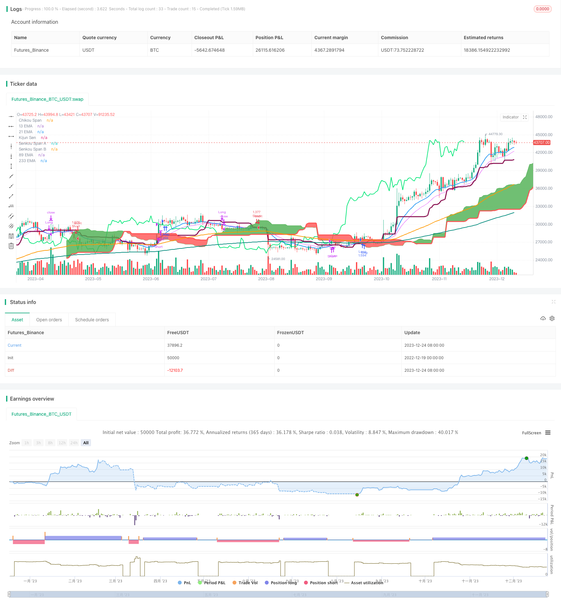

> Name

Ichimoku Cloud-with-Dual-Moving-Average-Crossover-Strategy
> Author

ChaoZhang

> Strategy Description


[trans]

### Overview
This strategy uses the combination of the Ichimoku cloud band indicator and the double moving average indicator to form long- and short-term momentum judgments and achieve high-precision trend judgment and trading signal generation. Among them, the Ichimoku cloud belt consists of a turning line, a baseline line, and a leading line to determine price momentum and future trends. The double moving average part consists of 13-period and 21-period exponential moving averages to determine short-term price momentum changes. The combination of the two enables comprehensive judgment in multiple time dimensions, filters out false breakthroughs, and improves signal quality.
### Strategy Principles
This strategy mainly consists of the Ichimoku Cloud Band indicator and the Double Exponential Moving Average indicator.
In the Ichimoku cloud band, the baseline represents the mid-term trend, the turning line represents the short-term trend, and the cloud band represents support and resistance. Specifically, the baseline is the midpoint of the highest and lowest price in 26 cycles, the turning line is the midpoint of the highest and lowest price in 9 cycles, and the upper and lower rails of the cloud belt are the midpoints of the steering line and the baseline respectively, and the midpoint of the highest and lowest price in 52 cycles. When the price is above the cloud band, it is a long market, and below it is a short market.
In the double exponential moving average part, the 13-period exponential moving average represents the short-term trend, and the 21-period exponential moving average represents the mid-term trend. When the 13EMA is above the 21EMA, it is a long market, and when it is below the 21EMA, it is a short market.
Based on the combined judgment of Ichimoku cloud band and double EMA, a more accurate trend judgment can be achieved. The specific trading strategy is that when bulls enter the market, the price is required to be higher than the delay line, the 13EMA is higher than the baseline and 21EMA, and the price is above the cloud band. The entry requirements for shorts are that the price is below the delay line, the 13EMA is below the baseline and the 21EMA, and the price is below the cloud band.
The cloud band is used to judge the general trend, the double EMA is used to judge the short-term momentum, and the delay line is used as a filter against whipsaws. Such comprehensive judgment of multiple conditions can effectively filter out false breakthroughs and ensure the reliability of trading signals.
### Strategic Advantages
This strategy has several advantages:
1. Comprehensive judgment in multiple time frames. The cloud band determines the medium and long-term trend, and the double EMA determines the short-term momentum, realizing the combination of multiple time dimensions and improving the accuracy of judgment.
2. Effectively filter out false breakthroughs. The entry conditions are relatively strict, requiring multiple indicators such as price, cloud band, delay line, and double EMA to send signals in the same direction, which can filter out most of the noise.
3. The strategy parameters are optimized. Parameter selections such as the 9-period turning line and the 26-period baseline make the signal more reliable.
4. Suitable for highly volatile stocks and digital currencies. Ichimoku Cloud Band is extremely insensitive to prices such as gaps and is more suitable for trading products with greater volatility.
5. Draw clear support and resistance. Cloud bands can clearly show key areas of support and resistance.
### Risk Analysis
There are also some risks with this strategy:
1. In volatile market conditions, confusing trading signals may occur. When the price does not have a clear trend in the mid-term, the cloud bands will diverge, and the signal reliability is poor at this time.
2. The delay line may miss the price reversal point. When a fast reversal occurs, delay line detection may be half a beat too late, causing losses to expand.
3. Multiple indicators need to be judged, which increases the difficulty of trading. This requires traders to have a deep understanding of each indicator, otherwise it will be difficult to judge accurately.
4. It is easy to get trapped when breaking through the cloud belt for the first time. When the price breaks through for the first time after being restricted by the cloud band for a long time, it is easy to form a lock-up situation.
5. Backtest data fitting risks. The current parameters have been optimized and fitted many times and may be too dependent on specific backtest data. SIGNALS MAY DETERIORATE in real offer.
These risks can be mitigated by:
1. Reduce positions in a volatile trend. Evaluate market volatility based on ATR and volatility, and consider only short-term trading if necessary.
2. Combine with other indicators to filter the delay line signal. Auxiliary indicators such as MACD and RSI can be introduced to perform secondary verification of the delay line signal.
3. Conduct continuous backtesting. Modify the backtest time and variety to check the robustness of the strategy. At the same time, real transaction factors such as slippage and handling fees are introduced.
4. Continuous tracking of real offers and recording of abnormal situations. Observe the matching between cloud bands and price movements in real trading, record the strategy performance, and use it as a reference for subsequent improvements.
### Strategy optimization
This strategy can be optimized from the following aspects:
1. Introduce a stop loss strategy. It is recommended to introduce strategies such as slippage stop loss and breakthrough new high (new low) stop loss to strictly control risks.
2. Optimize moving average parameters. You can test more EMA cycle parameter combinations to find a more matching long and short cycle.
3. Add other indicator filters. You can test the introduction of MACD, KD, RSI and other indicators to filter trading signals and eliminate more false signals.
4. Adjust positions according to market conditions. You can build a volatility model to reduce your position when volatility is high and increase your position when volatility is low.
5. Test the robustness of parameters of different varieties. Modify the backtest variety and time period to check the stability of the strategy in different markets.
Through these optimizations, the stability and signal quality of the strategy can be further improved, curve fitting risks can be reduced, and the parameters and rules of the strategy can be made more robust.
### Summarize
The Ichimoku cloud band and double EMA crossover strategy combines the trend judgment ability of Ichimoku cloud band and the short-term prediction ability of EMA, forming a relatively complete multi-time frame trading system. It is relatively strict in judging long and short conditions, including price itself, cloud band position, delay line, double EMA and various indicators, which can effectively filter out false signals. However, we should also pay attention to the risks in volatile market conditions. At this time, we should combine more indicators for secondary verification. Overall, this strategy successfully combines the two core capabilities of trend tracking and short-term forecasting, and is worthy of in-depth study and application.
||


## Overview

This strategy combines the Ichimoku cloud with a dual moving average crossover system to form judgments on both long-term and short-term momentum, enabling highly accurate trend identification and trade signals. The Ichimoku cloud is formed by the conversion line, base line, and leading lines to determine price energy and future movements. The dual moving average portion consists of 13 and 21 period exponential moving averages (EMA) to determine short-term price momentum shifts. Together, multiple timeframes are synthesized to improve accuracy and filter out false breaks.  

## Strategy Logic   

The strategy primarily consists of the Ichimoku cloud and dual EMA indicators.  

Within the Ichimoku cloud, the base line represents medium-term trends, conversion line for short-term trends, and cloud bands for support/resistance. Specifically, base line is 26 period midprice, conversion is 9 period midprice, cloud borders are midpoints of base/conversion lines and 52 period midprice. Prices above the cloud signal uptrend while below show downtrends.

For dual EMAs, 13 period EMA tracks short-term trends and 21 period EMA for medium-term trends. 13EMA above 21EMA signals uptrend and vice versa for downtrends.  

Combining Ichimoku and EMA judgments enables fairly accurate trend detection. Specific entry rules require price above lagging line, 13EMA over base line and 21EMA, and price within cloud for longs. Short entries need the reverse.  

The cloud identifies major trends, EMAs short-term momentum, and lagging line filters whipsaws. Together they reliably filter false breaks.  

## Advantages

The strategy has these main advantages:

1. Multi-timeframe synthesis. Cloud for medium/long-term, EMAs for short-term combine multiple dimensions for better accuracy.

2. Effective false break filtering. Strict entry rules requiring price, cloud, lagging line, EMAs alignment filter out noise. 

3. Optimized parameters. Inputs like 9 period conversion line, 26 period base line reliably generate signals.  

4. Applicable for high volatility assets. Ichimoku cloud robust against gaps, fitting for volatile stocks and crypto. 

5. Clear support/resistance levels. Cloud bands clearly show critical S/R zones.

## Risk Analysis   

There are also some risks to consider:

1. Whipsaws possible during rangbound markets. Clouds diverge and signal reliability lower when no clear trends.   

2. Lagging line may miss reversal points. Rapid flips could mean losses from lagging line detections.  

3. Multiple indicators increase complexity. Traders need strong grasp of all indicators for accurate judgments.

4. Break failures possible on initial cloud penetrations. Long contained prices can whip on first breakouts.   

5. Backtest overfitting risks. Current optimized parameters may overfit specific backtest data. Live performance may deteriorate.

Some mitigations for these risks include:

1. Reduce position sizing during choppy/whipsaw conditions based on volatility. 

2. Additional indicators like MACD, RSI to filter lagging line signals.  

3. Robust backtesting across various periods and instruments to verify stability. Incorporate real trading factors like slippage, commissions.  

4. Track live performance to log anomalies vs expected behaviors as reference for improvements.

## Enhancement Opportunities

The strategy can be improved in several aspects:  

1. Incorporate stop loss mechanisms like volatility or high/low based stops to strictly limit risks.   

2. Optimize EMA periods for better trend/counter-trend sensitivity. 

3. Add additional indicators like MACD, RSI to filter signals, removing false positives.  

4. Adapt position sizing based on volatility models, increase size in calm low volatility environments.

5. Test parameter robustness across different instruments and time periods for stability.

These enhancements can further improve stability, signal quality, robustness against curve fitting, and parameter resilience across various market conditions.  

## Conclusion

The integrated Ichimoku cloud and dual EMA crossover strategy complements Ichimoku’s trending capabilities with EMA’s short-term predictive skills into a robust system across multiple timeframes. Strict multi-indicator entry conditions effectively filter out false signals but whipsaw risks in choppy periods should be noted, warranting additional confirmation indicators in those cases. Overall it successfully combines core competencies of trend following and short-term forecasting, worthy of further research and application.

[/trans]

> Strategy Arguments


|Argument|Default|Description|
|----|----|----|
|v_input_1|9|Tenkan Sen Periods|
|v_input_2|26|Kijun Sen Periods|
|v_input_3|52|Senkou Span B Periods|
|v_input_4|26|Displacement|


> Source (PineScript)

``` pinescript
/*backtest
start: 2022-12-19 00:00:00
end: 2023-12-25 00:00:00
period: 1d
basePeriod: 1h
exchanges: [{"eid":"Futures_Binance","currency":"BTC_USDT"}]
*/

//@version=3
strategy("13/21 EMA + Ichimoku Kinko Hyo Strategy", shorttitle="EMI", overlay=true, default_qty_type=strategy.percent_of_equity, max_bars_back=1000, default_qty_value=100, calc_on_order_fills= true, calc_on_every_tick=true, pyramiding=0)

TenkanSenPeriods = input(9, minval=1, title="Tenkan Sen Periods")
KijunSenPeriods = input(26, minval=1, title="Kijun Sen Periods")
SenkouSpanBPeriods = input(52, minval=1, title="Senkou Span B Periods")
displacement = input(26, minval=1, title="Displacement")
donchian(len) => avg(lowest(len), highest(len))
TenkanSen = donchian(TenkanSenPeriods)
KijunSen = donchian(KijunSenPeriods)
SenkouSpanA = avg(TenkanSen, KijunSen)
SenkouSpanB = donchian(SenkouSpanBPeriods)
ChikouSpan = close[displacement-1]

Sema = ema(close, 13)
Mema = ema(close, 21)
Lema = ema(close, 89)
XLema = ema(close, 233)

plot(Sema, color=blue, title="13 EMA", linewidth = 2)
plot(Mema, color=fuchsia, title="21 EMA", linewidth = 1)
plot(Lema, color=orange, title="89 EMA", linewidth = 2)
plot(XLema, color=teal, title="233 EMA", linewidth = 2)
plot(KijunSen, color=maroon, title="Kijun Sen", linewidth = 3)
plot(close, offset = -displacement, color=lime, title="Chikou Span", linewidth = 2)
sa=plot (SenkouSpanA, offset = displacement, color=green,  title="Senkou Span A", linewidth = 1)
sb=plot (SenkouSpanB, offset = displacement, color=red,  title="Senkou Span B", linewidth = 3)
fill(sa, sb, color = SenkouSpanA > SenkouSpanB ? green : red)

longCondition = close>ChikouSpan and Sema>KijunSen and Sema>Mema and SenkouSpanA>SenkouSpanB
strategy.entry("Long",strategy.long,when = longCondition)
strategy.close("Long", when = (close<KijunSen and close<ChikouSpan and Sema<Mema))

shortCondition = close<ChikouSpan and Sema<KijunSen and Sema<Mema and SenkouSpanA<SenkouSpanB
strategy.entry("Short",strategy.short, when = shortCondition)
strategy.close("Short", when = (close>KijunSen and close>ChikouSpan and Sema>Mema))
```

> Detail

https://www.fmz.com/strategy/436651

> Last Modified

2023-12-26 16:10:24
