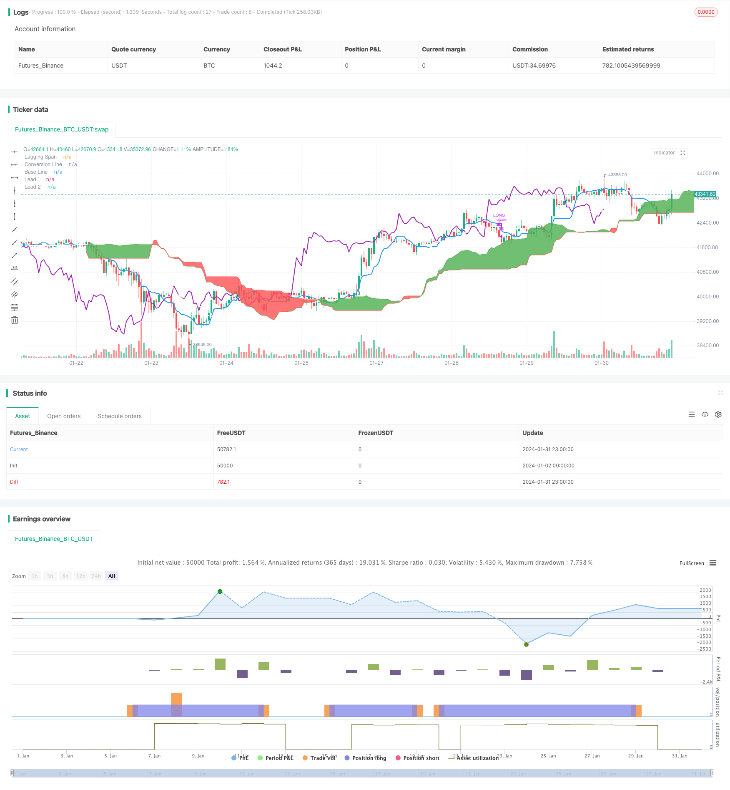

> Name

Market Potential Ichimoku Bullish Cloud StrategyMarket-Potential-Ichimoku-Bullish-Cloud-Strategy
> Author

ChaoZhang

> Strategy Description


[trans]
## Overview
This strategy is a long-only Ichimoku cloud trading strategy. It opens a long position when the conversion line crosses the base line and closes the position when the base line crosses below the conversion line. In addition, the lag span will be detected when opening and closing positions. If the lag span is higher than the cloud layer, the position will be opened, and if the lag span is lower than the cloud layer, the position will be closed.
## Strategy Principle
This strategy uses several lines from the Ichimoku technical indicator. Specifically:
1. Conversion line: the average of the highest price and lowest price in the last 9 days, representing the trend conversion in a certain period.
2. Baseline: The average of the highest and lowest prices in the last 26 days, representing the average price change within a certain period.
3. Front line A: the average of the conversion line and the baseline.
4. Frontline B: The average of the highest price and lowest price in the last 52 days, which represents the leading indicator of the mid- to long-term trend.
5. Lagging Span: the current closing price, lagging 26 days. Represents the power of trends.
When opening a position, the conditions for the conversion line to cross the baseline and the lag span to be above the clouds must be met at the same time. This indicates that both the short-term and medium- to long-term trends are upward.
When closing a position, the conditions for the baseline to cross the conversion line and the lag span to be below the clouds must be met at the same time. This indicates a trend reversal and the position should be exited. 
## Strategic Advantages
1. Use Ichimoku cloud indicators to judge trends with higher accuracy.
2. Combine multiple lines of judgment at the same time to avoid producing false signals.
3. Only long positions are in line with the long-term upward trend of most digital currencies.
4. Conditional filtering is relatively strict to achieve higher quality signals.
## Strategy Risk
1. Positions are only full or short, and the position size cannot be adjusted.
2. It performs well in a bull market, but has a high risk of losing money in a bear market.
3. The default parameter settings are for cryptocurrency and need to be adjusted to adapt to other varieties.
4. There are few trading signals and it is easy to miss some opportunities.
## Strategy optimization
1. Add a position adjustment function to close some positions when the loss reaches a certain percentage.
2. Add a sell signal to close the position below key support and reduce losses.
3. Optimize parameter settings to adapt to more varieties and improve stability.
4. Add a stop loss function to stop the loss when the loss reaches the threshold.
## Summarize
As a long-only Ichimoku cloud trading strategy, this strategy has high accuracy in judging trends. It combines multiple Ichimoku lines as filter conditions at the same time, which can more reliably determine the trend turning point. This strategy is particularly suitable for those products that have a long-term rise, such as cryptocurrencies. By further improving functions such as stop loss and position adjustment, the risk control capabilities of this strategy can be improved and adapted to more varieties and a wider market environment.
||

## Overview

This strategy is a long-only Ichimoku cloud trading strategy. It goes long when the conversion line crosses above the base line, and closes position when the base line crosses below the conversion line. In addition, when opening or closing positions, it also checks the Lagging Span to see if it is above or below the cloud.

## Strategy Logic

The strategy utilizes several lines from the Ichimoku indicator. Specifically:

1. Conversion Line: The average of the high and low over the past 9 days, representing short-term trend conversion.  

2. Base Line: The average of the high and low over the past 26 days, representing the mean price movement over that period.

3. Leading Span A: The average of the conversion and base lines.  

4. Leading Span B: The average of the high and low over the past 52 days, a leading indicator for medium to long term trends.

5. Lagging Span: The closing price lagging 26 days back, representing the momentum of the trend.

To open a position, the conversion line needs to cross above the base line AND the Lagging Span needs to be above the cloud. This signals an upward trend in both the short and medium/long term.

To close a position, the base line needs to cross below the conversion line AND the Lagging Span needs to be below the cloud. This signals a trend reversal and suggests exiting the position.   

## Advantages of the Strategy

1. Uses Ichimoku cloud to determine trend direction accurately.  

2. Combining multiple lines avoids false signals.

3. Long-only matches the long term upside trends of most cryptocurrencies.  

4. Strict condition filtering gives high quality signals.

## Risks of the Strategy  

1. Only allows full position or flat, cannot adjust position size.

2. Performs very well in bull market but risks heavy losses in bear market.  

3. Default parameters tuned for crypto may need adjustments for other assets.  

4. Fewer trade signals means some opportunities could be missed.

## Improvements  

1. Add position sizing functionality to close some of the position when loss reaches a threshold.

2. Add short selling signals when key support levels break to reduce losses.

3. Optimize parameters to fit more symbols and improve robustness. 

4. Add stop loss when loss reaches a level to contain downside risk.

## Summary

As a long-only Ichimoku strategy, this approach reliably determines trend reversals by combining multiple Ichimoku lines. It works especially well for assets with persistent upside trends like cryptocurrencies. Further enhancements to risk management like stop losses and position sizing can make this strategy more robust across different market environments and asset types.

[/trans]

> Strategy Arguments


|Argument|Default|Description|
|----|----|----|
|v_input_1|9|Conversion Line Periods|
|v_input_2|26|Base Line Periods|
|v_input_3|52|Lagging Span 2 Periods|
|v_input_4|26|Delta|
|v_input_5|true|Custom Backtesting Dates|
|v_input_6|2021|Backtest Start Year|
|v_input_7|true|Backtest Start Month|
|v_input_8|true|Backtest Start Day|
|v_input_9|false|Backtest Start Hour|
|v_input_10|2021|Backtest Stop Year|
|v_input_11|12|Backtest Stop Month|
|v_input_12|true|Backtest Stop Day|
|v_input_13|false|Backtest Stop Hour|


> Source (PineScript)

``` pinescript
/*backtest
start: 2024-01-02 00:00:00
end: 2024-02-01 00:00:00
period: 1h
basePeriod: 15m
exchanges: [{"eid":"Futures_Binance","currency":"BTC_USDT"}]
*/

// This source code is subject to the terms of the Mozilla Public License 2.0 at https://mozilla.org/MPL/2.0/
// Simple long-only Ichimoku Cloud Strategy
// Enter position when conversion line crosses base line up, and close it when the opposite happens. 
// Additional condition for open / close the trade is lagging span, it should be higher than cloud to open position and below - to close it.
//@version=4
strategy("Ichimoku Cloud Strategy Long Only", shorttitle="Ichimoku Cloud Strategy (long only)", overlay=true )

conversion_length = input(9, minval=1, title="Conversion Line Periods"),
base_length = input(26, minval=1, title="Base Line Periods")
lagging_length = input(52, minval=1, title="Lagging Span 2 Periods"),
delta = input(26, minval=1, title="Delta")

average(len) => avg(lowest(len), highest(len))

conversion_line = average(conversion_length) // tenkan sen - trend
base_line = average(base_length) // kijun sen - movement
lead_line_a = avg(conversion_line, base_line) // senkou span A
lead_line_b = average(lagging_length) // senkou span B
lagging_span = close // chikou span - trend / move power

plot(conversion_line, color=color.blue, linewidth=2, title="Conversion Line")
plot(base_line, color=color.white, linewidth=2, title="Base Line")
plot(lagging_span, offset = -delta, color=color.purple, linewidth=2, title="Lagging Span")

lead_line_a_plot = plot(lead_line_a, offset = delta, color=color.green, title="Lead 1")
lead_line_b_plot = plot(lead_line_b, offset = delta, color=color.red, title="Lead 2")
fill(lead_line_a_plot, lead_line_b_plot, color = lead_line_a > lead_line_b ? color.green : color.red)

// Strategy logic

long_signal = crossover(conversion_line,base_line) and ((lagging_span) > (lead_line_a)) and ((lagging_span) > (lead_line_b))
short_signal = crossover(base_line, conversion_line) and ((lagging_span) < (lead_line_a)) and ((lagging_span) < (lead_line_b))

strategy.entry("LONG", strategy.long, when=strategy.opentrades == 0 and long_signal, alert_message='BUY')
strategy.close("LONG", when=strategy.opentrades > 0 and short_signal, alert_message='SELL')
    
    // === Backtesting Dates === thanks to Trost

testPeriodSwitch = input(true, "Custom Backtesting Dates")
testStartYear = input(2021, "Backtest Start Year")
testStartMonth = input(1, "Backtest Start Month")
testStartDay = input(1, "Backtest Start Day")
testStartHour = input(0, "Backtest Start Hour")
testPeriodStart = timestamp(testStartYear, testStartMonth, testStartDay, testStartHour, 0)
testStopYear = input(2021, "Backtest Stop Year")
testStopMonth = input(12, "Backtest Stop Month")
testStopDay = input(1, "Backtest Stop Day")
testStopHour = input(0, "Backtest Stop Hour")
testPeriodStop = timestamp(testStopYear, testStopMonth, testStopDay, testStopHour, 0)
testPeriod() => true
testPeriod_1 = testPeriod()
isPeriod = testPeriodSwitch == true ? testPeriod_1 : true
// === /END

if not isPeriod
    strategy.cancel_all()
    strategy.close_all()
```

> Detail

https://www.fmz.com/strategy/440849

> Last Modified

2024-02-02 16:57:46
