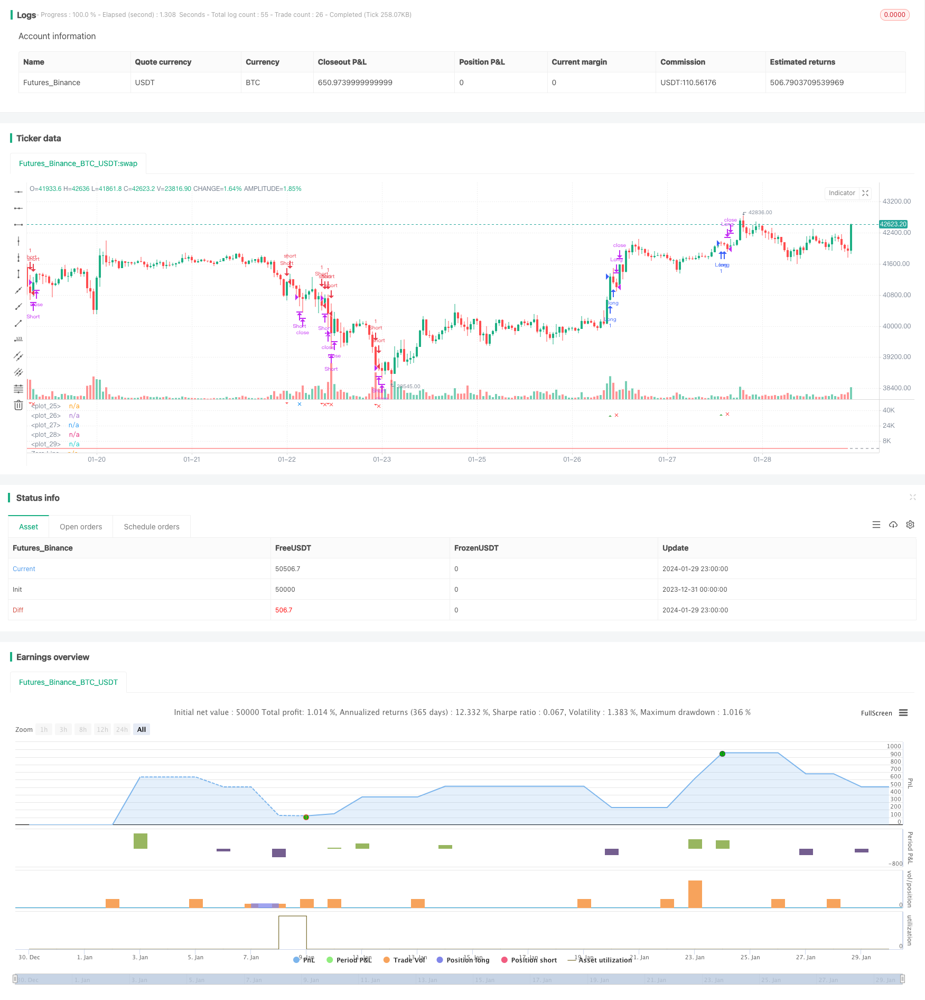

> Name

Improved-Wave-Trend-Tracking-Strategy
> Author

ChaoZhang

> Strategy Description


 [trans]

Overview: This is a tracking strategy that applies wave indicators to identify trends. It obtains a wavy line by calculating the exponential moving average of the average price and the moving average of the absolute price difference. The strategy generates trading signals by monitoring the intersection of wavy lines with overbought and oversold areas. Combined with moving average filtering and volume filtering to avoid false signals.
Strategy principle:
1. Calculate the average price ap=(highest price+lowest price+closing price)/3
2. Calculate the EMA of ap for n1 period and get esa
3. Calculate the n1 period EMA of the absolute difference between ap and esa, and get d
4. Calculate the wavy line: ci=(ap-esa)/(0.015*d)
5. Calculate the EMA of n2 period ci and get the ultimate wavy line tci, which is wt1
6. Calculate the 4-period SMA of wt1 and get wt2
7. Draw the horizontal lines obLevel1/2 and osLevel1/2 for the overbought and oversold areas.
8. When wt1 crosses above the obLevel2 line, a buy signal is generated; when wt1 crosses below the osLevel2 line, a sell signal is generated.
9. Add moving average emaFilter and trading volume volumeFilter as filter conditions to avoid false signals
10. After entering the market, set the stop-profit and stop-loss ratios and exit the position.

Advantage analysis:
1. The wavy line handles the long-short transition better and can effectively capture the trend.
2. Combined with double filtering of moving average and trading volume, high reliability
3. Use multiple sets of parameter calculations to avoid the limitations of a single indicator.
4. Set up stop-profit and stop-loss to lock in part of the profit and effectively control risks.

Risks and Disadvantages:
1. Parameter selection may lead to poor performance or overfitting in some cases
2. There is no clear guidance on optimal parameter selection and trial and error is required.
3. Failure to incorporate broader market conditions into signals
4. If used in a restricted or volatile market, there is a risk of a firecracker effect
5. Lack of exit rules other than take profit/stop loss

Optimization direction:
1. Test parameter sets on various timeframes and assets to find optimal values
2. Incorporate volatility indicators to avoid signals during periods of low volatility
3. Add supplementary indicators such as RSI to improve signal accuracy
4. Build a machine learning model to find optimal parameters for a specific asset
5. Enhance exits by adding trailing stops or exits based on sudden volatility expansion events
Summarize:
This is a strategy designed with a combination of wavy lines and auxiliary indicators. It uses wavy lines to effectively identify the characteristics of trend transitions, supplemented by moving averages and trading volume filters to avoid false signals, and can capture most medium and long-term trends. At the same time, use stop-profit and stop-loss to control risks. There is still a lot of room for optimization. By adjusting parameter combinations, combining more indicators, and continuously improving through machine learning, the strategy can perform better on more varieties and time periods.
||

Overview: This is a trend following strategy that utilizes the Wave Trend oscillator to identify trends. It calculates exponential moving averages of the average price and absolute price difference to plot a Wave Trend line. Trading signals are generated when the Wave Trend line crosses overbought/oversold zones. Additional filters on moving average and volume avoid false signals.  

Strategy Logic: 

1. Calculate average price ap = (high + low + close)/3

2. Compute n1-period EMA of ap to get esa 

3. Compute n1-period EMA of absolute difference between ap and esa to get d

4. Compute Wave Trend line: ci = (ap - esa)/(0.015*d)

5. Compute n2-period EMA of ci to get final wave trend line tci, i.e. wt1 

6. Compute 4-period SMA of wt1 to get wt2

7. Plot overbought/oversold level lines obLevel1/2 and osLevel1/2

8. Generate buy signal when wt1 crosses over obLevel2; generate sell signal when wt1 crosses below osLevel2  

9. Add moving average emaFilter and volume filter volumeFilter as filters to avoid false signals

10. Set take profit/stop loss after entry to exit positions


Advantages:  

1. Wave Trend line handles trend/counter-trend transitions well  

2. Reliability improved through dual filters of moving average and volume

3. Multiple parameters avoid limitations of single indicator 

4. Take profit/stop loss locks in profits and controls risk

Risks and Limitations:

1. Choice of parameters can lead to poor performance or overfitting 

2. No definitive guidance on optimal parameters

3. Ignores broader market conditions 

4. Risk of whip-saws in range-bound/choppy markets  

5. Lack of exit rules besides take profit/stop loss


Enhancement Opportunities: 

1. Test parameters across timeframes/assets to find optimal values  

2. Incorporate volatility metrics to avoid low volatility regimes

3. Add indicators like RSI to improve signal accuracy 

4. Build machine learning model to find optimal tailored parameters  

5. Enhance exits with trailing stops or volatility event based exits


Conclusion:

This is a trend following strategy incorporating the Wave Trend indicator with additional filters. It capitalizes on the Wave Trend line's ability to identify trend transitions, uses moving average and volume filters to avoid false signals, and aims to capture most medium/long term trends. Take profit/stop loss is used to control risk. Significant opportunity exists to improve performance across more instruments and timeframes by optimizing parameters, adding more indicators, and techniques like machine learning.

[/trans]

> Strategy Arguments


|Argument|Default|Description|
|----|----|----|
|v_input_1|10|Channel Length|
|v_input_2|21|Average Length|
|v_input_3|60|Over Bought Level 1|
|v_input_4|53|Over Bought Level 2|
|v_input_5|-65|Over Sold Level 1|
|v_input_6|-60|Over Sold Level 2|
|v_input_7|true|Take Profit (%)|
|v_input_8|0.5|Stop Loss (%)|


> Source (PineScript)

``` pinescript
/*backtest
start: 2023-12-31 00:00:00
end: 2024-01-30 00:00:00
period: 1h
basePeriod: 15m
exchanges: [{"eid":"Futures_Binance","currency":"BTC_USDT"}]
*/

//@version=5
strategy("Bush Strategy test", shorttitle="Nique Audi", overlay=false)

// Paramètres
n1 = input(10, title="Channel Length")
n2 = input(21, title="Average Length")
obLevel1 = input(60, title="Over Bought Level 1")
obLevel2 = input(53, title="Over Bought Level 2")
osLevel1 = input(-65, title="Over Sold Level 1")
osLevel2 = input(-60, title="Over Sold Level 2")
takeProfitPercentage = input(1, title="Take Profit (%)")
stopLossPercentage = input(0.50, title="Stop Loss (%)")

// Calculs
ap = hlc3 
esa = ta.ema(ap, n1)
d = ta.ema(math.abs(ap - esa), n1)
ci = (ap - esa) / (0.015 * d)
tci = ta.ema(ci, n2)

wt1 = tci
wt2 = ta.sma(wt1, 4)

// Tracé des lignes
plot(0, color=color.gray)
plot(obLevel1, color=color.red)
plot(osLevel1, color=color.green)
plot(obLevel2, color=color.red, style=plot.style_line)
plot(osLevel2, color=color.green, style=plot.style_line)

plot(wt1, color=color.green)
plot(wt2, color=color.red, style=plot.style_line)

// Tracé de la différence entre wt1 et wt2 en bleu
hline(0, "Zero Line", color=color.gray)

// Conditions d'entrée long et court
longCondition = ta.crossover(wt1, obLevel2)
shortCondition = ta.crossunder(wt1, osLevel2)

// Tracé des signaux d'achat et de vente
plotshape(series=longCondition, style=shape.triangleup, location=location.belowbar, color=color.green, size=size.small, title="Buy Signal")
plotshape(series=shortCondition, style=shape.triangledown, location=location.abovebar, color=color.red, size=size.small, title="Sell Signal")

// Conditions d'entrée et de sortie
strategy.entry("Long", strategy.long, when=longCondition)
strategy.entry("Short", strategy.short, when=shortCondition)

// Niveaux de prise de profit pour les positions longues et courtes
longTakeProfitLevel = strategy.position_avg_price * (1 + takeProfitPercentage / 100)
shortTakeProfitLevel = strategy.position_avg_price * (1 - takeProfitPercentage / 100)

// Vérification si les niveaux de prise de profit sont atteints
longTakeProfitReached = strategy.position_size > 0 and high >= longTakeProfitLevel
shortTakeProfitReached = strategy.position_size < 0 and low <= shortTakeProfitLevel

// Tracé des formes de prise de profit
plotshape(series=longTakeProfitReached, style=shape.xcross, location=location.belowbar, color=color.blue, size=size.small, title="Take Profit Long")
plotshape(series=shortTakeProfitReached, style=shape.xcross, location=location.abovebar, color=color.blue, size=size.small, title="Take Profit Short")

// Niveaux de stop loss pour les positions longues et courtes
longStopLossLevel = strategy.position_avg_price * (1 - stopLossPercentage / 100)
shortStopLossLevel = strategy.position_avg_price * (1 + stopLossPercentage / 100)

// Vérification si les niveaux de stop loss sont atteints
longStopLossReached = strategy.position_size > 0 and low <= longStopLossLevel
shortStopLossReached = strategy.position_size < 0 and high >= shortStopLossLevel

// Tracé des formes de stop loss
plotshape(series=longStopLossReached, style=shape.xcross, location=location.belowbar, color=color.red, size=size.small, title="Stop Loss Long")
plotshape(series=shortStopLossReached, style=shape.xcross, location=location.abovebar, color=color.red, size=size.small, title="Stop Loss Short")

// Fermeture des positions en cas de prise de profit ou de stop loss
strategy.close("Long", when=longTakeProfitReached or longStopLossReached)
strategy.close("Short", when=shortTakeProfitReached or shortStopLossReached)


```

> Detail

https://www.fmz.com/strategy/440548

> Last Modified

2024-01-31 15:35:41
