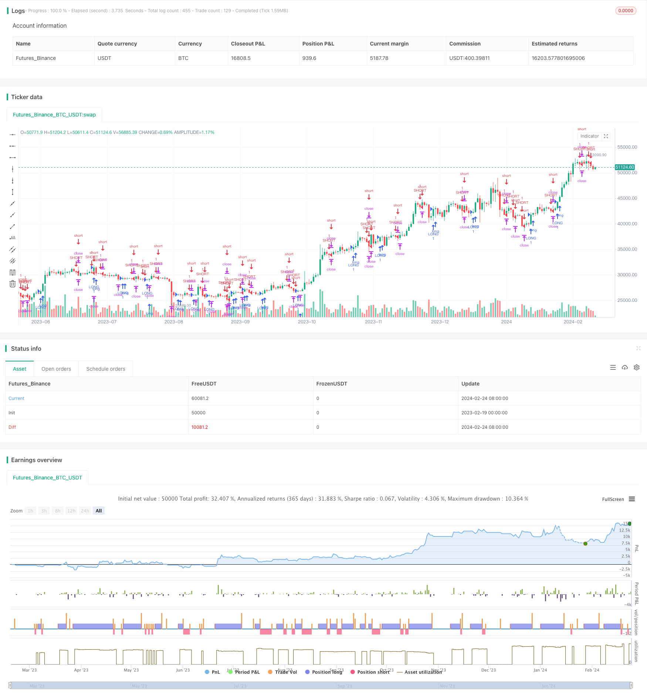

> Name

Inside-Bar-Breakout-Strategy
> Author

ChaoZhang

> Strategy Description


[trans]
## Overview
The internal convergence breakout strategy is a trend following strategy based on K-line patterns. This strategy uses the K-line form of internal convergence and external expansion to determine the trend, and opens long and short positions at the breakthrough point.
## Strategy Principle
This strategy mainly determines the following two K-line forms:
1. Internal Convergence K-line: The highest price of the current day's K-line is lower than yesterday's highest price, and the lowest price is higher than yesterday's lowest price, indicating that the range is converging.
2. External expansion K-line: The highest price of the current day's K-line is higher than yesterday's highest price, and the lowest price is lower than yesterday's lowest price, indicating that the range is expanding.
When the above two forms are judged, it is regarded as the entry signal of the strategy. On the day after entering the K-line, if the opening price is higher than the highest price of the previous day, go long; if the opening price is lower than the lowest price of the previous day, go short.
After going long or short, a stop-profit and stop-loss point will be set. The specific stop-profit and stop-loss algorithm is:
Take profit point = (current close price × target take profit percentage)/minimum change price
Stop loss point = (current close price × stop loss percentage)/minimum change price
In this way, we can place take-profit orders and stop-loss orders, exit the market after achieving profits, and avoid excessive losses.
## Advantage Analysis
This strategy has the following advantages:
1. The K-line shape of internal convergence and external expansion is more reliable, and the success rate of judging the trend direction is higher.
2. Breakthrough entry increases the certainty of judgment and avoids some false breakthroughs.
3. Fully automated trading requires no manual intervention, reducing operational risks.
## Risk Analysis
There are also some risks with this strategy:
1. The judgment of K-line shape is not completely reliable, and wrong signals may appear.
2. It is easy to be trapped when entering the market after a breakthrough, so the stop loss point should be adjusted appropriately.
3. Improper parameter settings may lead to increased losses, and optimization parameters need to be carefully tested.
## Optimization direction
This strategy can also be optimized in the following directions:
1. Add more filter conditions to avoid false signals. For example, volume filtering can be added.
2. Optimize the stop-profit and stop-loss algorithm to achieve dynamic stop-profit and stop-loss.
3. Add automatic stop loss and anti-reverse function.
4. Use machine learning methods to automatically optimize parameters.
## Summarize
The internal convergence breakthrough strategy is generally a relatively reliable and easy-to-implement trend strategy. This strategy makes full use of the judgment advantage of internal convergence and external expansion patterns, as well as the certainty advantage of breakthrough. At the same time, the strategy algorithm is simple, clear, easy to understand, and suitable for entry-level quantitative selection. Through continuous optimization and adjustment, the strategy can be made more stable and intelligent, thereby achieving better trading results.
||

## Overview

The inside bar breakout strategy is a trend following strategy based on candlestick patterns. It uses the inside bar and outside bar candlestick patterns to determine the trend direction and enters positions on breakouts.

## Strategy Logic 

The main logic behind this strategy is identifying two types of candlestick patterns:

1. Inside bar: When the high of current bar is lower than the previous high and the low is higher than the previous low, it indicates a price contraction. 

2. Outside bar: When the high of current bar is higher than the previous high and the low is lower than the previous low, it indicates a price expansion.

When either pattern is identified, it signals a potential entry. On the next bar after the signal bar, if open price breaks above previous high, go long. If open price breaks below previous low, go short.

After entry, take profit and stop loss orders will be placed. The specific algorithms are: 

Take Profit = (Current Close Price x Target Profit Percentage) / Minimum Price Tick
Stop Loss = (Current Close Price x Stop Loss Percentage) / Minimum Price Tick

By doing this, it can secure profits after hitting take profit level and limit losses below maximum tolerable amount when hitting stop loss.

## Advantage Analysis

The advantages of this strategy are:

1. Inside and outside bar patterns are quite reliable for determining trend direction. 

2. Breakout entry increases certainty and avoids some false breakouts. 

3. Fully automated without manual intervention. Reduces operational risks.

## Risk Analysis

Some risks also exist with this strategy:

1. Candlestick pattern identification not always accurate. Potential for wrong signals.

2. Breakout entry prone to getting trapped. Stop loss may need adjustment.  

3. Improper parameter settings can lead to amplified losses. Requires robust optimization.

## Improvement Areas

Some ways to improve the strategy include:

1. Adding filters to reduce false signals, e.g. volume filter.

2. Optimizing dynamic take profit and stop loss algorithms.  

3. Incorporating anti-reverse stop loss.

4. Utilizing machine learning to auto optimize parameters.

## Conclusion

The inside bar breakout strategy is an overall reliable and easy-to-implement trend following method. It takes advantage of the predictive power of inside bar and outside patterns combined with the higher certainty of breakout entries. With simple straightforward logic, it is beginner friendly in algorithmic trading. Further enhancements in optimization and automation will lead to more stable and intelligent trading results.

[/trans]

> Strategy Arguments


|Argument|Default|Description|
|----|----|----|
|v_input_1|3|target profit%|
|v_input_2|true|stop loss %|
|v_input_3|2021|yearfrom|
|v_input_4|2022|yearuntil|
|v_input_5|true|monthfrom|
|v_input_6|12|monthuntil|
|v_input_7|true|dayfrom|
|v_input_8|31|dayuntil|


> Source (PineScript)

``` pinescript
/*backtest
start: 2023-02-19 00:00:00
end: 2024-02-25 00:00:00
period: 1d
basePeriod: 1h
exchanges: [{"eid":"Futures_Binance","currency":"BTC_USDT"}]
*/

//@version=4
strategy("inside bar strategy  Wıth SL-TP ", overlay=true )


insides = high < high[1] and low > low[1]
outsides = high > high[1] and low < low[1]

candle_control=insides or outsides


target_profit_percent=input(3,"target profit%",step=0.1)
stop_loss_percent=input(1,"stop loss %",step=0.1)


yearfrom = input(2021)
yearuntil =input(2022)
monthfrom =input(1)
monthuntil =input(12)
dayfrom=input(1)
dayuntil=input(31)


long_cond=candle_control[1] and close>open and high>high[1]
short_cond=candle_control[1] and close<open and low<low[1]


if ( long_cond ) 
    strategy.entry("LONG", strategy.long, stop=close, oca_name="TREND",  comment="LONG")
    
else
    strategy.cancel(id="LONG")


if (  short_cond ) 

    strategy.entry("SHORT", strategy.short,stop=close, oca_name="TREND", comment="SHORT")
else
    strategy.cancel(id="SHORT")
    
    
    
    
profit_target=(close*(target_profit_percent/100))/syminfo.mintick
stop_target=(close*(stop_loss_percent/100))/syminfo.mintick


strategy.exit("LONG EXIT","LONG",profit=profit_target, loss=stop_target ) 
    
strategy.exit("LONG EXIT","SHORT",profit=profit_target, loss=stop_target ) 

```

> Detail

https://www.fmz.com/strategy/442825

> Last Modified

2024-02-26 12:16:52
