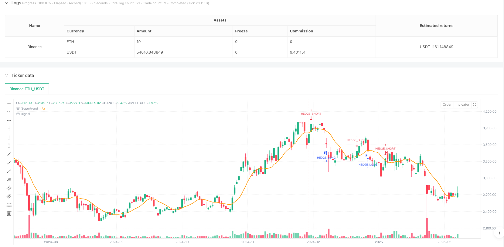
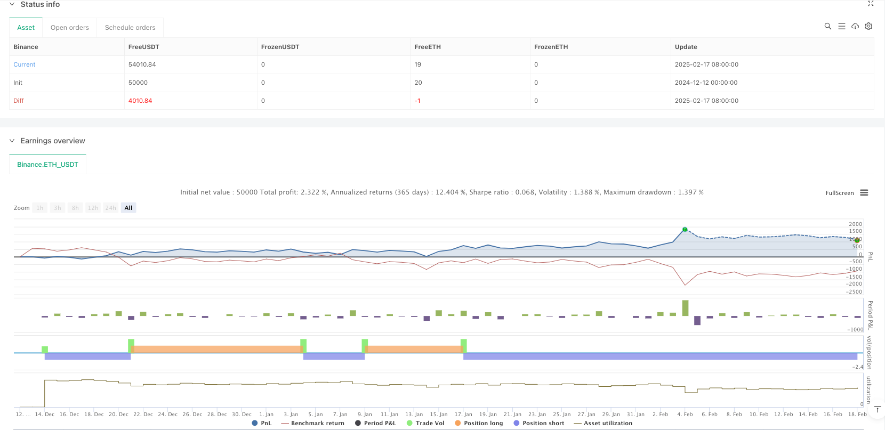

> Name

Institutional-Market-Maker-Tracking-Strategy-with-Dynamic-Cost-Averaging-and-Liquidity-Flow-Analysis
> Author

ianzeng123

> Strategy Description





[trans]
#### Overview
The strategy is a trading system based on market maker behavior and institutional-grade liquidity analysis. It identifies high-probability trading opportunities by tracking market liquidity indicators, order book imbalances, and market maker footprints. The strategy combines the dynamic cost averaging (DCAA) method with a hedging liquidity system to minimize risk and maximize returns. The system completely abandons traditional technical indicators and instead relies on institutional-level market microstructure analysis.
#### Strategy Principle
The core of the strategy is to track market maker behavior through multi-dimensional data:
1. Use VWAP (Volume Weighted Average Price) to confirm the institutional accumulation/distribution position
2. Use CVD (cumulative volume difference) to detect the actual power comparison between long and short parties
3. Combine order book data to identify liquidity traps and stop-loss hunting areas
4. Establish a batch opening system at key support levels through dynamic cost averaging method
5. Cooperate with the hedging system to manage risks when the market fluctuates violently.
#### Strategic Advantages
1. Completely based on market microstructure, avoiding the problem of lagging technical indicators
2. By analyzing the behavior of market makers, large-scale price fluctuations can be predicted in advance.
3. The dynamic cost averaging system can gradually build positions during declines and reduce the overall position cost.
4. Hedging systems provide an additional layer of risk protection, especially during periods of severe market volatility
5. The strategy can adapt to market conditions in real time and does not rely on static support and resistance levels.
#### Strategy Risk
1. Requires real-time high-quality market data and is sensitive to data delays
2. It may be difficult to accurately judge the intentions of market makers when market liquidity is extremely lacking.
3. Over-reliance on market maker behavior analysis may lead to misjudgments under certain market conditions.
4. The dynamic cost averaging system may accumulate large losses in a continuously declining market.
5. The cost of hedging strategies can eat into profits in sideways markets
#### Strategy optimization direction
1. Introduce machine learning algorithms to improve the accuracy of market maker behavior identification
2. Optimize the fund allocation ratio of the dynamic cost averaging system
3. Add more market microstructure indicators to improve signal reliability
4. Develop an adaptive hedging ratio adjustment mechanism
5. Establish a more complete risk control system, especially under extreme market conditions
#### Summary
This is an institutional-grade trading strategy built on market microstructure. Through in-depth analysis of market maker behavior, combined with dynamic cost averaging and hedging systems, strategies can maintain stability in different market environments. Although the implementation of the strategy requires overcoming some technical and operational challenges, its core concepts and methodology have a solid market microstructure foundation and the potential for long-term stable profitability.
|| 

#### Overview
This strategy is a trading system based on market maker behavior and institutional-level liquidity analysis. It identifies high-probability trading opportunities by tracking market liquidity indicators, order book imbalances, and market maker footprints. The strategy combines Dynamic Cost Averaging (DCAA) with a hedge flow system to minimize risks and maximize returns. The system completely abandons traditional technical indicators in favor of institutional-level market microstructure analysis.

#### Strategy Principles
The core of the strategy is tracking market maker behavior through multi-dimensional data:
1. Using VWAP (Volume Weighted Average Price) to confirm institutional absorption/distribution positions
2. Analyzing CVD (Cumulative Volume Delta) to detect actual strength comparison between bulls and bears
3. Combining order book data to identify liquidity traps and stop-loss hunting zones
4. Implementing dynamic cost averaging method to establish staged position building at key support levels
5. Utilizing a hedging system for risk management during extreme market volatility

#### Strategy Advantages
1. Entirely based on market microstructure, avoiding the lag of technical indicators
2. Ability to predict large price movements in advance through market maker behavior analysis
3. Dynamic cost averaging system enables gradual position building during downtrends, reducing overall position cost
4. Hedging system provides additional risk protection, especially during periods of extreme market volatility
5. Strategy can adapt to market conditions in real-time, not relying on static support/resistance levels

#### Strategy Risks
1. Requires high-quality real-time market data, sensitive to data latency
2. May struggle to accurately judge market maker intentions during extremely low liquidity periods
3. Over-reliance on market maker behavior analysis may lead to false signals under certain market conditions
4. Dynamic cost averaging system may accumulate significant losses in continuously declining markets
5. Hedging strategy costs may erode profits in ranging markets

#### Optimization Directions
1. Introduce machine learning algorithms to improve market maker behavior identification accuracy
2. Optimize capital allocation ratios in the dynamic cost averaging system
3. Add more market microstructure indicators to enhance signal reliability
4. Develop adaptive hedge ratio adjustment mechanisms
5. Establish more comprehensive risk control systems, especially under extreme market conditions

#### Summary
This is an institutional-grade trading strategy built on market microstructure foundations. Through deep analysis of market maker behavior, combined with dynamic cost averaging and hedging systems, the strategy maintains stability across different market environments. While implementation faces some technical and operational challenges, its core concepts and methodology have solid market microstructure foundations, showing potential for long-term stable profitability.[/trans]


> Source (PineScript)

``` pinescript
/*backtest
start: 2024-12-12 00:00:00
end: 2025-02-18 08:00:00
period: 1d
basePeriod: 1d
exchanges: [{"eid":"Binance","currency":"ETH_USDT"}]
*/

//@version=6
strategy("EDGE Market Maker Strategy – DCAA & HedgeFlow", overlay=true)

// ✅ Import Indicators  
vwapLine = ta.vwap
superTrend = ta.sma(close, 10)  // Replace with actual Supertrend formula if needed
volData = volume // Volume from current timeframe
cvdData = ta.cum(close - close[1]) // Approximation of CVD (Cumulative Volume Delta)
orderBlockHigh = ta.highest(high, 20) // Approximate Order Block Detection
orderBlockLow = ta.lowest(low, 20)

// ✅ Market Maker Buy Conditions  
longCondition = ta.crossover(close, vwapLine) and cvdData > cvdData[1] and volData > volData[1]
if longCondition
    strategy.entry("BUY", strategy.long)

// ✅ Market Maker Sell Conditions  
shortCondition = ta.crossunder(close, vwapLine) and cvdData < cvdData[1] and volData > volData[1]
if shortCondition
    strategy.entry("SELL", strategy.short)

// ✅ Order Block Confirmation (For Stronger Signals)  
longOB = longCondition and close > orderBlockHigh
shortOB = shortCondition and close < orderBlockLow

if longOB
    label.new(bar_index, high, "BUY (Order Block)", color=color.green, textcolor=color.white, style=label.style_label_down)

if shortOB
    label.new(bar_index, low, "SELL (Order Block)", color=color.red, textcolor=color.white, style=label.style_label_up)

// ✅ DCAA Levels – Adaptive Re-Entry Strategy  
dcaaBuy1 = close * 0.97  // First re-entry for long position (3% drop)
dcaaBuy2 = close * 0.94  // Second re-entry for long position (6% drop)
dcaaSell1 = close * 1.03 // First re-entry for short position (3% rise)
dcaaSell2 = close * 1.06 // Second re-entry for short position (6% rise)

if longCondition
    strategy.entry("DCAA_BUY_1", strategy.long, limit=dcaaBuy1)
    strategy.entry("DCAA_BUY_2", strategy.long, limit=dcaaBuy2)

if shortCondition
    strategy.entry("DCAA_SELL_1", strategy.short, limit=dcaaSell1)
    strategy.entry("DCAA_SELL_2", strategy.short, limit=dcaaSell2)

// ✅ HedgeFlow System – Dynamic Hedge Adjustments  
hedgeLong = ta.crossunder(close, superTrend) and cvdData < cvdData[1] and volData > volData[1]
hedgeShort = ta.crossover(close, superTrend) and cvdData > cvdData[1] and volData > volData[1]

if hedgeLong
    strategy.entry("HEDGE_LONG", strategy.long)

if hedgeShort
    strategy.entry("HEDGE_SHORT", strategy.short)

// ✅ Take Profit & Stop Loss  
tpLong = close * 1.05  
tpShort = close * 0.95  
slLong = close * 0.97  
slShort = close * 1.03  

strategy.exit("TP_Long", from_entry="BUY", limit=tpLong, stop=slLong)
strategy.exit("TP_Short", from_entry="SELL", limit=tpShort, stop=slShort)

// ✅ Plot VWAP & Supertrend for Reference  
plot(vwapLine, title="VWAP", color=color.blue, linewidth=2)
plot(superTrend, title="Supertrend", color=color.orange, linewidth=2)
```

> Detail

https://www.fmz.com/strategy/482856

> Last Modified

2025-02-27 17:34:56
