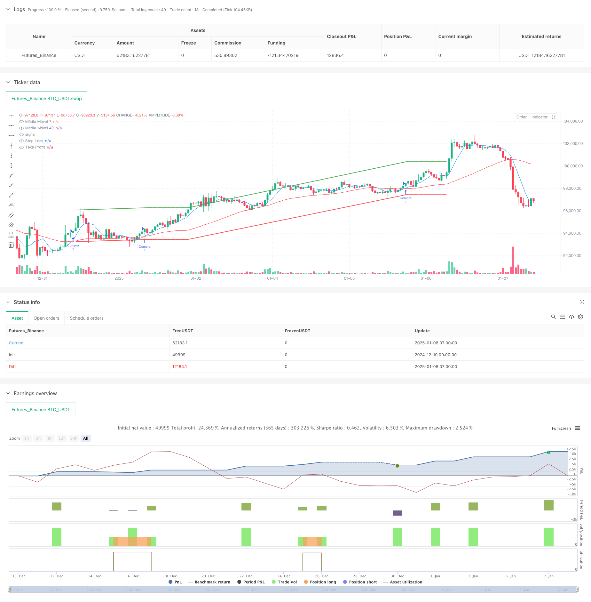

> Name

Intelligent-Moving-Average-Crossover-Strategy-with-Dynamic-Profit-Loss-Management-System
> Author

ChaoZhang

> Strategy Description



[trans]
#### Overview
This strategy is an intelligent trading system based on moving average crossover signals, combined with a dynamic stop-profit and stop-loss management mechanism. The core of the strategy uses the intersection of two simple moving averages (SMA) of 7 periods and 40 periods to generate trading signals. It also integrates a percentage-based stop-profit and stop-loss control system to achieve precise management of trading risks.
#### Strategy Principle
Strategy operation is based on the following core mechanisms:
1. Signal generation: Generate trading signals by observing the intersection of the short-period (7-day) moving average and the long-period (40-day) moving average. When the short-term moving average crosses the long-term moving average upward, a buy signal is generated, and when it crosses downward, a sell signal is generated.
2. Position management: The system adopts a single position mechanism and will not open positions repeatedly if there are already positions, ensuring the effectiveness of the use of funds.
3. Risk control: Integrated dynamic stop-profit and stop-loss system based on opening price. The stop loss level is set to 1% below the opening price, and the take profit level is set to 2% above the opening price, achieving quantitative management of the risk of each transaction.
#### Strategic Advantages
1. Signal reliability: By combining fast and slow moving averages, it can effectively capture changes in price trends.
2. Improved risk management: A dynamic stop-profit and stop-loss mechanism is introduced to accurately control the risk of each transaction.
3. Parameter flexibility: All key parameters can be adjusted through the interface, including moving average periods, take-profit and stop-loss ratios, etc.
4. Visualization effect: The moving average and stop-profit and stop-loss positions are clearly displayed on the chart to facilitate real-time monitoring by traders.
#### Strategy Risk
1. Moving average lag: The moving average is essentially a lagging indicator, which may cause delays in violently volatile markets.
2. Volatile market risk: False signals may frequently occur in a volatile market.
3. Fixed stop loss risk: Percentage fixed stop loss may not be flexible enough under certain market conditions.
#### Strategy optimization direction
1. Signal filtering: It is recommended to introduce trend filters, such as the ADX indicator, to identify trend strength.
2. Dynamic stop loss: Consider linking the stop loss position to market volatility to achieve more intelligent risk management.
3. Position management: Introduce a dynamic position management system based on volatility.
4. Market adaptability: Add a market status identification module and adopt different parameter settings under different market conditions.
#### Summary
This strategy captures market trends through moving average crossovers and combines dynamic take-profit and stop-loss to achieve risk management, which is highly practical. Although there is a certain degree of hysteresis risk, the stability and profitability of the strategy can be further improved through the recommended optimization direction. The strategy is highly configurable and suitable for further improvement and personalized adjustment. ||
#### Overview
This strategy is an intelligent trading system based on moving average crossover signals, combined with a dynamic profit/loss management mechanism. The core strategy uses the crossover of 7-period and 40-period Simple Moving Averages (SMA) to generate trading signals, while integrating a percentage-based stop-loss and take-profit control system for precise risk management.

#### Strategy Principles
The strategy operates based on the following core mechanisms:
1. Signal Generation: Trading signals are generated by observing the crossover between short-period (7-day) and long-period (40-day) moving averages. Buy signals are generated when the short-term MA crosses above the long-term MA, and sell signals when it crosses below.
2. Position Management: The system employs a single position mechanism, preventing multiple entries while a position is open to ensure effective capital utilization.
3. Risk Control: Integrates a dynamic stop-loss/take-profit system based on entry price. Stop-loss is set at 1% below entry price, and take-profit at 2% above, enabling quantified risk management for each trade.

#### Strategy Advantages
1. Signal Reliability: Effectively captures price trend changes by combining fast and slow moving averages.
2. Comprehensive Risk Management: Incorporates dynamic stop-loss/take-profit mechanisms for precise risk control of each trade.
3. Parameter Flexibility: All key parameters can be adjusted through the interface, including MA periods and profit/loss percentages.
4. Visualization: Clearly displays moving averages and profit/loss levels on the chart for real-time monitoring.

#### Strategy Risks
1. MA Lag: Moving averages are inherently lagging indicators, potentially causing delays in volatile markets.
2. Sideways Market Risk: May generate frequent false signals in range-bound markets.
3. Fixed Stop-Loss Risk: Percentage-based fixed stops may lack flexibility under certain market conditions.

#### Strategy Optimization Directions
1. Signal Filtering: Recommend incorporating trend filters, such as ADX, to identify trend strength.
2. Dynamic Stops: Consider linking stop-loss levels to market volatility for smarter risk management.
3. Position Sizing: Introduce volatility-based dynamic position sizing system.
4. Market Adaptability: Add market state recognition module for different parameter settings under various market conditions.

#### Summary
This strategy captures market trends through moving average crossovers while implementing risk management through dynamic profit/loss controls, demonstrating strong practicality. While there are inherent lag risks, the suggested optimization directions can further enhance strategy stability and profitability. The strategy's high configurability makes it suitable for further refinement and customization.[/trans]


> Source (PineScript)

``` pinescript
/*backtest
start: 2024-12-10 00:00:00
end: 2025-01-08 08:00:00
period: 1h
basePeriod: 1h
exchanges: [{"eid":"Futures_Binance","currency":"BTC_USDT","balance":49999}]
*/

//@version=5
strategy("Cruzamento de Médias Móveis (Configuração Interativa)", overlay=true)

// Permite que o usuário defina os períodos das médias móveis na interface
periodo_ma7 = input.int(7, title="Período da Média Móvel 7", minval=1)
periodo_ma40 = input.int(40, title="Período da Média Móvel 40", minval=1)

// Definindo as médias móveis com os períodos configuráveis
ma7 = ta.sma(close, periodo_ma7)
ma40 = ta.sma(close, periodo_ma40)

// Parâmetros de stop loss e take profit
stop_loss_pct = input.float(1, title="Stop Loss (%)", minval=0.1) / 100
take_profit_pct = input.float(2, title="Take Profit (%)", minval=0.1) / 100

// Condições para compra e venda
compra = ta.crossover(ma7, ma40)
venda = ta.crossunder(ma7, ma40)

// Impede novas entradas enquanto já houver uma posição aberta
if (compra and strategy.position_size == 0)
    strategy.entry("Compra", strategy.long)

// Cálculo do preço de stop loss e take profit
stop_loss_price = strategy.position_avg_price * (1 - stop_loss_pct)
take_profit_price = strategy.position_avg_price * (1 + take_profit_pct)

// Estratégia de saída com stop loss e take profit
strategy.exit("Saída", from_entry="Compra", stop=stop_loss_price, limit=take_profit_price)

// Sinal de venda (fechamento da posição)
if (venda)
    strategy.close("Compra")

// Plotando as médias móveis no gráfico
plot(ma7, color=color.blue, title="Média Móvel 7")
plot(ma40, color=color.red, title="Média Móvel 40")

// Plotando o Stop Loss e Take Profit no gráfico
plot(stop_loss_price, color=color.red, style=plot.style_line, linewidth=2, title="Stop Loss")
plot(take_profit_price, color=color.green, style=plot.style_line, linewidth=2, title="Take Profit")

```

> Detail

https://www.fmz.com/strategy/477955

> Last Modified

2025-01-10 15:39:12
