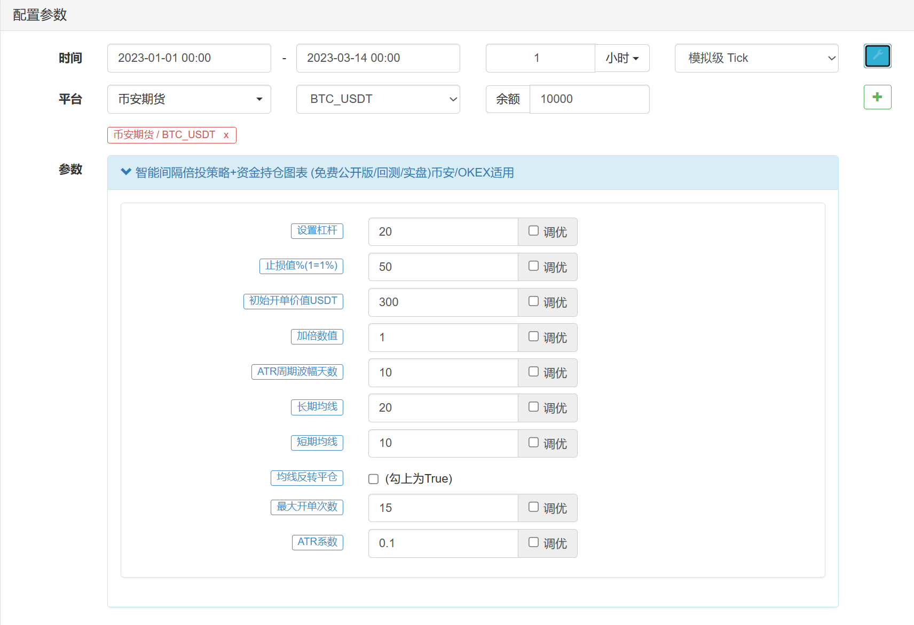
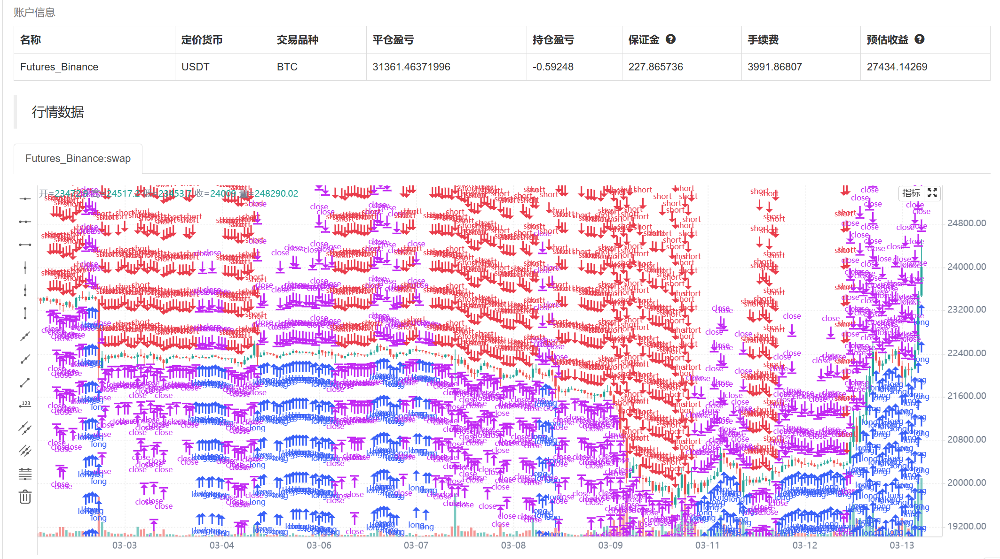
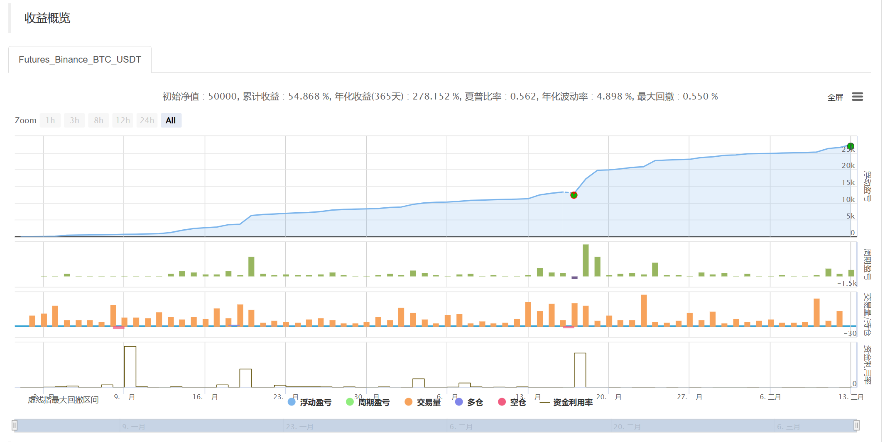
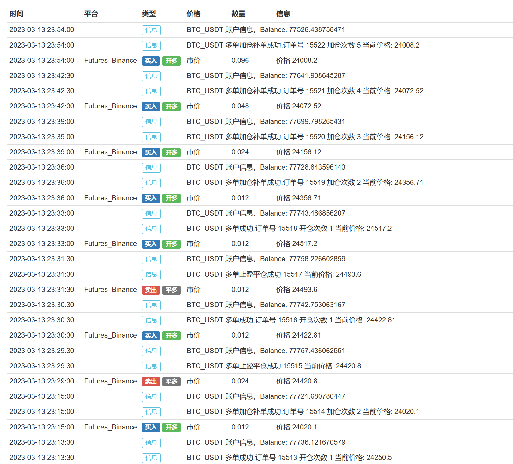
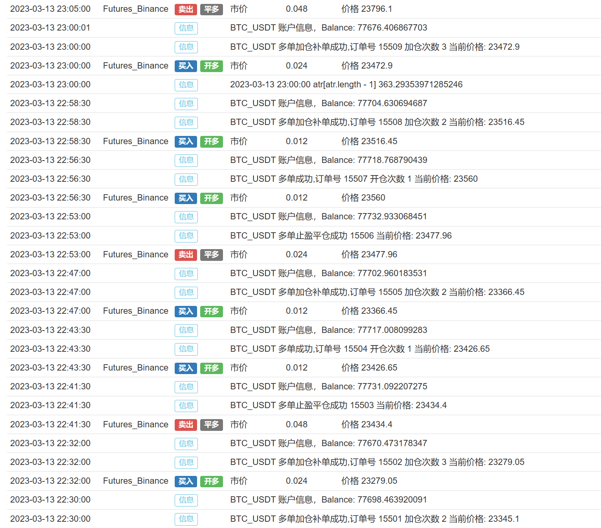

> Name

Intelligent interval doubling strategy for sale
> Author

high frequency quantization
> Strategy Description

Strategy introduction:
The intelligent double investment strategy is an investment strategy based on artificial intelligence technology. Its advantages are mainly reflected in the following aspects:
Automated decision-making: The intelligent doubling strategy can automatically analyze market data, generate trading signals, and automatically execute transactions through artificial intelligence technology, thereby achieving fully automated trading decisions.
Accurate prediction ability: The intelligent doubling investment strategy can conduct in-depth learning and analysis of market data through artificial intelligence technology, thereby improving prediction ability and more accurately predicting market trends and trading signals.
Efficient risk control: The intelligent doubling strategy can monitor and control market risks in real time through artificial intelligence technology, thereby achieving efficient risk control and fund management.
Strong adaptability: The intelligent doubling strategy can be adaptively adjusted according to market conditions and investors’ risk preferences, thereby better adapting to different market environments and investor needs.
Efficient execution capabilities: The intelligent doubling investment strategy can achieve efficient transaction execution through artificial intelligence technology, thereby improving transaction efficiency and execution capabilities.
It should be noted that the intelligent doubling investment strategy also has certain risks and needs to be adjusted and optimized according to the actual situation. At the same time, it requires a certain understanding and mastery of artificial intelligence technology.
The double investment strategy is a common investment strategy. Its basic idea is to increase investment when losing money in the hope of making up for previous losses in future profits. The advantages of this strategy are mainly reflected in the following aspects:
High flexibility: The doubling investment strategy can be adjusted according to market conditions, and the investment amount and frequency of investment can be flexibly adjusted according to the actual situation to achieve optimal results.
Strong risk control ability: The doubling investment strategy can control risks by gradually increasing investment. When the market suffers a loss, it can make up for the previous losses by increasing investment, thereby reducing risks.
High profit potential: The double investment strategy can obtain higher returns when the market conditions are good, because when the market conditions are good, higher returns can be obtained by increasing investment.
Wide applicability: The double investment strategy is suitable for various markets, including stocks, futures, foreign exchange, etc., and can be adjusted according to the characteristics of different markets to achieve optimal results.
It should be noted that the doubling investment strategy also has certain risks. If the market conditions continue to be bad, the investment amount may become larger and larger, eventually leading to losses. Therefore, when using the double investment strategy, you need to make adjustments according to market conditions and control risks to achieve optimal results.
ATR (Average True Range) is a commonly used technical indicator used to measure market volatility. In quantitative trading, adding the ATR adjustment interval can bring the following benefits:
More adaptable to market fluctuations: Market volatility is constantly changing. Adding the ATR adjustment interval can adjust the trading interval according to changes in market volatility, thereby becoming more adaptable to market fluctuations.
Control risks: Adding the ATR adjustment interval can control the frequency of transactions and thereby control risks. When the market volatility is high, the trading interval can be shortened to respond to market changes more quickly; when the market volatility is low, the trading interval can be extended to avoid the risks caused by frequent trading.
Increase returns: Adding the ATR adjustment interval can increase the number of transactions when market volatility is high, thereby increasing returns. When market volatility is low, the number of transactions is reduced and the costs of frequent transactions can be avoided.
It should be noted that adding the ATR adjustment interval needs to be adjusted according to the actual situation, and you cannot blindly pursue high-frequency trading or low-frequency trading. At the same time, the ATR indicator also has a certain lag, and it needs to be comprehensively analyzed in conjunction with other indicators and market conditions.
The main advantages and benefits of this strategy are as follows:
Use the ATR indicator to calculate volatility: This strategy uses the ATR indicator to calculate the true volatility, which can more accurately reflect market volatility, thereby more accurately controlling trading frequency and risk.
Use the WMA indicator for moving average calculation: This strategy uses the WMA indicator for moving average calculation, which can more accurately reflect market trends and thus determine trading signals more accurately.
Strict stop-loss and take-profit mechanisms: This strategy sets strict stop-loss and take-profit mechanisms, which can effectively control risks and losses while also protecting profits.
Flexible parameter settings: The parameter settings of this strategy are relatively flexible and can be adjusted according to the actual situation, thus making it more adaptable to different market conditions.
Wide applicability: This strategy is applicable to various markets, including stocks, futures, foreign exchange, etc., and can be adjusted according to the characteristics of different markets to achieve optimal results.
It should be noted that this strategy is for reference only and needs to be adjusted and optimized according to the actual situation during specific application. At the same time, quantitative trading involves multiple aspects of knowledge and skills, and requires certain programming and trading experience to better apply this strategy.

Backtest records









The backtest record is too long. If you are interested, you can load the backtest yourself.
Real offer display
There is a capital curve
There are assets on display
Display of open orders
2023.05.15 Users reported that profit cannot cover the handling fee, and inspection found that the handling fee for each user is different. To solve this problem, quote the handling rate parameter


> Source (javascript)

``` javascript
/*backtest
start: 2023-04-01 00:00:00
end: 2023-05-01 00:00:00
period: 5m
basePeriod: 1m
exchanges: [{"eid":"Futures_Binance","currency":"BTC_USDT","balance":10000}]
args: [["TransactionVal",300,411371]]
*/


/*
0.具体请看该教程https://www.fmz.com/bbs-topic/4145
1.添加交易所
2.部署托管者
3.创建与修改参数
4.创建和管理实盘

5.技术支持 VX:18826683356   okex实盘交易免费

5.1 币安实盘交易权限费用如下
6.TRC(20)主网 收USDT地址: TFZn8YGYRVuE5CPLsSieaKgPbwJrG3E8e7
7 通过币安支付 手机号18826683356 （免手续费）建议使用该方式支付
8.币安需要支付 100USDT/3月
  币安需要支付 500USDT/永久

9.不对策略利润作任何保证，可以参考回测参数设置运行
10.非开通权限，时间宝贵，请勿联系
*/

/*
参数解析

设置杠杆：设置该合约使用资金的倍数，杠杆越大开仓需要的保证金越小
止损值：亏损额达账号总资金的一定百分比，清仓强平
初始开单价值USDT：首单开仓的价值，如果设置为300，当前交易产品为BTC_USDT,报价为30000，那么开仓量为300/30000=0.01个
加倍数值：如果已经有持仓订单，会加仓拉平持仓成本，设置为1，那么加仓量与持仓量一致。该参数需要设置为正整数
ATR周期波幅天数：指标ATR的参数
长期均线：指标MA的参数
短期均线：指标MA的参数
均线反转平仓：打勾，长期均线>短期均线 会全平所有多单；长期均线<短期均线 会全平所有空单
最大开单次数：符合条件可以加仓补单的次数，结束一轮循环会重新计数
ATR系数:用来修改ATR值，调整波动间隔
*/
//2023.05.15 用户反馈获利无法覆盖手续费，检查发现每个用户的手续费有差异化。为解决该问题，引用手续费率参数
//双向持仓

function main() {
    Log("策略保密,复制可以直接加载币安期货交易所回测与OKEX期货交易所免费实盘"); 
    Log("策略保密,复制可以直接加载币安期货交易所实盘，需要支付费用开通权限");   
    $.main1()
}
```

> Detail

https://www.fmz.com/strategy/417138

> Last Modified

2023-06-11 20:07:40
