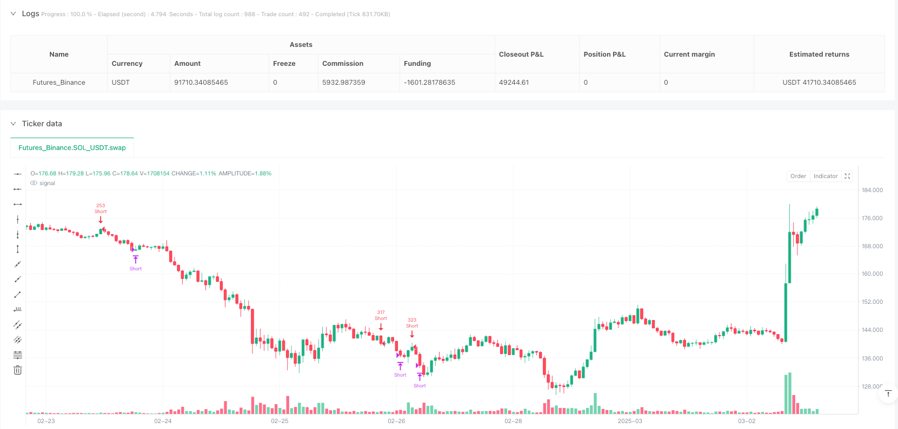
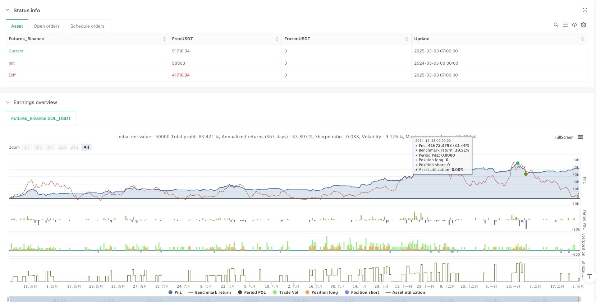

> Name

Internal-Bar-Strength-Trend-Reversal-Trading-System
> Author

ianzeng123

> Strategy Description





[trans]

#### Overview
The Internal Price Strength Trend Reversal Trading System is a daily level trading strategy based on the Internal Price Strength (IBS) indicator. The core of this strategy is to identify potential market reversal points and determine the overbought and oversold status of the market by monitoring the relative position of the previous candle's closing price within its high and low range. This strategy is particularly suitable for trading stocks and US indices, with default parameters optimized for major indices such as SPY/SPX and NDQ/QQQ. By incorporating the exponential moving average (EMA) as a trend filter, this strategy is able to capture trading opportunities presented by short-term price fluctuations while following long-term trends.
#### Strategy Principle
The core of this strategy lies in the calculation and application of the Internal Price Strength (IBS) indicator. The IBS indicator is calculated by the following formula:
```
IBS = (前一日收盘价 - 前一日最低价) / (前一日最高价 - 前一日最低价)
```

IBS values always fluctuate between 0 and 1:
- An IBS value below 0.2 is usually interpreted as an oversold condition, indicating that the market may be about to rise.
- An IBS value above 0.9 indicates an overbought condition, which means the market may be about to pull back.
The trading rules of this strategy are as follows:
1. Long entry conditions:
   - Condition 1: IBS below user-defined entry threshold (default 0.09)
   - Condition 2: The current price is above the N-period exponential moving average (EMA) (default period is 220)
   - NOTE: User can disable EMA conditions by setting EMA period to 0
2. Long entry conditions:
   - Close the position when IBS rises above the user-defined exit threshold (default 0.985)
   - Or close the position when the trading duration reaches the maximum trading period (default is 14 days)
In addition, the strategy also introduces the "minimum new entry distance percentage" parameter to ensure that new positions are only opened when the price retraces enough, effectively reducing retracement risks and optimizing fund management.
#### Strategic Advantages
1. Accurate market timing: The IBS indicator can accurately capture the overbought and oversold state of the market, providing an objective mathematical basis for entry and exit, and reducing the bias caused by subjective judgment.
2. Trend filtering mechanism: Use EMA as a trend filter to ensure that the trading direction is consistent with the main trend, effectively avoiding the risk of counter-trend trading. Strategies can adjust the EMA period according to different market characteristics, or disable this condition completely.
3. Flexible position management: The strategy supports pyramid-style position additions (up to 2 times), and introduces the "minimum new entry distance percentage" parameter to implement a more intelligent batch opening mechanism, which can effectively reduce the average position cost when prices retrace.
4. Automatic risk control: The strategy sets a maximum position limit. Even if the market does not trigger a regular exit signal, the position will be automatically closed after the preset maximum trading period, effectively controlling the risk exposure time of a single transaction.
5. Parameter optimization: The default parameters have been optimized for major market indexes such as SPY and QQQ/NDQ, and users can directly apply the recommended settings:
   - QQQ recommended settings: entry threshold 0.09, exit threshold 0.985, EMA period 220, minimum entry distance 0%, maximum holding period 14 days
   - SPY recommended settings: entry threshold 0.11, exit threshold 0.995, EMA period 200, minimum entry distance 0%, maximum holding period 12 days
6. Comprehensive trading mode: supports long-only, short-only or two-way trading modes to adapt to different market environments and trading styles.
#### Strategy Risk
1. Parameter sensitivity: IBS entry and exit thresholds have a greater impact on strategy performance. Improper parameter settings may lead to over-trading or missing important trading opportunities. It is recommended that sufficient historical data backtesting and parameter optimization be conducted for specific trading varieties before real-time application.
2. Volatile market risk: In a volatile market with no obvious trend, IBS signals may appear frequently, leading to excessive trading and unnecessary increase in transaction costs. The solution is to add filtering conditions, such as requiring multiple consecutive IBS signal confirmations or combining other indicators (such as ATR) to judge market volatility.
3. Hysteresis of sharp trend changes: When the market experiences a rapid trend change, the IBS indicator calculated based on the previous day's data may lag behind, resulting in less than ideal entry or exit timing. It is recommended to appropriately adjust the IBS threshold or shorten the maximum holding time during periods of high volatility.
4. Fund management risk: By default, 50% of the account's funds are used for transactions, which may lead to excessive risk exposure if multiple positions are added. It is recommended that users adjust the position size and position adding parameters according to their own risk tolerance.
5. Technical implementation limitations: The strategy executes transactions based on the closing price, and may face slippage and price differences in actual operations. To reduce this risk, consider placing an order a certain time before the market closes or using a limit order instead of a market order.
#### Strategy optimization direction
1. Dynamic threshold adjustment: The current strategy uses fixed IBS entry and exit thresholds, and dynamic adjustment of these thresholds based on market volatility can be considered. For example, in periods of high volatility, the entry threshold can be appropriately raised and the exit threshold can be lowered to reduce false signals; in periods of low volatility, more aggressive settings can be adopted. Specific implementation can be achieved by linking the IBS threshold to ATR (average true range) or historical volatility.
2. Multi-time period confirmation: Introducing a multi-time period analysis framework, requiring short-term and medium-term IBS signals to be confirmed at the same time before executing transactions. For example, in addition to the daily IBS signal, you can also calculate the weekly or 4-hour IBS value. Only enter the market when multiple time periods show overbought or oversold conditions, which can greatly improve the signal quality.
3. Intelligent stop-loss mechanism: The current strategy only relies on IBS exit signals and maximum position time to control risks, and a more intelligent stop-loss mechanism can be introduced. For example, dynamic stop loss based on ATR, trailing stop loss or stop loss strategy based on support/resistance levels to better protect profits and control single transaction risk.
4. Market state adaptation: Introduce a market state identification mechanism and use different parameter settings in different market environments (trending market, shock market). Market status can be identified through ADX (Average Directional Index) or other trend strength indicators, relaxing IBS conditions in strong trend environments, and adopting stricter IBS thresholds in volatile markets.
5. Machine learning optimization: Use machine learning technology to optimize and screen IBS signals. By training the model to identify which IBS signals are more likely to generate profitable transactions, and automatically adjusting parameters according to market characteristics to achieve adaptive performance of the strategy. This method can significantly improve the stability and adaptability of the strategy, especially when facing different market conditions and trading varieties.
#### Summary
The Internal Price Strength Trend Reversal Trading System is a daily-level trading strategy that combines the Internal Price Strength (IBS) indicator and the Exponential Moving Average (EMA). This strategy optimizes trading decisions by identifying potential market reversal points and following long-term trends, and is particularly suitable for stock and U.S. index trading. The core advantage lies in its objective mathematical model, flexible position management and built-in risk control mechanism.
The strategy has parameter optimization for major market indexes such as SPY/SPX and NDQ/QQQ, and users can directly apply the recommended settings for trading. However, there are risks in any trading strategy, including parameter sensitivity, market shock risk, and hysteresis under dramatic trend changes.
Future optimization directions include dynamic threshold adjustment, multi-time cycle confirmation, intelligent stop loss mechanism, market state adaptation and machine learning optimization, etc. These improvements can further improve the adaptability and robustness of the strategy, allowing it to maintain good performance in different market environments.
As a quantitative trading strategy, the Internal Price Strength Trend Reversal Trading System provides traders with a rules-based, objective trading method that reduces the impact of emotional factors on trading decisions and helps achieve more consistent and predictable trading results. ||
#### Overview
The Internal Bar Strength Trend Reversal Trading System is a daily timeframe trading strategy based on the Internal Bar Strength (IBS) indicator. The core concept of this strategy is to identify potential market reversal points by monitoring the relative position of the previous candle's closing price within its high-low range to determine overbought and oversold market conditions. This strategy is particularly suitable for stocks and US indices trading, with default parameters optimized for major indices like SPY/SPX and NDQ/QQQ. By combining the Exponential Moving Average (EMA) as a trend filter, this strategy can capture short-term price fluctuations while adhering to long-term trends.

#### Strategy Principles
The core of this strategy lies in the calculation and application of the Internal Bar Strength (IBS) indicator. The IBS is calculated using the following formula:
```
IBS = (Previous Day's Close - Previous Day's Low) / (Previous Day's High - Previous Day's Low)
```

The IBS value always fluctuates between 0 and 1:
- An IBS value below 0.2 is typically interpreted as an oversold condition, indicating a potential upward market movement
- An IBS value above 0.9 suggests an overbought condition, signaling a possible market retracement

The trading rules of this strategy are as follows:
1. Long Entry Conditions:
   - Condition 1: IBS is below the user-defined entry threshold (default is 0.09)
   - Condition 2: Current price is above the N-period Exponential Moving Average (EMA) (default period is 220)
   - Note: Users can disable the EMA condition by setting the EMA period to 0

2. Long Exit Conditions:
   - Close the position when IBS rises above the user-defined exit threshold (default is 0.985)
   - Or close the position when the trade duration reaches the maximum trading period (default is 14 days)

Additionally, the strategy introduces a "Minimum Distance for New Entry (%)" parameter, ensuring that new positions are only opened when the price has pulled back sufficiently, effectively reducing drawdown risk and optimizing capital management.

#### Strategy Advantages
1. Precise Market Timing: The use of the IBS indicator allows for accurate capture of market overbought and oversold conditions, providing an objective mathematical basis for entries and exits, reducing biases from subjective judgment.

2. Trend Filtering Mechanism: By using EMA as a trend filter, the strategy ensures that the trading direction aligns with the main trend, effectively avoiding the risks of counter-trend trading. The EMA period can be adjusted based on different market characteristics or completely disabled.

3. Flexible Position Management: The strategy supports pyramiding (up to 2 entries) and introduces the "Minimum Distance for New Entry (%)" parameter, implementing a more intelligent phased position building mechanism that can effectively lower the average position cost during price pullbacks.

4. Automatic Risk Control: The strategy sets a maximum holding time limit, automatically closing positions after a preset maximum trading period even if the market doesn't trigger regular exit signals, effectively controlling the risk exposure time for each trade.

5. Parameter Optimization: Default parameters have been optimized for major market indices like SPY and QQQ/NDQ, with recommended settings that users can directly apply:
   - QQQ recommended settings: Entry threshold 0.09, Exit threshold 0.985, EMA period 220, Minimum entry distance 0%, Maximum holding days 14
   - SPY recommended settings: Entry threshold 0.11, Exit threshold 0.995, EMA period 200, Minimum entry distance 0%, Maximum holding days 12

6. Comprehensive Trading Modes: Supports long-only, short-only, or bidirectional trading modes, adapting to different market environments and trading styles.

#### Strategy Risks
1. Parameter Sensitivity: IBS entry and exit thresholds significantly impact strategy performance; improper parameter settings may lead to overtrading or missing important trading opportunities. It is recommended to conduct thorough historical data backtesting and parameter optimization for specific trading instruments before live implementation.

2. Oscillating Market Risk: In range-bound markets without clear trends, IBS signals may appear frequently, leading to overtrading and unnecessary transaction costs. The solution is to add filtering conditions, such as requiring confirmation from multiple consecutive IBS signals or combining with other indicators (like ATR) to assess market volatility.

3. Lag in Rapid Trend Changes: When markets experience quick trend shifts, the IBS indicator calculated from previous day's data may react with a lag, resulting in less-than-ideal entry or exit timing. It is advisable to adjust IBS thresholds or shorten the maximum holding time during high volatility periods.

4. Capital Management Risk: By default, the strategy uses 50% of account funds for trading, which may lead to excessive risk exposure with multiple position additions. Users should adjust position size and pyramiding parameters according to their risk tolerance.

5. Technical Implementation Limitations: The strategy executes trades based on closing prices, which may face slippage and price discrepancies in actual operations. To reduce such risks, consider placing orders a certain time before market close or using limit orders instead of market orders.

#### Strategy Optimization Directions
1. Dynamic Threshold Adjustment: The current strategy uses fixed IBS entry and exit thresholds. Consider dynamically adjusting these thresholds based on market volatility. For example, increase entry thresholds and decrease exit thresholds during high volatility periods to reduce false signals; adopt more aggressive settings during low volatility periods. This can be implemented by linking IBS thresholds with ATR (Average True Range) or historical volatility.

2. Multi-Timeframe Confirmation: Introduce a multi-timeframe analysis framework, requiring simultaneous confirmation from short-term and medium-term IBS signals before executing trades. For example, in addition to daily IBS signals, calculate weekly or 4-hour IBS values, only entering when multiple timeframes show overbought or oversold conditions, which can significantly improve signal quality.

3. Intelligent Stop-Loss Mechanism: The current strategy relies only on IBS exit signals and maximum holding time to control risk. More intelligent stop-loss mechanisms can be introduced, such as ATR-based dynamic stop-losses, trailing stops, or support/resistance-based stop-loss strategies, to better protect profits and control single trade risk.

4. Market State Adaptation: Introduce market state recognition mechanisms to use different parameter settings in different market environments (trending markets, oscillating markets). Market states can be identified through ADX (Average Directional Index) or other trend strength indicators, relaxing IBS conditions in strong trend environments and adopting stricter IBS thresholds in oscillating markets.

5. Machine Learning Optimization: Utilize machine learning techniques to optimize and filter IBS signals. Train models to identify which IBS signals are more likely to generate profitable trades and automatically adjust parameters based on market characteristics, achieving adaptive strategy performance. This approach can significantly improve strategy stability and adaptability, especially when facing different market conditions and trading instruments.

#### Summary
The Internal Bar Strength Trend Reversal Trading System is a daily timeframe trading strategy that combines the Internal Bar Strength (IBS) indicator with the Exponential Moving Average (EMA). This strategy optimizes trading decisions by identifying potential market reversal points and following long-term trends, making it particularly suitable for stocks and US indices trading. Its core advantages lie in its objective mathematical model, flexible position management, and built-in risk control mechanisms.

The strategy has been parameter-optimized for major market indices like SPY/SPX and NDQ/QQQ, allowing users to directly apply recommended settings for trading. However, like any trading strategy, risks exist, including parameter sensitivity, oscillating market risk, and lag during rapid trend changes.

Future optimization directions include dynamic threshold adjustment, multi-timeframe confirmation, intelligent stop-loss mechanisms, market state adaptation, and machine learning optimization. These improvements can further enhance the strategy's adaptability and robustness, maintaining good performance across different market environments.

As a quantitative trading strategy, the Internal Bar Strength Trend Reversal Trading System provides traders with a rule-based, objective trading method that reduces the impact of emotional factors on trading decisions, helping to achieve more consistent and predictable trading results.[/trans]


> Source (PineScript)

``` pinescript
/*backtest
start: 2024-03-05 00:00:00
end: 2025-03-03 08:00:00
period: 1h
basePeriod: 1h
exchanges: [{"eid":"Futures_Binance","currency":"SOL_USDT"}]
*/

//Implementation by AlgoTradeKit
//v.0.5
//The IBS Trading Strategy is a daily bars long-only trading system, based on the concept of Internal Bar Strength (IBS). 
//The strategy aims to identify potential reversals by monitoring how the previous bar’s close positions itself within its high-low range. 
//It is suitable for stock and US indices. The default parameters are optimized for SPY/SPX and NDQ/QQQ
//Setting for QQQ: 0.09, 0.985, 220, 0, 14
//Setting for SPY: 0.11, 0.995, 200, 0, 12

//@version=6
strategy("IBS (Internal Bar Strength) Trading Strategy for SPY and NDQ", overlay=true, initial_capital=10000, default_qty_type=strategy.percent_of_equity, default_qty_value=50, pyramiding = 2, currency = currency.USD, process_orders_on_close=false)

// ***** INPUTS *****
// IBS thresholds
ibsEntryThreshold = input.float(0.09, title="IBS Entry Threshold", step=0.01, tooltip="IBS = (Previous Close - Previous Low) / (Previous High - Previous Low), and IBS value below 0.2 is typically interpreted as an oversold condition, while a value above 0.9 suggests an overbought state.")
ibsExitThreshold  = input.float(0.985, title="IBS Exit Threshold", step=0.01, tooltip="IBS = (Previous Close - Previous Low) / (Previous High - Previous Low), and IBS value below 0.2 is typically interpreted as an oversold condition, while a value above 0.9 suggests an overbought state.")
// EMA period (set to 0 to disable the EMA condition)
emaPeriod = input.int(220, title="EMA Period (0 to disable)", minval=0, maxval=5000, step=1, tooltip="Exponential Moving Average Filter Period (0 to disable)")
// Minimum percentage drop required for a new entry (for dollar-cost averaging)
minEntryPct = input.float(0, title="Minimum Distance for New Entry (%)", step=0.05, minval=0.0, maxval=100, tooltip = "Distance in Price from Last Opened Position, in Percentage Terms (%)")
maxTradeDuration = input.int(title="Maximum Trade Duration (days)", defval=14, minval=1, step=1, maxval=1000, tooltip = "Exit at close if maximum trade duration is reached.")


// Persistent variable to record the bar index when the trade is entered.
var int entryBarIndex = na

// ***** EMA CALCULATION *****
// Calculate the EMA globally if the period is greater than 0, otherwise leave as na.
emaValue = emaPeriod > 0 ? ta.ema(close, emaPeriod) : na

// ***** IBS CALCULATION *****
// Calculate IBS using the previous bar’s values.
// Guard against division by zero: if previous high equals previous low, default IBS to 0.5.
prevHigh  = high[1]
prevLow   = low[1]
prevClose = close[1]
ibs = (prevHigh != prevLow) ? (prevClose - prevLow) / (prevHigh - prevLow) : 0.5

// ***** ENTRY AND EXIT CONDITIONS *****
// Define the EMA condition: if emaPeriod is 0, bypass the EMA check.
emaConditionLong = emaPeriod == 0 or (close > emaValue)
emaConditionShort = emaPeriod == 0 or (close < emaValue)

// Entry: IBS is below the entry threshold and the EMA condition holds.
enterLong = (ibs < ibsEntryThreshold) and emaConditionLong 
enterShort = (ibs > ibsExitThreshold) and emaConditionShort 

// Exit: IBS is above the exit threshold.
exitLong = ibs > ibsExitThreshold
exitShort = ibs < ibsEntryThreshold

// ***** DOLLAR-COST AVERAGING CONDITION IN PERCENTAGE *****
// Track the last entry price. Reset when there is no open position.
var float lastEntryPrice = na
if strategy.position_size == 0
    lastEntryPrice := na

// If there is no previous entry, the condition is met.
// Otherwise, allow a new entry only if the current price is lower than the last entry price
// by at least the predefined percentage (converted to a fraction).
dcaCondition = na(lastEntryPrice) or ((close < lastEntryPrice) and (((lastEntryPrice - close) / lastEntryPrice) >= (minEntryPct / 100)))
dcaConditionShort = na(lastEntryPrice) or ((close > lastEntryPrice) and (((close - lastEntryPrice) / lastEntryPrice) >= (minEntryPct / 100)))


// ***** STRATEGY ORDERS *****
// Enter a long position only if both the entry condition and the DCA condition are met.
if enterLong and dcaCondition 
    strategy.entry("Long", strategy.long)
    lastEntryPrice := close  // update the last entry price
    entryBarIndex := bar_index

if enterShort and dcaConditionShort 
    strategy.entry("Short", strategy.short)
    lastEntryPrice := close  // update the last entry price
    entryBarIndex := bar_index

// Compute trade duration in days using the absolute difference
tradeDuration = not na(entryBarIndex) ? math.abs(bar_index - entryBarIndex) : 0

// Exit the long position when the exit condition is met or if the trade duration reaches maxTradeDuration days.
if exitLong or (tradeDuration >= maxTradeDuration)
    strategy.close("Long")

// Exit the long position when the exit condition is met or if the trade duration reaches maxTradeDuration days.
if exitShort or (tradeDuration >= maxTradeDuration)
    strategy.close("Short")

// ***** PLOTTING *****
// Plot IBS for reference, along with horizontal lines for the entry and exit thresholds.
//plot(ibs, title="IBS", color=color.blue, linewidth=2)
//hline(ibsEntryThreshold, title="IBS Entry Threshold", color=color.green)
//hline(ibsExitThreshold, title="IBS Exit Threshold", color=color.red)

```

> Detail

https://www.fmz.com/strategy/484915

> Last Modified

2025-03-05 09:55:24
