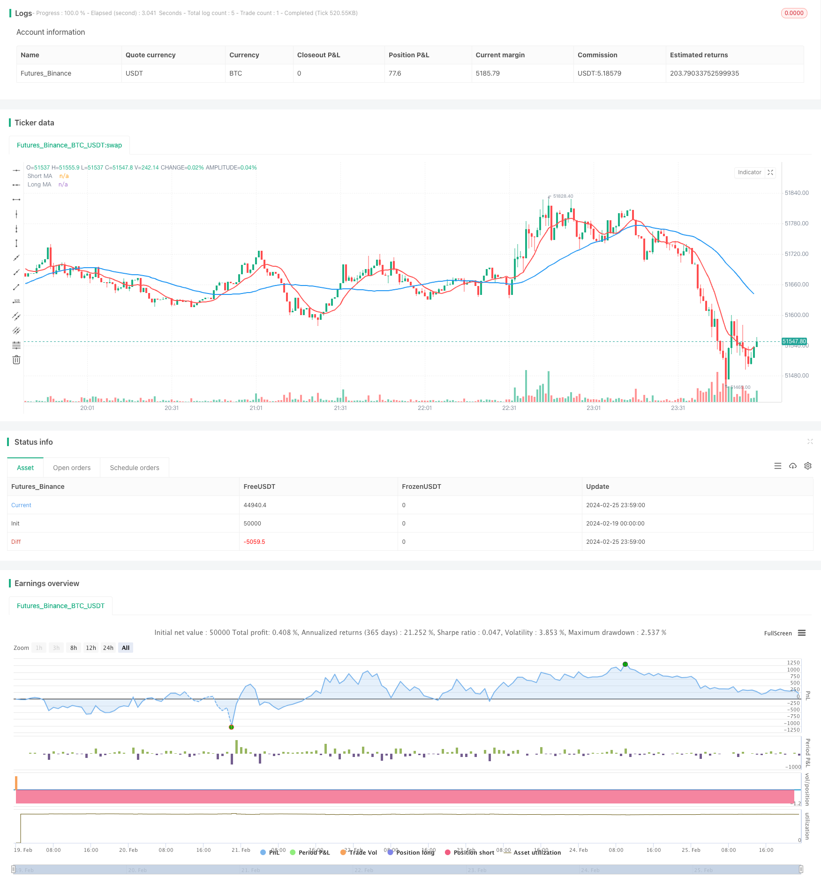

> Name

Intraday-Dual-Moving-Average-Trading-Strategy
> Author

ChaoZhang

> Strategy Description


[trans]
## Overview
This is a simple day trading strategy based on double moving averages. It uses two simple moving averages with different periods, and buys or sells when the moving averages cross. When the signal changes, use double the amount to close the position and then open the position in the opposite direction. At the end of the intraday trading session, if the positions have not been closed, all positions will be closed.
## Strategy Principle
This strategy uses two simple moving averages, the 10-day and the 40-day. When the short-term moving average crosses the long-term moving average, go long; when the short-term moving average crosses below the long-term moving average, go short. When the signal changes, use double the lot size to close the position and then open the position in the opposite direction. Trade following moving average signals during defined intraday trading sessions. At the end of the trading session within the day, if there are still open positions, all positions will be closed.
This strategy mainly takes advantage of the fact that short-term moving averages can capture price changes faster. When the short-term moving average crosses the long-term moving average, it means that short-term prices have begun to rise, and going long can capture this trend; when the short-term moving average crosses below the long-term moving average, it means that short-term prices have begun to fall, and going short can capture this trend. The design of reverse position opening with double lot size can increase the position and expand the profit margin.
## Strategic Advantages
1. The strategic ideas are simple and clear, easy to understand and implement.
2. Using the double moving average crossover principle, you can effectively capture short-term price trends. 
3. Using intraday time period trading can avoid overnight risks.
4. Adopt double lot size reverse opening design to expand profit margins.
## Risk Analysis
1. As a short-term strategy, it is easily affected by market noise and produces false signals.
2. Double lot size design may amplify losses.
3. The design of forced liquidation within the day may result in the inability to hold long-term profitable transactions.
Solutions corresponding to risks:
1. Optimize the moving average parameters and reduce the false signal rate.
2. Filter signals in combination with other indicators. 
3. Optimize the double lot size parameters.
4. Appropriately relax intraday trading hours.
## Strategy optimization direction
1. Optimize the moving average parameters. More combinations can be tested to find the best parameters.
2. Add other technical indicator filters. For example, adding MACD indicator confirmation can reduce the false signal rate.
3. Optimize the reverse position opening multiple. Test different multiple sizes to find optimal parameters.
4. Test different intraday trading sessions. Properly extending the period may yield better returns.
## Summarize
The overall idea of ​​this strategy is simple. It captures the short-term trend formed by the intersection of double moving averages, cooperates with reverse opening of double lot sizes to expand profit margins, and finally cooperates with intraday trading to avoid overnight risks. It is an effective strategy suitable for short-term intraday trading. There is room for further optimization. By adjusting parameters and adding other technical indicator filters, better strategic effects can be obtained.
||

## Overview  

This is a simple intraday trading strategy based on dual moving averages. It uses two simple moving averages with different periods and takes long or short positions when the moving averages cross over. The position is reversed using double quantity when signal changes. All open positions are squared off when the intraday session ends.  

## Strategy Logic

The strategy uses a 10-day and a 40-day simple moving average. It goes long when the short period moving average crosses above the long period one and goes short when the reverse crossover happens. When signal changes, the position is closed out using double quantity and a reverse position is initiated. Trading only happens following the moving average signals during a defined intraday session. Any open positions left are squared off when the session ends.

The strategy mainly utilizes the faster price change capturing capability of the shorter period moving average. When the short SMA crosses above the long SMA, it indicates an uptrend in prices in the short term hence going long can capture this. The reverse indicates a short term downtrend. The double quantity reverse entry expands profit potential.


## Advantages

1. Simple and clear strategy logic, easy to understand and implement.  
2. Effectively catches short term price trends using dual MA crossover.
3. Avoids overnight risk by restricting to an intraday session. 
4. Expands profit potential using double quantity reverse trading.

## Risk Analysis 

1. Prone to noise trading errors as a short term strategy.  
2. Double quantity may amplify losses.
3. Forced square off risks missing longer profitable trends.

Risk Mitigation:

1. Optimize MA parameters to reduce false signals.  
2. Add filters using other indicators.  
3. Optimize quantity parameters.
4. Relax intraday session duration.


## Enhancement Opportunities

1. Optimize MA parameters by testing more combinations for best fit.  

2. Add filters like MACD confirmation to reduce false signals.  

3. Optimize reverse entry quantity multiplier through parameter tuning.

4. Test extending intraday session duration for better returns.


## Conclusion

The strategy catches short term trends formed from MA crossover signals, expands profits using double quantity reverse trading and restricts overnight risks by trading only in an intraday session. Further optimizations on parameters and adding filters can improve strategy performance. On the whole, it is an effective strategy suitable for intraday trading.

[/trans]

> Strategy Arguments


|Argument|Default|Description|
|----|----|----|
|v_input_1|0915-1455|Market session|
|v_input_2|10|Short MA Period|
|v_input_3|40|Long MA Period|


> Source (PineScript)

``` pinescript
/*backtest
start: 2024-02-19 00:00:00
end: 2024-02-26 00:00:00
period: 1m
basePeriod: 1m
exchanges: [{"eid":"Futures_Binance","currency":"BTC_USDT"}]
*/

// This source code is subject to the terms of the Mozilla Public License 2.0 at https://mozilla.org/MPL/2.0/
// © Pritesh-StocksDeveloper

//@version=4
strategy("Moving Average - Intraday", shorttitle = "MA - Intraday", 
     overlay=true, calc_on_every_tick = true)

// Used for intraday handling
// Session value should be from market start to the time you want to square-off 
// your intraday strategy
var i_marketSession = input(title="Market session", type=input.session, 
     defval="0915-1455", confirm=true)

// Short & Long moving avg. period
var int i_shortPeriod = input(title = "Short MA Period", type = input.integer, 
     defval = 10, minval = 2, maxval = 20, confirm=true)
var int i_longPeriod = input(title = "Long MA Period", type = input.integer, 
     defval = 40, minval = 3, maxval = 120, confirm=true)

// A function to check whether the bar is in intraday session
barInSession(sess) => time(timeframe.period, sess) != 0

// Calculate moving averages
shortAvg = sma(close, i_shortPeriod)
longAvg = sma(close, i_longPeriod)

// Plot moving averages
plot(series = shortAvg, color = color.red, title = "Short MA", 
     linewidth = 2)
plot(series = longAvg, color = color.blue, title = "Long MA", 
     linewidth = 2)

// Long/short condition
longCondition = crossover(shortAvg, longAvg)
shortCondition = crossunder(shortAvg, longAvg)

// See if intraday session is active
bool intradaySession = barInSession(i_marketSession)

// Trade only if intraday session is active

// Long position
strategy.entry(id = "Long", long = strategy.long, 
     when = longCondition and intradaySession)

// Short position
strategy.entry(id = "Short", long = strategy.short, 
     when = shortCondition and intradaySession)

// Square-off position (when session is over and position is open)
squareOff = (not intradaySession) and (strategy.position_size != 0)
strategy.close_all(when = squareOff, comment = "Square-off")
```

> Detail

https://www.fmz.com/strategy/442963

> Last Modified

2024-02-27 16:36:31
