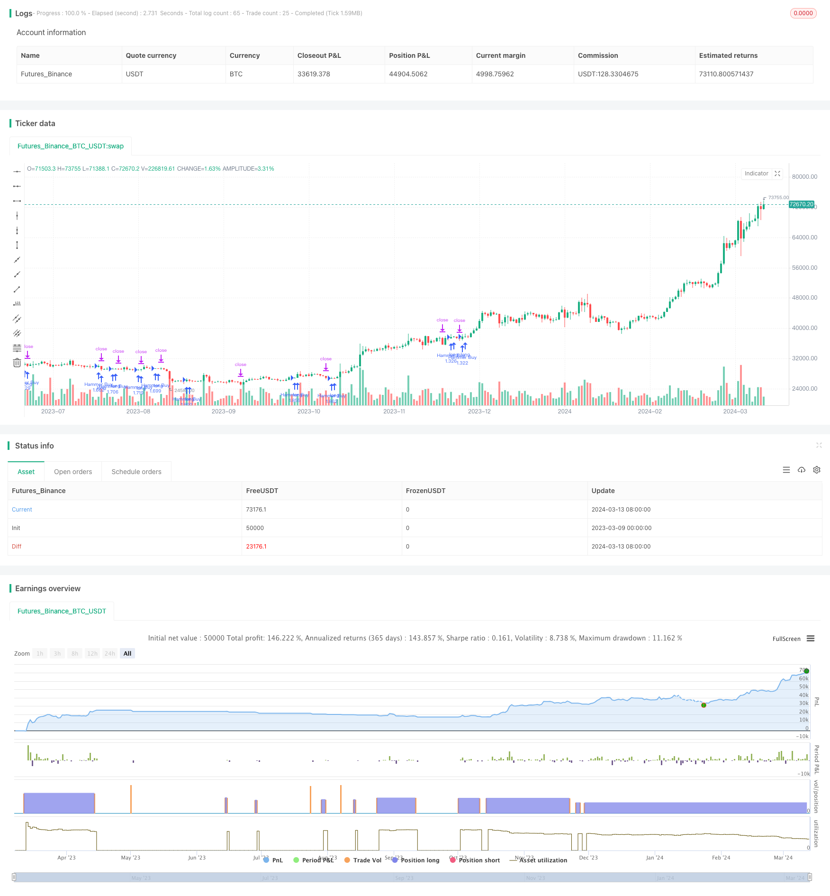

> Name

Intraday-Hammer-Reversal-Pattern-Long-Strategy
> Author

ChaoZhang

> Strategy Description


[trans]
## Overview
This strategy uses a combination of an intraday hammer reversal pattern and a subsequent green candle to look for potential upside opportunities. When a hammer reversal pattern appears and the next candle is a green up candle, the strategy opens a long position. The stop loss position is set at the low point of the hammer candle, and the take profit position is set at 1.5 times the opening price.
## Strategy Principle
The hammer pattern is a common technical pattern that often appears at the end of a downward trend, indicating the arrival of a trend reversal. A typical hammer pattern has the following characteristics:
1. The overall candle body is small, usually less than 30% of the entire candle's high and low range.
2. The lower shadow is longer, at least twice the length of the candle body.
3. The upper shadow line is very short or does not exist, and does not exceed 1% of the opening price of the candle at most.
When the hammer pattern is confirmed, if the next candle is a green up candle and the low is higher than the low of the hammer candle, it will form a bullish signal and enter the market at this time. Stop loss is set at the low of the hammer candle to control risk; take profit is set at 1.5 times the opening price to obtain potential profits.
## Advantage Analysis
1. The hammer pattern is a common reversal pattern. When used in conjunction with the trend background, the winning rate is higher.
2. Strictly limit hammer patterns and subsequent bullish candle patterns to improve signal quality.
3. The stop loss position is set at the low point of the hammer candle, and the risk is controllable.
4. The take-profit position is set to 1.5R, which has a good profit-loss ratio.
## Risk Analysis
1. Even if the form and subsequent trend meet the strategic conditions, there is still a risk that the market will repeat or even continue to decline. 
2. The stop loss position is close to the low point of the hammer candle. Once the stop loss is triggered, the single loss will be relatively large.
3. There are large fluctuations in the initial stage of trend turning, and the strategy faces higher risk of price fluctuations.
## Optimization direction
1. You can consider introducing more technical indicators, such as RSI, MACD, etc., and combine the indicator status to improve the effectiveness of the signal.
2. The pattern definition of the hammer pattern and subsequent bullish candles can be further optimized, such as introducing more quantitative standards.
3. The stop-profit and stop-loss position settings can be further optimized, such as using dynamic take-profit or trailing stop-loss strategies.
4. Considering the market trend status, looking for the hammer pattern in the upward trend may have a higher winning rate.
## Summary
The intraday hammer reversal pattern long strategy makes full use of the characteristics of the hammer pattern reversal, combined with the confirmation of subsequent green candles, to form a bullish signal based on two consecutive K-line patterns. At the same time, the strategy adopts fixed take-profit and stop-loss ratios to control the level of risk exposure and maintain the profit-loss ratio at a high level. However, this strategy has a relatively simple definition of form and lacks verification of other technical indicators, so it may face a high signal failure rate in practical applications. In addition, since the stop loss position is set relatively close, the strategy also faces the problem of high single loss. In the future, the strategy can be further optimized and improved from aspects such as signal confirmation and risk control to improve overall stability and profitability.
|| 

## Overview
This strategy uses the intraday hammer reversal pattern in combination with a subsequent green candle to find potential upside opportunities. When a hammer reversal pattern appears and the next candle is a green upward candle, the strategy opens a long position. The stop loss is set at the low of the hammer candle, and the take profit is set at 1.5 times the entry price.

## Strategy Principles 
The hammer pattern is a common technical pattern that often appears at the end of a downtrend, signaling the arrival of a trend reversal. A typical hammer pattern has the following characteristics:
1. The overall candle body is relatively small, usually less than 30% of the entire candle's high-low range.
2. The lower shadow is long, at least twice the length of the candle body.
3. The upper shadow is very short or nonexistent, at most not exceeding 1% of the candle's opening price.

When the hammer pattern is confirmed, if the next candle is a green upward candle and the low is higher than the low of the hammer candle, a bullish signal is formed and a long position is entered. The stop loss is set at the low of the hammer candle to control risk, and the take profit is set at 1.5 times the entry price to capture potential profits.

## Advantage Analysis
1. The hammer pattern is a common reversal pattern and has a high win rate when used in combination with trend context.
2. Strict restrictions on the hammer pattern and subsequent bullish candle shape improve signal quality.
3. Setting the stop loss at the low of the hammer candle makes risk controllable.
4. Setting the take profit at 1.5R provides a decent risk-reward ratio.

## Risk Analysis  
1. Even if the pattern and subsequent price action satisfy the strategy conditions, there is still a risk of the market repeating or continuing to fall.
2. With the stop loss set close to the low of the hammer candle, a single loss is relatively large once triggered.  
3. Volatility is high in the early stages of a trend reversal, exposing the strategy to high price volatility risk.

## Optimization Directions
1. Consider introducing more technical indicators, such as RSI and MACD, to improve signal validity in combination with indicator status.
2. The definitions of the hammer pattern and subsequent bullish candle can be further optimized, such as introducing more quantitative criteria.
3. Take profit and stop loss settings can be further optimized, such as using dynamic take profit or trailing stop strategies.  
4. Consider market trend conditions, as hammer patterns found in uptrends may have higher win rates.

## Summary
The intraday hammer reversal pattern long strategy makes full use of the reversal characteristics of the hammer pattern, combined with confirmation from a subsequent green candle, to form a bullish signal based on two consecutive candle patterns. At the same time, the strategy uses a fixed risk-reward ratio to control risk exposure and maintain a high risk-reward ratio. However, the strategy's definition of patterns is relatively simple and lacks verification from other technical indicators, which may face a high signal failure rate in practical applications. In addition, because the stop loss is set relatively close, the strategy also faces the problem of high single losses. In the future, the strategy can be further optimized and improved in terms of signal confirmation and risk control to enhance overall stability and profitability.
[/trans]


> Source (PineScript)

``` pinescript
/*backtest
start: 2023-03-09 00:00:00
end: 2024-03-14 00:00:00
period: 1d
basePeriod: 1h
exchanges: [{"eid":"Futures_Binance","currency":"BTC_USDT"}]
*/

//@version=5
strategy("Hammer Pattern and Follow-Up Green Candle Strategy", overlay=true)

// Detecting a Hammer candle
isHammer() =>
    bodySize = math.abs(close[1] - open[1])
    lowerWickSize = open[1] - low[1]
    upperWickSize = high[1] - open[1] // For a red candle, the upper wick is from the open to the high
    bodyIsSmall = bodySize <= (high[1] - low[1]) * 0.3 // Body is less than 30% of the entire candle range
    lowerWickIsLong = lowerWickSize >= bodySize * 2 // Lower wick is at least twice the body length
    noUpperWick = upperWickSize == 0 or high[1] <= open[1] * 1.01 // No upper wick or very small
    close[1] < open[1] and bodyIsSmall and lowerWickIsLong and noUpperWick

// Check if the current candle is green with no or small tail
isGreenWithNoSmallTail() =>
    close > open

// Entry condition
entryCondition = isHammer() and isGreenWithNoSmallTail() and low >low[1]

// Calculate stop loss and take profit levels
stopLossLevel = low[1]
profitTargetLevel = close * 1.5
//Calculate position bodySize
positionSize = 50000 / close

// Execute strategy
if (entryCondition)
    strategy.entry("Hammer Buy", strategy.long,qty=positionSize)
    strategy.exit("Take Profit / Stop Loss", "Hammer Buy", stop=stopLossLevel, limit=profitTargetLevel)


```

> Detail

https://www.fmz.com/strategy/444985

> Last Modified

2024-03-15 17:13:23
