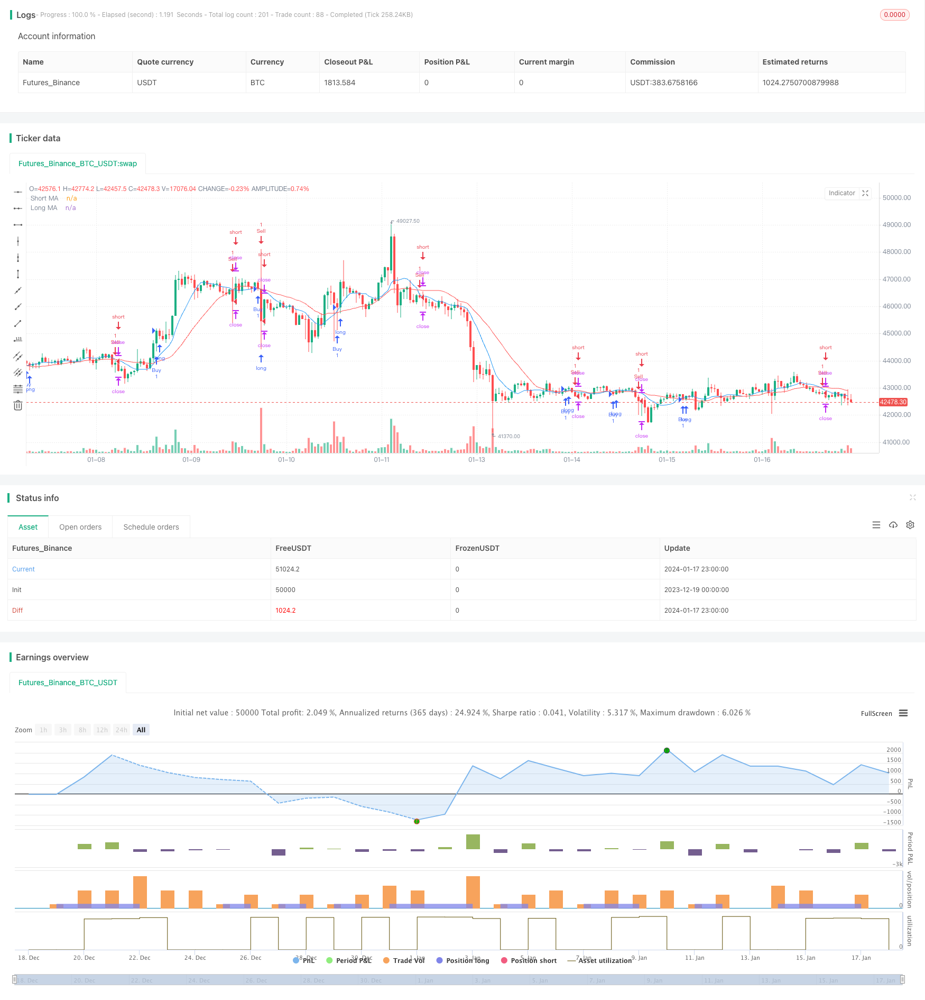

> Name

High-frequency quantitative trading strategy based on moving average crossover Intraday-Moving-Average-Crossover-Trading-Strategy
> Author

ChaoZhang

> Strategy Description


 [trans]

## Overview
This strategy is based on the golden cross of the Moving Average (MA) to identify the turning point of the market trend to capture the short-term rise and fall of stock prices. The strategy will calculate two MAs with different periods, namely a shorter period MA and a longer period MA. When the short-period MA crosses above the long-period MA, a buy signal is generated; when the short-period MA crosses below the long-period MA, a sell signal is generated.
## Strategy Principle
The core judgment logic of this strategy lies in the intersection relationship between short-period MA and long-period MA. The short-period MA can more quickly reflect price changes in the recent period, while the long-period MA has better denoising capabilities and can reflect long-term price trends. When the short MA crosses the long MA, it means that the price has begun to rise recently, which may be a signal of short-term stock price reversal, thus generating a buy signal to capture the subsequent rise. On the contrary, when the short MA crosses below the long MA, it indicates that the price has begun to fall recently, which may be a signal of short-term stock price reversal, thus generating a sell signal.
Specifically, this strategy will apply the ta.sma function to the close price to calculate two MA lines: maShort (9 periods) and maLong (21 periods). Then use the ta.crossover and ta.crossunder functions to determine the cross relationship between the short MA and the long MA to generate buy and sell signals. Finally, set stop-loss and take-profit logic to lock in profits and control risks.
## Strategic Advantages
- Using the MA crossover principle, you can effectively identify the turning point of the short-term trend
- Consider both recent and long-term price changes to improve signal quality
- Intuitively reflects the moving direction and momentum of stock prices
- Simple to understand, easy to implement, suitable for high-frequency short-term trading
- MA parameters can be flexibly adjusted to adapt to different trading varieties
Compared with a single MA system, this strategy comprehensively considers the value of short-period MA and long-period MA, which can reduce false signals and increase the probability of profit. At the same time, the MA cross signal is clear and easy to read, and the operating rules are direct and effective, making it very suitable for traders who are familiar with technical analysis.
## Strategy Risk
- The MA cross signal may lag behind and miss the best time for reversal
- Strictly following MA crossovers may result in too many trades
- Improper MA period setting will affect signal quality
- Individual stock characteristics will also affect the effect of the MA crossover system
If you only follow MA cross signals mechanically, you will be unable to judge market trends and individual stock characteristics, and may face problems such as low profitability or increased transaction costs due to high-frequency trading. In addition, the MA crossover signal itself may lag behind the true trend turning point, thereby missing the best reversal opportunity.
## Strategy optimization direction
- Optimize the combination of short and long period parameters of MA
- Combine with other analytical tools to identify long- and short-term stock trends
- Consider the characteristics of individual stocks and adjust strategy parameters
- Combined with volume and energy indicators to identify true reversal signals
- Use stop-loss methods to reasonably control single losses
For example, you can use other technical indicators such as MACD, KDJ, etc. to verify the MA cross signal to avoid misjudgments. MA parameters can also be adjusted for different trading varieties to improve the stability of the strategy. At the same time, adjust the stop loss level appropriately to prevent excessive single loss. The comprehensive use of various optimization methods can greatly improve the actual performance of short-term trading strategies based on MA crossover.
## Summarize
This strategy designs a simple and direct short-term trading strategy based on the MA crossover principle. It combines the advantages of short-period MA and long-period MA, taking into account both recent price movements and long-term trend judgment, thereby generating high-quality trading signals. This strategy is suitable for active traders who are accustomed to using technical analysis tools. It can be optimized by adjusting MA parameters and other methods to obtain generous excess returns.
||

## Overview

This strategy utilizes the golden cross and death cross of Moving Averages (MA) to identify turning points in market trends and capitalize on short-term price fluctuations of stocks. It calculates two MAs with different time periods, namely a shorter-period MA and a longer-period MA. When the shorter-period MA crosses above the longer-period MA, a buy signal is generated. When the shorter-period MA crosses below the longer-period MA, a sell signal is generated.  

## Strategy Logic

The core logic of this strategy lies in the crossover relationships between the shorter-period MA and longer-period MA. The shorter-period MA reflects recent price changes more swiftly, while the longer-period MA has better noise reduction capabilities to depict long-term price trends. When the shorter MA crosses above the longer MA, it indicates prices have started trending higher recently and may signal a short-term reversal, hence triggering a buy signal to capture subsequent upside. Conversely, when the shorter MA crosses below the longer MA, it signals recent downward price momentum and potential for a short-term reversal, thus generating a sell signal.

Specifically, this strategy applies the ta.sma function on the close prices to compute two MA lines: maShort (9 periods) and maLong (21 periods). It then uses the ta.crossover and ta.crossunder functions to determine if the shorter MA has crossed above or below the longer MA, in order to produce buy and sell signals accordingly. Stop loss and take profit logic is implemented at the end to lock in profits and manage risks.  

## Advantages

- Effectively identifies short-term trend reversal points using MA crossover concept 
- Considers both recent and long-term price changes to improve signal quality
- Intuitively depicts price direction and momentum  
- Simple to understand and implement, suitable for high-frequency short-term trading
- Flexible MA parameters catered to different trading instruments

Compared to single MA systems, this strategy synthesizes the value of both shorter-period and longer-period MAs, resulting in fewer false signals and higher probability of profitability. Meanwhile, MA crossover signals are clear and straightforward for operators to interpret and act upon efficiently.  

## Risks

- MA crossover signals may lag, thus missing optimal reversal timing
- Strictly following MA crosses may result in excessive trading frequency  
- Poor MA period settings negatively impact signal quality
- Individual stock characteristics also affect MA crossover system efficacy  

Mechanically chasing MA crossover signals without judging market conditions and stock traits may lead to low profitability or high transaction costs from overtrading. Additionally, MA signals themselves may lag behind actual trend turning points.  

## Enhancement Opportunities

- Optimize combination of short and long MA periods   
- Incorporate other analytical tools to identify short-term and long-term trends
- Consider individual stock traits and adjust strategy parameters accordingly  
- Integrate price volume indicators to spot authentic reversal signals 
- Employ stop loss methods to rationally limit losses

For instance, other technical indicators like MACD, KDJ may be used to validate MA crossover signals and prevent misfires. MA parameters can also be tuned based on different trading instruments to enhance stability. Meanwhile, stop loss levels should be set appropriately to avoid oversized losses on individual trades. Comprehensively applying all such optimization techniques can substantially improve actual strategy performance building upon the simple MA crossover concept.

## Conclusion  

This strategy designs a straightforward short-term trading approach based on the MA crossover principle. By harmonizing the strengths of shorter-period MAs and longer-period MAs, it considers both recent price developments and long-term trends to produce high-quality trading signals. It suits active traders well-versed in using technical analysis tools. Further optimizations around aspects like MA periods can lead to strong excess returns.  
[/trans]

> Strategy Arguments


|Argument|Default|Description|
|----|----|----|
|v_input_int_1|9|Short MA Length|
|v_input_int_2|21|Long MA Length|
|v_input_float_1|true|Stop Loss %|
|v_input_float_2|true|Take Profit %|


> Source (PineScript)

``` pinescript
/*backtest
start: 2023-12-19 00:00:00
end: 2024-01-18 00:00:00
period: 1h
basePeriod: 15m
exchanges: [{"eid":"Futures_Binance","currency":"BTC_USDT"}]
*/

//@version=5
strategy("Intraday MA Crossover Strategy", overlay=true)

// Define MA lengths
maLengthShort = input.int(9, title="Short MA Length", minval=1)
maLengthLong = input.int(21, title="Long MA Length", minval=1)

// Calculate MAs
maShort = ta.sma(close, maLengthShort)
maLong = ta.sma(close, maLengthLong)

// Plot MAs on the chart
plot(maShort, color=color.blue, title="Short MA")
plot(maLong, color=color.red, title="Long MA")

// Generate Buy Signal (Golden Cross: Short MA crosses above Long MA)
buySignal = ta.crossover(maShort, maLong)
strategy.entry("Buy", strategy.long, when=buySignal)

// Generate Sell Signal (Death Cross: Short MA crosses below Long MA)
sellSignal = ta.crossunder(maShort, maLong)
strategy.entry("Sell", strategy.short, when=sellSignal)

// Set stop loss and take profit levels
stopLossPercent = input.float(1, title="Stop Loss %", minval=0.1, maxval=5)
takeProfitPercent = input.float(1, title="Take Profit %", minval=0.1, maxval=5)

strategy.exit("Take Profit/Stop Loss", from_entry="Buy", loss=close * stopLossPercent / 100, profit=close * takeProfitPercent / 100)
strategy.exit("Take Profit/Stop Loss", from_entry="Sell", loss=close * stopLossPercent / 100, profit=close * takeProfitPercent / 100)

```

> Detail

https://www.fmz.com/strategy/439364

> Last Modified

2024-01-19 15:32:58
