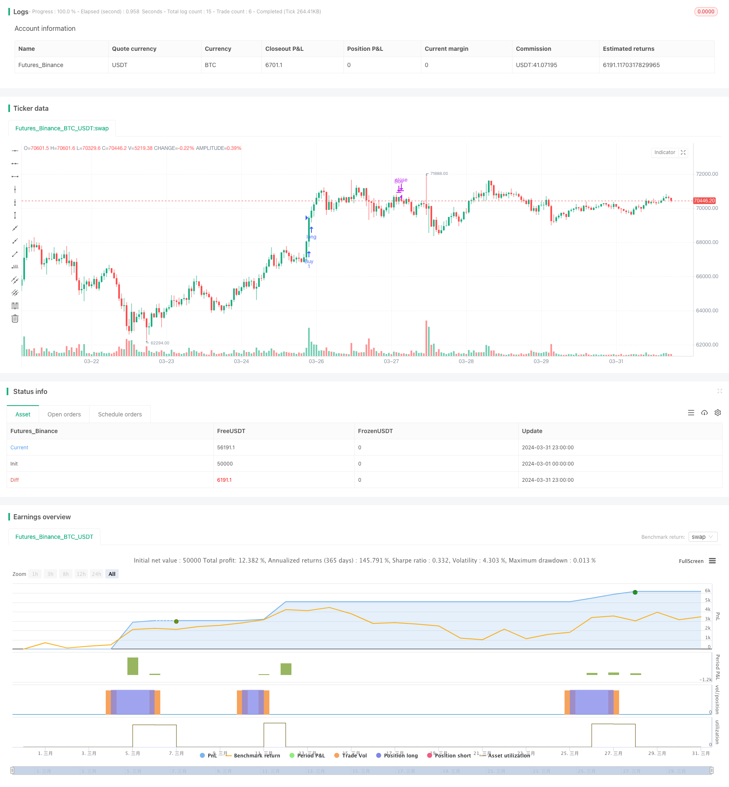

> Name

Intraday-Scalable-Volatility-Trading-Strategy
> Author

ChaoZhang

> Strategy Description



[trans]
#### Overview
This strategy is a scalable volatility trading strategy based on day trading. It finds potential long and short trading opportunities by combining multiple technical indicators and market conditions, including volatility, volume, price ranges, technical indicators, and new catalysts. This strategy uses the ATR indicator to measure market volatility and determines whether to place a trade based on the level of volatility. At the same time, the strategy also takes into account factors such as volume, price range, technical indicators and new catalysts to improve the reliability of trading signals.
#### Strategy Principle
The core principle of this strategy is to use multiple factors such as market volatility, trading volume, price range, technical indicators and new catalysts to comprehensively judge market trends and potential trading opportunities. Specifically, this strategy uses the following steps to generate trading signals:
1. Calculate the ATR indicator, which is used to measure market volatility. When the current ATR value is greater than 1.2 times the previous ATR value, it indicates that the market is in a state of high volatility.
2. Determine whether the current trading volume is greater than the 50-period trading volume simple moving average. This condition is used to ensure that transactions are carried out when the trading volume is large to improve the reliability of the transaction.
3. Calculate the price range (highest price - lowest price) of the current trading day and determine whether it is greater than 0.005. This condition is used to ensure that trades are made during large price fluctuations for greater potential profits.
4. Use two simple moving averages (5-day and 20-day) to determine market trends. When the 5-day moving average is above the 20-day moving average, it indicates that the market is in a bullish trend; otherwise, it indicates that the market is in a bearish trend.
5. Determine whether there is a new catalyst, that is, whether the current closing price is higher than the opening price. This condition is used to ensure that transactions are conducted when new favorable factors appear to increase the success rate of transactions.
6. When all the above conditions are met, the corresponding trading signal (buy or sell) is generated according to the market trend (long or short).
7. For long trades, when the fast moving average crosses the slow moving average, close the position and exit; for short trades, when the fast moving average crosses the slow moving average, close the position and exit.
#### Strategic Advantages
1. Multi-factor comprehensive judgment: This strategy comprehensively considers multiple factors such as market volatility, trading volume, price range, technical indicators and new catalysts. It can comprehensively evaluate market conditions and potential trading opportunities and improve the reliability of trading signals.
2. Strong adaptability: By using the ATR indicator to measure market volatility, this strategy can adapt to different market environments. When volatility is high, this strategy automatically adjusts trading conditions to respond to market changes.
3. Risk control: This strategy sets clear entry and exit conditions to help control trading risks. At the same time, by considering factors such as trading volume and price range, this strategy can avoid trading when the market is illiquid or volatile, further reducing risks.
4. Trend tracking: By using simple moving averages to determine market trends, this strategy can track the main direction of the market and adjust trading strategies in a timely manner according to changes in trends to improve trading accuracy.
5. Automated trading: This strategy can realize automated trading, reduce human intervention and emotional influence, and improve trading efficiency and consistency.
#### Strategy Risk
1. Parameter optimization risk: This strategy involves multiple parameters, such as ATR period, volatility factor, trading volume simple moving average period, etc. The selection of these parameters has an important impact on strategy performance. Improper parameter settings may lead to strategy failure or poor performance. Therefore, parameters need to be optimized and tested to find the best parameter combination.
2. Risk of over-fitting: This strategy uses multiple conditions to generate trading signals, and there may be a risk of over-fitting. Overfitting will cause the strategy to perform well on historical data, but perform poorly in actual trading. In order to reduce the risk of overfitting, out-of-sample data can be used for testing and the robustness of the strategy can be checked.
3. Market risk: This strategy is mainly suitable for market environments with obvious trends and high volatility. When the market trend is not obvious or volatility is low, the performance of this strategy may be affected. In addition, the strategy is also affected by external factors such as black swan events and policy changes, which may cause the strategy to fail.
4. Transaction cost risk: This strategy is an intraday trading strategy with high transaction frequency, which may result in higher transaction costs, such as slippage, handling fees, etc. These costs can erode the strategy's profits and reduce its overall performance. Therefore, in practical applications, it is necessary to consider the impact of transaction costs and optimize the strategy accordingly.
5. Liquidity risk: The trading signals of this strategy depend on multiple conditions, such as trading volume, price range, etc. In the case of insufficient market liquidity, these conditions may not be met, resulting in the strategy being unable to generate effective trading signals. Therefore, when applying this strategy, you need to choose markets and trading targets with better liquidity.
#### Optimization direction
1. Dynamically adjust parameters: Consider using adaptive algorithms or machine learning methods to automatically adjust strategy parameters according to changes in market conditions to adapt to different market environments and improve the robustness and adaptability of the strategy.
2. Introduce risk management measures: Introduce risk management measures into the strategy, such as stop loss, position management, etc., to control potential losses. At the same time, you can consider using volatility adjustment position management methods to dynamically adjust the position size according to the level of market volatility to control risks.
3. Optimize trading signals: You can consider introducing other technical indicators or market factors, such as relative strength index (RSI), market sentiment indicators, etc., to optimize the generation of trading signals. In addition, machine learning algorithms, such as support vector machines (SVM), random forests, etc., can also be used to train and optimize trading signals.
4. Improve the take-profit and stop-loss strategy: Currently, this strategy uses simple moving average crossovers to determine exit conditions. You can consider introducing more complex take-profit and stop-loss strategies, such as trailing stop-loss, volatility stop-loss, etc., to better protect profits and control risks.
5. Add market microstructure analysis: Consider incorporating market microstructure analysis into your strategy, such as analyzing order flow, buying and selling depth, etc., to obtain more market information and improve the accuracy of trading decisions.
6. Combine fundamental analysis: Combine fundamental analysis with technical analysis, and consider macroeconomic indicators, industry trends, company financial data and other factors to obtain more comprehensive market information and improve the reliability and robustness of the strategy.
#### Summarize
This strategy is an intraday scalable volatility trading strategy based on multi-factor analysis that generates long and short trading signals by comprehensively considering factors such as market volatility, trading volume, price range, technical indicators and new catalysts. The advantages of this strategy include strong adaptability, clear risk control measures, and strong trend tracking capabilities. At the same time, there are risks such as parameter optimization, over-fitting, market risk, transaction costs, and liquidity. In order to further improve the performance and robustness of the strategy, optimization measures such as dynamic parameter adjustment, risk management measures, trading signal optimization, improved stop-profit and stop-loss strategies, market microstructure analysis and fundamental analysis can be considered. Overall, this strategy provides a feasible framework for intraday trading, but it requires further optimization and testing in practical applications.
|| 

#### Overview

This strategy is an intraday scalable volatility trading strategy based on day trading. It combines multiple technical indicators and market conditions, including volatility, volume, price range, technical indicators, and new catalysts, to identify potential long and short trading opportunities. The strategy uses the ATR indicator to measure market volatility and determines whether to trade based on the level of volatility. At the same time, the strategy also considers factors such as trading volume, price range, technical indicators, and new catalysts to improve the reliability of trading signals.

#### Strategy Principle

The core principle of this strategy is to use multiple factors such as market volatility, trading volume, price range, technical indicators, and new catalysts to comprehensively judge market trends and potential trading opportunities. Specifically, the strategy uses the following steps to generate trading signals:

1. Calculate the ATR indicator to measure market volatility. When the current ATR value is greater than 1.2 times the previous ATR value, it indicates that the market is in a high volatility state.

2. Determine whether the current trading volume is greater than the simple moving average of the trading volume over 50 periods. This condition is used to ensure that trading is carried out when the trading volume is relatively large, to improve the reliability of trading.

3. Calculate the price range (highest price - lowest price) of the current trading day and determine whether it is greater than 0.005. This condition is used to ensure that trading is carried out when the price fluctuation is relatively large, to obtain more potential profits.

4. Use two simple moving averages (5-day and 20-day) to judge the market trend. When the 5-day average is above the 20-day average, it indicates that the market is in a bullish trend; otherwise, it indicates that the market is in a bearish trend.

5. Determine whether a new catalyst has appeared, that is, whether the current closing price is higher than the opening price. This condition is used to ensure that trading is carried out when there are new favorable factors, to increase the success rate of trading.

6. When all of the above conditions are met, generate corresponding trading signals (buy or sell) according to the market trend (bullish or bearish).

7. For long trades, when the fast moving average crosses below the slow moving average, close the position and exit; for short trades, when the fast moving average crosses above the slow moving average, close the position and exit.

#### Strategy Advantages

1. Comprehensive multi-factor judgment: The strategy comprehensively considers multiple factors such as market volatility, trading volume, price range, technical indicators, and new catalysts, which can comprehensively evaluate market conditions and potential trading opportunities, and improve the reliability of trading signals.

2. Strong adaptability: By using the ATR indicator to measure market volatility, the strategy can adapt to different market environments. When volatility is high, the strategy automatically adjusts trading conditions to cope with market changes.

3. Risk control: The strategy sets clear entry and exit conditions, which helps to control trading risks. At the same time, by considering factors such as trading volume and price range, the strategy can avoid trading when market liquidity is insufficient or volatility is too small, further reducing risks.

4. Trend tracking: By using simple moving averages to judge market trends, the strategy can track the main direction of the market and adjust trading strategies in a timely manner according to changes in trends, improving the accuracy of trading.

5. Automated trading: The strategy can achieve automated trading, reducing human intervention and emotional impact, and improving trading efficiency and consistency.

#### Strategy Risks

1. Parameter optimization risk: The strategy involves multiple parameters, such as the ATR period, volatility factor, simple moving average period of trading volume, etc. The selection of these parameters has an important impact on strategy performance, and improper parameter settings may lead to strategy failure or poor performance. Therefore, it is necessary to optimize and test the parameters to find the best parameter combination.

2. Overfitting risk: The strategy uses multiple conditions to generate trading signals, which may have the risk of overfitting. Overfitting may cause the strategy to perform well on historical data but perform poorly in actual trading. To reduce the risk of overfitting, out-of-sample data can be used for testing and robustness testing of the strategy.

3. Market risk: The strategy is mainly applicable to market environments with obvious trends and high volatility. When market trends are not obvious or volatility is low, the performance of the strategy may be affected. In addition, the strategy is also affected by external factors such as black swan events and policy changes, which may cause the strategy to fail.

4. Transaction cost risk: The strategy is an intraday trading strategy with a high trading frequency, which may generate high transaction costs, such as slippage and commission. These costs will erode the profits of the strategy and reduce the overall performance of the strategy. Therefore, in practical applications, it is necessary to consider the impact of transaction costs and optimize the strategy accordingly.

5. Liquidity risk: The trading signals of the strategy depend on multiple conditions, such as trading volume, price range, etc. In the case of insufficient market liquidity, these conditions may not be met, resulting in the strategy not being able to generate effective trading signals. Therefore, when applying the strategy, it is necessary to select markets and trading targets with good liquidity.

#### Optimization Direction

1. Dynamic parameter adjustment: Consider using adaptive algorithms or machine learning methods to automatically adjust strategy parameters according to changes in market conditions, to adapt to different market environments and improve the robustness and adaptability of the strategy.

2. Introduce risk management measures: Introduce risk management measures in the strategy, such as stop loss and position management, to control potential losses. At the same time, consider using volatility-adjusted position management methods to dynamically adjust position size according to the level of market volatility to control risk.

3. Optimize trading signals: Consider introducing other technical indicators or market factors, such as the Relative Strength Index (RSI), market sentiment indicators, etc., to optimize the generation of trading signals. In addition, machine learning algorithms such as support vector machines (SVM) and random forests can be used to train and optimize trading signals.

4. Improve stop-profit and stop-loss strategies: At present, the strategy uses simple moving average crossover to determine exit conditions. More complex stop-profit and stop-loss strategies, such as trailing stop loss and volatility stop loss, can be considered to better protect profits and control risks.

5. Incorporate market microstructure analysis: Consider incorporating market microstructure analysis into the strategy, such as analyzing order flow, order book depth, etc., to obtain more market information and improve the accuracy of trading decisions.

6. Combine fundamental analysis: Combine fundamental analysis with technical analysis, considering factors such as macroeconomic indicators, industry trends, company financial data, etc., to obtain more comprehensive market information and improve the reliability and robustness of the strategy.

#### Summary

This strategy is an intraday scalable volatility trading strategy based on multi-factor analysis, which generates long and short trading signals by comprehensively considering factors such as market volatility, trading volume, price range, technical indicators, and new catalysts. The advantages of the strategy are strong adaptability, clear risk control measures, and strong trend tracking ability. At the same time, there are


> Source (PineScript)

``` pinescript
/*backtest
start: 2024-03-01 00:00:00
end: 2024-03-31 23:59:59
period: 1h
basePeriod: 15m
exchanges: [{"eid":"Futures_Binance","currency":"BTC_USDT"}]
*/

//@version=4
strategy("Intraday Scalping Strategy with Exit Conditions", shorttitle="ISS", overlay=true)

// Define Volatility based on ATR for intraday
atrPeriod = 10
atrValue = atr(atrPeriod)
volatilityFactor = 1.2
highVolatility = atrValue > volatilityFactor * atrValue[1]

// Define Volume conditions for intraday
volumeCondition = volume > sma(volume, 50)

// Define Price Range for intraday
range = high - low

// Define Technical Indicator (SMA example) for intraday
smaFast = sma(close, 5)
smaSlow = sma(close, 20)
isBullish = smaFast > smaSlow

// Define New Catalyst condition for intraday (example)
newCatalyst = close > open

// Combine all conditions for entry in intraday
enterLong = highVolatility and volumeCondition and range > 0.005 and isBullish and newCatalyst
enterShort = highVolatility and volumeCondition and range > 0.005 and not isBullish and newCatalyst

// Submit entry orders based on conditions
strategy.entry("Buy", strategy.long, when=enterLong)
strategy.entry("Sell", strategy.short, when=enterShort)

// Define exit conditions
exitLong = crossover(smaFast, smaSlow) // Example exit condition for long position
exitShort = crossunder(smaFast, smaSlow) // Example exit condition for short position

// Submit exit orders based on conditions
strategy.close("Buy", when=exitLong)
strategy.close("Sell", when=exitShort)
```

> Detail

https://www.fmz.com/strategy/449523

> Last Modified

2024-04-26 15:46:42
