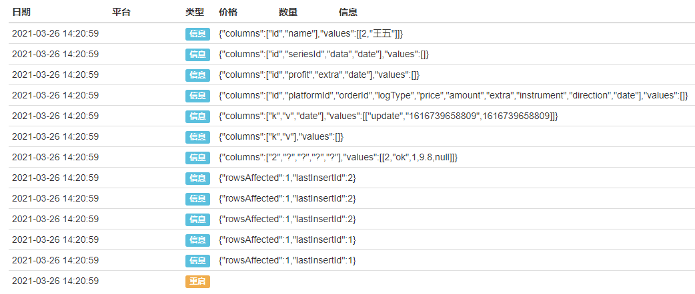
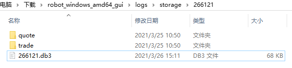
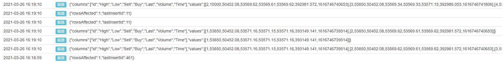
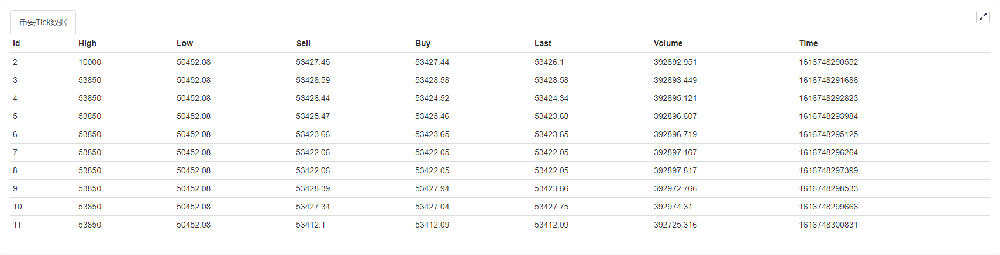

> Name

Inventor’s Quantitative Database Practice
> Author

Inventor Quantification-Little Dream
> Strategy Description

#### 1. Summary
Data is the source of quantitative trading. How to efficiently manage large amounts of data is a very critical link. Database is one of the best solutions. Nowadays, the application of database has become the quantitative standard configuration of various types of intraday trading, high-frequency trading and other strategies. In this article, we will study the built-in database of Inventor Quantification (FMZ.COM), including: how to create data tables, store data, modify data, delete data, quote data, and how to apply it in actual combat.
#### 2. How to choose a database
Those who are familiar with the Inventor Quantification Platform should know that before this, if you wanted to save data to local reuse, you could only use the _G() function. Each time you stop the strategy, the _G() function will automatically save the required information. But if you want to save more and more complex formatted data, the _G() function is obviously not suitable, so many people think of building their own database to solve this problem.
When it comes to self-built databases, everyone can probably think of Oracle, MySQL, KDB, OneTick, NoSQL... These are all excellent enterprise-level applications, both in terms of functionality and performance. However, it also faces several problems: it is difficult to get started, the configuration is cumbersome and maintenance is cumbersome. For quantitative trading retail investors, it feels like using a cannon to kill flies. Even if you get started, only a few functions are used.
#### 3. The inventor quantifies the built-in database
Next, let us get to know the lightweight database built into Inventor Quantitative. DBExec is a relational data management system interface built into Inventor Quantitative. It is developed based on SQLite and is written in C. It is not only small in size, low in resources, but also fast in processing speed. It is very suitable for financial quantitative analysis enthusiasts to implement local data management, because different "objects" (such as exchanges, data sources, prices) can be divided into different tables, and relationships are defined between tables. In addition, users do not need to install and configure it separately, they can use it directly by calling the DBExec() function!
In addition, the learning cost of SQLite language is very low, and most of the work performed on the database is completed by SQLite statements. Being familiar with the basic syntax can meet most needs. The following is the basic syntax of SQLite.
#### 4. Basic Grammar
SQLite's syntax is not case-sensitive, but some commands are case-sensitive, such as GLOB and glob, which have different meanings. SQLite statements can start with any keyword, such as SELECT, INSERT, UPDATE, DELETE, ALTER, DROP, etc., which respectively represent: extract data, insert data, update data, delete data, modify database, delete data table. All statements end with an English semicolon. The following is a simple database creation, addition, deletion, modification, query and other operations:
```
function main() {
    // 创建：如果“users”表不存在就创建一个，“id”是整数且自动增加，“name”是文本形式且不为空
    Log(DBExec('CREATE TABLE IF NOT EXISTS "users" (id INTEGER PRIMARY KEY AUTOINCREMENT, name text not NULL);'));
    
    // 增加：
    Log(DBExec("INSERT INTO users(name) values('张三')"));
    Log(DBExec("INSERT INTO users(name) values('李四')"));
    
    // 删除：
    Log(DBExec("DELETE FROM users WHERE id=1;"));
    
    // 修改
    Log(DBExec("UPDATE users SET name='王五' WHERE id=2"));
    
    // 查询
    Log(DBExec('select 2, ?, ?, ?, ?', 'ok', true,9.8,null));
    Log(DBExec('select * from kvdb'));
    Log(DBExec('select * from cfg'));
    Log(DBExec('select * from log'));
    Log(DBExec('select * from profit'));
    Log(DBExec('select * from chart'));
    Log(DBExec("selEct * from users"));
}
```
A database usually contains one or more tables, each table is identified by a name. It should be noted that the system reserved tables are: kvdb, cfg, log, profit, chart. In other words, when creating a table, you should avoid names reserved by the system. Let's run the above code and it will output the following:
 
#### 5. Strategy Examples
After understanding the basic syntax of SQLite, we strike while the iron is hot and use the inventor's built-in database to create an example of collecting and using Tick data.
**Step One: Update Host**
First, make sure you are using the latest version of the host. If you have downloaded and used the host before, you need to delete it first and re-download and deploy it on the https://www.fmz.cn/m/add-node page.
**Step 2: Create a Strategy**
```
function main() {
    // 订阅合约
    _C(exchange.SetContractType, 'swap');
    
    // 创建数据表
    DBExec('CREATE TABLE IF NOT EXISTS "tick" (id INTEGER PRIMARY KEY AUTOINCREMENT,'.concat(
        'High FLOAT not NULL,', 
        'Low FLOAT not NULL,', 
        'Sell FLOAT not NULL,', 
        'Buy FLOAT not NULL,', 
        'Last FLOAT not NULL,', 
        'Volume INTEGER not NULL,', 
        'Time INTEGER not NULL);'
    ));
    
    // 获取10个tick数据
    while (true) {
        let tick = exchange.GetTicker();
        // 在tick表中增加数据
        DBExec(`INSERT INTO tick(High, Low, Sell, Buy, Last, Volume, Time) values(${tick.High}, ${tick.Low}, ${tick.Sell}, ${tick.Buy}, ${tick.Last}, ${tick.Volume}, ${tick.Time})`);
        // 查询所有数据
        let allDate = DBExec('select * from tick');
        if (allDate.values.length > 10) {
            break;
        }
        Sleep(1000);
    }
    
    // 查询所有数据
    Log(DBExec('select * from tick'));
    
    // 查询第一个数据
    Log(DBExec('select * from tick limit 1'));
    
    // 查询前两个数据
    Log(DBExec('select * from tick limit 0,2'));
    
    // 删除第一个数据
    Log(DBExec('DELETE FROM tick WHERE id=1;'));
    
    // 修改第二个数据
    Log(DBExec('UPDATE tick SET High=10000 WHERE id=2'));
    
    // 查询所有数据
    let allDate = DBExec('select * from tick')
    Log(allDate);
}
```

**Step Three: Run the Strategy**
Taking Windows as an example, after running the policy, a folder named after the robot number will be generated in the "\logs\storage" directory of the host directory. When you open the folder, there is a file with ".db3" as the suffix. This file is the file of the inventor's built-in database. As shown in the following figure:
 
The above code first creates a data table named "tick", then adds the tick data field to the table, then obtains the tick data from the exchange in the loop, and inserts the data into the "tick" data table. At the same time, it judges that the amount of data in the data table exceeds 10 and breaks out of the loop. Finally, five SQLite commands are used to query, delete, and modify the data in the data table. And print it out in the log, as shown in the following figure:
 
**Step 4: Create status bar**
Finally, we add some code to create a status bar for the strategy by obtaining data from the inventor's quantitative database to display the data more intuitively. The new code is as follows:
```
    // 创建状态栏
    let table = {
        type: 'table',
        title: '币安Tick数据',
        cols: allDate.columns,
        rows: allDate.values
    }
    LogStatus('`' + JSON.stringify(table) + '`');
```
The above code creates a "Binance Tick Data" table from the data in the database. The "columns" field in the database represents the "rows" in the status bar, and the "values" field represents the "columns" in the status bar. As shown below:
 
#### 6. Complete strategy code
```
/*backtest
start: 2020-07-19 00:00:00
end: 2020-08-17 23:59:00
period: 15m
basePeriod: 15m
exchanges: [{"eid":"Binance","currency":"LTC_USDT"}]
*/

function main() {
    Log(DBExec('DROP TABLE tick;'));
    // 订阅合约
    _C(exchange.SetContractType, 'swap');

    // 创建数据表
    DBExec('CREATE TABLE IF NOT EXISTS "tick" (id INTEGER PRIMARY KEY AUTOINCREMENT,'.concat(
        'High FLOAT not NULL,',
        'Low FLOAT not NULL,',
        'Sell FLOAT not NULL,',
        'Buy FLOAT not NULL,',
        'Last FLOAT not NULL,',
        'Volume INTEGER not NULL,',
        'Time INTEGER not NULL);'
    ));

    // 获取10个tick数据
    while (true) {
        let tick = exchange.GetTicker();
        // 在tick表中增加数据
        DBExec(`INSERT INTO tick(High, Low, Sell, Buy, Last, Volume, Time) values(${tick.High}, ${tick.Low}, ${tick.Sell}, ${tick.Buy}, ${tick.Last}, ${tick.Volume}, ${tick.Time})`);
        // 查询所有数据
        let allDate = DBExec('select * from tick');
        if (allDate.values.length > 10) {
            break;
        }
        Sleep(1000);
    }

    // 查询所有数据
    Log(DBExec('select * from tick'));

    // 查询第一个数据
    Log(DBExec('select * from tick limit 1'));

    // 查询前两个数据
    Log(DBExec('select * from tick limit 0,2'));

    // 删除第一个数据
    Log(DBExec('DELETE FROM tick WHERE id=1;'));

    // 修改第二个数据
    Log(DBExec('UPDATE tick SET High=10000 WHERE id=2'));

    // 查询所有数据
    let allDate = DBExec('select * from tick')
    Log(allDate);

    // 创建状态栏
    let table = {
        type: 'table',
        title: '币安Tick数据',
        cols: allDate.columns,
        rows: allDate.values
    }
    LogStatus('`' + JSON.stringify(table) + '`');
}
```
Click this link https://www.fmz.com/strategy/388963 to copy the complete strategy code.
#### 7. Summary
The database can not only carry massive amounts of data, but also carry the quant dreams of many quantitative trading enthusiasts. The use of databases is by no means limited to the examples in this article. For more usage methods, please refer to the SQLite tutorial and the subsequent series of articles published by the inventor.


> Source (javascript)

``` javascript
/*backtest
start: 2020-07-19 00:00:00
end: 2020-08-17 23:59:00
period: 15m
basePeriod: 15m
exchanges: [{"eid":"Binance","currency":"LTC_USDT"}]
*/

function main() {
    // 订阅合约
    _C(exchange.SetContractType, 'swap');

    // 创建数据表
    DBExec('CREATE TABLE IF NOT EXISTS "tick" (id INTEGER PRIMARY KEY AUTOINCREMENT,'.concat(
        'High FLOAT not NULL,',
        'Low FLOAT not NULL,',
        'Sell FLOAT not NULL,',
        'Buy FLOAT not NULL,',
        'Last FLOAT not NULL,',
        'Volume INTEGER not NULL,',
        'Time INTEGER not NULL);'
    ));

    // 获取10个tick数据
    while (true) {
        let tick = exchange.GetTicker();
        // 在tick表中增加数据
        DBExec(`INSERT INTO tick(High, Low, Sell, Buy, Last, Volume, Time) values(${tick.High}, ${tick.Low}, ${tick.Sell}, ${tick.Buy}, ${tick.Last}, ${tick.Volume}, ${tick.Time})`);
        // 查询所有数据
        let allDate = DBExec('select * from tick');
        if (allDate.values.length > 10) {
            break;
        }
        Sleep(1000);
    }

    // 查询所有数据
    Log(DBExec('select * from tick'));

    // 查询第一个数据
    Log(DBExec('select * from tick limit 1'));

    // 查询前两个数据
    Log(DBExec('select * from tick limit 0,2'));

    // 删除第一个数据
    Log(DBExec('DELETE FROM tick WHERE id=1;'));

    // 修改第二个数据
    Log(DBExec('UPDATE tick SET High=10000 WHERE id=2'));

    // 查询所有数据
    let allDate = DBExec('select * from tick')
    Log(allDate);

    // 创建状态栏
    let table = {
        type: 'table',
        title: '币安Tick数据',
        cols: allDate.columns,
        rows: allDate.values
    }
    LogStatus('`' + JSON.stringify(table) + '`');
}
```

> Detail

https://www.fmz.com/strategy/388963

> Last Modified

2022-11-04 19:15:36
