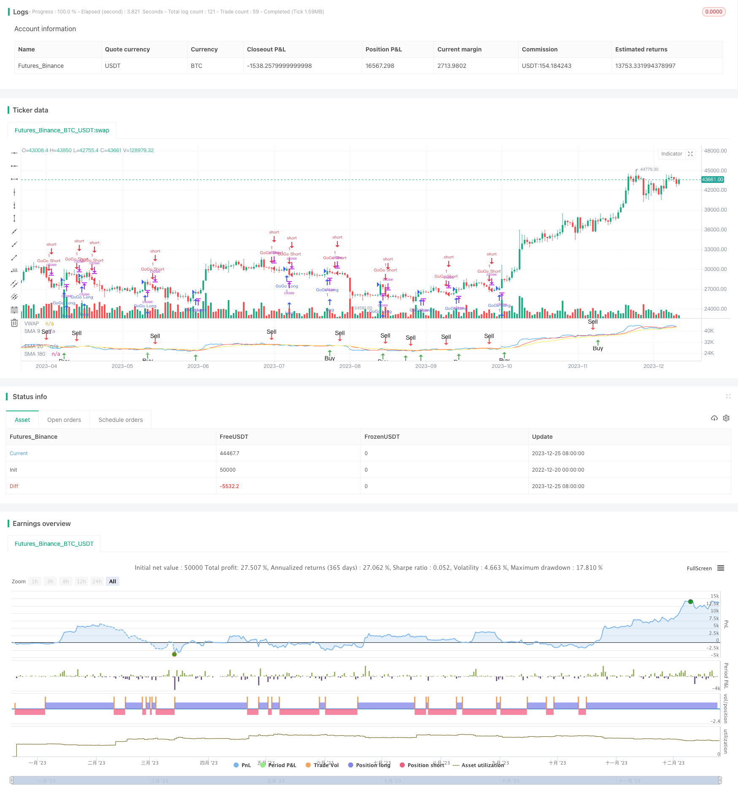

> Name

JBravo Quantitative-Trend-Strategy
> Author

ChaoZhang

> Strategy Description



## Strategy Overview ##
JBravo Quantitative Trend Strategy is a trend following strategy based on moving averages. It uses the 9-day simple moving average, the 20-day exponential moving average, and the 180-day simple moving average to determine the trend direction of the market, as well as the final buy and sell signals.
The name of this strategy is inspired by the animated character Johnny Bravo, which represents a confident and decisive trading decision. The term "GoGo Juice" describes an aggressive entry when the VWAP line crosses the 20-day exponential moving average.
## Strategy Principle ##
When the closing price of a K line crosses above the 9-day simple moving average, a buy signal is generated; when the closing price crosses below the 20-day exponential moving average, a sell signal is generated.
If the 9-day, 20-day and 180-day moving averages are all upward, and the 9-day moving average is above the 20-day moving average, and the 20-day moving average is above the 180-day moving average, a strong buy signal is generated.
If the 9-day, 20-day and 180-day moving averages are all downward, and the 9-day moving average is below the 20-day moving average, and the 20-day moving average is below the 180-day moving average, a strong sell signal is generated.
When the volume-weighted average price line crosses the 20-day exponential moving average from below, a "GoGo" signal is generated; when the volume-weighted average price line crosses the 20-day exponential moving average from above, a "GoGo" signal is generated.
## Strategic Advantage Analysis ##
This strategy combines the strategic ideas of trend following and breakout. Moving averages can clearly judge the direction of market trends and reduce the probability of wrong transactions. At the same time, it flexibly uses the volume-weighted average price indicator to judge the timing of entry, and controls risks while being optimistic about market breakthroughs.
Compared with using moving averages alone, this strategy adds the aggressive entry mechanism of "GoGo Juice", which can achieve higher market returns in strong markets.
Generally speaking, this strategy has a smaller retracement and has stable profitability.
## Strategy Risk Analysis ##
Although this strategy adds a strong entry mechanism, the stop loss point may be triggered frequently in volatile markets. In addition, the moving average itself has a strong lag and cannot capture price changes in time.
This means that the strategy may produce a certain number of virtual transactions and cannot truly reflect market price trends. In addition, strong entry also increases the risk of loss.
In order to reduce risks, the period of the moving average can be appropriately adjusted; or a stop loss module can be added to stop the loss and exit after the loss reaches a certain level.
## Strategy optimization direction ##
This strategy can be optimized in the following directions:
1. Adjust moving average parameters, optimize period parameters, and find the best parameter combination
2. Increase the judgment of trading volume indicators to avoid false signals caused by violent price fluctuations.
3. Add a stop loss module, set exit rules, and control single losses
4. Combine the selection of market hot sectors to make the strategy more targeted
5. Optimize the proportion of open positions, and optimize different position scales with different parameters.
## Summarize ##
JBravo quantitative trend strategy integrates moving average analysis and volume-weighted average price trend judgment. It pursues stable long-term profits and has a certain aggressive trading mechanism. This strategy is suitable for medium and long-term holdings, with medium to high risk and high return rate. It can become an integral part of a portfolio trading strategy and has good market adaptability.
|| 
## Strategy Overview ##

The JBravo Quantitative Trend Strategy is a trend-following strategy based on moving averages. It uses the 9-day simple moving average, 20-day exponential moving average, and 180-day simple moving average to determine the market trend direction, as well as the final buy and sell signals.  

The strategy name is inspired by the cartoon character Johnny Bravo, representing a confident and decisive trading decision. The term "GoGo Juice" depicts the aggressive entry when the VWAP line crosses the 20-day exponential moving average.

## Strategy Principle ##  

A buy signal is generated when the closing price crosses above the 9-day simple moving average; A sell signal is generated when the closing price crosses below the 20-day exponential moving average.

If the 9-day, 20-day and 180-day moving averages are all moving up, and the 9-day moving average is above the 20-day moving average, the 20-day moving average is above the 180-day moving average, a strong buy signal is generated.  

If the 9-day, 20-day and 180-day moving averages are all moving down, and the 9-day moving average is below the 20-day moving average, the 20-day moving average is below the 180-day moving average, a strong sell signal is generated.

When the Volume Weighted Average Price line crosses the 20-day exponential moving average upward, a "GoGo Long" signal is generated; When the Volume Weighted Average Price line crosses the 20-day exponential moving average downward, a "GoGo Short" signal is generated.

## Advantage Analysis ##

This strategy combines the ideas of trend following and breakout strategies. Moving averages can clearly determine the direction of the market trend and reduce the probability of wrong trades. At the same time, it flexibly uses the VWAP indicator to determine the entry time, controlling risks while favoring breakthroughs in the market.

Compared to using moving averages alone, this strategy adds the aggressive entry mechanism of "GoGo Juice", which can obtain higher returns in strong trends.

Overall, this strategy has small drawdowns and stable profitability.  

## Risk Analysis ##

Although the strategy increases the strength of entries, stop loss points can be frequently triggered in sideways markets. In addition, moving averages themselves have high inertia and cannot keep up with price changes in time.

This means that the strategy may generate a certain number of virtual trades that do not actually reflect market price movements. In addition, aggressive entries also increase the risk of losses.

To reduce risks, we can adjust the cycle of moving averages as appropriate; or add a stop loss module to stop loss when losses reach a certain level.

## Optimization Directions ##  

The strategy can be optimized in the following directions:

1. Adjust moving average parameters and optimize cycle parameters to find the optimal parameter combination

2. Add volume indicators to avoid false signals in times of  violent price fluctuations

3. Increase stop loss modules and set exit rules to control per trade loss

4. Combine selections of market hot sectors to make strategies more targeted  

5. Optimize opening position proportions, optimize different scale for different parameters

## Conclusion ##   

The JBravo Quantitative Trend Strategy integrates moving average analysis and VWAP trend judgment. It pursues stable long-term profits while having a certain degree of aggressive trading mechanisms. The strategy is suitable for medium-long term holdings, with medium-high risks and high returns. It can become a part of portfolio trading strategies with very good market adaptability.

[/trans]

> Strategy Arguments


|Argument|Default|Description|
|----|----|----|
|v_input_1|true|Display SMA 9|
|v_input_2|true|Display EMA 20|
|v_input_3|true|Display SMA 180|
|v_input_4|false|Color-code 180 trend direction|
|v_input_5|true|Display VWAP|


> Source (PineScript)

``` pinescript
/*backtest
start: 2022-12-20 00:00:00
end: 2023-12-26 00:00:00
period: 1d
basePeriod: 1h
exchanges: [{"eid":"Futures_Binance","currency":"BTC_USDT"}]
*/

// This source code is subject to the terms of the Mozilla Public License 2.0 at https://mozilla.org/MPL/2.0/
// © bradvaughn

//@version=4
strategy("JBravo Swing", overlay = false)

var buy_in_progress = false


//Moving Averages
smaInput1 = input(title="Display SMA 9", type=input.bool, defval=true)
smaInput2 = input(title="Display EMA 20", type=input.bool, defval=true)
smaInput4 = input(title="Display SMA 180", type=input.bool, defval=true)
colored_180 = input(false, title="Color-code 180 trend direction")
vwapInput = input(title="Display VWAP", type=input.bool, defval=true)

sma9 = sma(close, 9)
ema20 = ema(close, 20)
sma180 = sma(close, 180)

//Plot Moving Averages
plot(smaInput1 ? sma9 : na, color= color.red, title="SMA 9")
plot(smaInput2 ? ema20 : na, color = color.yellow, title="EMA 20")

// Plot VWAP
vwap1 = vwap(hlc3)
plot(vwapInput ? vwap1 : na, color = color.blue, title="VWAP")
vwaplong = vwap1 > ema20
vwapshort = vwap1 < ema20

//Color SMA 180 trend direction if selected
sma180_uptrend = sma(close, 180) > sma(close[2], 180)
colr = sma180_uptrend == true or colored_180 == false ? color.white : colored_180 == true ? color.gray : na
plot(smaInput4 ? sma180 : na, color = colr, title="SMA 180")

//Get value of lower end of candle
buyLow = iff(lowest(open, 1) < lowest(close, 1), lowest(open, 1), lowest(close, 1))
sellLow = lowest(close, 1)

// Find the lower MA for crossover sell condition
sellma = iff((sma9<ema20), sma9, ema20)


//SMA 9 trend direction
sma9_uptrend = sma(close, 9) > sma(close[2], 9)
//EMA 20 trend direction
ema20_uptrend = ema(close, 20) > sma(close[2], 20)

//Buy or sell if conditions are met
// Buy when the candle low is above the SMA9
// Sell when the candle low is below the lower of SMA9 and EMA20
Buy = iff(buy_in_progress == false and buyLow > sma9 == true, true, false)
Sell = iff(buy_in_progress == true and sellLow < sellma == true, true, false)

// Determine stong buy and strong sell conditions.
// If moving averages are all up, then this will qualify a buy as a strong buy.
// If the moving averages are not up (ie. down) then this will qualify a sell as a strong sell
StrongBuy = iff (Buy and sma9_uptrend and sma180_uptrend and ema20_uptrend and (sma9 > ema20) and (ema20 > sma180), true, false)
StrongSell = iff (Sell and not sma9_uptrend and not sma180_uptrend and not ema20_uptrend and (sma9 < ema20) and (ema20 < sma180), true, false)

//Update Trading status if bought or sold
if Buy
    buy_in_progress := true
if Sell
    buy_in_progress := false
    
// Clear Buy and Sell conditions if StrongBuy or StrongSell conditions exist.  
// This disables plotting Buy and Sell conditions
if StrongBuy
    Buy := false
if StrongSell
    Sell := false
    

//Display BUY/SELL indicators

plotshape(Buy,title="Buy", color=color.green, style=shape.arrowup,location=location.belowbar, text="Buy")
plotshape(StrongBuy,title="Strong Buy", color=color.green, style=shape.arrowup,location=location.belowbar, text="Strong Buy")
plotshape(Sell,title="Sell", color=color.red, style=shape.arrowdown,text="Sell")
plotshape(StrongSell,title="Strong Sell", color=color.red, style=shape.arrowdown,text="Strong Sell")

strategy.entry("GoGo Long", strategy.long, 1, when=vwaplong and vwapInput)
strategy.entry("GoGo Short", strategy.short, 1, when=vwapshort and vwapInput)

strategy.close("GoGo Long", when = vwapshort and vwapInput)
strategy.close("GoGo Short", when = vwaplong and vwapInput)


alertcondition(Buy, title="Buy Signal", message="Buy")
alertcondition(Sell, title="Sell Signal", message="Sell")
```

> Detail

https://www.fmz.com/strategy/436759

> Last Modified

2023-12-27 14:53:07
