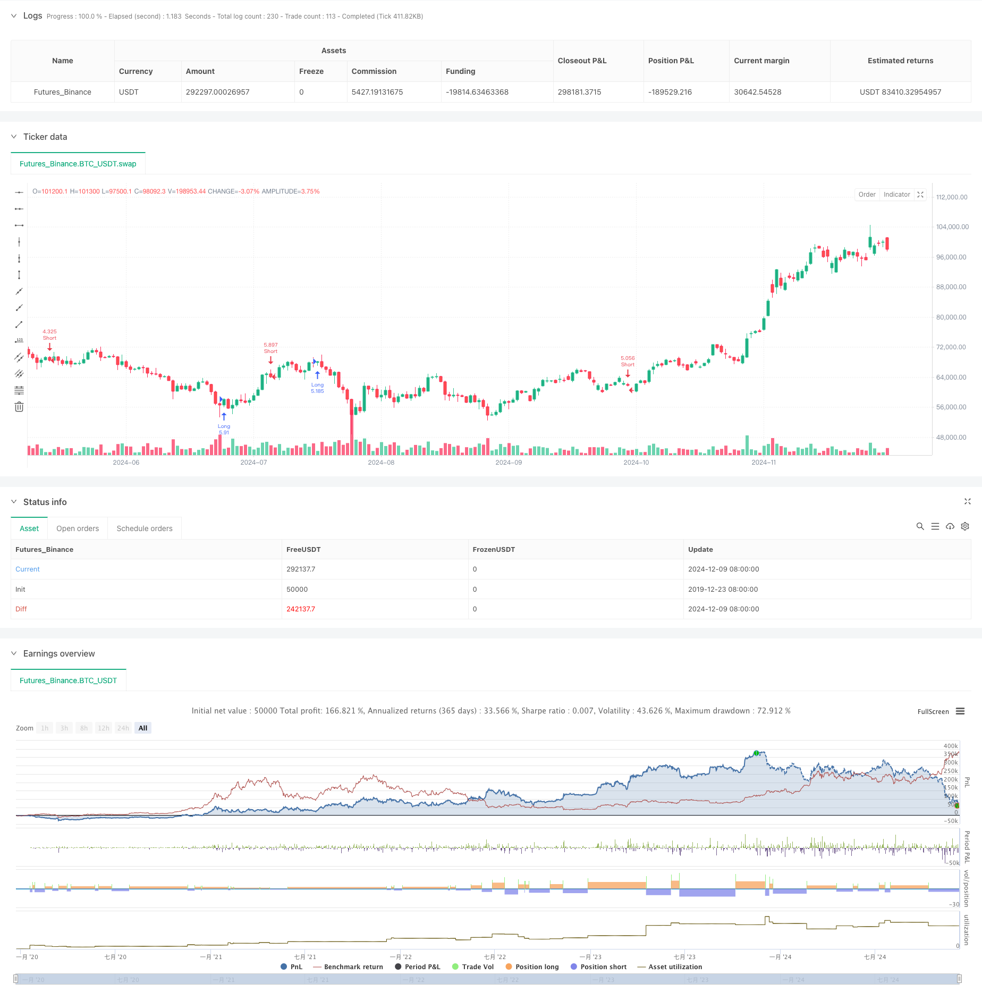

> Name

Bidirectional-Trading-Strategy-Based-on-Candlestick-Absorption-Pattern-Analysis
> Author

ChaoZhang

> Strategy Description



[trans]
#### Overview
This strategy is a two-way trading system based on the K-line candlestick absorption pattern. This strategy analyzes the relationship between the directionality, amplitude and trading volume of adjacent K lines, identifies patterns with absorption characteristics in the market, and conducts transactions in the corresponding direction when conditions are met. The strategy adopts percentage fund management method and has complete logic of opening and closing positions.
#### Strategy Principle
The core logic of the strategy is based on three key conditions:
1. Adjacent K lines have opposite directions: Judging the K line direction by comparing the opening price and closing price, two adjacent K lines are required to show opposite trends.
2. Amplitude relationship analysis: Calculate and compare the price amplitude of two K lines (the absolute value of the difference between the closing price and the opening price). It is required that the amplitude of the latter K line is greater than the previous one.
3. Trading volume characteristics: The trading volume of the first K line is required to be greater than that of the second K line, and at the same time, the trading volume of the second K line must be smaller than the previous trading volume.
When these three conditions are met at the same time, the strategy will determine the trading direction based on the direction of the latest K-line: if it is a positive line, it will be long, and if it is a negative line, it will be short. The strategy trades using full positions and tracks positions through state variables.
#### Strategic Advantages
1. Multi-dimensional analysis: Analyze based on the three dimensions of price form, amplitude and trading volume to improve signal reliability.
2. Two-way trading: You can capture two-way market opportunities and make full use of market fluctuations.
3. Perfect risk management: use percentage fund management and can flexibly set stop-loss and stop-profit conditions.
4. Visual support: Provides graphical display of trading signals to facilitate analysis and optimization.
5. Clear status management: Precisely control positions through status variables to avoid repeated opening of positions.
#### Strategy Risk
1. False breakthrough risk: False absorption patterns may appear in volatile markets, resulting in false signals.
2. Impact of slippage: When the market fluctuates violently, you may face larger slippage, which affects the actual trading effect.
3. Fund management risk: Full position trading may bring greater risk exposure.
4. Signal lag: The signal cannot be confirmed until the K-line closes, and the best entry opportunity may be missed.
#### Strategy optimization direction
1. Introduce trend filtering: It is recommended to add moving averages or trend indicators as direction filters to improve signal quality.
2. Optimize fund management: position size can be dynamically adjusted according to market volatility.
3. Improve the stop loss mechanism: It is recommended to set a dynamic stop loss in combination with the ATR indicator to improve risk control capabilities.
4. Add time filtering: You can add trading time period filtering to avoid low-efficiency periods.
5. Optimize signal confirmation: You can add trading volume indicators or other technical indicators as auxiliary confirmation.
#### Summary
This strategy builds a complete trading system through multi-dimensional analysis of K-line shape, amplitude and trading volume. Although there are certain risks, the stability and reliability of the strategy can be further improved through the suggested optimization directions. The core advantage of the strategy lies in its multi-dimensional analysis method and perfect status management mechanism, which is suitable for application in volatile market environments. ||
#### Overview
This strategy is a bidirectional trading system based on candlestick absorption patterns. It identifies market absorption patterns by analyzing the direction, amplitude, and volume relationships of adjacent candlesticks, executing trades when conditions are met. The strategy employs percentage-based money management with complete entry and exit logic.

#### Strategy Principle
The core logic is based on three key conditions:
1. Adjacent candlesticks have opposite directions: Comparing open and close prices to determine candlestick direction, requiring opposite trends in adjacent candlesticks.
2. Amplitude relationship analysis: Calculating and comparing the price amplitude of two candlesticks (absolute difference between close and open prices), requiring the latter candlestick's amplitude to be larger.
3. Volume characteristics: Requiring the first candlestick's volume to be larger than the second, while the second candlestick's volume should be smaller than the previous volume.

When these three conditions are met simultaneously, the strategy determines the trading direction based on the latest candlestick: long for bullish candles, short for bearish ones. The strategy uses full position trading and tracks positions through state variables.

#### Strategy Advantages
1. Multi-dimensional analysis: Combines price patterns, amplitude, and volume analysis to improve signal reliability.
2. Bidirectional trading: Captures market opportunities in both directions, fully utilizing market volatility.
3. Comprehensive risk management: Uses percentage-based money management with flexible stop-loss and take-profit settings.
4. Visual support: Provides graphical display of trading signals for analysis and optimization.
5. Clear state management: Precisely controls positions through state variables, avoiding duplicate entries.

#### Strategy Risks
1. False breakout risk: False absorption patterns may appear in ranging markets, leading to incorrect signals.
2. Slippage impact: May face significant slippage during high market volatility, affecting actual trading results.
3. Money management risk: Full position trading may create large risk exposure.
4. Signal lag: Signals can only be confirmed after candlestick closure, potentially missing optimal entry points.

#### Strategy Optimization Directions
1. Introduce trend filtering: Recommend adding moving averages or trend indicators for direction filtering to improve signal quality.
2. Optimize money management: Position size can be dynamically adjusted based on market volatility.
3. Enhance stop-loss mechanism: Recommend implementing dynamic stop-loss using ATR indicator to improve risk control.
4. Add time filtering: Can add trading time period filters to avoid inefficient periods.
5. Improve signal confirmation: Can add volume indicators or other technical indicators for auxiliary confirmation.

#### Summary
This strategy constructs a complete trading system through multi-dimensional analysis of candlestick patterns, amplitude, and volume. While certain risks exist, the strategy's stability and reliability can be further enhanced through the suggested optimization directions. The core advantages lie in its multi-dimensional analysis method and comprehensive state management mechanism, making it suitable for application in highly volatile market environments.[/trans]


> Source (PineScript)

``` pinescript
/*backtest
start: 2019-12-23 08:00:00
end: 2024-12-10 08:00:00
period: 1d
basePeriod: 1d
exchanges: [{"eid":"Futures_Binance","currency":"BTC_USDT"}]
*/

//@version=5
strategy("Candle Absorption Strategy", overlay=true, default_qty_type=strategy.percent_of_equity, default_qty_value=100)

// Условия индикатора
// 1. Две соседних свечи должны быть разнонаправленными
condition1 = (close[1] > open[1] and close < open) or (close[1] < open[1] and close > open)

// 2. Дельта по цене открытия/закрытия у первой свечи меньше, чем у следующей
delta1 = math.abs(close[1] - open[1])
delta2 = math.abs(close - open)
condition2 = delta1 < delta2

// 3. Объем первой свечи должен быть больше, а последней меньше
condition3 = volume[1] > volume and volume < volume[2]

// Проверяем выполнение всех условий
all_conditions = condition1 and condition2 and condition3

// Определяем направление для входа
is_bullish = close > open  // Зеленая свеча больше (бычье поглощение)
is_bearish = close < open  // Красная свеча больше (медвежье поглощение)

// Переменные для отслеживания состояния позиции
var float entryPrice = na
var bool isLong = false
var bool isShort = false

// Логика генерации сигналов
buySignal = all_conditions and is_bullish and not isLong
sellSignal = all_conditions and is_bearish and not isShort

// Обработка лонгового входа
if (buySignal)
    isLong := true
    isShort := false
    entryPrice := close
    strategy.entry("Long", strategy.long)

// Обработка шортового входа
if (sellSignal)
    isLong := false
    isShort := true
    entryPrice := close
    strategy.entry("Short", strategy.short)

// Визуализация точек поглощения
// if all_conditions
//     label.new(bar_index, high, "✔", color=is_bullish ? color.green : color.red, textcolor=color.white, style=label.style_circle, size=size.small)

// Логика сброса состояния при закрытии позиции
if (strategy.position_size == 0)
    isLong := false
    isShort := false
    entryPrice := na

// Дополнительно: можно добавить стоп-лосс и тейк-профит (пример ниже)
// strategy.exit("Exit Long", from_entry="Long", stop=low - atr(14), limit=high + atr(14))
// strategy.exit("Exit Short", from_entry="Short", stop=high + atr(14), limit=low - atr(14))

```

> Detail

https://www.fmz.com/strategy/474813

> Last Modified

2024-12-12 11:27:27
