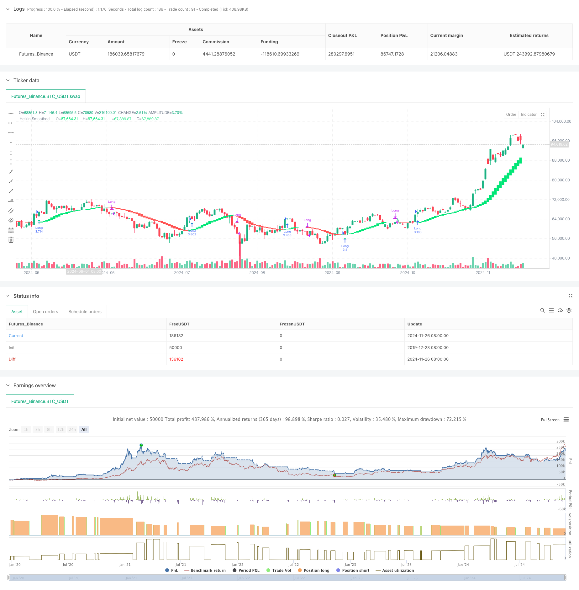

> Name

Double-Smoothed-Moving-Average-Trend-Following-Strategy-Based-on-Modified-Heikin-Ashi
> Author

ChaoZhang

> Strategy Description



[trans]
#### Overview
This strategy is a trend following system based on the improved Heikin-Ashi K-line. By performing dual exponential moving average (EMA) smoothing on the traditional Ping An Jiangshi K-line, it effectively reduces market noise and provides clearer trend signals. The strategy operates in a long-only manner, holding positions in an upward trend, closing positions in a downward trend, and obtaining market returns through efficient trend capture.
#### Strategy Principle
The core logic of the strategy includes the following key steps:
1. Perform the first EMA smoothing on OHLC price data
2. Use the smoothed price to calculate the improved Ping An Jiangshi K-line
3. Perform secondary EMA smoothing on the calculated Ping An Jiangshi K-line
4. Judge the K-line color change by comparing the smoothed opening price and closing price.
5. A buy signal is generated when the K line turns from red to green, and a sell signal is generated when the K line turns from green to red.
6. Use 100% of the total account value for position trading
#### Strategic Advantages
1. Double smoothing significantly reduces false signals
2. Long-only strategy reduces short-selling risk
3. Enter the market only after the trend is confirmed to increase your winning rate
4. Complete signal system supports automated trading
5. Flexible time period selection to meet different trading needs
6. Simple and clear entry and exit rules for easy implementation
7. Support fund management under different market conditions
#### Strategy Risk
1. A large retracement may form in the early stage of trend reversal
2. Continuous false signals may occur in volatile markets
3. Full position trading increases financial risks
4. Lagging entry signals may result in missing part of the gains
5. Performance varies greatly in different time periods
#### Strategy optimization direction
1. Introduce trend strength filter to reduce false signals in volatile markets
2. Increase dynamic position management and optimize capital utilization
3. Add a trailing stop function to control retracement risk
4. Combine with other technical indicators to confirm the validity of the signal
5. Develop an adaptive parameter system to improve strategy stability
#### Summary
This strategy uses double smoothing processing and the improved Ping An Jiangshi K-line as the core to build a robust trend tracking system. The strategy design is concise and clear, easy to understand and execute, and provides multiple optimization directions to adapt to different market environments. Although there is a certain degree of hysteresis and retracement risk, through reasonable fund management and risk control measures, this strategy can provide investors with a reliable trend tracking tool. ||
#### Overview
This strategy is a trend following system based on modified Heikin-Ashi candlesticks. By applying double Exponential Moving Average (EMA) smoothing to traditional Heikin-Ashi candlesticks, it effectively reduces market noise and provides clearer trend signals. The strategy operates in a long-only mode, holding positions during uptrends and staying out of the market during downtrends, capturing market returns through efficient trend detection.

#### Strategy Principles
The core logic includes the following key steps:
1. Initial EMA smoothing of OHLC price data
2. Calculation of modified Heikin-Ashi candlesticks using smoothed prices
3. Secondary EMA smoothing of the calculated Heikin-Ashi candlesticks
4. Color change determination through comparison of smoothed open and close prices
5. Generation of buy signals when candles change from red to green, and sell signals when changing from green to red
6. Trading with 100% of account equity position sizing

#### Strategy Advantages
1. Double smoothing significantly reduces false signals
2. Long-only approach eliminates short-selling risks
3. Entry after trend confirmation improves win rate
4. Complete signal system supports automated trading
5. Flexible timeframe selection meets different trading needs
6. Simple and clear entry/exit rules facilitate execution
7. Supports money management under different market conditions

#### Strategy Risks
1. Potential large drawdowns during trend reversals
2. Multiple false signals possible in ranging markets
3. Full position trading increases capital risk
4. Delayed entry signals may miss initial price movements
5. Performance varies significantly across different timeframes

#### Strategy Optimization Directions
1. Introduce trend strength filters to reduce false signals in ranging markets
2. Implement dynamic position sizing to optimize capital utilization
3. Add trailing stop loss functionality to control drawdown risk
4. Incorporate additional technical indicators for signal confirmation
5. Develop adaptive parameter system to improve strategy stability

#### Summary
The strategy builds a robust trend following system using double smoothing and modified Heikin-Ashi candlesticks as its core components. The strategy design is clean and straightforward, easy to understand and execute, while providing multiple optimization directions to adapt to different market environments. Although it has certain lag and drawdown risks, through proper money management and risk control measures, this strategy can provide investors with a reliable trend following tool.[/trans]


> Source (PineScript)

``` pinescript
/*backtest
start: 2019-12-23 08:00:00
end: 2024-11-27 08:00:00
period: 1d
basePeriod: 1d
exchanges: [{"eid":"Futures_Binance","currency":"BTC_USDT"}]
*/

//@version=5
strategy("Smoothed Heiken Ashi Strategy Long Only", overlay=true, initial_capital=1000, default_qty_type=strategy.percent_of_equity, default_qty_value=100)

len = input.int(10, title="EMA Length")
len2 = input.int(10, title="Smoothing Length")
start_date = input(defval=timestamp("2020-01-01"), title="Backtest Start Date")

o = ta.ema(open, len)
c = ta.ema(close, len)
h = ta.ema(high, len)
l = ta.ema(low, len)

haclose = (o + h + l + c) / 4
var float haopen = na
haopen := na(haopen[1]) ? (o + c) / 2 : (haopen[1] + haclose[1]) / 2
hahigh = math.max(h, math.max(haopen, haclose))
halow = math.min(l, math.min(haopen, haclose))

o2 = ta.ema(haopen, len2)
c2 = ta.ema(haclose, len2)
h2 = ta.ema(hahigh, len2)
l2 = ta.ema(halow, len2)

col = o2 > c2 ? color.red : color.lime

// Plot candles without visible wicks
plotcandle(o2, o2, c2, c2, title="Heikin Smoothed", color=col, wickcolor=color.new(col, 100))

// Delayed Buy and Sell signals
colorChange = col != col[1]
buySignal = colorChange[1] and col[1] == color.lime
sellSignal = colorChange[1] and col[1] == color.red

plotshape(buySignal, title="Buy Signal", location=location.belowbar, color=color.lime, style=shape.triangleup, size=size.small)
plotshape(sellSignal, title="Sell Signal", location=location.abovebar, color=color.red, style=shape.triangledown, size=size.small)

// Strategy entry and exit
if (true)
    if (buySignal)
        strategy.entry("Long", strategy.long)
    if (sellSignal)
        strategy.close("Long")

// Add a vertical line at the start date
// if (time == start_date)
//     line.new(x1=bar_index, y1=low, x2=bar_index, y2=high, color=color.blue, width=2)

// Alert conditions
alertcondition(colorChange[1], title="Color Change Alert", message="Heiken Ashi Candle Color Changed")
alertcondition(buySignal, title="Buy Signal Alert", message="Buy Signal: Color changed from Red to Green")
alertcondition(sellSignal, title="Sell Signal Alert", message="Sell Signal: Color changed from Green to Red")
```

> Detail

https://www.fmz.com/strategy/473354

> Last Modified

2024-11-29 15:03:37
