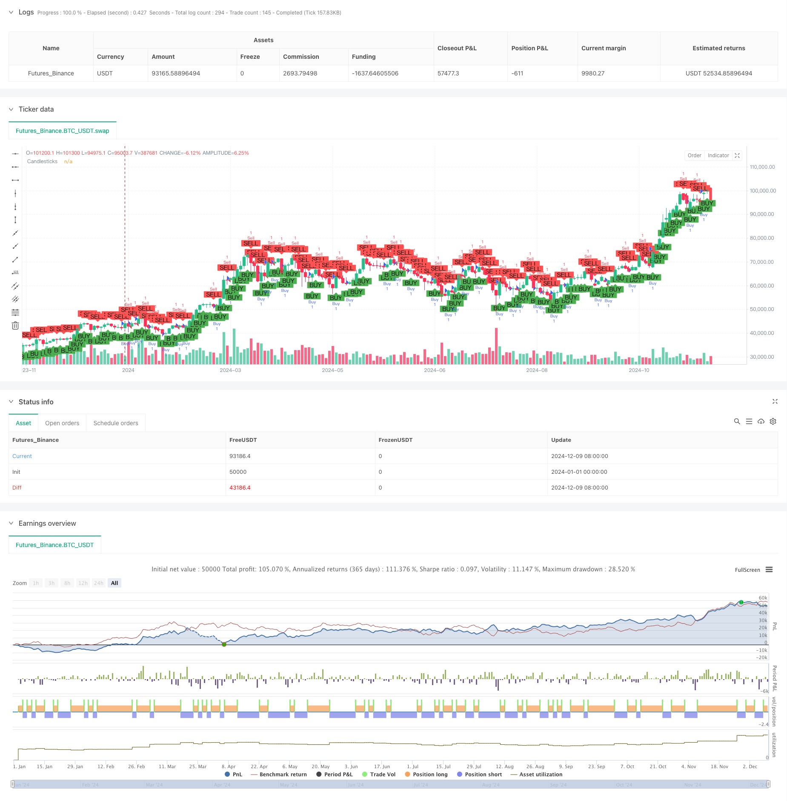

> Name

High-Frequency-Breakout-Trading-Strategy-Based-on-Candlestick-Close-Direction
> Author

ChaoZhang

> Strategy Description



[trans]
#### Overview
This is a high-frequency trading strategy based on the closing direction of the 1-minute K-line. The strategy determines the market trend by judging the relationship between the closing price and the opening price of the K-line, and goes long after the bullish K-line is formed, and goes short after the bearish K-line is formed. The strategy adopts a fixed holding time, closes the position at the close of the next K line, and limits the maximum number of transactions per day to control risks.
#### Strategy Principle
The core logic of the strategy is to judge the short-term market trend through the closing direction of the K line:
1. When the closing price is higher than the opening price, a positive line is formed, indicating that the buyer has the upper hand in the current cycle and the strategy is to go long.
2. When the closing price is lower than the opening price, a negative line is formed, indicating that the seller is dominant in the current cycle and the strategy is to choose shorting.
3. The strategy closes the position at the close of the next K-line after opening the position to achieve quick profit or stop loss.
4. The number of daily transactions is limited to 200 to prevent excessive trading.
5. Each transaction uses 1% of the account's funds to achieve risk control.
#### Strategic Advantages
1. The transaction logic is simple and clear, easy to understand and implement
2. The short holding time reduces the risks caused by market fluctuations
3. Use a fixed holding time to avoid bias caused by subjective judgment.
4. Set a limit on the maximum number of transactions per day to effectively control risks
5. Use percentage risk management to protect the safety of account funds
6. Visually display trading signals to facilitate strategy monitoring and optimization
#### Strategy Risk
1. High-frequency trading may bring higher transaction costs
   Solution: Choose trading varieties with smaller spreads and optimize trading time periods
2. May suffer continuous losses in highly volatile markets
   Solution: Add market volatility filter
3. Strategies may be affected by false breakouts
   Solution: Increase trading volume and other auxiliary indicators for confirmation
4. Fixed holding time may lead to missed greater profit opportunities
   Solution: Dynamically adjust the position holding time according to market conditions
5. Failure to consider more market information and technical indicators
   Solution: Combine with other technical indicators to optimize entry conditions
#### Strategy optimization direction
1. Introduce trading volume indicators: confirm the validity of K-line through trading volume and improve the reliability of trading signals
2. Add trend filtering: combine trend indicators such as moving averages to trade in the main trend direction
3. Dynamic position holding time: dynamically adjust the position holding time according to market volatility to improve strategy adaptability
4. Optimize fund management: dynamically adjust position size based on historical profit and loss conditions
5. Add market volatility filtering: suspend trading in market environments where volatility is too high or too low
6. Add time filtering: avoid high-volatility market opening and closing periods
#### Summary
This strategy is a high-frequency trading system based on the K-line closing direction, which captures short-term market opportunities through simple price action analysis. The advantages of the strategy are simple logic, short holding time, and controllable risks, but it also faces challenges such as high transaction costs and false breakthroughs. By introducing more technical indicators and optimization solutions, the stability and profitability of the strategy are expected to be further improved. For investors pursuing short-term trading opportunities, this is a trading strategy worth trying and improving. ||
#### Overview
This is a high-frequency trading strategy based on 1-minute candlestick close direction. The strategy determines market trends by analyzing the relationship between closing and opening prices, taking long positions after bullish candles and short positions after bearish candles. It employs fixed holding periods, closes positions at the next candlestick's close, and limits daily trading frequency to control risk.

#### Strategy Principles
The core logic relies on candlestick close direction to judge short-term market trends:
1. When closing price is above opening price, forming a bullish candle, indicating buyer dominance in the current period, the strategy goes long.
2. When closing price is below opening price, forming a bearish candle, indicating seller dominance in the current period, the strategy goes short.
3. Positions are closed at the next candlestick's close, enabling quick profit-taking or loss-cutting.
4. Daily trades are limited to 200 to prevent overtrading.
5. Each trade uses 1% of account balance, implementing risk control.

#### Strategy Advantages
1. Simple and clear trading logic, easy to understand and implement
2. Short holding periods reduce market volatility risk
3. Fixed holding time eliminates subjective judgment bias
4. Daily trade limit effectively controls risk
5. Percentage-based risk management protects account capital
6. Visual trade signal display facilitates strategy monitoring and optimization

#### Strategy Risks
1. High-frequency trading may incur high transaction costs
   Solution: Choose instruments with low spreads, optimize trading time periods
2. Potential consecutive losses in volatile markets
   Solution: Add market volatility filtering conditions
3. Strategy may be affected by false breakouts
   Solution: Include volume and other confirmatory indicators
4. Fixed holding periods might miss larger profit opportunities
   Solution: Dynamically adjust holding periods based on market conditions
5. Limited consideration of market information and technical indicators
   Solution: Incorporate additional technical indicators for entry optimization

#### Strategy Optimization Directions
1. Implement volume indicators: Confirm candlestick validity through volume analysis, improving signal reliability
2. Add trend filters: Combine with trend indicators like moving averages to trade in the primary trend direction
3. Dynamic holding periods: Adjust holding times based on market volatility for better adaptability
4. Optimize money management: Dynamically adjust position size based on historical performance
5. Add volatility filters: Pause trading during extremely high or low volatility conditions
6. Implement time filters: Avoid high-volatility market opening and closing periods

#### Summary
This strategy is a high-frequency trading system based on candlestick close direction, capturing short-term market opportunities through simple price action analysis. Its strengths lie in simple logic, short holding periods, and controllable risk, while facing challenges like high transaction costs and false breakouts. Through the introduction of additional technical indicators and optimization measures, the strategy's stability and profitability can be further enhanced. For investors seeking short-term trading opportunities, this is a trading strategy worth testing and improving.[/trans]


> Source (PineScript)

``` pinescript
/*backtest
start: 2024-01-01 00:00:00
end: 2024-12-10 08:00:00
period: 2d
basePeriod: 2d
exchanges: [{"eid":"Futures_Binance","currency":"BTC_USDT"}]
*/

//@version=5
strategy("Candle Close Strategy", overlay=true)

// Define conditions for bullish and bearish candlesticks
isBullish = close > open
isBearish = close < open

// Track the number of bars since the trade was opened and the number of trades per day
var int barsSinceTrade = na
var int tradesToday = 0

// Define a fixed position size for testing
fixedPositionSize = 1

// Entry condition: buy after the close of a bullish candlestick
if (isBullish and tradesToday < 200)  // Limit to 200 trades per day
    strategy.entry("Buy", strategy.long, qty=fixedPositionSize)
    barsSinceTrade := 0
    tradesToday := tradesToday + 1

// Entry condition: sell after the close of a bearish candlestick
if (isBearish and tradesToday < 200)  // Limit to 200 trades per day
    strategy.entry("Sell", strategy.short, qty=fixedPositionSize)
    barsSinceTrade := 0
    tradesToday := tradesToday + 1

// Update barsSinceTrade if a trade is open
if (strategy.opentrades > 0)
    barsSinceTrade := nz(barsSinceTrade) + 1

// Reset tradesToday at the start of a new day
if (dayofmonth != dayofmonth[1])
    tradesToday := 0

// Exit condition: close the trade after the next candlestick closes
if (barsSinceTrade == 2)
    strategy.close("Buy")
    strategy.close("Sell")

// Plot bullish and bearish conditions
plotshape(series=isBullish, location=location.belowbar, color=color.green, style=shape.labelup, text="BUY")
plotshape(series=isBearish, location=location.abovebar, color=color.red, style=shape.labeldown, text="SELL")

// Plot the candlesticks
plotcandle(open, high, low, close, title="Candlesticks")

```

> Detail

https://www.fmz.com/strategy/474839

> Last Modified

2024-12-12 14:35:24
