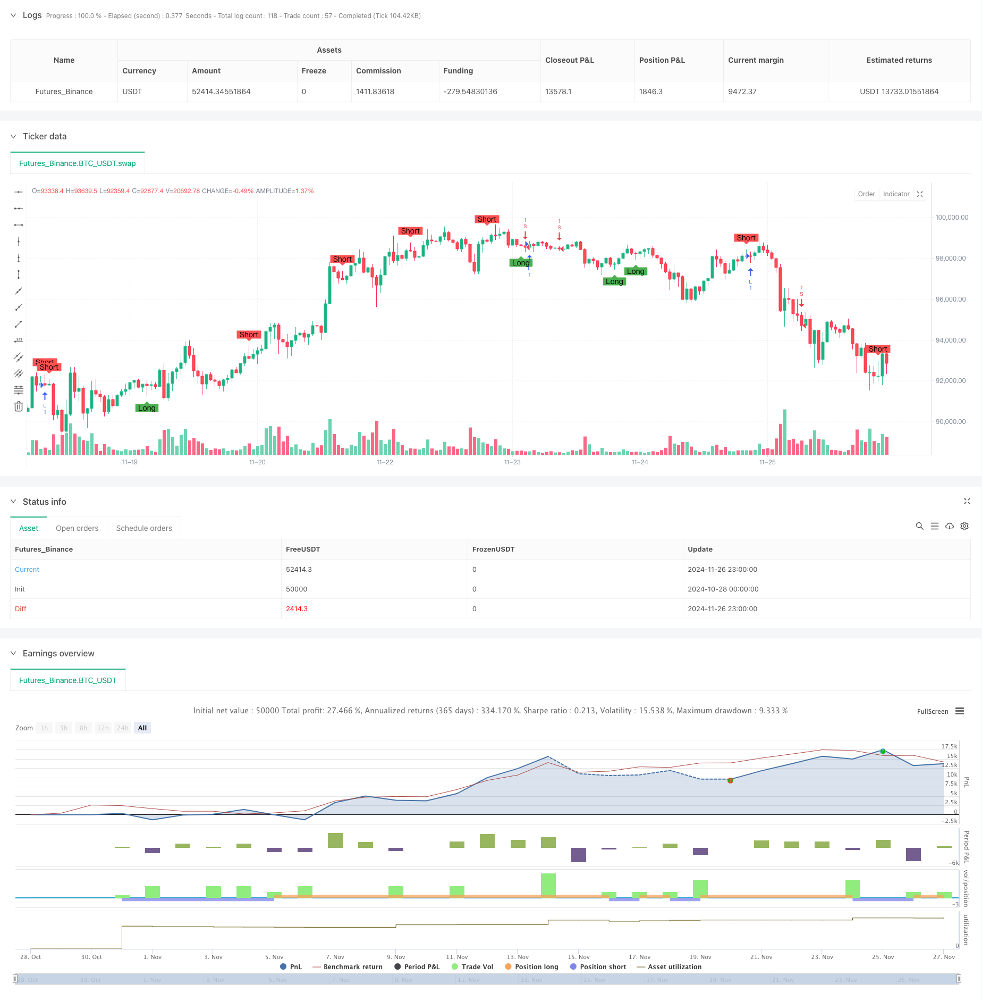

> Name

Moving-Average-Crossover-and-Candlestick-Pattern-Smart-Timing-Strategy
> Author

ChaoZhang

> Strategy Description



[trans]
#### Overview
This strategy is an intelligent trading system that combines the classic moving average crossover and K-line pattern recognition in technical analysis. The strategy analyzes the relationship between the upper and lower shadow lines of the K line and the entity, and combines the double moving average crossover signals to accurately capture the turning point of the market trend. The system not only pays attention to price trends, but also dynamically adjusts trading parameters by calculating average volatility to improve the adaptability of the strategy.
#### Strategy Principle
The core logic of the strategy is divided into two main parts:
1. The K-line pattern recognition module identifies potential reversal signals by calculating the proportional relationship between upper and lower shadow lines and entities. The system sets adjustable hatch multiple parameters (wickMultiplier) and body percentage parameters (bodyPercentage) to optimize signal quality. When a qualified long upper shadow or long lower shadow appears on the K line, the system will issue a corresponding long or short signal.
2. The Double Moving Average Crossover system uses 14-period and 28-period simple moving averages (SMA) as trend indicators. When the short-term moving average crosses the long-term moving average upward, the system generates a long signal; when the short-term moving average crosses the long-term moving average downward, the system generates a short signal.
#### Strategic Advantages
1. Strict signal screening: effectively filter out low-quality signals by setting hatch multiples and entity percentage thresholds
2. Strong parameter adjustability: Provides a flexible parameter adjustment interface to facilitate optimization of strategy performance according to different market environments
3. Combination of trend following and reversal signals: Capable of capturing trend market conditions without missing important reversal opportunities
4. Improved risk control: dynamically adjust trading parameters by calculating the average volatility of 50 periods to improve the stability of the strategy
#### Strategy Risk
1. Parameter sensitivity: Different parameter settings may lead to large differences in strategy performance, which requires sufficient parameter optimization.
2. Dependence on market environment: Too many false signals may be generated in a volatile market, increasing transaction costs.
3. Impact of slippage: In markets with poor liquidity, you may face greater risk of slippage.
4. Signal delay: There is a certain lag in the moving average system, and the best entry opportunity may be missed.
#### Strategy optimization direction
1. Introduce trading volume indicators: Confirm the effectiveness of reversal signals by analyzing changes in trading volume
2. Optimize the dynamic adjustment mechanism of parameters: automatically adjust the shadow multiple and entity percentage parameters according to market volatility
3. Add trend strength filtering: Combine with indicators such as RSI or ADX to filter signals in weak markets
4. Improve the stop loss mechanism: design dynamic stop loss positions based on the ATR indicator to improve the accuracy of risk control
#### Summary
This strategy builds a relatively complete trading decision-making framework by combining K-line pattern recognition and moving average crossover systems. The advantage of the strategy lies in its strict signal screening mechanism and flexible parameter adjustment capabilities, but at the same time, attention must be paid to parameter optimization and market environment adaptability. Through continuous optimization and improvement, this strategy is expected to maintain stable performance in different market environments. ||
#### Overview
This strategy is an intelligent trading system that combines classical technical analysis tools including moving average crossovers and candlestick pattern recognition. The strategy identifies potential market turning points by analyzing the relationship between candlestick shadows and bodies, while incorporating dual moving average crossover signals. The system not only focuses on price trends but also calculates average ranges to dynamically adjust trading parameters for improved adaptability.

#### Strategy Principles
The core logic consists of two main components:
1. The candlestick pattern recognition module identifies potential reversal signals by calculating the ratio between shadows and bodies. The system includes adjustable parameters for shadow multiplier (wickMultiplier) and body percentage (bodyPercentage) to optimize signal quality. When a candlestick displays qualifying long upper or lower shadows, the system generates corresponding long or short signals.

2. The dual moving average crossover system utilizes 14-period and 28-period Simple Moving Averages (SMA) as trend indicators. Long signals are generated when the short-term MA crosses above the long-term MA, while short signals occur when the short-term MA crosses below the long-term MA.

#### Strategy Advantages
1. Strict Signal Filtering: Effectively filters out low-quality signals through shadow multiplier and body percentage thresholds
2. Strong Parameter Adaptability: Provides flexible parameter adjustment interfaces for optimizing strategy performance across different market conditions
3. Combines Trend Following and Reversal Signals: Captures both trending markets and important reversal opportunities
4. Comprehensive Risk Control: Utilizes 50-period average range calculations to dynamically adjust trading parameters for enhanced stability

#### Strategy Risks
1. Parameter Sensitivity: Different parameter settings may lead to significant performance variations, requiring thorough optimization
2. Market Environment Dependency: May generate excessive false signals in ranging markets, increasing trading costs
3. Slippage Impact: Potential for significant slippage in markets with poor liquidity
4. Signal Delay: Moving average systems have inherent lag, possibly missing optimal entry points

#### Strategy Optimization Directions
1. Incorporate Volume Indicators: Analyze volume changes to confirm reversal signal validity
2. Enhance Dynamic Parameter Adjustment: Automatically adjust shadow multiplier and body percentage parameters based on market volatility
3. Add Trend Strength Filtering: Integrate RSI or ADX indicators to filter signals in weak market conditions
4. Improve Stop-Loss Mechanism: Design dynamic stop-loss positions based on ATR indicator for more precise risk control

#### Summary
This strategy constructs a relatively complete trading decision framework by combining candlestick pattern recognition with moving average crossover systems. Its strengths lie in strict signal filtering mechanisms and flexible parameter adjustment capabilities, while attention must be paid to parameter optimization and market environment adaptability. Through continuous optimization and refinement, the strategy shows potential for maintaining stable performance across various market conditions.[/trans]


> Source (PineScript)

``` pinescript
/*backtest
start: 2024-10-28 00:00:00
end: 2024-11-27 00:00:00
period: 1h
basePeriod: 1h
exchanges: [{"eid":"Futures_Binance","currency":"BTC_USDT"}]
*/

//@version=5 indicator("Wick Reversal Setup", overlay=true)

// Input parameters
wickMultiplier = input.float(3.5, title="Wick Multiplier", minval=0.5, maxval=20)
bodyPercentage = input.float(0.25, title="Body Percentage", minval=0.1, maxval=1.0)

// Calculate the average range over 50 periods
avgRange = ta.sma(high - low, 50)

// Define the lengths of wicks and bodies
bodyLength = math.abs(close - open)
upperWickLength = high - math.max(close, open)
lowerWickLength = math.min(close, open) - low
totalRange = high - low

// Long signal conditions
longSignal = (close > open and upperWickLength >= bodyLength * wickMultiplier and upperWickLength <= totalRange * bodyPercentage) or
             (close < open and lowerWickLength >= bodyLength * wickMultiplier and upperWickLength <= totalRange * bodyPercentage) or
             (close == open and close != high and upperWickLength >= bodyLength * wickMultiplier and upperWickLength <= totalRange * bodyPercentage) or
             (open == high and close == high and totalRange >= avgRange)

// Short signal conditions
shortSignal = (close < open and (high - open) >= bodyLength * wickMultiplier and lowerWickLength <= totalRange * bodyPercentage) or
              (close > open and (high - close) >= bodyLength * wickMultiplier and lowerWickLength <= totalRange * bodyPercentage) or
              (close == open and close != low and lowerWickLength >= bodyLength * wickMultiplier and lowerWickLength <= totalRange * bodyPercentage) or
              (open == low and close == low and totalRange >= avgRange)

// Plot signals
plotshape(series=longSignal, location=location.belowbar, color=color.green, style=shape.labelup, text="Long")
plotshape(series=shortSignal, location=location.abovebar, color=color.red, style=shape.labeldown, text="Short")
// This Pine Script™ code is subject to the terms of the Mozilla Public License 2.0 at https://mozilla.org/MPL/2.0/
// © Sahaj_Beriwal

//@version=5
strategy("My strategy", overlay=true, margin_long=100, margin_short=100)

longCondition = ta.crossover(ta.sma(close, 14), ta.sma(close, 28))
if (longCondition)
    strategy.entry("L", strategy.long)

shortCondition = ta.crossunder(ta.sma(close, 14), ta.sma(close, 28))
if (shortCondition)
    strategy.entry("S", strategy.short)

```

> Detail

https://www.fmz.com/strategy/473269

> Last Modified

2024-11-28 17:18:29
