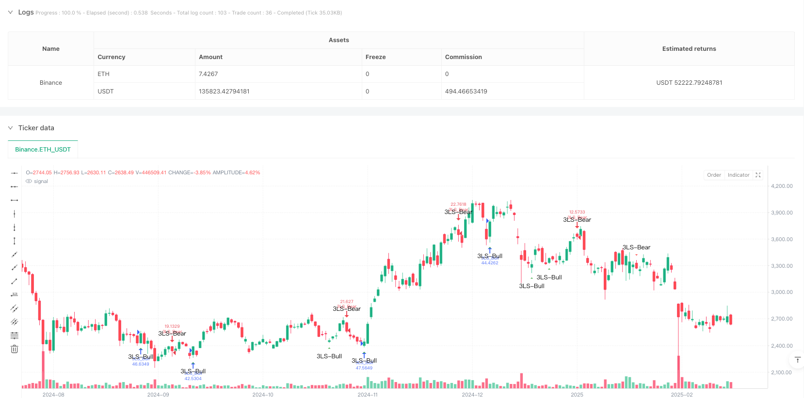
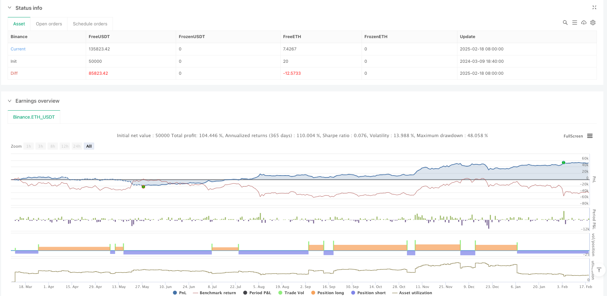

> Name

Triple-Strike Quantitative-Trading-Strategy based on multiple K-line patterns-Multi-Candlestick-Pattern-Based-Triple-Strike-Quantitative-Trading-Strategy
> Author

ianzeng123

> Strategy Description





[trans]
#### Overview
This is a quantitative trading strategy based on the Three Line Strike and Engulfing Pattern. This strategy captures the turning point of the market trend by identifying the breakthrough reversal K-line after three consecutive K-line patterns, and combines multiple technical indicators to make trading decisions. The strategy designs a complete signal identification system and risk control mechanism, and provides highly customizable parameter settings.
#### Strategy Principle
The core logic of the strategy is based on two main K-line forms:
1. Triple strike pattern: Judge the trend reversal by identifying the reversal K-line after three consecutive K-lines in the same direction. The bullish pattern consists of three consecutive falling red K lines followed by a larger green engulfing K line; the bearish pattern consists of three consecutive rising green K lines followed by a larger red engulfing K line.
2. Engulfing pattern: A separate large engulfing K line also serves as an auxiliary signal. The strategy identifies engulfing patterns by calculating the size of the entity between the current K line and the previous K line.
#### Strategic Advantages
1. Accurate signal recognition: The strategy uses strict mathematical calculation methods to determine the K-line shape, and filters through multiple conditions to ensure signal quality.
2. Improved risk control: Risk parameters such as initial capital and position ratio are set, and repeated entries are prohibited.
3. Highly customizable: Provides rich parameter settings, which can be optimized according to different market characteristics and trading needs.
4. Visual support: Provide clear graphic marks and prompt information to facilitate analysis and monitoring.
#### Strategy Risk
1. Market environment dependence: Too many false signals may be generated in a volatile market.
2. Impact of slippage: The entry point of a large engulfing K line may be affected by large slippage.
3. Delay risk: Pattern recognition requires multiple K lines to complete, and the best entry opportunity may be missed.
#### Strategy optimization direction
1. Introduce the trading volume indicator: combine the changes in trading volume to filter the signal quality.
2. Optimize stop loss settings: dynamically adjust stop loss positions based on ATR or volatility.
3. Added trend filtering: Added moving average system to determine the overall trend.
4. Improve the exit mechanism: design more flexible profit-taking conditions.
#### Summary
This strategy captures important turning points in the market through systematic technical analysis methods and has a strong theoretical foundation and practical value. Through parameter optimization and risk control improvement, it can be used as an important part of a robust trading system. The modular design of the strategy also provides a good foundation for further optimization.
#### Overview
This is a quantitative trading strategy based on Three Line Strike and Engulfing patterns. The strategy captures market turning points by identifying breakthrough reversal candlesticks following three consecutive candles, combining multiple technical indicators for trading decisions. It features a complete signal detection system and risk control mechanism, with highly customizable parameter settings.

#### Strategy Principle
The core logic is based on two main candlestick patterns:
1. Three Line Strike Pattern: Identifies trend reversals through three consecutive same-direction candles followed by a reversal candle. Bullish pattern consists of three consecutive red candles followed by a large green engulfing candle; bearish pattern consists of three consecutive green candles followed by a large red engulfing candle.
2. Engulfing Pattern: Large single engulfing candles serve as auxiliary signals. The strategy identifies engulfing patterns by comparing the body size of current and previous candles.

#### Strategy Advantages
1. Precise Signal Identification: Uses strict mathematical calculations to judge candlestick patterns, ensuring signal quality through multiple condition filtering.
2. Comprehensive Risk Control: Includes risk parameters like initial capital and position sizing, with pyramiding prevention.
3. Highly Customizable: Offers rich parameter settings for optimization according to different market characteristics and trading needs.
4. Visual Support: Provides clear graphical markers and alert messages for analysis and monitoring.

#### Strategy Risks
1. Market Environment Dependency: May generate excessive false signals in ranging markets.
2. Slippage Impact: Entry points for large engulfing candles may be subject to significant slippage.
3. Delay Risk: Pattern recognition requires multiple candles, potentially missing optimal entry points.

#### Optimization Directions
1. Incorporate Volume Indicators: Filter signal quality by combining volume changes.
2. Optimize Stop Loss Settings: Dynamically adjust stop loss positions based on ATR or volatility.
3. Add Trend Filtering: Implement moving average systems to judge overall trend.
4. Improve Exit Mechanism: Design more flexible profit-taking conditions.

#### Summary
The strategy captures important market turning points through systematic technical analysis, with strong theoretical foundation and practical value. Through parameter optimization and risk control refinement, it can serve as an important component of a robust trading system. The modular design also provides a good foundation for further optimization.[/trans]


> Source (PineScript)

``` pinescript
/*backtest
start: 2024-03-09 18:40:00
end: 2025-02-19 08:00:00
period: 1d
basePeriod: 1d
exchanges: [{"eid":"Binance","currency":"ETH_USDT"}]
*/

// Copyright ...
// Based on the TMA Overlay by Arty, converted to a simple strategy example.
// Pine Script v5

//@version=5
strategy(title='3 Line Strike [TTF] - Strategy',
     shorttitle='3LS Strategy [TTF]',
     overlay=true,
     initial_capital=100000,
     default_qty_type=strategy.percent_of_equity,
     default_qty_value=100,
     pyramiding=0)

// -----------------------------------------------------------------------------
//                               INPUTS
// -----------------------------------------------------------------------------

//
// ### 3 Line Strike
//
showBear3LS = input.bool(title='Show Bearish 3 Line Strike', defval=true, group='3 Line Strike',
     tooltip="Bearish 3 Line Strike (3LS-Bear) = 3 green candles followed by a large red candle (engulfing).")
showBull3LS = input.bool(title='Show Bullish 3 Line Strike', defval=true, group='3 Line Strike',
     tooltip="Bullish 3 Line Strike (3LS-Bull) = 3 red candles followed by a large green candle (engulfing).")
showMemeChars = input.bool(title="Plot 3 Line Strike meme symbols", defval=false, group="3 Line Strike")

//
//### Engulfing Candles
//
showBearEngulfing= input.bool(title='Show Bearish Big Candles', defval=false, group='Big Candles')
showBullEngulfing= input.bool(title='Show Bullish Big Candles', defval=false, group='Big Candles')

//
//### Alerts
//
void = input.bool(title="(Info) Alerts are based on detected signals.", defval=true)

// -----------------------------------------------------------------------------
//                          HELPER FUNCTIONS
// -----------------------------------------------------------------------------

// Function: Get the 'color' of the candle: -1 = red, 0 = doji, +1 = green
getCandleColorIndex(barIndex) =>
    int ret = na
    if (close[barIndex] > open[barIndex])
        ret := 1
    else if (close[barIndex] < open[barIndex])
        ret := -1
    else
        ret := 0
    ret

// Function: Check if the candle is engulfing (based on the body size of the candles)
isEngulfing(checkBearish) =>
    // Size of the previous candle
    sizePrevCandle = close[1] - open[1]
    // Size of the current candle
    sizeCurrentCandle = close - open
    isCurrentLargerThanPrevious = math.abs(sizeCurrentCandle) > math.abs(sizePrevCandle)
    
    // Bearish / Bullish division
    if checkBearish
        // Bearish engulfing: previous green, current larger red
        isGreenToRed = (getCandleColorIndex(0) < 0) and (getCandleColorIndex(1) > 0)
        isCurrentLargerThanPrevious and isGreenToRed
    else
        // Bullish engulfing: previous red, current larger green
        isRedToGreen = (getCandleColorIndex(0) > 0) and (getCandleColorIndex(1) < 0)
        isCurrentLargerThanPrevious and isRedToGreen

// Simplified calls for bullish/bearish engulfing
isBearishEngulfing() => isEngulfing(true)
isBullishEngulfing() => isEngulfing(false)

// Function: 3 consecutive candles of one color followed by the opposite engulfing candle
// 3 Line Strike - Bearish
is3LSBear() =>
    // Three consecutive green candles?
    is3LineSetup = (getCandleColorIndex(1) > 0) and (getCandleColorIndex(2) > 0) and (getCandleColorIndex(3) > 0)
    // Followed by Bearish engulfing
    is3LineSetup and isBearishEngulfing()

// 3 Line Strike - Bullish
is3LSBull() =>
    // Three consecutive red candles?
    is3LineSetup = (getCandleColorIndex(1) < 0) and (getCandleColorIndex(2) < 0) and (getCandleColorIndex(3) < 0)
    // Followed by Bullish engulfing
    is3LineSetup and isBullishEngulfing()

// -----------------------------------------------------------------------------
//                             SIGNALS
// -----------------------------------------------------------------------------

// ### 3 Line Strike
is3LSBearSig = is3LSBear()
is3LSBullSig = is3LSBull()

// Meme icons vs. standard shapes
plotchar(showBull3LS and showMemeChars ? is3LSBullSig : na, char="?", color=color.rgb(0, 255, 0, 0),
         location=location.belowbar, size=size.tiny, text='3LS-Bull', title='3 Line Strike Up (Meme Icon)', editable=false)
plotchar(showBear3LS and showMemeChars ? is3LSBearSig : na, char="?", color=color.rgb(255, 0, 0, 0),
         location=location.abovebar, size=size.tiny, text='3LS-Bear', title='3 Line Strike Down (Meme Icon)', editable=false)

plotshape(showBull3LS and not showMemeChars ? is3LSBullSig : na, style=shape.triangleup,
         color=color.green, location=location.belowbar, size=size.small, text='3LS-Bull', title='3 Line Strike Up')
plotshape(showBear3LS and not showMemeChars ? is3LSBearSig : na, style=shape.triangledown,
         color=color.red, location=location.abovebar, size=size.small, text='3LS-Bear', title='3 Line Strike Down')

// ### Engulfing Candles
isBullEngulfingSig = isBullishEngulfing()
isBearEngulfingSig = isBearishEngulfing()

plotshape(showBullEngulfing ? isBullEngulfingSig : na, style=shape.triangleup,
         location=location.belowbar, color=color.new(color.green,0), size=size.tiny, title='Big Candle Up')
plotshape(showBearEngulfing ? isBearEngulfingSig : na, style=shape.triangledown,
         location=location.abovebar, color=color.new(color.red,0), size=size.tiny, title='Big Candle Down')

// -----------------------------------------------------------------------------
//                               ALERTS
// -----------------------------------------------------------------------------

// 3LS - "Old" alertcondition + "New" alert() (based on what people use)
alertcondition(showBull3LS and is3LSBullSig, title='Bullish 3 Line Strike',
     message='{{exchange}}:{{ticker}} {{interval}} - Bullish 3 Line Strike')
alertcondition(showBear3LS and is3LSBearSig, title='Bearish 3 Line Strike',
     message='{{exchange}}:{{ticker}} {{interval}} - Bearish 3 Line Strike')

if (showBull3LS and is3LSBullSig)
    m = syminfo.tickerid + ' ' + timeframe.period + ' - Bullish 3 Line Strike'
    alert(message=str.tostring(m), freq=alert.freq_once_per_bar_close)

if (showBear3LS and is3LSBearSig)
    m = syminfo.tickerid + ' ' + timeframe.period + ' - Bearish 3 Line Strike'
    alert(message=str.tostring(m), freq=alert.freq_once_per_bar_close)

// Engulfing - "Old" alertcondition + "New" alert()
alertcondition(showBullEngulfing and isBullEngulfingSig, title='Bullish Engulfing',
     message='{{exchange}}:{{ticker}} {{interval}} - Bullish candle engulfing previous candle')
alertcondition(showBearEngulfing and isBearEngulfingSig, title='Bearish Engulfing',
     message='{{exchange}}:{{ticker}} {{interval}} - Bearish candle engulfing previous candle')

if (showBullEngulfing and isBullEngulfingSig)
    m = syminfo.tickerid + ' ' + timeframe.period + ' - Bullish candle engulfing previous candle'
    alert(message=str.tostring(m), freq=alert.freq_once_per_bar_close)

if (showBearEngulfing and isBearEngulfingSig)
    m = syminfo.tickerid + ' ' + timeframe.period + ' - Bearish candle engulfing previous candle'
    alert(message=str.tostring(m), freq=alert.freq_once_per_bar_close)

// -----------------------------------------------------------------------------
//                          STRATEGY ENTRY ORDERS
// -----------------------------------------------------------------------------
//
// Logic for entering trades. If display is enabled and a signal is detected, a trade will be entered.
//
// 3 Line Strike
if (showBull3LS and is3LSBullSig)
    strategy.entry("3LS_Bull", strategy.long, comment="3LS Bullish")

if (showBear3LS and is3LSBearSig)
    strategy.entry("3LS_Bear", strategy.short, comment="3LS Bearish")

// Engulfing
if (showBullEngulfing and isBullEngulfingSig)
    strategy.entry("BullEngulf", strategy.long, comment="Bullish Engulfing")

if (showBearEngulfing and isBearEngulfingSig)
    strategy.entry("BearEngulf", strategy.short, comment="Bearish Engulfing")

//
// End of script

```

> Detail

https://www.fmz.com/strategy/483050

> Last Modified

2025-02-27 17:12:20
