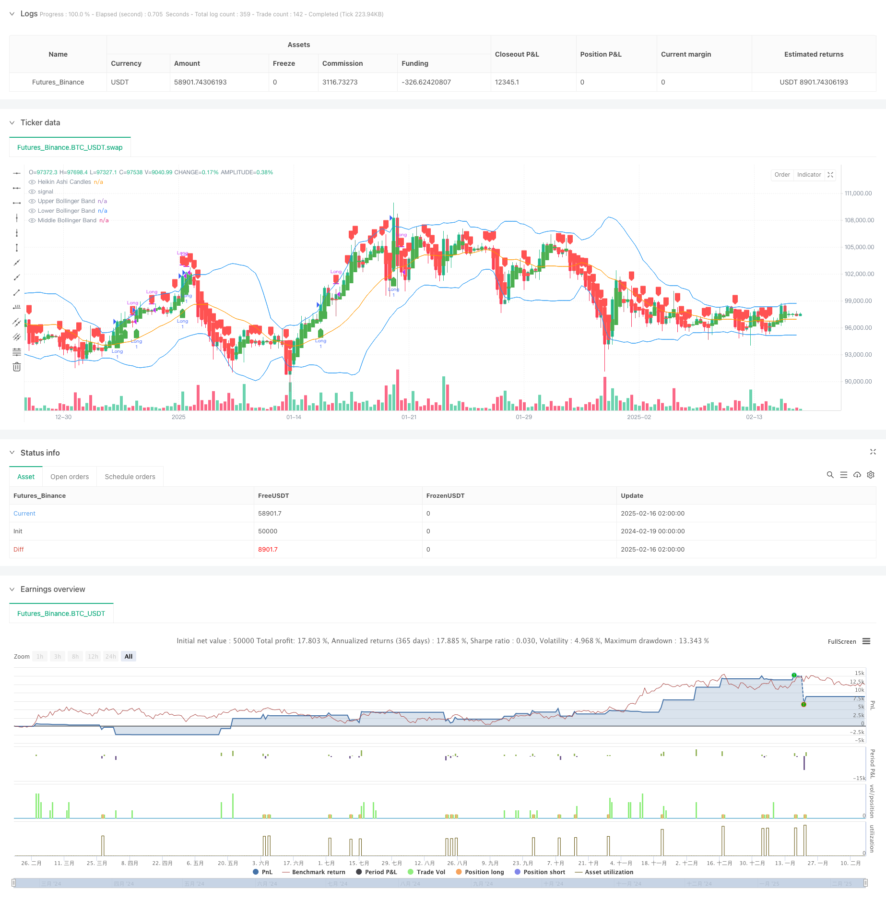

> Name

Multi-Indicator-Momentum-Breakout-with-Smoothed-Candlestick-Trading-Strategy
> Author

ChaoZhang

> Strategy Description



[trans]
#### Overview
This strategy is a breakout trading system that combines Bollinger Bands, RSI and Heikin Ashi. Through the combined use of multiple technical indicators, it can effectively filter market noise and capture high-probability breakthrough trading opportunities. The strategy adopts the concepts of trend following and momentum trading, entering the market after the breakthrough is confirmed, and using the reversal of the smooth K-line and RSI overbought as exit signals.
#### Strategy Principle
The core logic of the strategy is based on the synergy of the following three technical indicators:
1. Bollinger Bands are used to identify price fluctuation ranges and potential breakthrough locations. The 20-day moving average is used as the middle rail, and the upper and lower rails are 2 standard deviations from the middle rail.
2. The RSI indicator is used to confirm price momentum, using a 14-period setting. RSI greater than 50 indicates upward momentum.
3. Smooth K-line filters short-term price fluctuations by calculating the weighted average of the opening price, highest price, lowest price and closing price.
Admission conditions must be met at the same time:
- Smooth K line changes from red to green
- The closing price broke above the upper Bollinger Band
- RSI greater than 50
The exit conditions meet any of the following:
- Smooth K line changes from green to red
- RSI reaches overbought level of 70
#### Strategic Advantages
1. The combined use of multiple technical indicators improves the reliability of trading signals.
2. Smooth K-line effectively reduces the impact of false breakthroughs
3. The addition of RSI indicator ensures going long in the trend direction
4. Clear entry and exit mechanism to avoid subjective judgment
5. The strategy logic is simple, easy to understand and execute
6. Parameters can be flexibly adjusted according to different market characteristics
#### Strategy Risk
1. Frequent false signals may occur in volatile markets
2. The entry conditions are strict and some trading opportunities may be missed.
3. Reliance on technical indicators may fail when the market environment changes drastically.
4. Failure to consider the impact of fundamental factors on the market
5. Exit mechanism may result in missing out on larger profit margins
Risk control suggestions:
- Set a stop loss position to protect the safety of funds
- Adjust Bollinger Band parameters according to market fluctuations
- Combine more market analysis dimensions
- Strictly implement the trading plan
#### Strategy optimization direction
1. Introduce adaptive parameters:
- Dynamically adjust the Bollinger Bands multiplier based on market volatility
- Optimize RSI parameters based on market environment
2. Add filter conditions:
- Add volume confirmation
- Consider longer-term moving average trends
- Incorporation of market volatility indicators
3. Improve the stop loss mechanism:
- Design trailing stop loss
- Increase profit and loss ratio control
- Optimize warehouse management plan
4. Enhance signal system:
- Develop signal strength score
- Design signal confirmation mechanism
- Optimize the judgment of exit timing
#### Summary
This strategy builds a relatively complete trend following trading system through the combined application of Bollinger Bands, RSI and smooth K-line. The strategy logic is clear, the implementation standards are clear, and it has good practicality. By optimizing parameter settings and adding auxiliary indicators, the stability and reliability of the strategy are expected to be further improved. It is recommended that traders conduct sufficient backtest verification before applying the real offer, and make appropriate adjustments based on market characteristics and personal risk preferences. ||
#### Overview
This strategy is a breakout trading system that combines Bollinger Bands, Relative Strength Index (RSI), and Heikin Ashi candlesticks. Through the coordinated use of multiple technical indicators, it effectively filters market noise and captures high-probability breakout trading opportunities. The strategy adopts trend-following and momentum trading concepts, entering after breakout confirmation and using Heikin Ashi reversal and RSI overbought conditions as exit signals.

#### Strategy Principles
The core logic is based on the synergy of three technical indicators:
1. Bollinger Bands identify price volatility range and potential breakout positions, using 20-day moving average as the middle band, with upper and lower bands 2 standard deviations away.
2. RSI confirms price momentum, using 14-period settings, with RSI above 50 indicating upward momentum.
3. Heikin Ashi candlesticks filter short-term price fluctuations through weighted averages of open, high, low, and close prices.

Entry conditions require:
- Heikin Ashi candles turn from red to green
- Close price breaks above upper Bollinger Band
- RSI above 50

Exit conditions meet either:
- Heikin Ashi candles turn from green to red
- RSI reaches overbought level of 70

#### Strategy Advantages
1. Multiple technical indicators enhance trading signal reliability
2. Heikin Ashi candlesticks effectively reduce false breakouts
3. RSI inclusion ensures trading with trend direction
4. Clear entry and exit mechanisms avoid subjective judgment
5. Simple strategy logic, easy to understand and execute
6. Parameters can be flexibly adjusted for different market characteristics

#### Strategy Risks
1. May generate frequent false signals in ranging markets
2. Strict entry conditions might miss some trading opportunities
3. Reliance on technical indicators may fail during rapid market changes
4. Fundamental factors not considered in market analysis
5. Exit mechanism may lead to missed profit potential

Risk control suggestions:
- Set stop-loss positions to protect capital
- Adjust Bollinger Bands parameters based on market volatility
- Incorporate additional market analysis dimensions
- Strictly execute trading plan

#### Strategy Optimization Directions
1. Introduce adaptive parameters:
- Dynamically adjust Bollinger Bands multiplier based on market volatility
- Optimize RSI parameters based on market conditions

2. Add filtering conditions:
- Include volume confirmation
- Consider longer-term moving average trends
- Incorporate market volatility indicators

3. Improve stop-loss mechanism:
- Design trailing stop-loss
- Add risk-reward ratio control
- Optimize position management plan

4. Enhance signal system:
- Develop signal strength scoring
- Design signal confirmation mechanism
- Optimize exit timing determination

#### Summary
This strategy constructs a relatively complete trend-following trading system through the combined application of Bollinger Bands, RSI, and Heikin Ashi candlesticks. The strategy logic is clear with explicit execution standards, demonstrating good practicality. Through parameter optimization and additional auxiliary indicators, the strategy's stability and reliability can be further improved. Traders are advised to conduct thorough backtesting before live implementation and make appropriate adjustments based on market characteristics and personal risk preferences.[/trans]


> Source (PineScript)

``` pinescript
/*backtest
start: 2024-02-19 00:00:00
end: 2025-02-16 08:00:00
period: 6h
basePeriod: 6h
exchanges: [{"eid":"Futures_Binance","currency":"BTC_USDT"}]
*/

//@version=6
strategy("Bollinger Bands + RSI + Heikin Ashi Breakout", overlay=true)

// Input Settings
bbLength = input.int(20, title="Bollinger Bands Length")
bbMultiplier = input.float(2, title="Bollinger Bands Multiplier")
rsiLength = input.int(14, title="RSI Length")
rsiOverbought = input.float(70, title="RSI Overbought Level")

// Bollinger Bands
basis = ta.sma(close, bbLength)
dev = bbMultiplier * ta.stdev(close, bbLength)
upperBB = basis + dev
lowerBB = basis - dev

// Heikin Ashi Candle Calculations
var float heikinOpen = na  // Declare `heikinOpen` with an undefined initial value
var float heikinClose = na // Declare `heikinClose` with an undefined initial value

// Update Heikin Ashi values
heikinClose := (open + high + low + close) / 4
heikinOpen := na(heikinOpen[1]) ? (open + close) / 2 : (heikinOpen[1] + heikinClose[1]) / 2
heikinHigh = math.max(high, math.max(heikinOpen, heikinClose))
heikinLow = math.min(low, math.min(heikinOpen, heikinClose))

// RSI
rsi = ta.rsi(close, rsiLength)

// Entry Conditions
heikinGreen = heikinClose > heikinOpen
longCondition = heikinGreen and close > upperBB and rsi > 50

// Exit Conditions
heikinRed = heikinClose < heikinOpen
longExitCondition = heikinRed or rsi >= rsiOverbought

// Strategy Execution
if (longCondition)
    strategy.entry("Long", strategy.long)

if (longExitCondition)
    strategy.close("Long", comment="Exit Long")

// Plotting Bollinger Bands
plot(upperBB, color=color.blue, title="Upper Bollinger Band")
plot(lowerBB, color=color.blue, title="Lower Bollinger Band")
plot(basis, color=color.orange, title="Middle Bollinger Band")

// Heikin Ashi Visualization
plotcandle(heikinOpen, heikinHigh, heikinLow, heikinClose, color=(heikinGreen ? color.green : color.red), title="Heikin Ashi Candles")

// Debugging Signals
plotshape(longCondition, style=shape.labelup, location=location.belowbar, color=color.green, title="Long Entry Signal")
plotshape(longExitCondition, style=shape.labeldown, location=location.abovebar, color=color.red, title="Long Exit Signal")

```

> Detail

https://www.fmz.com/strategy/482472

> Last Modified

2025-02-18 15:38:21
