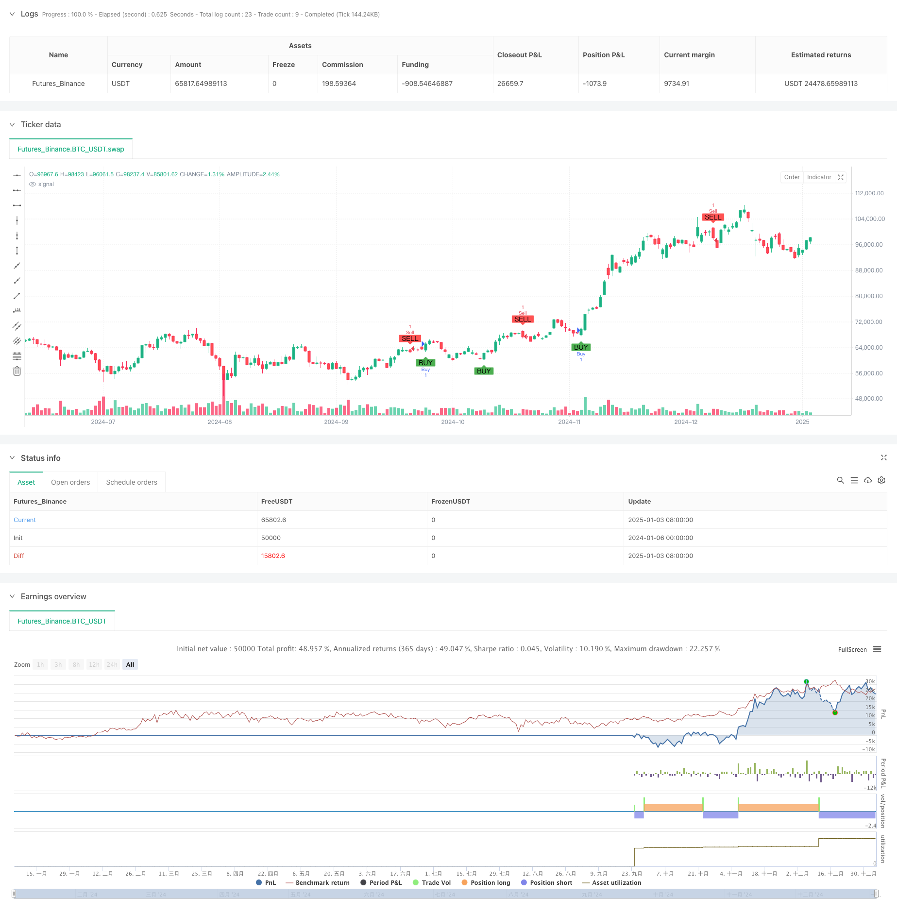

> Name

Multi-period daily K-line pattern signal trading strategy-Multi-Timeframe-Candlestick-Pattern-Trading-Strategy
> Author

ChaoZhang

> Strategy Description



[trans]
#### Overview
This is a trading strategy based on multi-cycle K-line pattern analysis. It mainly generates trading signals by identifying typical K-line patterns such as bullish engulfing, bearish engulfing and cross stars. The strategy operates on the daily cycle and determines the turning point of the market trend by combining multiple technical indicators and morphological characteristics to find the ideal trading entry time.
#### Strategy Principle
策略的核心逻辑是通过程序化方式识别三种经典的蜡烛图形态:
1. Bullish engulfing pattern: the previous K line is a negative line, the current K line is a positive line and completely includes the previous K line
2. Bearish engulfing pattern: the previous K line is a positive line, the current K line is a negative line and completely includes the previous K line
3. Cross star pattern: the difference between the opening price and the closing price is less than 10% of the height of the current K-line entity
When a bullish engulfing pattern is identified, a buy signal is displayed below the K line; when a bearish engulfing pattern is identified, a sell signal is displayed above the K line; when a cross star pattern is identified, a mark is placed on the top of the K line. The strategy implements signal labeling through the label.new() function and enhances the visualization of the signal through the plotshape() function.
#### Strategic Advantages
1. Clear signals: identify K-line patterns through strict mathematical definitions to avoid subjective judgments
2. 可视化强:使用不同颜色和形状标注各类信号,直观易懂
3. Risk controllable: Based on mature technical analysis theory, it has a good theoretical foundation
4. Timely notification: Integrated trading signal reminder function can realize automatic early warning
5. Flexible parameters: supports customized signal period and color scheme
#### Strategy Risk
1. Lagging risk: Confirmation of the K-line pattern requires waiting for the closing of the K-line, and the best entry opportunity may be missed.
2. Risk of false breakthrough: relying solely on the K-line pattern may trigger false signals
3. Market environment risk: Too many trading signals may be generated in a volatile market
4. 参数敏感性:十字星的判定阈值设置不当会影响信号质量
#### Strategy optimization direction
1. Introduce trading volume indicators: verify the validity of the pattern based on changes in trading volume
2. Add trend filtering: add trend indicators such as moving averages to filter counter-trend signals
3. Optimize signal confirmation: design multiple confirmation mechanisms to improve signal reliability
4. Improve the risk control module: add stop-loss and stop-profit functions to optimize fund management
5. Expanded form library: Add more recognition of classic K-line forms
#### Summary
This strategy implements classic K-line morphological analysis through a programmed approach and has good operability and scalability. Through reasonable parameter settings and risk control, it can provide valuable reference for trading decisions. In the future, the stability and reliability of the strategy can be improved by adding more technical indicators and optimizing the signal confirmation mechanism. ||
#### Overview
This is a multi-timeframe trading strategy based on candlestick pattern analysis, which generates trading signals by identifying bullish engulfing, bearish engulfing, and doji patterns. The strategy operates on daily timeframes, combining multiple technical indicators and pattern characteristics to identify market trend reversal points and optimal entry timing.

#### Strategy Principle
The core logic of the strategy is to programmatically identify three classic candlestick patterns:
1. Bullish Engulfing: Previous candle is bearish, current candle is bullish and completely engulfs the previous candle
2. Bearish Engulfing: Previous candle is bullish, current candle is bearish and completely engulfs the previous candle
3. Doji Pattern: The difference between open and close prices is less than 10% of the current candle's body height

Buy signals are displayed below the candle when bullish engulfing patterns are identified; sell signals are displayed above the candle for bearish engulfing patterns; and doji patterns are marked at the candle top. The strategy implements signal annotation through the label.new() function and enhances signal visualization using the plotshape() function.

#### Strategy Advantages
1. Clear Signals: Identifies candlestick patterns through strict mathematical definitions, avoiding subjective judgment
2. Strong Visualization: Uses different colors and shapes to mark various signals, making them intuitive and easy to understand
3. Controlled Risk: Based on mature technical analysis theory with a solid theoretical foundation
4. Timely Notifications: Integrates trading signal alerts for automatic warnings
5. Flexible Parameters: Supports customizable signal timeframes and color schemes

#### Strategy Risks
1. Lag Risk: Pattern confirmation requires waiting for candle closure, potentially missing optimal entry points
2. False Breakout Risk: Relying solely on candlestick patterns may trigger false signals
3. Market Environment Risk: May generate excessive trading signals in choppy markets
4. Parameter Sensitivity: Improper doji threshold settings can affect signal quality

#### Strategy Optimization Directions
1. Incorporate Volume Indicators: Validate pattern effectiveness by combining volume changes
2. Add Trend Filters: Include trend indicators like moving averages to filter counter-trend signals
3. Optimize Signal Confirmation: Design multiple confirmation mechanisms to improve signal reliability
4. Enhance Risk Control: Add stop-loss and take-profit functions, optimize money management
5. Expand Pattern Library: Include recognition of more classic candlestick patterns

#### Summary
The strategy implements classic candlestick pattern analysis programmatically, offering good operability and extensibility. Through appropriate parameter settings and risk control, it can provide valuable reference for trading decisions. Future improvements can focus on adding more technical indicators and optimizing signal confirmation mechanisms to enhance strategy stability and reliability.[/trans]


> Source (PineScript)

``` pinescript
/*backtest
start: 2024-01-06 00:00:00
end: 2025-01-04 08:00:00
period: 1d
basePeriod: 1d
exchanges: [{"eid":"Futures_Binance","currency":"BTC_USDT"}]
*/

//@version=5
strategy("Sensex Option Buy/Sell Signals", overlay=true)

// Input parameters
bullishColor = color.new(color.green, 0)
bearishColor = color.new(color.red, 0)
dojiColor = color.new(color.yellow, 0)

// Candlestick pattern identification
isBullishEngulfing = close[1] < open[1] and close > open and close > high[1] and open < low[1]
isBearishEngulfing = close[1] > open[1] and close < open and close < low[1] and open > high[1]
isDoji = math.abs(close - open) <= (high - low) * 0.1

// Plot buy/sell signals
buySignal = isBullishEngulfing
sellSignal = isBearishEngulfing

timeframeCondition = input.timeframe("D", title="Timeframe for signals")

// Buy Signal
if buySignal
    label.new(bar_index, high, "Buy", style=label.style_label_up, color=bullishColor, textcolor=color.white)
    strategy.entry("Buy", strategy.long)

// Sell Signal
if sellSignal
    label.new(bar_index, low, "Sell", style=label.style_label_down, color=bearishColor, textcolor=color.white)
    strategy.entry("Sell", strategy.short)

// Highlight Doji candles
if isDoji
    label.new(bar_index, high, "Doji", style=label.style_circle, color=dojiColor, textcolor=color.black)

// Alerts
alertcondition(buySignal, title="Buy Alert", message="Bullish Engulfing Pattern Detected")
alertcondition(sellSignal, title="Sell Alert", message="Bearish Engulfing Pattern Detected")

// Add plot shapes for visibility
plotshape(series=buySignal, title="Buy Signal", location=location.belowbar, color=bullishColor, style=shape.labelup, text="BUY")
plotshape(series=sellSignal, title="Sell Signal", location=location.abovebar, color=bearishColor, style=shape.labeldown, text="SELL")

```

> Detail

https://www.fmz.com/strategy/477606

> Last Modified

2025-01-06 16:40:11
