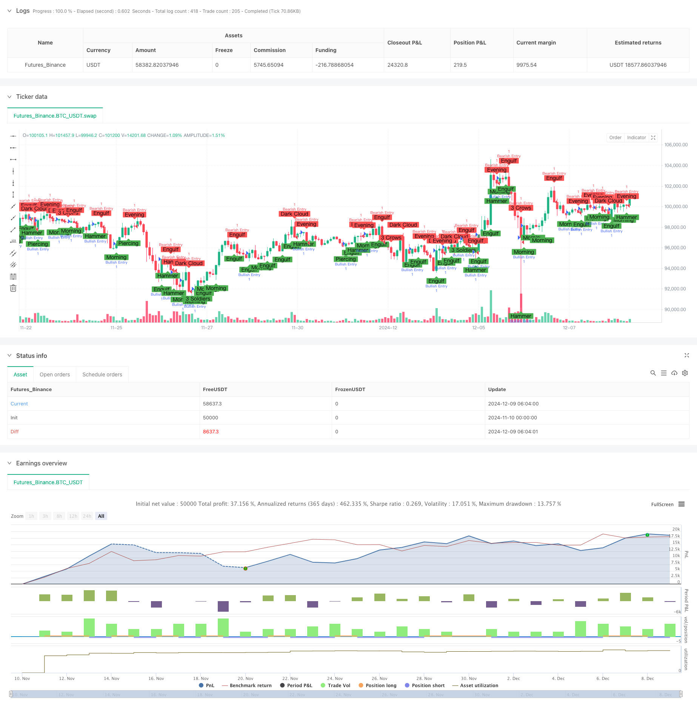

> Name

Multi-period combined K-line pattern recognition trading strategy-Multi-Timeframe-Combined-Candlestick-Pattern-Recognition-Trading-Strategy
> Author

ChaoZhang

> Strategy Description



[trans]
#### Overview
This strategy is an automated trading system based on K-line pattern recognition. It integrates ten classic K-line patterns, including five bullish patterns (hammer, bull engulfing, piercing line, morning star and three white soldiers) and five bearish patterns (hanging line, short engulfing, dark cloud cover, evening star and three black crows). The strategy provides traders with potential market reversal signals and trading opportunities through real-time identification and analysis of these patterns.
#### Strategy Principle
The core of the strategy is to achieve accurate identification of various K-line forms through programming. Each form has its own unique mathematical definition and conditional judgment:
1. For a single K-line form (such as hammer line, hanging line), the judgment is mainly based on the proportional relationship between the entity and the shadow line.
2. For the shape of two K lines (such as engulfing line and piercing line), judge by comparing the opening and closing price positions of the two adjacent K lines.
3. For the three K-line pattern (such as three white soldiers, three black crows), the trend direction and position relationship of three consecutive K-lines need to be satisfied at the same time.
Policies allow users to flexibly choose to enable or disable the recognition of specific patterns through parameter settings.
#### Strategic Advantages
1. Comprehensiveness: Covers the ten most representative K-line forms and can capture different types of market reversal signals
2. Flexibility: Users can freely choose the combination of patterns they need to identify based on the market environment and personal trading style.
3. Visualization: Through a clear marking system, the location and type of various forms can be visually displayed.
4. Automation: A completely programmed judgment process that avoids the subjectivity and emotion of human judgment.
5. Practicality: The strategy logic is clear and easy to use in conjunction with other technical indicators or trading systems.
#### Strategy Risk
1. Lagging risk: Confirmation of the K-line pattern requires waiting for the closing of the K-line, which may lead to a slight delay in entry timing.
2. Risk of false signals: In a volatile market, relying solely on K-line patterns may produce many false signals.
3. Market environment dependence: The strategy performs better in markets with obvious trends, but may not be effective in sideways markets.
4. Parameter setting risk: too much enabling of pattern recognition may cause signals to be too dense, affecting judgment.
5. Stop loss control risk: The strategy itself does not include a complete stop loss mechanism and requires additional risk control measures.
#### Strategy optimization direction
1. Introduce trend filtering: combine with moving averages or trend indicators to filter out counter-trend signals
2. Increase trading volume confirmation: verify the validity of the pattern through changes in trading volume
3. Improve risk control: add dynamic stop loss and profit target setting functions
4. Optimize morphological parameters: adjust parameter standards for morphological recognition according to different markets and time periods
5. Add form weight: Set different signal weight systems according to the reliability of different forms.
#### Summary
This is a K-line pattern recognition trading strategy with reasonable design and clear logic. It realizes the most commonly used K-line pattern judgment in traditional technical analysis through programmed methods, providing traders with an objective and systematic trading tool. Although there are some inherent limitations, through appropriate optimization and cooperation with other technical tools, this strategy can provide valuable reference signals for trading decisions. The modular design of the strategy also provides a good foundation for subsequent function expansion and performance optimization.
|| 

#### Overview
This strategy is an automated trading system based on candlestick pattern recognition. It integrates ten classic candlestick patterns, including five bullish patterns (Hammer, Bullish Engulfing, Piercing Line, Morning Star, and Three White Soldiers) and five bearish patterns (Hanging Man, Bearish Engulfing, Dark Cloud Cover, Evening Star, and Three Black Crows). Through real-time identification and analysis of these patterns, the strategy provides traders with potential market reversal signals and trading opportunities.

#### Strategy Principle
The core of the strategy lies in its programmatic implementation of precise candlestick pattern recognition. Each pattern has its unique mathematical definition and condition criteria:
1. For single candlestick patterns (like Hammer, Hanging Man), judgment is primarily based on the ratio between body and shadow
2. For two-candlestick patterns (like Engulfing, Piercing Line), judgment is made by comparing the relative positions of adjacent candlesticks' open and close prices
3. For three-candlestick patterns (like Three White Soldiers, Three Black Crows), multiple conditions regarding trend direction and position relationships must be satisfied simultaneously
The strategy allows users to flexibly enable or disable specific pattern recognition through parameter settings.

#### Strategy Advantages
1. Comprehensiveness: Covers the most representative ten candlestick patterns, capable of capturing different types of market reversal signals
2. Flexibility: Users can freely choose pattern combinations based on market conditions and personal trading style
3. Visualization: Clear marking system provides intuitive display of pattern locations and types
4. Automation: Fully programmed judgment process eliminates subjective and emotional human judgment
5. Practicality: Clear strategy logic facilitates combination with other technical indicators or trading systems

#### Strategy Risks
1. Lag Risk: Pattern confirmation requires waiting for candle closure, potentially causing slight entry delays
2. False Signal Risk: Relying solely on candlestick patterns may generate numerous false signals in choppy markets
3. Market Environment Dependency: Strategy performs better in trending markets but may underperform in ranging markets
4. Parameter Setting Risk: Enabling too many pattern recognitions may lead to overcrowded signals affecting judgment
5. Stop Loss Control Risk: Strategy lacks built-in comprehensive stop-loss mechanisms, requiring additional risk control measures

#### Strategy Optimization Directions
1. Implement Trend Filtering: Combine with moving averages or trend indicators to filter out counter-trend signals
2. Add Volume Confirmation: Validate pattern effectiveness through volume changes
3. Enhance Risk Control: Add dynamic stop-loss and profit target setting functionality
4. Optimize Pattern Parameters: Adjust pattern recognition parameters for different markets and timeframes
5. Add Pattern Weighting: Set up different signal weighting systems based on pattern reliability

#### Summary
This is a well-designed and logically clear candlestick pattern recognition trading strategy. It implements traditional technical analysis's most commonly used candlestick pattern judgments through programming, providing traders with an objective and systematic trading tool. While it has some inherent limitations, through appropriate optimization and combination with other technical tools, this strategy can provide valuable reference signals for trading decisions. The strategy's modular design also provides a good foundation for subsequent functional expansion and performance optimization.[/trans]


> Source (PineScript)

``` pinescript
/*backtest
start: 2024-11-10 00:00:00
end: 2024-12-09 08:00:00
period: 2h
basePeriod: 2h
exchanges: [{"eid":"Futures_Binance","currency":"BTC_USDT"}]
*/

//@version=5
// Author: Raymond Ngobeni
strategy('Candlestick Pattern Strategy [Ubaton]', 'Ubaton - Candlestick Pattern Strategy', overlay = true, max_labels_count = 500, max_lines_count = 500, max_boxes_count = 500)

// User Inputs: Enable/Disable Patterns
// Bullish Patterns
enableHammer = input.bool(true, "Show Hammer")
enableBullEngulfing = input.bool(true, "Show Bullish Engulfing")
enablePiercingLine = input.bool(true, "Show Piercing Line")
enableMorningStar = input.bool(true, "Show Morning Star")
enableThreeWhiteSoldiers = input.bool(true, "Show Three White Soldiers")

// Bearish Patterns
enableHangingMan = input.bool(true, "Show Hanging Man")
enableBearEngulfing = input.bool(true, "Show Bearish Engulfing")
enableDarkCloudCover = input.bool(true, "Show Dark Cloud Cover")
enableEveningStar = input.bool(true, "Show Evening Star")
enableThreeBlackCrows = input.bool(true, "Show Three Black Crows")

// Helper Functions
isHammer() =>
    bodySize = math.abs(open - close)
    shadowSize = low < math.min(open, close) ? math.min(open, close) - low : na
    shadowSize >= 2 * bodySize and high - math.max(open, close) <= bodySize

isBullishEngulfing() =>
    close[1] < open[1] and close > open and open <= close[1] and close >= open[1]

isPiercingLine() =>
    close[1] < open[1] and close > close[1] + (open[1] - close[1]) * 0.5 and close < open[1]

isMorningStar() =>
    close[2] < open[2] and math.abs(close[1] - open[1]) < (high[1] - low[1]) * 0.3 and close > open

isThreeWhiteSoldiers() =>
    close > open and close[1] > open[1] and close[2] > open[2] and open > close[1] and open[1] > close[2]

isHangingMan() =>
    bodySize = math.abs(open - close)
    shadowSize = low < math.min(open, close) ? math.min(open, close) - low : na
    shadowSize >= 2 * bodySize and high - math.max(open, close) <= bodySize and close < open

isBearishEngulfing() =>
    close[1] > open[1] and close < open and open >= close[1] and close <= open[1]

isDarkCloudCover() =>
    close[1] > open[1] and open > close[1] and close < open[1] and close < close[1] + (open[1] - close[1]) * 0.5

isEveningStar() =>
    close[2] > open[2] and math.abs(close[1] - open[1]) < (high[1] - low[1]) * 0.3 and close < open

isThreeBlackCrows() =>
    close < open and close[1] < open[1] and close[2] < open[2] and open < close[1] and open[1] < close[2]

// Detect Patterns
// Bullish
hammerDetected = enableHammer and isHammer()
bullEngulfDetected = enableBullEngulfing and isBullishEngulfing()
piercingDetected = enablePiercingLine and isPiercingLine()
morningStarDetected = enableMorningStar and isMorningStar()
threeWhiteDetected = enableThreeWhiteSoldiers and isThreeWhiteSoldiers()

// Bearish
hangingManDetected = enableHangingMan and isHangingMan()
bearEngulfDetected = enableBearEngulfing and isBearishEngulfing()
darkCloudDetected = enableDarkCloudCover and isDarkCloudCover()
eveningStarDetected = enableEveningStar and isEveningStar()
threeBlackDetected = enableThreeBlackCrows and isThreeBlackCrows()

// Plot Bullish Patterns
plotshape(enableHammer and hammerDetected, title="Hammer", location=location.belowbar, color=color.green, style=shape.labelup, text="Hammer")
plotshape(enableBullEngulfing and bullEngulfDetected, title="Bullish Engulfing", location=location.belowbar, color=color.green, style=shape.labelup, text="Engulf")
plotshape(enablePiercingLine and piercingDetected, title="Piercing Line", location=location.belowbar, color=color.green, style=shape.labelup, text="Piercing")
plotshape(enableMorningStar and morningStarDetected, title="Morning Star", location=location.belowbar, color=color.green, style=shape.labelup, text="Morning")
plotshape(enableThreeWhiteSoldiers and threeWhiteDetected, title="Three White Soldiers", location=location.belowbar, color=color.green, style=shape.labelup, text="3 Soldiers")

// Plot Bearish Patterns
plotshape(enableHangingMan and hangingManDetected, title="Hanging Man", location=location.abovebar, color=color.red, style=shape.labeldown, text="Hanging")
plotshape(enableBearEngulfing and bearEngulfDetected, title="Bearish Engulfing", location=location.abovebar, color=color.red, style=shape.labeldown, text="Engulf")
plotshape(enableDarkCloudCover and darkCloudDetected, title="Dark Cloud Cover", location=location.abovebar, color=color.red, style=shape.labeldown, text="Dark Cloud")
plotshape(enableEveningStar and eveningStarDetected, title="Evening Star", location=location.abovebar, color=color.red, style=shape.labeldown, text="Evening")
plotshape(enableThreeBlackCrows and threeBlackDetected, title="Three Black Crows", location=location.abovebar, color=color.red, style=shape.labeldown, text="3 Crows")

// Strategy Execution
if hammerDetected or bullEngulfDetected or piercingDetected or morningStarDetected or threeWhiteDetected
    strategy.entry("Bullish Entry", strategy.long)

if hangingManDetected or bearEngulfDetected or darkCloudDetected or eveningStarDetected or threeBlackDetected
    strategy.entry("Bearish Entry", strategy.short)
```

> Detail

https://www.fmz.com/strategy/474631

> Last Modified

2024-12-11 11:04:35
