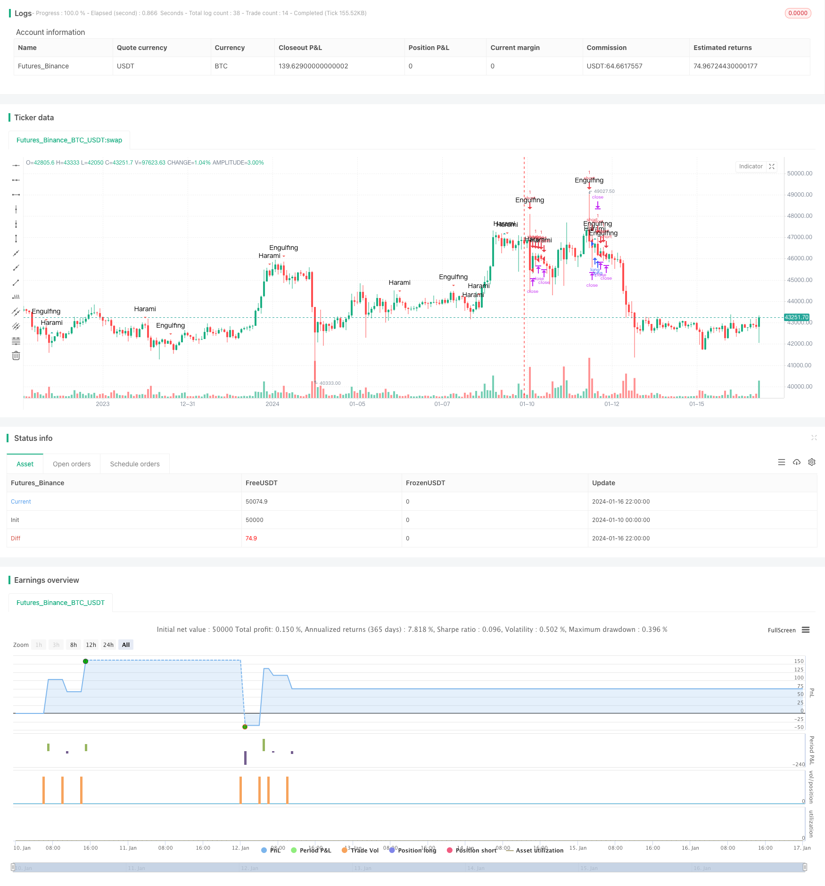

> Name

Candlestick-Patterns-Strategy
> Author

ChaoZhang

> Strategy Description


 [trans]
## Overview
This strategy identifies buy and sell signals by identifying multiple price pattern patterns in candlestick charts. This strategy combines technical analysis methods such as Tangle Theory and Dow Theory, and uses more than a dozen common graphic patterns to capture market turning points.
## Strategy Principle
The core of this strategy is to identify different K-line forms, including wrapping lines, Harami lines, piercing lines, morning star lines, etc. When a positive line pattern is identified, a buy signal is generated; when a negative line pattern is identified, a sell signal is generated.
For example, when the three white soldiers pattern is identified, it means that the first three K lines are all long positive lines, and the closing price of each K line is higher than the opening price, which means that strong buying is pushing up the stock price, so a buy signal is generated.
Each form has a specific algorithm to identify it. The strategy will traverse the historical K-line to determine whether each bar satisfies a certain form of construction algorithm. Once satisfied, a graph will be drawn on the corresponding bar to mark the signal.
## Strategic Advantages
1. Combine multiple forms of judgment to improve the winning rate
2. Automatically identify forms without manual judgment.
3. Use visual markers, intuitive and clear
4. Control risks by combining stop-loss and stop-profit mechanisms
## Risk and Optimization
1. There is a probability of pattern failure, and losses cannot be completely avoided.
2. The stop loss ratio can be appropriately adjusted to reduce single losses.
3. Trend judgment can be added to avoid reverse patterns
4. Can optimize trading session settings and reduce overnight risks
## Optimization suggestions
1. Add more auxiliary form judgments
2. Filter signals based on trend indicators
3. Optimize the stop-loss and take-profit ratios
4. You can try machine learning methods to identify patterns
5. Add position opening volume control
## Summarize
This strategy uses graphic technical analysis to identify multiple key forms on the K line and determine the future trend of the market. The strategy has strong practicality, but traders also need to pay attention to the broader market environment to avoid missing the general trend due to local patterns. Through further optimization, it is expected to improve the stability and profitability of the strategy.
||

## Overview  

This strategy determines buy and sell signals by identifying various price pattern formations on the candlestick chart. The strategy incorporates technical analysis methods such as Chanlun and Dow Theories, utilizing more than a dozen common graphical patterns to capture inflection points in the market.

## Strategy Principle  

The core of this strategy lies in recognizing different candlestick patterns, including engulfing lines, harami lines, piercing lines, morning stars etc. When a bullish pattern is identified, a buy signal is generated; when a bearish pattern is detected, a sell signal is triggered. 

For example, when the Three White Soldiers pattern is recognized, it means that the last three candlesticks are all long green candles, and the closing price of each candle exceeds its opening price, indicating the strong buying is pushing up the price, so a buy signal is generated.

Each pattern has a specific algorithm to identify. The strategy scans through the historical candlesticks, judging if each bar meets the formulation algorithm of a certain pattern, and once it does, plot a graphical marker on that bar marking out that signal.

## Advantages  

1. Combining judgments of various patterns improves winning rate  
2. Automatically pattern recognition without manual interference
3. Visualized markers gives intuitiveness  
4. Controlling risks by integrating stop loss and take profit

## Risks and Optimization

1. Probability of failure still exists for patterns identification
2. Fine tune the stop loss ratio properly to lower per trade loss  
3. Adding trend judgment to avoid reverse patterns
4. Optimize session setting to eliminate overnight risks

## Optimization Suggestions

1. Include more auxiliary pattern judgments 
2. Add trend indicator filters for entry signals
3. Optimize ratios of stop loss and take profit  
4. Try machine learning methods to recognize patterns
5. Add position sizing control 

## Summary  

This strategy determines future market moves by analyzing graphical patterns formed on the candlesticks bars using technical tools. The strategy is practical to use, but traders still need to take account of the general market environment, avoiding missing major trends because of local shapes. By further optimizations, it is promising to enhance the stability and profitability of the strategy.

[/trans]

> Strategy Arguments


|Argument|Default|Description|
|----|----|----|
|v_input_1|true|Engulfing|
|v_input_2|true|Harami|
|v_input_3|true|Piercing Line / Dark Cloud Cover|
|v_input_4|true|Morning Star / Evening Star |
|v_input_5|true|Belt Hold|
|v_input_6|true|Three White Soldiers / Three Black Crows|
|v_input_7|true|Three Stars in the South|
|v_input_8|true|Stick Sandwich|
|v_input_9|true|Meeting Line|
|v_input_10|true|Kicking|
|v_input_11|true|Ladder Bottom|
|v_input_12|70|Stop Loss|
|v_input_13|1000|Take Profit|
|v_input_14|30|Trailing Stop|
|v_input_15|0000-0000|Trading session|


> Source (PineScript)

``` pinescript
/*backtest
start: 2024-01-10 00:00:00
end: 2024-01-17 00:00:00
period: 2h
basePeriod: 15m
exchanges: [{"eid":"Futures_Binance","currency":"BTC_USDT"}]
*/

//@version=2
strategy("Candle Patterns Strategy", shorttitle="CPS", overlay=true)

//--- Patterns Input ---

OnEngulfing = input(defval=true, title="Engulfing", type=bool)
OnHarami = input(defval=true, title="Harami", type=bool)
OnPiercingLine = input(defval=true, title="Piercing Line / Dark Cloud Cover", type=bool)
OnMorningStar = input(defval=true, title="Morning Star / Evening Star ", type=bool)
OnBeltHold = input(defval=true, title="Belt Hold", type=bool)
OnThreeWhiteSoldiers = input(defval=true, title="Three White Soldiers / Three Black Crows", type=bool)
OnThreeStarsInTheSouth = input(defval=true, title="Three Stars in the South", type=bool)
OnStickSandwich = input(defval=true, title="Stick Sandwich", type=bool)
OnMeetingLine = input(defval=true, title="Meeting Line", type=bool)
OnKicking = input(defval=true, title="Kicking", type=bool)
OnLadderBottom = input(defval=true, title="Ladder Bottom", type=bool)

//--- Risk Management Input ---

inpsl = input(defval = 70, title="Stop Loss", minval = 0)
inptp = input(defval = 1000, title="Take Profit", minval = 0)
inptrail = input(defval = 30, title="Trailing Stop", minval = 0)
// If the zero value is set for stop loss, take profit or trailing stop, then the function is disabled
sl = inpsl >= 1 ? inpsl : na
tp = inptp >= 1 ? inptp : na
trail = inptrail >= 1 ? inptrail : na

//--- Session Input ---

sess = input(defval = "0000-0000", title="Trading session")
t = time(timeframe.period, sess)
session_open = true

// --- Candlestick Patterns ---

//Engulfing 
bullish_engulfing = high[0]>high[1] and low[0]<low[1] and open[0]<open[1] and close[0]>close[1] and close[0]>open[0] and close[1]<close[2] and close[0]>open[1] ? OnEngulfing : na
bearish_engulfing = high[0]>high[1] and low[0]<low[1] and open[0]>open[1] and close[0]<close[1] and close[0]<open[0] and close[1]>close[2] and close[0]<open[1] ? OnEngulfing : na

//Harami
bullish_harami =  open[1]>close[1] and close[1]<close[2] and open[0]>close[1] and open[0]<open[1] and close[0]>close[1] and close[0]<open[1] and high[0]<high[1] and low[0]>low[1] and close[0]>=open[0] ? OnHarami : na
bearish_harami =   open[1]<close[1] and close[1]>close[2] and open[0]<close[1] and open[0]>open[1] and close[0]<close[1] and close[0]>open[1] and high[0]<high[1] and low[0]>low[1] and close[0]<=open[0] ? OnHarami : na

//Piercing Line/Dark Cloud Cover 
piercing_line = close[2]>close[1] and open[0]<low[1] and close[0]>avg(open[1],close[1]) and close[0]<open[1] ? OnPiercingLine : na
dark_cloud_cover = close[2]<close[1] and open[0]>high[1] and close[0]<avg(open[1],close[1]) and close[0]>open[1] ? OnPiercingLine : na

//Morning Star/Evening Star
morning_star = close[3]>close[2] and close[2]<open[2] and open[1]<close[2] and close[1]<close[2] and open[0]>open[1] and open[0]>close[1] and close[0]>close[2] and open[2]-close[2]>close[0]-open[0] ? OnMorningStar : na
evening_star = close[3]<close[2] and close[2]>open[2] and open[1]>close[2] and close[1]>close[2] and open[0]<open[1] and open[0]<close[1] and close[0]<close[2] and close[2]-open[2]>open[0]-close[0] ? OnMorningStar : na

//Belt Hold
bullish_belt_hold = close[1]<open[1] and low[1]>open[0] and close[1]>open[0] and open[0]==low[0] and close[0]>avg(close[0],open[0]) ? OnBeltHold :na
bearish_belt_hold =  close[1]>open[1] and high[1]<open[0] and close[1]<open[0] and open[0]==high[0] and close[0]<avg(close[0],open[0]) ? OnBeltHold :na

//Three White Soldiers/Three Black Crows 
three_white_soldiers = close[3]<open[3] and open[2]<close[3] and close[2]>avg(close[2],open[2]) and open[1]>open[2] and open[1]<close[2] and close[1]>avg(close[1],open[1]) and open[0]>open[1] and open[0]<close[1] and close[0]>avg(close[0],open[0]) and high[1]>high[2] and high[0]>high[1] ? OnThreeWhiteSoldiers : na
three_black_crows =  close[3]>open[3] and open[2]>close[3] and close[2]<avg(close[2],open[2]) and open[1]<open[2] and open[1]>close[2] and close[1]<avg(close[1],open[1]) and open[0]<open[1] and open[0]>close[1] and close[0]<avg(close[0],open[0]) and low[1]<low[2] and low[0]<low[1] ? OnThreeWhiteSoldiers : na

//Three Stars in the South
three_stars_in_the_south = open[3]>close[3] and open[2]>close[2] and open[2]==high[2] and open[1]>close[1] and open[1]<open[2] and open[1]>close[2] and low[1]>low[2] and open[1]==high[1] and open[0]>close[0] and open[0]<open[1] and open[0]>close[1] and open[0]==high[0] and close[0]==low[0] and close[0]>=low[1] ? OnThreeStarsInTheSouth : na

//Stick Sandwich
stick_sandwich = open[2]>close[2] and open[1]>close[2] and open[1]<close[1] and open[0]>close[1] and open[0]>close[0] and close[0]==close[2] ? OnStickSandwich : na

//Meeting Line 
bullish_ml = open[2]>close[2] and open[1]>close[1] and close[1]==close[0] and open[0]<close[0] and open[1]>=high[0] ? OnMeetingLine : na
bearish_ml = open[2]<close[2] and open[1]<close[1] and close[1]==close[0] and open[0]>close[0] and open[1]<=low[0] ? OnMeetingLine : na

//Kicking 
bullish_kicking =  open[1]>close[1] and open[1]==high[1] and close[1]==low[1] and open[0]>open[1] and open[0]==low[0] and close[0]==high[0] and close[0]-open[0]>open[1]-close[1] ? OnKicking : na
bearish_kicking = open[1]<close[1] and open[1]==low[1] and close[1]==high[1] and open[0]<open[1] and open[0]==high[0] and close[0]==low[0] and open[0]-close[0]>close[1]-open[1] ? OnKicking : na

//Ladder Bottom
ladder_bottom = open[4]>close[4] and open[3]>close[3] and open[3]<open[4] and open[2]>close[2] and open[2]<open[3] and open[1]>close[1] and open[1]<open[2] and open[0]<close[0] and open[0]>open[1] and low[4]>low[3] and low[3]>low[2] and low[2]>low[1] ? OnLadderBottom : na

// ---Plotting ---

plotshape(bullish_engulfing, text='Engulfing', style=shape.triangleup, color=#1FADA2, editable=true, title="Bullish Engulfing Text")
plotshape(bearish_engulfing,text='Engulfing', style=shape.triangledown, color=#F35A54, editable=true, title="Bearish Engulfing Text")
plotshape(bullish_harami,text='Harami', style=shape.triangleup, color=#1FADA2, editable=true, title="Bullish Harami Text")
plotshape(bearish_harami,text='Harami', style=shape.triangledown, color=#F35A54, editable=true, title="BEarish Harami Text")
plotshape(piercing_line,text='Piercing Line', style=shape.triangleup, color=#1FADA2, editable=false)
plotshape(dark_cloud_cover,text='Dark Cloud Cover', style=shape.triangledown, color=#F35A54, editable=false)
plotshape(morning_star,text='Morning Star', style=shape.triangleup, color=#1FADA2, editable=false)
plotshape(evening_star,text='Evening Star', style=shape.triangledown, color=#F35A54, editable=false)
plotshape(bullish_belt_hold,text='Belt Hold', style=shape.triangleup, color=#1FADA2, editable=false)    
plotshape(bearish_belt_hold,text='Belt Hold', style=shape.triangledown, color=#F35A54, editable=false)
plotshape(three_white_soldiers,text='Three White Soldiers', style=shape.triangleup, color=#1FADA2, editable=false)
plotshape(three_black_crows,text='Three Black Crows', style=shape.triangledown, color=#F35A54, editable=false)
plotshape(three_stars_in_the_south,text='3 Stars South', style=shape.triangleup, color=#1FADA2, editable=false)
plotshape(stick_sandwich,text='Stick Sandwich', style=shape.triangleup, color=#1FADA2, editable=false)
plotshape(bullish_ml,text='Meeting Line', style=shape.triangleup, color=#1FADA2, editable=false)
plotshape(bearish_ml,text='Meeting Line', style=shape.triangledown, color=#F35A54, editable=false)
plotshape(bullish_kicking,text='Kicking', style=shape.triangleup, color=#1FADA2, editable=false)
plotshape(bearish_kicking,text='Kicking', style=shape.triangledown, color=#F35A54, editable=false)
plotshape(ladder_bottom,text='Ladder Bottom', style=shape.triangleup, color=#1FADA2, editable=false)

// --- STRATEGY ---

SignalUp = bullish_engulfing or bullish_harami or piercing_line or morning_star or bullish_belt_hold or three_white_soldiers or three_stars_in_the_south or stick_sandwich or bullish_ml or bullish_kicking or ladder_bottom
SignalDown = bearish_engulfing or bearish_harami or dark_cloud_cover or evening_star or bearish_belt_hold or three_black_crows or bearish_ml or bearish_kicking

strategy.entry("long", true, when = SignalUp and session_open)
strategy.entry("short", false, when = SignalDown and session_open)
strategy.close("long", when = not session_open)
strategy.close("short", when = not session_open)
strategy.exit("Risk Exit long", from_entry = "long", profit = tp, trail_points = trail, loss = sl)
strategy.exit("Risk Exit short", from_entry = "short", profit = tp, trail_points = trail, loss = sl )
```

> Detail

https://www.fmz.com/strategy/439228

> Last Modified

2024-01-18 15:14:13
