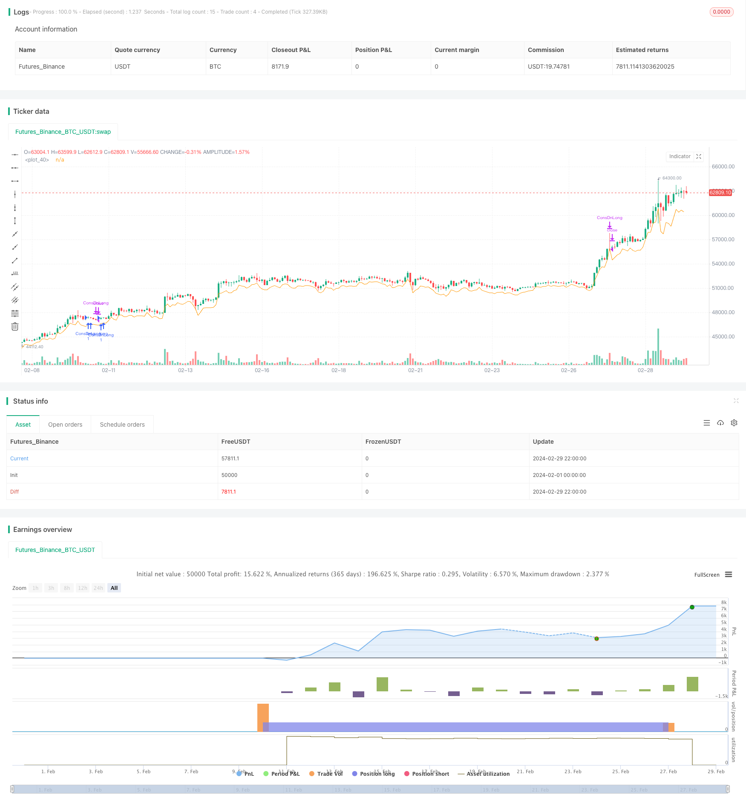

> Name

Consecutive-Candlestick-Reversal-Breakout-Strategy
> Author

ChaoZhang

> Strategy Description


[trans]

## Strategy Overview
The core idea of the continuous K-line reversal breakthrough strategy is to capture trading opportunities when the stock price shows a reversal signal and breaks through important resistance levels after a period of continuous decline. This strategy sets parameters such as the number of consecutive falling K-lines, the number of consecutive rising K-lines, and stop-loss conditions. It opens a long position when specific conditions are met and closes the position when the stop-loss condition is triggered.
## Strategy Principle
1. Set the entry conditions: When the stock price continuously drops by
2. Set stop-loss conditions: After opening a position, if the stock price is lower than the lowest closing price of the previous K-lines, or lower than the highest price at the time of opening minus 2 times ATR (average true volatility), the stop-loss condition will be triggered and the position will be closed.
3. Record the corresponding entry price and stop-loss price every time a position is opened, and reset the parameters after closing the position to prepare for the next transaction.
4. Use pine script to write strategy code, which can be backtested and optimized on platforms such as TradingView.
The key to the strategy lies in correctly identifying reversal signals and setting appropriate parameters. How many K lines have fallen continuously and how many K lines have risen continuously are two important parameters that need to be optimized based on the backtest results. In addition, the setting of stop loss conditions is also critical. It is necessary to control risks and not stop losses too early, resulting in missed opportunities.
## Strategic Advantages
1. Suitable for volatile markets and early trends: This strategy opens a position when a reversal signal appears after the stock price has adjusted for a period of time, making it easier to capture opportunities at the beginning of the trend.
2. Timely stop loss control risk: By setting stop loss conditions based on previous lows and ATR, you can close positions in time and control losses when the stock price drops again.
3. Adjustable parameters and strong adaptability: parameters such as the number of consecutive K lines and stop loss conditions can be adjusted according to market characteristics and personal preferences to enhance the adaptability of the strategy.
## Strategy Risk
1. Improper parameter selection leads to frequent transactions: If the number of consecutive K lines is set too small, it may cause the strategy to frequently open and close positions, increasing transaction costs.
2. Improper stop-loss position setting leads to increased losses: If the stop-loss position is set too wide, it may cause excessive losses in a single transaction; if the stop-loss position is set too narrow, it may cause profitable transactions to be stopped prematurely.
3. For long-term trending market, the strategy performance is average: This strategy is more suitable for use in volatile markets and early trends. For long-term stable trending market, it may not be able to fully enjoy the rising market.
4. Lack of position management and fund management: The current strategy code does not reflect the content of position management and fund management. In practical applications, these contents need to be added to improve the stability of the strategy.
## Strategy optimization direction
1. Optimize the number of continuous K-lines: By backtesting different parameter combinations, find out the number of continuous falling K-lines and the number of continuous rising K-lines that have performed best in the recent period.
2. Optimize stop loss conditions: You can consider using more dynamic stop loss conditions, such as setting stop loss positions based on ATR or percentage to adapt to different market fluctuations.
3. Add long-short two-way trading: The current strategy only has one direction: long. You can consider adding a short-selling strategy to capture rising and falling opportunities at the same time.
4. Introduce position management and fund management: Dynamically adjust the position size of each transaction based on account capital status and risk preference, and set overall risk limits to improve the robustness of the strategy.
5. Combine with other technical indicators or signals: This strategy can be combined with other technical indicators (such as RSI, MACD, etc.) or trading signals (such as breakthroughs, patterns, etc.) to improve the accuracy of opening and closing positions.
## Strategy summary
The continuous K-line reversal breakthrough strategy makes trading decisions by capturing reversal signals after a continuous decline in stock prices. This strategy is simple and easy to understand, suitable for use in volatile markets and early trends. By setting parameters such as the number of consecutive K lines and stop loss conditions, it can be flexibly adapted to different market conditions. However, this strategy also has some limitations, such as general adaptability to long-term trend conditions, lack of position management and fund management, etc.
In practical applications, strategies need to be optimized and improved based on market characteristics and one's own risk preferences. For example, optimize the number of consecutive K lines and the setting of stop loss conditions, add long and short two-way trading, introduce position management and fund management, and combine it with other technical indicators and trading signals. This can improve the profitability of the strategy while controlling risks and achieving stable investment returns.
In general, the continuous K-line reversal breakthrough strategy is a simple and practical trading strategy that is worthy of further exploration and optimization in practice. However, no strategy is omnipotent. Investors also need to combine their own experience and judgment, make prudent decisions and strictly implement them in order to remain invincible in the market for a long time.
|| 


## Strategy Overview
The core idea of the Consecutive Candlestick Reversal Breakout Strategy is to capture trading opportunities when the stock price shows a reversal signal and breaks through important resistance levels after a period of consecutive declines. The strategy sets parameters such as the number of consecutive down candles, the number of consecutive up candles, and stop-loss conditions. When specific conditions are met, it enters a long position, and closes the position when the stop-loss conditions are triggered.

## Strategy Principle
1. Set entry conditions: When the stock price has fallen for X consecutive candles, followed by Y consecutive up candles, and the strategy currently has no position, the entry condition is triggered, and a long position is opened.
2. Set stop-loss conditions: After opening a position, if the stock price falls below the lowest closing price of the previous few candles, or falls below the highest price at the time of entry minus 2 times the ATR (Average True Range), the stop-loss condition is triggered, and the position is closed.
3. Record the corresponding entry price and stop-loss price for each entry, and reset the parameters after closing the position to prepare for the next trade.
4. Use pine script to write the strategy code, which can be backtested and optimized on platforms like TradingView.

The key to the strategy lies in correctly identifying reversal signals and setting appropriate parameters. The number of consecutive down candles and the number of consecutive up candles are two important parameters that need to be optimized based on the backtest results. In addition, setting the stop-loss conditions is also crucial. It needs to control risk while not closing positions too early and missing opportunities.

## Strategy Advantages
1. Suitable for oscillating markets and early stages of trends: The strategy opens positions when a reversal signal appears after a period of price adjustment, making it easier to capture opportunities at the beginning of a trend.
2. Timely stop-loss to control risk: By setting stop-loss conditions based on previous lows and ATR, positions can be closed in a timely manner when the stock price falls again, controlling losses.
3. Adjustable parameters and strong adaptability: Parameters such as the number of consecutive candles and stop-loss conditions can be adjusted according to market characteristics and personal preferences, enhancing the adaptability of the strategy.

## Strategy Risks
1. Inappropriate parameter selection leads to frequent trading: If the number of consecutive candles is set too small, it may cause the strategy to open and close positions frequently, increasing transaction costs.
2. Improper stop-loss position setting leads to increased losses: If the stop-loss position is set too wide, it may cause excessive losses in a single trade; if the stop-loss position is set too narrow, it may cause profitable trades to be closed too early.
3. Average performance in long-term trending markets: The strategy is more suitable for use in oscillating markets and early stages of trends. For long-term stable trending markets, it may not be able to fully enjoy the market's upside.
4. Lack of position management and capital management: The current strategy code does not include position management and capital management. In practical applications, these need to be added to improve the stability of the strategy.

## Strategy Optimization Directions
1. Optimize the number of consecutive candles: Find the best-performing number of consecutive down candles and up candles in the most recent period by backtesting different parameter combinations.
2. Optimize stop-loss conditions: Consider using more dynamic stop-loss conditions, such as setting stop-loss positions based on ATR or percentage, to adapt to different market volatility situations.  
3. Add two-way trading for long and short: Currently, the strategy only has one direction of going long. Consider adding a short strategy to capture both upward and downward opportunities.
4. Introduce position management and capital management: Dynamically adjust the position size of each trade according to the account's capital situation and risk preference, and set overall risk limits to improve the robustness of the strategy.
5. Combine with other technical indicators or signals: The strategy can be combined with other technical indicators (such as RSI, MACD, etc.) or trading signals (such as breakouts, patterns, etc.) to improve the accuracy of opening and closing positions.

## Strategy Summary
The Consecutive Candlestick Reversal Breakout Strategy makes trading decisions by capturing reversal signals after consecutive declines in stock prices. The strategy is simple and easy to understand, suitable for use in oscillating markets and early stages of trends. By setting parameters such as the number of consecutive candles and stop-loss conditions, it can flexibly adapt to different market conditions. However, the strategy also has some limitations, such as average adaptability to long-term trending markets and lack of position management and capital management.

In practical applications, the strategy needs to be optimized and improved according to market characteristics and one's own risk preferences. For example, optimizing the setting of the number of consecutive candles and stop-loss conditions, adding two-way trading for long and short positions, introducing position management and capital management, and combining with other technical indicators and trading signals. This can improve the profitability of the strategy while controlling risks and achieving stable investment returns. 

In general, the Consecutive Candlestick Reversal Breakout Strategy is a simple and practical trading strategy worth further exploration and optimization in practice. However, no strategy is omnipotent. Investors also need to combine their own experience and judgment, make prudent decisions, and execute strictly in order to stand invincible in the market for the long term.
[/trans]

> Strategy Arguments


|Argument|Default|Description|
|----|----|----|
|v_input_1|2|consecutiveBarsUp|
|v_input_2|3|consecutiveBarsDown|
|v_input_3|timestamp(01 Jan 2023 00:00 +0000)|From|
|v_input_4|timestamp(01 Mar 2024 00:00 +0000)|Thru|


> Source (PineScript)

``` pinescript
/*backtest
start: 2024-02-01 00:00:00
end: 2024-02-29 23:59:59
period: 2h
basePeriod: 15m
exchanges: [{"eid":"Futures_Binance","currency":"BTC_USDT"}]
*/

//@version=5
strategy("Bottom Out Strategy", overlay=true)
consecutiveBarsUp = input(2)
consecutiveBarsDown = input(3)
price = close
ups = 0.0
ups := price > price[1] ? nz(ups[1]) + 1 : 0
dns = 0.0
dns := price < price[1] ? nz(dns[1]) + 1 : 0
var entry_bar_index = 1000000
var active = false
var stop_loss = 0.0

// === INPUT BACKTEST RANGE ===
i_from = input(defval = timestamp("01 Jan 2023 00:00 +0000"), title = "From")
i_thru = input(defval = timestamp("01 Mar 2024 00:00 +0000"), title = "Thru")
// === FUNCTION EXAMPLE ===
date() => true

entry_condition() => 
	date() and dns[2] >= consecutiveBarsDown and ups >= consecutiveBarsUp and not active

exit_condition() =>
	date() and active and (close < nz(stop_loss) or close < high - 2 * ta.atr(7))

if (entry_condition())
	strategy.entry("ConsDnLong", strategy.long, comment="CDLEntry")
	entry_bar_index := bar_index
	active := true
	stop_loss := math.min(close, close[1], close[2])
	// log.info("Entry at bar {0}, close={1}, stop_loss={2} ", entry_bar_index, close, stop_loss)
if (exit_condition())
	strategy.close("ConsDnLong", comment = "CDLClose")
	// log.info("Close at bar {0}", bar_index)
	entry_bar_index := 1000000
	active := false
// if (dns >= consecutiveBarsDown)
// 	strategy.entry("ConsDnSE", strategy.short, comment="ConsDnSE")
//plot(strategy.equity, title="equity", color=color.red, linewidth=2, style=plot.style_areabr)
plot(high - 2* ta.atr(7))
```

> Detail

https://www.fmz.com/strategy/443643

> Last Modified

2024-03-05 16:07:40
