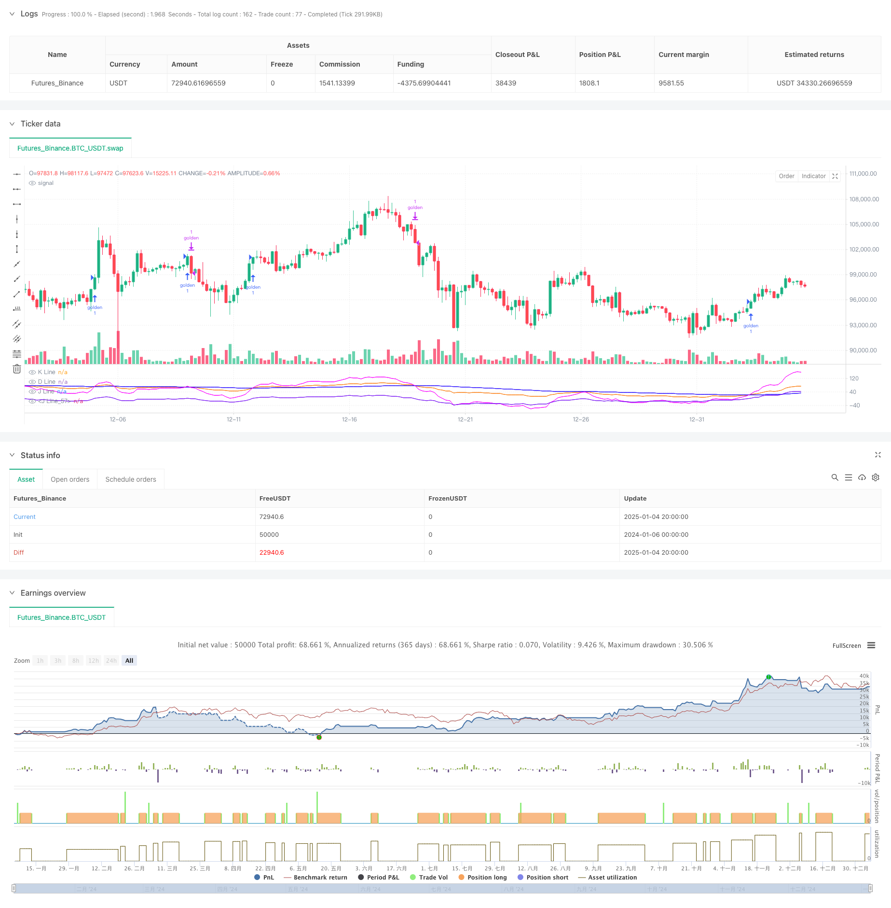

> Name

Multi-Indicator-Optimized-KDJ-Trend-Crossover-Strategy-Based-on-Dynamic-Stochastic-Pattern-Trading-System
> Author

ChaoZhang

> Strategy Description



[trans]
#### Overview
This strategy is an advanced trading system based on the KDJ indicator, which captures market trends through in-depth analysis of the cross patterns of K-line, D-line and J-line. The strategy integrates a custom BCWSMA smoothing algorithm, which improves the reliability of the signal through the optimized calculation of the stochastic indicator. The system adopts strict risk control mechanisms, including stop-loss and trailing stop-loss functions, to achieve robust fund management.
#### Strategy Principle
The core logic of the strategy is based on the following key elements:
1. Use the customized BCWSMA (weighted moving average) algorithm to calculate the KDJ indicator, which improves the smoothness and stability of the indicator.
2. Through the calculation of RSV (Immature Random Value), the price is converted into a value in the range of 0-100 to better reflect the price position between high and low points.
3. Designed a unique J-line and J5-line (derivative indicator) cross-validation mechanism to improve the accuracy of trading signals through multiple confirmations.
4. A trend confirmation mechanism based on continuity is established, which requires the J line to remain above the D line for 3 consecutive days to confirm the validity of the trend.
5. Composite risk control system integrating percentage stop loss and trailing stop loss
#### Strategic Advantages
1. Advanced signal generation mechanism: through cross-validation of multiple technical indicators, the impact of false signals is significantly reduced
2. Improved risk control: adopt a multi-level risk control mechanism, including fixed stop loss and trailing stop loss, to effectively control downside risks
3. Strong parameter adjustability: key parameters such as KDJ cycle, signal smoothing coefficient, etc. can be flexibly adjusted according to market conditions.
4. High computational efficiency: Using the optimized BCWSMA algorithm reduces computational complexity and improves strategy execution efficiency
5. Good adaptability: can adapt to different market environments and optimize strategy performance through parameter adjustment
#### Strategy Risk
1. Volatile market risk: Frequent false breakthrough signals may occur in a volatile market, increasing transaction costs.
2. Lagging risk: Due to the use of moving average smoothing, the signal may lag to a certain extent.
3. Parameter sensitivity: The strategy effect is more sensitive to parameter settings. Improper parameter settings may cause the strategy effect to be significantly reduced.
4. Market environment dependence: In some specific market environments, the performance of the strategy may not be ideal.
#### Strategy optimization direction
1. Optimization of signal filtering mechanism: auxiliary indicators such as trading volume and volatility can be introduced to improve the reliability of signals
2. Dynamic parameter adjustment: dynamically adjust KDJ parameters and stop loss parameters according to market fluctuations
3. Market environment identification: Add a market environment judgment module and adopt different trading strategies in different market environments.
4. Enhanced risk control: Additional risk control methods such as maximum drawdown control and position limit can be added
5. Performance optimization: further optimize the BCWSMA algorithm and improve calculation efficiency
#### Summary
This strategy builds a complete trading system through an innovative combination of technical indicators and strict risk control. The core advantage of the strategy lies in the multiple signal confirmation mechanism and complete risk control system, but it is also necessary to pay attention to parameter optimization and market environment adaptability. Through continuous optimization and improvement, the strategy is expected to maintain stable performance in different market environments.
||

#### Overview
This strategy is an advanced trading system based on the KDJ indicator, which captures market trends through in-depth analysis of K-line, D-line, and J-line crossover patterns. The strategy integrates a custom BCWSMA smoothing algorithm, improving signal reliability through optimized calculation of stochastic indicators. The system employs strict risk control mechanisms, including stop-loss and trailing stop features, to achieve robust money management.

#### Strategy Principles
The core logic of the strategy is based on several key elements:
1. Uses custom BCWSMA (Weighted Moving Average) algorithm to calculate KDJ indicators, improving indicator smoothness and stability
2. Converts prices to 0-100 range through RSV (Raw Stochastic Value) calculation, better reflecting price position between highs and lows
3. Designs unique J-line and J5-line (derivative indicator) cross-validation mechanism, improving trade signal accuracy through multiple confirmations
4. Establishes trend confirmation mechanism based on continuity, requiring J-line to remain above D-line for 3 consecutive days to confirm trend validity
5. Integrates composite risk control system with percentage stop-loss and trailing stop-loss

#### Strategy Advantages
1. Advanced Signal Generation: Significantly reduces false signals through multiple technical indicator cross-validation
2. Comprehensive Risk Control: Employs multi-level risk control mechanisms, including fixed and trailing stops, effectively controlling downside risk
3. Strong Parameter Adaptability: Key parameters like KDJ period and signal smoothing coefficients can be flexibly adjusted based on market conditions
4. High Computational Efficiency: Uses optimized BCWSMA algorithm, reducing computational complexity and improving strategy execution efficiency
5. Good Adaptability: Can adapt to different market environments through parameter adjustment optimization

#### Strategy Risks
1. Oscillation Market Risk: May generate frequent false breakout signals in sideways markets, increasing trading costs
2. Lag Risk: Signals may experience some delay due to moving average smoothing
3. Parameter Sensitivity: Strategy effectiveness is sensitive to parameter settings, improper settings may significantly reduce strategy performance
4. Market Environment Dependency: Strategy performance may not be ideal in certain specific market environments

#### Strategy Optimization Directions
1. Signal Filter Mechanism Optimization: Can introduce auxiliary indicators like volume and volatility to improve signal reliability
2. Dynamic Parameter Adjustment: Dynamically adjust KDJ parameters and stop-loss parameters based on market volatility
3. Market Environment Recognition: Add market environment judgment module to adopt different trading strategies in different market environments
4. Risk Control Enhancement: Can add additional risk control measures like maximum drawdown control and position time limits
5. Performance Optimization: Further optimize BCWSMA algorithm to improve computational efficiency

#### Summary
The strategy builds a complete trading system through innovative technical indicator combinations and strict risk control. The core advantages lie in multiple signal confirmation mechanisms and comprehensive risk control systems, but attention needs to be paid to parameter optimization and market environment adaptability. Through continuous optimization and improvement, the strategy has the potential to maintain stable performance across different market environments.[/trans]


> Source (PineScript)

``` pinescript
/*backtest
start: 2024-01-06 00:00:00
end: 2025-01-05 00:00:00
period: 4h
basePeriod: 4h
exchanges: [{"eid":"Futures_Binance","currency":"BTC_USDT"}]
*/

// This Pine Script™ code is subject to the terms of the Mozilla Public License 2.0 at https://mozilla.org/MPL/2.0/
// © hexu90

//@version=6

// Date Range
// STEP 1. Create inputs that configure the backtest's date range
useDateFilter = input.bool(true, title="Filter Date Range of Backtest",
     group="Backtest Time Period")
backtestStartDate = input(timestamp("1 Jan 2020"), 
     title="Start Date", group="Backtest Time Period",
     tooltip="This start date is in the time zone of the exchange " + 
     "where the chart's instrument trades. It doesn't use the time " + 
     "zone of the chart or of your computer.")
backtestEndDate = input(timestamp("15 Dec 2024"),
     title="End Date", group="Backtest Time Period",
     tooltip="This end date is in the time zone of the exchange " + 
     "where the chart's instrument trades. It doesn't use the time " + 
     "zone of the chart or of your computer.")
// STEP 2. See if current bar falls inside the date range
inTradeWindow = true

//KDJ strategy
// indicator("My Customized KDJ", shorttitle="KDJ")
strategy("My KDJ Strategy", overlay = false)

// Input parameters
ilong = input(90, title="Period")
k_isig = input(3, title="K Signal")
d_isig = input(30, title="D Signal")

// Custom BCWSMA calculation outside the function
bcwsma(source, length, weight) =>
    var float prev = na  // Persistent variable to store the previous value
    if na(prev)
        prev := source  // Initialize on the first run
    prev := (weight * source + (length - weight) * prev) / length
    prev

// Calculate KDJ
c = close
h = ta.highest(high, ilong)
l = ta.lowest(low, ilong)
RSV = 100 * ((c - l) / (h - l))
pK = bcwsma(RSV, k_isig, 1)
pD = bcwsma(pK, d_isig, 1)
pJ = 3 * pK - 2 * pD

pJ1 = 0
pJ2 = 80
pJ5 = (pJ-pK)-(pK-pD)

// Plot the K, D, J lines with colors
plot(pK, color=color.rgb(251, 121, 8), title="K Line")  // Orange
plot(pD, color=color.rgb(30, 0, 255), title="D Line")  // Blue
plot(pJ, color=color.new(color.rgb(251, 0, 255), 10), title="J Line")  // Pink with transparency
plot(pJ5, color=#6f03f3e6, title="J Line")  // Pink with transparency

// Background color and reference lines
// bgcolor(pJ > pD ? color.new(color.green, 75) : color.new(color.red, 75))
// hline(80, "Upper Band", color=color.gray)
// hline(20, "Lower Band", color=color.gray)

// Variables to track the conditions
var bool condition1_met = false
var int condition2_met = 0

// Condition 1: pJ drops below pJ5
if ta.crossunder(pJ, pJ5)
    condition1_met := true
    condition2_met := 0  // Reset condition 2 if pJ drops below pJ5 again

if ta.crossover(pJ, pD)
    condition2_met += 1

to_long = ta.crossover(pJ, pD)


var int consecutiveDays = 0
// Update the count of consecutive days
if pJ > pD
    consecutiveDays += 1
else
    consecutiveDays := 0

// Check if pJ has been above pD for more than 3 days
consPJacrossPD = false
if consecutiveDays > 3
    consPJacrossPD := true

// Entry condition: After condition 2, pJ crosses above pD a second time
// if condition1_met and condition2_met > 1
//     strategy.entry("golden", strategy.long, qty=1000)
//     condition1_met := false  // Reset the conditions for a new cycle
//     condition2_met = 0
// 
if ta.crossover(pJ, pD) 
    // and pD < 40 and consPJacrossPD
    // consecutiveDays == 1
    //  consecutiveDays == 3 and
    strategy.entry("golden", strategy.long, qty=1)

// to_short = 
// or ta.crossunder(pJ, 100)

// Exit condition
if ta.crossover(pD, pJ)
    strategy.close("golden", qty = 1)

// Stop loss and trailing profit
trail_stop_pct = input.float(0.5, title="Trailing Stop activation (%)", group="Exit Lonng", inline="LTS", tooltip="Trailing Treshold %")
trail_offset_pct = input.float(0.5, title="Trailing Offset (%)", group="Exit Lonng", inline="LTS", tooltip="Trailing Offset %")
trail_stop_tick = trail_stop_pct * close/100
trail_offset_tick = trail_offset_pct * close/100

sl_pct = input.float(5, title="Stop Loss", group="SL and TP", inline="LSLTP")
// tp_pct = input.float(9, title="Take Profit", group="SL and TP", inline="LSLTP")

long_sl_price = strategy.position_avg_price * (1 - sl_pct/100)
// long_tp_price = strategy.position_avg_price * (1 + tp_pct/100)

strategy.exit('golden Exit', 'golden', stop = long_sl_price)
// trail_points = trail_stop_tick, trail_offset=trail_offset_tick

```

> Detail

https://www.fmz.com/strategy/477597

> Last Modified

2025-01-06 16:23:38
