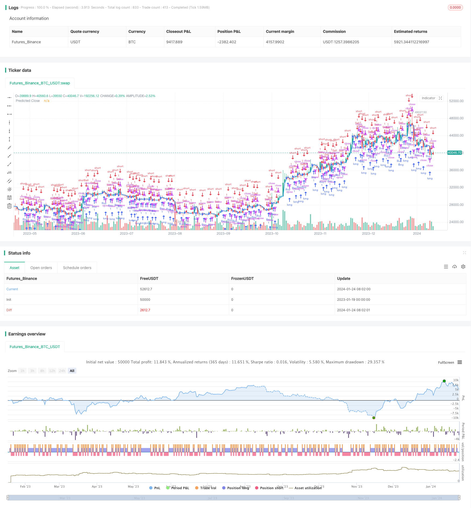

> Name

Dual-Candlestick-Prediction-Close-Strategy
> Author

ChaoZhang

> Strategy Description


[trans]

## Overview
The purpose of this strategy is to predict the closing price of the next 15-minute K-line by analyzing the opening and closing prices of the past two 30-minute K-lines. Based on the trend, determine whether the K-line will continue to rise, fall, or consolidate in the next 15 minutes.
## Strategy Principle
The core logic of this strategy lies in the predictNextCandleClose function. This function accepts the opening price and closing price of the previous two 30-minute K-lines as input parameters.
If the closing price of the last 30-minute K-line is higher than the opening price, it is judged to be a long trend; if it is lower than the opening price, it is a short trend. If the penultimate 30-minute K-line also shows the same long-short trend, the trend is considered to be strong, and the next 15-minute K-line is predicted to continue the trend.
Specifically, if the last two 30-minute K-lines have closed positive (the closing price is higher than the opening price), then the closing price of the next 15-minute K-line is predicted to be higher than the closing price of the current K-line by the difference between the closing price and the opening price of the last 30-minute K-line.
If the last two 30-minute K-lines have closed negative (the closing price is lower than the opening price), then the closing price of the next 15-minute K-line is predicted to be lower than the closing price of the current K-line by the difference between the opening price and closing price of the last 30-minute K-line.
If the last two 30-minute K-lines are yin and one is yang, it means there is no clear trend. At this time, it is predicted that the closing price of the next 15-minute K-line will be the same as the closing price of the last 30-minute K-line.
In this way, past K-line information can be used to judge future short-term price trends as a reference for trading decisions.
## Advantage Analysis
This double K-line prediction strategy has the following advantages:
1. Simple and intuitive, easy to understand and implement, suitable for beginners of quantitative trading
2. Using double K lines to judge the trend can filter out some noise and improve the accuracy of judgment.
3. 15-minute level forecast, short time span, which is conducive to timely adjustment of positions
4. Judgment of trading signals based on current price and predicted price can quickly respond to emergencies
5. No need for a large amount of historical data, reducing data volume requirements, suitable for situations where data is incomplete or real.
## Risk Analysis
But this strategy also has some risks:
1. Only considering the opening price and closing price, without more K-line details as auxiliary judgment, important signals may be missed.
2. The distance between the double K-lines is long and it cannot respond to short-term price fluctuations immediately, resulting in a time lag.
3. The forecast is only based on historical data and cannot determine the impact of major emergencies, which is a high risk.
4. The long and short judgment rules are relatively simple and can easily produce erroneous signals. The signal quality needs to be improved.
5. There are often jumps or gaps in real-time data, which can also interfere with the accuracy of judgment logic.
## Optimization direction
Considering the above risks, this strategy can be optimized from the following aspects:
1. Add more auxiliary judgment indicators, such as MACD, KD, etc., to improve prediction accuracy
2. Combine more K-line details, such as shadow lines, entities, etc. to determine price critical points and improve long and short rules.
3. Increase the sample size, expand the time range for judging K-lines, and avoid being disturbed by short-term noise.
4. Add stop loss strategies and use means such as trailing stop loss and time stop loss to control single losses.
5. Optimize the rules for opening positions and only open positions when the trend is clear to avoid the recurrence of uncertain markets.
6. Real offer verification, correct the logic that does not match the real offer, and make the strategy parameters closer to the real market
## Summarize
This strategy determines the future short-term trend by analyzing the opening and closing price information of the double K-line, and generates trading signals accordingly. It is a predictive strategy based on historical data. This strategy is simple and easy to use and suitable for beginners in quantitative trading, but it also has problems such as single judgment rules and limited signal quality. We can carry out multi-dimensional optimization from auxiliary indicators, K-line details, stop loss strategies, etc., to make the actual effect of the strategy better. Overall, the double K-line prediction strategy provides us with a basic solution worthy of optimization and iteration.
||

## Overview

The purpose of this strategy is to predict the close price of the next 15-minute candlestick by analyzing the open and close prices of the past two 30-minute candlesticks. It judges whether the trend of the next 15-minute candlestick will continue going up, down or sideways based on the trend.

## Strategy Principle  

The core logic of this strategy lies in the predictNextCandleClose function. This function takes the open and close prices of the previous two 30-minute candlesticks as input parameters.

If the close price of the last 30-minute candlestick is higher than the open price, it is judged as a bullish trend. If the close price is lower than the open price, it is judged as a bearish trend. If the second last 30-minute candlestick also shows the same bullish or bearish trend, it is considered that the trend is stronger and the next 15-minute candlestick will likely continue the trend.   

Specifically, if both of the most recent two 30-minute candlesticks are bullish (close price higher than open price), the predicted close price of the next 15-minute candlestick will be higher than the current candlestick's close price by the difference between the last 30-minute candlestick's close price and open price.  

If both of the most recent two 30-minute candlesticks are bearish (close price lower than open price), the predicted close price of the next 15-minute candlestick will be lower than the current candlestick's close price by the difference between the last 30-minute candlestick's open price and close price.

If one of the most recent two 30-minute candlesticks is bullish and the other is bearish, it indicates there is no clear trend, and in this case the predicted close price of the next 15-minute candlestick will be the same as the close price of the last 30-minute candlestick.   

In this way, it predicts the short-term price movement in the future based on past candlestick information, serving as a reference for trading decisions.

## Advantage Analysis   

This dual candlestick prediction strategy has the following advantages:

1. It is simple, intuitive and easy to understand and implement, suitable for quant trading beginners.  

2. By judging the trend using dual candlesticks, it can filter out some noise and improve the accuracy.   

3. The 15-minute level prediction has a short time span, which helps adjust positions in a timely manner.  

4. Combined with current price and predicted price to determine trading signals, it can respond quickly to unexpected events. 

5. It requires less historical data, reducing data needs and making it suitable for incomplete data or live trading scenarios.

## Risk Analysis   

However, there are also some risks with this strategy:   

1. It only considers open and close prices, lacking more candlestick details as auxiliary judgement, thus may miss important signals.

2. The interval between the two candlesticks is long, unable to respond timely to short-term price fluctuations, posing time lag risks.  

3. The prediction relies solely on historical data, unable to judge the impact of significant unexpected events, with higher risks.

4. The bullish/bearish rules are quite simple, prone to generating false signals and the signal quality needs improvement.  

5. Real trading data often has gaps, which could also interfere with the accuracy of the judgement logic.

## Optimization Directions   

In light of the above risks, the strategy can be optimized from the following aspects:

1. Add more auxiliary indicators like MACD, KD etc to improve prediction accuracy.  

2. Combine more candlestick details like shadows, real body etc to determine critical price levels and refine bullish/bearish rules.   

3. Increase sample size, expand the time range of judgement candlesticks to avoid interference from short-term noises.   

4. Add stop loss mechanisms like moving stop loss, timed stop loss etc to control single trade loss.

5. Optimize entry rules to only open positions when the trend is clear, avoiding uncertain market fluctuations.  

6. Backtest with real trading data, modify logic that does not match actual price moves to make the strategy parameters closer to the real market.

## Conclusion   

This strategy predicts short-term trends by analyzing the open and close prices of dual candlesticks, and generates trading signals based on it. It belongs to predictive strategies based on historical data. The strategy is simple and easy to use, suitable for quant trading beginners, but also has risks like relatively simple judgement rules and limited signal quality. We can optimize it in aspects like auxiliary indicators, candlestick details, stop loss mechanisms etc to improve practical performance. In summary, the dual candlestick prediction strategy provides us with a basic scheme worth optimizing and iterating on.  

[/trans]


> Source (PineScript)

``` pinescript
/*backtest
start: 2023-01-19 00:00:00
end: 2024-01-25 00:00:00
period: 1d
basePeriod: 1h
exchanges: [{"eid":"Futures_Binance","currency":"BTC_USDT"}]
*/

// This Pine Script™ code is subject to the terms of the Mozilla Public License 2.0 at https://mozilla.org/MPL/2.0/
// © Sosawolf

//@version=5
strategy("Predict Next Candle Close Strategy", overlay=true)

// Function to predict next candle close based on previous two candles
predictNextCandleClose(open1, close1, open2, close2) =>
    if close1 > open1 and close2 > open2
        // Bullish trend, predict next candle close to be bullish
        close1 + (close1 - open1)
    else if close1 < open1 and close2 < open2
        // Bearish trend, predict next candle close to be bearish
        close1 - (open1 - close1)
    else
        // Indecisive or ranging market, predict next candle close to be neutral
        close1

// Get previous two 30-minute candles' open and close prices
open1 = request.security(syminfo.tickerid, "30", open[1])
close1 = request.security(syminfo.tickerid, "30", close[1])
open2 = request.security(syminfo.tickerid, "30", open[2])
close2 = request.security(syminfo.tickerid, "30", close[2])

// Predict next 15-minute candle close
predictedClose = predictNextCandleClose(open1, close1, open2, close2)

// Plot the predicted close as a line
plot(predictedClose, color=color.blue, linewidth=2, title="Predicted Close")

// Buy condition: Predicted close is higher than the current close
buyCondition = predictedClose > close
strategy.entry("Buy", strategy.long, when=buyCondition)

// Sell condition: Predicted close is lower than the current close
sellCondition = predictedClose < close
strategy.entry("Sell", strategy.short, when=sellCondition)

```

> Detail

https://www.fmz.com/strategy/440056

> Last Modified

2024-01-26 10:58:03
