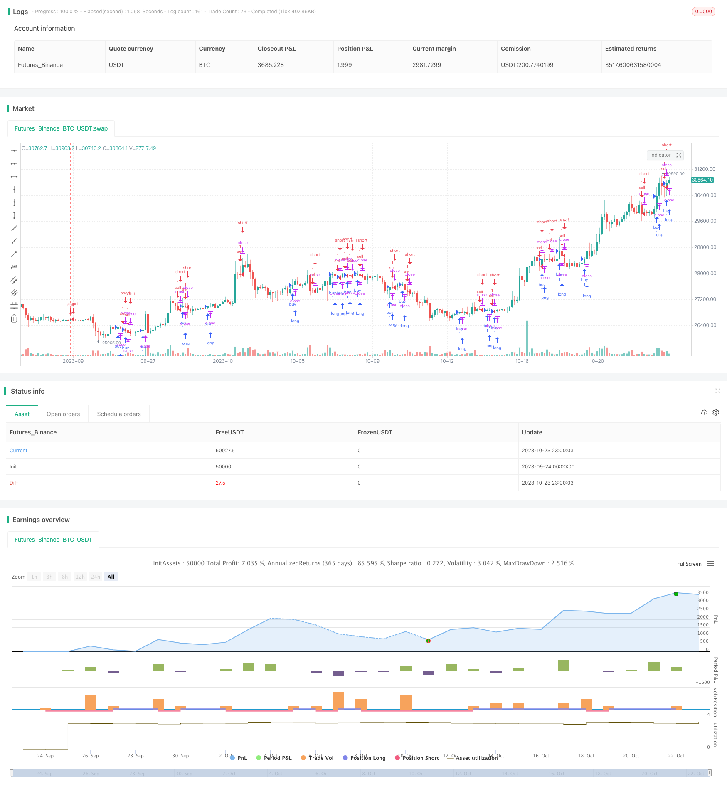

> Name

Dynamic K-line direction strategy Dynamic-Candle-Direction-Strategy
> Author

ChaoZhang

> Strategy Description



[trans]


## Overview
This strategy determines the direction of the future K lines by analyzing the closing prices of the past N K lines that are higher/lower than the opening prices. According to the long and short situation in the direction of the K line, take long or short operations.
## Strategy Principle
The core logic of this strategy is:
1. Set the parameter NUM_CANDLES to determine the number of K lines that need to be analyzed.
2. Define the function candle_dir to determine the direction of a single K line. close>open means long, close<open means short, close=open means shock.
3. Define the function count_candles to count the number of K lines in different directions in the past NUM_CANDLES K lines.
4. Count the number of long, short and oscillating K lines in the past NUM_CANDLES K lines, and store them in ups, dns, and neu.
5. Define the indic indicator, whose value is equal to ups-dns plus the positive and negative value of neu.
6. Determine the timing of long and short positions based on the indic indicator.
This strategy determines the probability of the future K-line direction by counting the directions of a certain number of K-lines, thereby making trading decisions. The parameter NUM_CANDLES can be used to control the number of statistical K lines and adjust the strategy sensitivity.
## Strategic advantage analysis
1. The strategic ideas are clear and easy to understand, easy to explain and verify.
2. There is no need to calculate complex indicators, only K-line data is needed, which reduces calculation costs.
3. The number of statistical K lines can be adjusted through parameters to control the sensitivity of the strategy.
4. Can be used in any variety and any period, with strong applicability.
5. It is easy to perform parameter optimization and find the optimal parameter combination.
## Risk Analysis
1. Unable to handle consolidation and shock in the market, frequent opening and closing of positions may occur.
2. Improper statistical period may cause signal lag, so parameters need to be set appropriately.
3. Unable to handle trend reversal, there may be a risk of losses against the trend.
4. The impact of transaction costs needs to be considered to prevent too frequent transactions.
5. Pay attention to the over-fitting problem in parameter optimization and verify it through backtesting in multiple markets.
## Optimization direction
1. You can consider adding stop loss logic to reduce the risk of loss.
2. You can combine trend indicators to avoid counter-trend operations.
3. You can increase the statistical period or use a low period, and optimize parameters to improve the stability of the strategy.
4. You can consider combining multiple varieties to improve your strategy’s winning rate.
5. Can be combined with machine learning methods to automatically optimize parameters.
## Summarize
This strategy determines the trading direction based on K-line direction analysis. The idea is clear and easy to understand. The sensitivity of the strategy can be controlled through parameter settings. The advantages of the strategy are simple logic, low usage requirements, and wide applicability. However, there are also certain risks and need to be further optimized to improve the stability of the strategy. Overall, this strategy provides a simple and practical trading idea for quantitative trading.
||


## Overview

This strategy determines future candle direction by analyzing the closing price relative to opening price of past N candles. It takes long or short positions based on candle direction signals.

## Strategy Logic

The core logic of this strategy is:

1. Set parameter NUM_CANDLES to determine the number of candles to analyze. 

2. Define function candle_dir to determine direction of a single candle. close>open is bullish, close<open is bearish, close=open is neutral.

3. Define function count_candles to count number of candles with certain direction in past NUM_CANDLES candles.

4. Count number of bullish, bearish and neutral candles in past NUM_CANDLES candles, store in ups, dns, neu. 

5. Define indic indicator, its value equals ups-dns plus/minus neu. 

6. Determine long/short entry based on indic indicator.

By analyzing candle direction of a certain number of candles, this strategy estimates probability of future candle direction for trading decisions. NUM_CANDLES controls sample size to adjust strategy sensitivity.   

## Advantage Analysis

1. Strategy logic is clear and easy to understand, interpret and verify.

2. Only candle data is needed, reducing computing cost.

3. Easy to adjust sensitivity by tuning NUM_CANDLES parameter.

4. Applicable to all products and timeframes, high adaptability. 

5. Easy to optimize parameters to find best combination.

## Risk Analysis

1. Unable to handle range-bound market, may cause over-trading.

2. Inappropriate sample period may cause signal lag, NUM_CANDLES needs careful tuning.

3. Unable to adapt to trend reversal, risk of loss in reversing trend.

4. Trading cost impact needs consideration to avoid over-trading.

5. Beware of overfitting in parameter optimization, require multi-market verification.

## Optimization Directions

1. Consider adding stop loss to limit loss.

2. Combine with trend indicator to avoid counter-trend trading. 

3. Increase sample size or use lower timeframe to improve stability.

4. Consider multi-market compounding to improve win rate.

5. Utilize machine learning for automatic parameter optimization.

## Conclusion

This strategy determines trade direction by analyzing candle direction, with clear and simple logic. Sensitivity is controllable through parameter tuning. The pros are simplicity, low requirement, and wide adaptability, but some risks exist and further optimization is needed to improve stability. Overall, this strategy provides a simple and practical approach for quantitative trading.

[/trans]


> Source (PineScript)

``` pinescript
/*backtest
start: 2023-09-24 00:00:00
end: 2023-10-24 00:00:00
period: 3h
basePeriod: 15m
exchanges: [{"eid":"Futures_Binance","currency":"BTC_USDT"}]
*/

//@version=3
strategy("Refined CandleCounter Strategy by origo", overlay=true)

// how many candles to count
NUM_CANDLES = 7

// determine candle direction
candle_dir = close > open ? 1 : (round(close-open) == 0 ? 0 : -1)

// return # of candles with a given direction
count_candles(dir, max) =>
    count = 0
    for i = 0 to max
        if candle_dir[i] == dir
            count := count + 1
    count

ups = count_candles(1, NUM_CANDLES)
dns = count_candles(-1, NUM_CANDLES)
neu = count_candles(0, NUM_CANDLES)

indic = ups-dns


if indic > 0
    indic := indic+neu
else
    indic := indic-neu

plotarrow(neu, title="UP vs DN")

longCondition = (indic) > 0
shortCondition = (indic) <= 0

strategy.entry("buy", strategy.long, 1, when = longCondition and not shortCondition)
strategy.entry("sell", strategy.short, 1, when = shortCondition and not longCondition)

```

> Detail

https://www.fmz.com/strategy/430164

> Last Modified

2023-10-25 16:57:05
