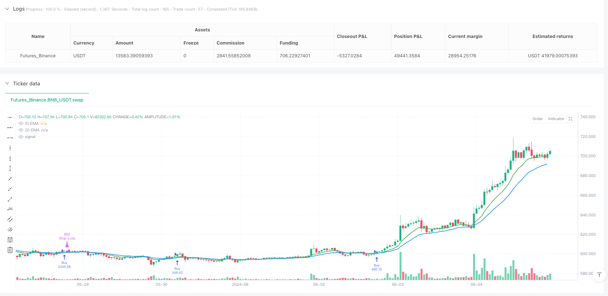
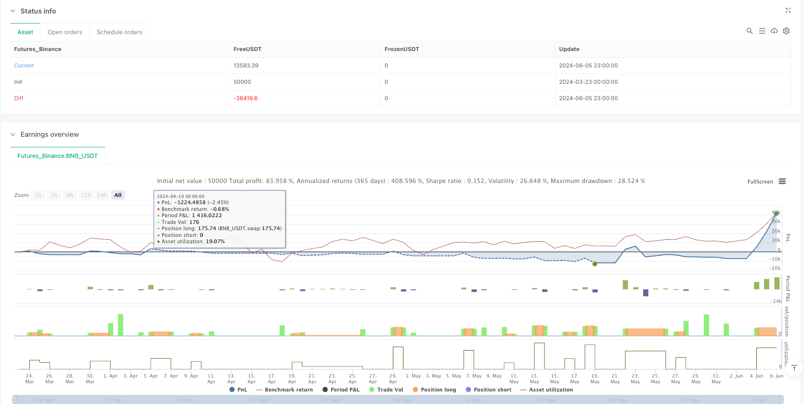

> Name

Dynamic-Position-Sizing-and-Entry-Candle-Stop-Loss-EMA-Crossover-Strategy
> Author

ianzeng123

> Strategy Description





[trans]

#### Overview
The EMA crossover strategy of dynamic positions and entry K-line stop loss is a quantitative trading strategy based on exponential moving average (EMA) crossover signals. This strategy combines dynamic position management and precise stop loss setting. The core idea of ​​the strategy is to identify when the 10-period EMA crosses the 20-period EMA (golden cross) upwards and at the same time require the current K line to be a positive line (the closing price is higher than the opening price), as a long signal. The uniqueness of the strategy is that it adopts a dynamic position calculation method based on current price fluctuations, and sets the lowest point of the entry K-line as a stop loss position to achieve better risk control. The strategy also improves the visualization of trading signals by displaying micro triangle markers on the chart to identify entry opportunities.
#### Strategy Principle
The strategy operates based on the following core principles:
1. **EMA crossover signal**: The strategy uses 10-period and 20-period exponential moving averages. When the short-period (10-period) EMA crosses the long-period (20-period) EMA upward, a potential long signal is generated. This crossover is called a "golden cross" and is often seen as the beginning of an uptrend.
2. **Positive line confirmation**: In order to increase the reliability of the signal, the strategy requires that the closing price must be higher than the opening price (forming a positive line) on the same K line where the EMA crossover occurs. This condition ensures that the market exhibits some buyer power when the signal occurs.
3. **Dynamic position calculation**: The strategy uses an innovative dynamic position calculation method to determine the purchase quantity through the formula `1000 / (收盘价 - 最低价)`. This method will increase the position when the K-line fluctuation is small and reduce the position when the fluctuation is large, thereby achieving automatic adjustment of volatility.
4. **Entry K-line stop loss**: The strategy sets the lowest point of the entry K-line as the stop loss position, which provides a natural stop loss position based on the actual market fluctuations, rather than using a fixed percentage or point stop loss.
5. **Visual signal**: When the long condition is triggered, the strategy adds a miniature green triangle mark below the K line to help traders visually identify the entry signal.
#### Strategic Advantages
In-depth analysis of the code implementation of this strategy, we can summarize the following significant advantages:
1. **Double Conditions for Trend Confirmation**: By combining EMA crossovers and Yang line confirmations, the strategy reduces the possibility of false signals and only trades when there is sufficient market support.
2. **Intelligent dynamic position management**: Dynamic position allocation calculated based on the difference between the high and low points of the K line, which can automatically adapt to changes in market volatility. Intelligent risk adjustment is achieved by increasing positions in an environment with low volatility (lower potential risk) and reducing positions in an environment with high volatility (higher potential risk).
3. **Adaptive stop-loss strategy**: Using the lowest point of the entry K-line as the stop-loss position, it provides a stop-loss method based on the market's natural support level, avoiding the problem that the fixed stop loss may be triggered too early or be too far away to effectively protect funds.
4. **Visually clear trading signals**: Through micro triangle marks, traders can intuitively identify trading signals, improving the convenience of strategy use and the efficiency of trading decisions.
5. **Clear and concise code structure**: The implementation code of the strategy is simple and clear, easy to understand and modify, making it easy for traders to make personalized adjustments according to their own needs.
#### Strategy Risk
Although this strategy has many advantages, there are also some potential risks and limitations:
1. **False breakthrough risk**: In a volatile market, EMA cross signals may produce more false breakthroughs, leading to frequent stop-loss exits and capital losses. The solution is to add additional filters, such as longer period trend confirmation or volatility indicator filtering.
2. **Extreme cases of dynamic position calculation**: When the fluctuation within the K-line is very small (the closing price is close to the lowest price), the calculated position may become abnormally large, resulting in excessive leverage risk. It is recommended to set a maximum position limit to avoid taking excessive risks in extreme situations.
3. **Risk of stop loss too close**: If the lowest point of the entry K-line is very close to the entry price, the stop loss may be too close and easily triggered by normal market noise. You can consider increasing the buffer zone of the stop loss position or using volatility indicators such as ATR to adjust the stop loss distance.
4. **Lack of profit target**: The strategy defines clear entry and stop loss conditions, but does not set a profit target or other exit conditions, which may result in the inability to lock in profits in time when the trend reverses. It is recommended to add exit conditions based on trailing stop loss or reverse EMA crossover.
5. **Parameters are fixed and not flexible**: The EMA period (10 and 20) is fixed and may not be suitable for all market environments and time periods. It is recommended to perform backtest optimization on these parameters, or consider using adaptive parameter methods.
#### Strategy optimization direction
Based on an in-depth analysis of the strategy, the following are several possible optimization directions:
1. **Add trend filter**: Introduce longer-period trend indicators (such as 50-period EMA or 200-period EMA), and only execute transactions when the direction of the general trend is consistent, which can reduce false breakthroughs. Such optimization can significantly improve the performance of the strategy in strongly trending markets.
2. **Increase volatility adjustment**: Integrate the ATR (Average True Range) indicator to adjust the stop loss distance and dynamic position calculation, so that the strategy can better adapt to different volatility environments. Periods of high volatility allow for looser stops and smaller positions, while the opposite is true during periods of low volatility.
3. **Add Profit Target and Trailing Stop**: Implement dynamic profit targets based on market volatility, and use trailing stop to protect earned profits as the trend develops. For example, you can set a profit target based on an ATR multiple, or use a trailing stop to gradually raise your stop as price increases.
4. **Add volume confirmation**: Add volume confirmation on the basis of EMA cross signal, and only execute transactions when the volume supports it, which can improve the reliability of the signal. High volume breakouts are generally more reliable than low volume breakouts.
5. **Optimize the dynamic position calculation formula**: Modify the position calculation formula, add upper and lower limit constraints, and consider incorporating it into the overall risk management framework to ensure that the risk of a single transaction does not exceed a certain proportion of the total account value (such as 1-2%).
6. **Parameter adaptive mechanism**: Implements the adaptive mechanism of EMA cycle, automatically adjusts EMA cycle according to market conditions, so that the strategy can better adapt to different market environments. For example, you can use longer EMA periods in high-volatility markets and shorter EMA periods in low-volatility markets.
#### Summary
The EMA crossover strategy of dynamic positions and entry K-line stop loss is a quantitative trading method that combines trend tracking, dynamic position management and precise stop loss. Through the dual conditions of EMA crossover and positive line confirmation, the strategy can identify potential upward trends; through dynamic position calculation based on K-line fluctuations, intelligent adjustment of market risks is achieved; by setting the lowest point of the entry K-line as a stop loss position, it provides a risk control method based on the market's natural support level.
Although this strategy may perform well in trending markets, it may face the risk of false breakouts in sideways choppy markets. By adding trend filters, volatility adjustment, profit target setting, volume confirmation and optimized position calculation improvements, the robustness and profitability of the strategy can be further improved.
The most important thing is that any trading strategy requires sufficient historical backtesting and simulated trading before actual application to verify its performance in different market environments. At the same time, good risk management is always the basis for successful trading, and even the best strategies require the support of strict fund management and risk control measures. ||
#### Overview
The Dynamic Position Sizing and Entry Candle Stop-Loss EMA Crossover Strategy is a quantitative trading approach that combines exponential moving average (EMA) crossover signals with dynamic position sizing and precise stop-loss placement. The core concept involves identifying when the 10-period EMA crosses above the 20-period EMA (golden cross) while ensuring the current candle is bullish (close higher than open). What makes this strategy unique is its dynamic position calculation method based on current price volatility and its use of the entry candle's low as a stop-loss level to achieve better risk control. The strategy also enhances trade signal visualization by displaying tiny triangle markers on the chart to identify entry points.

#### Strategy Principles
This strategy operates based on several core principles:

1. **EMA Crossover Signal**: The strategy employs 10-period and 20-period exponential moving averages. When the shorter-term (10-period) EMA crosses above the longer-term (20-period) EMA, it generates a potential long entry signal. This crossover is commonly referred to as a "golden cross" and is typically viewed as the beginning of an uptrend.

2. **Bullish Candle Confirmation**: To increase signal reliability, the strategy requires that the close must be above the open (forming a bullish candle) on the same bar where the EMA crossover occurs. This condition ensures that the market demonstrates some buying pressure when the signal appears.

3. **Dynamic Position Sizing**: The strategy employs an innovative dynamic position calculation method using the formula `1000 / (close - low)` to determine the purchase quantity. This method increases position size when candle volatility is low and decreases it when volatility is high, automatically adjusting for volatility.

4. **Entry Candle Stop-Loss**: The strategy sets the stop-loss at the low of the entry candle, providing a natural stop-loss location based on actual market volatility, rather than using a fixed percentage or point-based stop.

5. **Visual Signals**: When the long condition is triggered, the strategy adds a tiny green triangle marker below the candle, helping traders visually identify entry signals.

#### Strategy Advantages
Analyzing the code implementation of this strategy, we can summarize the following significant advantages:

1. **Dual Conditions for Trend Confirmation**: By combining the EMA crossover with bullish candle confirmation, the strategy reduces the likelihood of false signals, only trading when there is sufficient market support.

2. **Intelligent Dynamic Position Sizing**: The dynamic position allocation calculated based on candle high-low differential can automatically adapt to changes in market volatility. It increases position size in environments with low volatility (potentially lower risk) and decreases position size in environments with high volatility (potentially higher risk), achieving intelligent risk adjustment.

3. **Adaptive Stop-Loss Strategy**: Using the entry candle's low as a stop-loss provides a method based on natural market support levels, avoiding the problems of fixed stops being triggered too early or being too distant to effectively protect capital.

4. **Visually Clear Trading Signals**: Through tiny triangle markers, traders can intuitively identify trading signals, improving the convenience of strategy use and the efficiency of trading decisions.

5. **Clear and Concise Code Structure**: The implementation code is simple and straightforward, easy to understand and modify, making it convenient for traders to make personalized adjustments according to their needs.

#### Strategy Risks
Despite its many advantages, this strategy also has some potential risks and limitations:

1. **False Breakout Risk**: In oscillating markets, EMA crossover signals may produce numerous false breakouts, leading to frequent stop-loss exits and capital losses. The solution is to add additional filtering conditions, such as longer-term trend confirmation or volatility indicator filtering.

2. **Extreme Cases in Dynamic Position Calculation**: When the intra-candle volatility is very small (close price near the low), the calculated position size may become abnormally large, leading to excessive leverage risk. It is recommended to set a maximum position limit to avoid taking on too much risk in extreme cases.

3. **Too-Close Stop-Loss Risk**: If the entry candle's low is very close to the entry price, the stop-loss may be too tight and easily triggered by normal market noise. Consider adding a buffer zone to the stop-loss or adjusting the stop-loss distance using volatility indicators like ATR.

4. **Lack of Profit Targets**: The strategy defines clear entry and stop-loss conditions but does not set profit targets or other exit conditions, which may result in failure to lock in profits when trends reverse. Consider adding exit conditions based on trailing stops or reverse EMA crossovers.

5. **Inflexible Fixed Parameters**: The EMA periods (10 and 20) are fixed and may not be suitable for all market environments and time periods. It is recommended to perform backtesting optimization on these parameters or consider using adaptive parameter methods.

#### Strategy Optimization Directions
Based on in-depth analysis of the strategy, here are several possible optimization directions:

1. **Add Trend Filters**: Introduce longer-period trend indicators (such as 50-period EMA or 200-period EMA) and only execute trades when the major trend direction is consistent, which can reduce false breakouts. This optimization can significantly improve strategy performance in strong trend markets.

2. **Incorporate Volatility Adjustment**: Integrate the ATR (Average True Range) indicator to adjust stop-loss distances and dynamic position calculations, allowing the strategy to better adapt to different volatility environments. In high-volatility periods, set looser stops and smaller positions; in low-volatility periods, do the opposite.

3. **Add Profit Targets and Trailing Stops**: Implement dynamic profit targets based on market volatility and use trailing stops to protect profits as trends develop. For example, set profit targets based on ATR multiples, or use trailing stops to gradually raise the stop-loss level as prices rise.

4. **Add Volume Confirmation**: Add volume confirmation to the EMA crossover signal, only executing trades when supported by volume, which can improve signal reliability. High-volume breakouts are typically more reliable than low-volume ones.

5. **Optimize Dynamic Position Sizing Formula**: Modify the position calculation formula, adding upper and lower constraints, and consider incorporating it into an overall risk management framework to ensure that the risk of a single trade does not exceed a certain percentage (e.g., 1-2%) of the total account value.

6. **Parameter Adaptive Mechanism**: Implement an adaptive mechanism for EMA periods, automatically adjusting them according to market conditions, allowing the strategy to better adapt to different market environments. For example, use longer EMA periods in high-volatility markets and shorter EMA periods in low-volatility markets.

#### Summary
The Dynamic Position Sizing and Entry Candle Stop-Loss EMA Crossover Strategy is a quantitative trading method that combines trend following, dynamic position management, and precise stop-loss placement. Through the dual conditions of EMA crossover and bullish candle confirmation, the strategy can identify potential uptrends; through dynamic position calculations based on candle volatility, it achieves intelligent adjustment to market risk; through setting the entry candle's low as the stop-loss, it provides a risk control method based on natural market support levels.

While this strategy may perform well in trending markets, it may face false breakout risks in sideways, oscillating markets. By improving in areas such as adding trend filters, volatility adjustments, profit target setting, volume confirmation, and optimizing position calculation, the strategy's robustness and profitability can be further enhanced.

Most importantly, any trading strategy needs thorough historical backtesting and simulation trading before actual application to verify its performance in different market environments. At the same time, good risk management is always the foundation of successful trading. Even the best strategies need the support of strict capital management and risk control measures.[/trans]


> Source (PineScript)

``` pinescript
/*backtest
start: 2024-03-23 00:00:00
end: 2024-06-06 00:00:00
period: 1h
basePeriod: 1h
exchanges: [{"eid":"Futures_Binance","currency":"BNB_USDT"}]
*/

// This Pine Script™ code is subject to the terms of the Mozilla Public License 2.0 at https://mozilla.org/MPL/2.0/
// © nadeemred19

//@version=6
strategy("EMA Crossover with Tiny Triangle Signal & Dynamic Quantity", overlay=true)

// EMA Indicators
ema10 = ta.ema(close, 10)
ema20 = ta.ema(close, 20)

// Plot EMAs
plot(ema10, title="10 EMA", color=color.green, linewidth=2)
plot(ema20, title="20 EMA", color=color.blue, linewidth=2)

// Bullish candle condition
bullishCandle = close > open

// Variables to store entry candle low
var float entryCandleLow = na

// Entry Signal: 10 EMA crosses over 20 EMA AND candle is bullish
longCondition = ta.crossover(ema10, ema20) and bullishCandle

// Calculate dynamic stock quantity: 1000 / (close - low)
var float buyQty = na
if (longCondition)
    entryCandleLow := low
    buyQty := 1000 / (close - low)

// Plot Tiny Triangle Entry Signal
if (longCondition)
    label.new(bar_index, low, "▲", color=color.green, textcolor=color.green, size=size.tiny, style=label.style_label_down, yloc=yloc.belowbar)

// Entry and stop-loss
if (longCondition)
    strategy.entry("Buy", strategy.long, qty=buyQty)
    strategy.exit("Stop-Loss", from_entry="Buy", stop=entryCandleLow)


```

> Detail

https://www.fmz.com/strategy/488014

> Last Modified

2025-03-24 14:04:36
