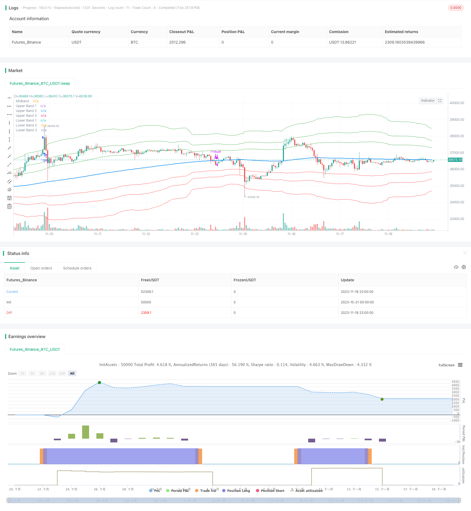

> Name

K-line reversal strategy based on Fibonacci channel Fibonacci-Channel-Based-Candlestick-Reversal-Trading-Strategy
> Author

ChaoZhang

> Strategy Description


[trans]


## Overview
This strategy identifies key support and resistance price areas and helps traders predict potential reversal points in the market by calculating Fibonacci extension channels based on moving averages.
## Strategy Principle
The core of this strategy is the calculation of three moving average-based Keltner channels that help determine the upper and lower boundaries of the Fibonacci channels. The default Fibonacci extension levels are 1.618, 2.618 and 4.236. These levels serve as reference points to help traders identify important areas of support and resistance.
When analyzing price action, traders can focus on extreme Fibonacci channels, which are the upper and lower boundaries of the channel. If price trades a few bars away and then moves back inside the channel, this may indicate a potential reversal. This pattern indicates that price has temporarily deviated from its normal range and may be about to correct.
To improve the accuracy of the Fibonacci Channel indicator, traders often use multiple time frames. By aligning short-term signals with larger time frames, traders can better understand overall market trends. It is often recommended to trade in the direction of the larger time frame to increase the probability of success.
In addition to identifying potential reversal points, traders can also use the Fibonacci Channel indicator to determine entry and exit points. Short-term support and resistance levels can be derived from channels, providing valuable information for trading decisions. These levels can serve as reference points for stop-loss or take-profit orders.
Another useful tool for analyzing trends is the slope of the midline, which is the middle line of the Fibonacci channel indicator. The slope of the midline can indicate the strength and direction of the trend. Traders can monitor slope to gain information about market momentum and make informed trading decisions.
## Strategic advantage analysis
The main advantages of this strategy are as follows:
1. Able to identify key support and resistance areas to help predict price reversal points.
2. Combined with multi-time frame analysis, the accuracy of trading signals can be improved.
3. Entry and exit points can be clearly identified.
4. By analyzing the slope of the midline, the strength and direction of the market trend can be judged.
5. Based on Fibonacci theory, use natural ratios to identify key price levels.
## Strategy risk analysis
The main risks of this strategy are as follows:
1. Like all technical analysis indicators, this strategy is not 100% accurate in predicting price action and reversals. The indicator only provides possible price areas and does not guarantee that the price will reverse.
2. Incorrect or subjective settings of Fibonacci extension levels and Keltner channel parameters may affect the reliability of the signal.
3. The price may break through the Fibonacci channel and continue running, resulting in losses.
4. Multiple time frame analysis methods are not always applicable.
5. In markets with high volatility or low liquidity, the signals from this strategy may be less reliable.

To reduce these risks, you can combine other indicators such as RSI to verify trading signals, adjust parameters to adapt to different market conditions, and use stop losses to control the risk of each trade.
## Strategy optimization direction
This strategy can be optimized through the following aspects:
1. Test parameters of different types and lengths to optimize moving averages and Keltner channels to make them more consistent with the statistical characteristics of different markets.
2. Test other key Fibonacci areas such as 0.5 or 0.786 as extension areas of Fibonacci channels.
3. Combine trading signals with price patterns, trading volume or other indicators as confirmation of entry.
4. Optimize your stop-loss strategy to exit early when the trend reverses.
5. Backtest optimization for entry and exit rules.
## Summarize
In general, the K-line reversal trading strategy based on identifying key support and resistance areas through Fibonacci channels is a method that effectively uses the principle of natural proportions to guide trading decisions. The strategy has demonstrated stable performance under a variety of market conditions. By optimizing parameter settings and risk control and other measures, the robustness of the strategy can be further improved. Overall, this strategy provides traders with an effective tool for identifying trading opportunities in complex and volatile markets.
|| 

## Overview

This strategy calculates Fibonacci expansion channels based on a moving average to identify key areas of support and resistance and help traders anticipate potential reversal points in the market.

## Strategy Logic  

The core of this strategy is to compute three Keltner channels based on a moving average, which help determine the upper and lower boundaries of the Fibonacci channels. The default Fibonacci expansion levels used are 1.618, 2.618 and 4.236. These levels serve as reference points for traders to identify significant areas of support and resistance.
 
When analyzing the price action, traders can focus on the extreme Fibonacci Bands, which are the upper and lower boundaries of the bands. If prices trade outside of the bands for a few bars and then return inside, it may indicate a potential reversal. This pattern suggests that the price has temporarily deviated from its usual range and could be due for a correction.

To enhance the accuracy of the Fibonacci Bands indicator, traders often use multiple time frames. By aligning short-term signals with the larger time frame scenario, traders can gain a better understanding of the overall market trend. It is generally advised to trade in the direction of the larger time frame to increase the probability of success.

In addition to identifying potential reversals, traders can also use the Fibonacci Bands indicator to determine entry and exit points. Short-term support and resistance levels can be derived from the bands, providing valuable insights for trade decision-making.  

## Advantage Analysis

The main advantages of this strategy are:

1. Able to identify key areas of support and resistance to help predict price reversal points.  

2. Improves trading signal accuracy when combined with multi-timeframe analysis.

3. Can clearly identify entry and exit points.  

4. Can gauge market trend strength and direction by analyzing midline slope.

5. Uses natural ratios based on Fibonacci theory to identify key price levels.

## Risk Analysis

The main risks of this strategy are:

1. Like all technical analysis indicators, the strategy cannot predict price action and reversals with 100% accuracy. The indicator provides potential price zones, not guarantees.

2. Incorrect or subjective settings of Fibonacci extension levels and Keltner Channel parameters may impact signal reliability.  

3. Prices may break through Fibonacci bands and continue running, resulting in losses.

4. Multi-timeframe analysis may not always be applicable.  

5. Signals may be less reliable in high volatility or low liquidity markets.

To mitigate these risks, validate signals with other indicators like RSI, adjust parameters to suit different market conditions, use stop losses to control risk per trade.

## Optimization Directions

This strategy can be optimized in several ways:

1. Test different types and lengths of parameters to optimize the moving average and Keltner Channels to better fit statistical properties of different markets.

2. Test other Fibonacci key areas like 0.5 or 0.786 as extension zones for Fibonacci Bands.   

3. Combine entry signals with price patterns, volume or other indicators for confirmation.

4. Optimize stop loss strategies to exit early when trend reverses.  

5. Backtest optimization of entry and exit rules.  

## Conclusion

In summary, the Fibonacci channel-based strategy for identifying key support/resistance areas for candlestick reversal trading is an effective approach to leverage natural ratio principles to guide trading decisions. The strategy has shown robust performance across various market conditions. Further enhancements in parameter tuning and risk control can improve its resilience. Overall, it provides traders an efficient tool to identify trading opportunities in complex, dynamic markets.

[/trans]

> Strategy Arguments


|Argument|Default|Description|
|----|----|----|
|v_input_string_1|0|MA Type: WMA|EMA|SMA|HMA|
|v_input_int_1|233|MA Length|
|v_input_1_hl2|0|Data Source: hl2|high|low|open|close|hlc3|hlcc4|ohlc4|
|v_input_float_1|1.618|Fibonacci Level 1|
|v_input_float_2|2.618|Fibonacci Level 2|
|v_input_float_3|4.236|Fibonacci Level 3|
|v_input_int_2|2|Keltner Channel Multiplier|
|v_input_int_3|89|Keltner Channel Length|


> Source (PineScript)

``` pinescript
/*backtest
start: 2023-10-21 00:00:00
end: 2023-11-20 00:00:00
period: 1h
basePeriod: 15m
exchanges: [{"eid":"Futures_Binance","currency":"BTC_USDT"}]
*/

    // ____  __    ___   ________ ___________  ___________ __  ____ ___ 
   // / __ )/ /   /   | / ____/ //_/ ____/   |/_  __<  / // / / __ |__ \
  // / __  / /   / /| |/ /   / ,< / /   / /| | / /  / / // /_/ / / __/ /
 // / /_/ / /___/ ___ / /___/ /| / /___/ ___ |/ /  / /__  __/ /_/ / __/ 
// /_____/_____/_/  |_\____/_/ |_\____/_/  |_/_/  /_/  /_/  \____/____/                                              

// This source code is subject to the terms of the Mozilla Public License 2.0 at https://mozilla.org/MPL/2.0/
// © blackcat1402
//@version=5
strategy('[blackcat] L2 Fibonacci Bands', overlay=true)

// Define the moving average type and length
maType = input.string(title='MA Type', defval='WMA', options=['SMA', 'EMA', 'WMA', 'HMA'])
maLength = input.int(title='MA Length', defval=233, minval=1)
src = input(title='Data Source', defval=hl2)

// Define the Fibonacci expansion levels
fib1 = input.float(title='Fibonacci Level 1', defval=1.618, minval=0)
fib2 = input.float(title='Fibonacci Level 2', defval=2.618, minval=0)
fib3 = input.float(title='Fibonacci Level 3', defval=4.236, minval=0)

// Calculate the moving average
ma = maType == 'SMA' ? ta.sma(src, maLength) : maType == 'EMA' ? ta.ema(src, maLength) : maType == 'WMA' ? ta.wma(src, maLength) : maType == 'HMA' ? ta.hma(src, maLength) : na

// Calculate the Keltner Channels
kcMultiplier = input.int(title='Keltner Channel Multiplier', defval=2, minval=0)
kcLength = input.int(title='Keltner Channel Length', defval=89, minval=1)
kcTrueRange = ta.tr
kcAverageTrueRange = ta.sma(kcTrueRange, kcLength)
kcUpper = ma + kcMultiplier * kcAverageTrueRange
kcLower = ma - kcMultiplier * kcAverageTrueRange

// Calculate the Fibonacci Bands
fbUpper1 = ma + fib1 * (kcUpper - ma)
fbUpper2 = ma + fib2 * (kcUpper - ma)
fbUpper3 = ma + fib3 * (kcUpper - ma)
fbLower1 = ma - fib1 * (ma - kcLower)
fbLower2 = ma - fib2 * (ma - kcLower)
fbLower3 = ma - fib3 * (ma - kcLower)

// Plot the Fibonacci Bands
plot(ma, title='Midband', color=color.new(color.blue, 0), linewidth=2)
plot(fbUpper1, title='Upper Band 1', color=color.new(color.green, 0), linewidth=1)
plot(fbUpper2, title='Upper Band 2', color=color.new(color.green, 0), linewidth=1)
plot(fbUpper3, title='Upper Band 3', color=color.new(color.green, 0), linewidth=1)
plot(fbLower1, title='Lower Band 1', color=color.new(color.red, 0), linewidth=1)
plot(fbLower2, title='Lower Band 2', color=color.new(color.red, 0), linewidth=1)
plot(fbLower3, title='Lower Band 3', color=color.new(color.red, 0), linewidth=1)

// Define the entry and exit conditions
longCondition = ta.crossover(src, fbUpper3) and ta.rsi(src, 14) > 60
shortCondition = ta.crossunder(src, fbLower3) and ta.rsi(src, 14) < 40
exitCondition = ta.crossover(src, ma) or ta.crossunder(src, ma)

// Execute the trades
if longCondition
    strategy.entry('Long', strategy.long)
if shortCondition
    strategy.entry('Short', strategy.short)
if exitCondition
    strategy.close_all()


```

> Detail

https://www.fmz.com/strategy/432811

> Last Modified

2023-11-21 17:24:17
