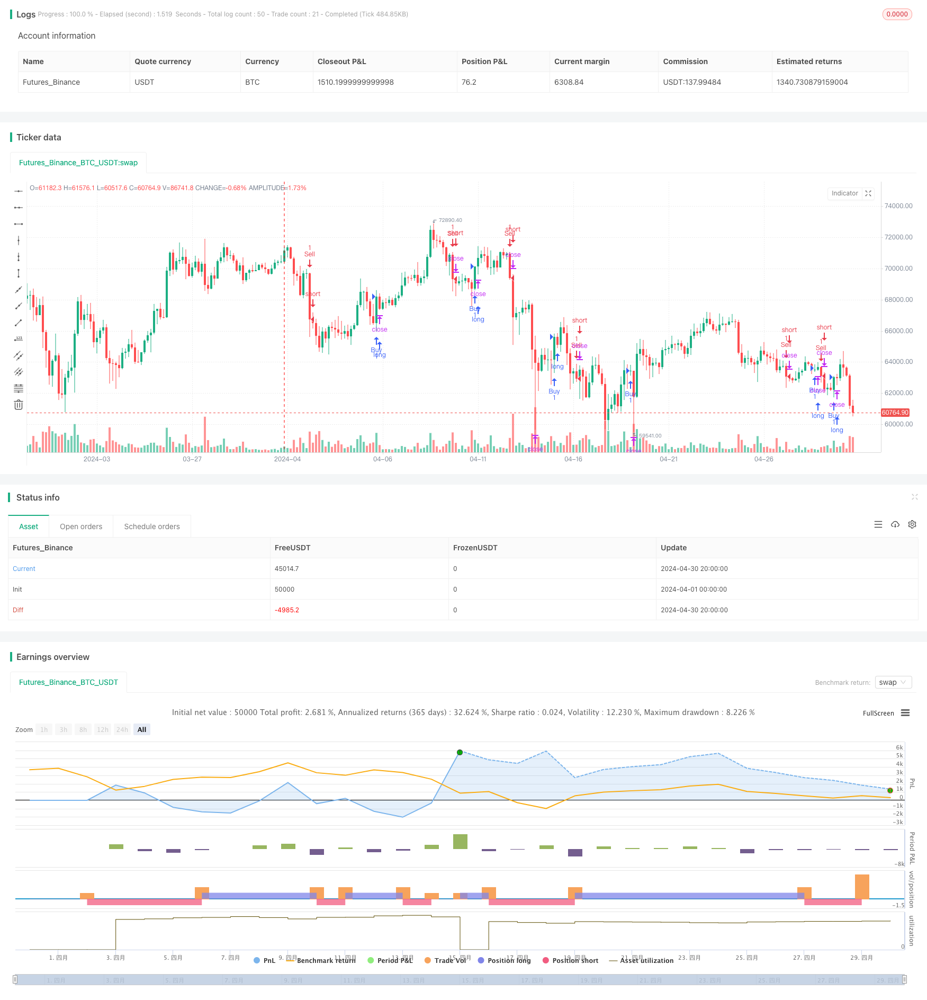

> Name

Improved-Swing-High-Low-Breakout-Strategy-with-Bullish-and-Bearish-Engulfing-Patterns
> Author

ChaoZhang

> Strategy Description



[trans]
#### Overview
This strategy is an improved long-short conversion breakthrough strategy that aims to use a combination of bullish and bearish engulfing K-line patterns to capture potential trend reversal signals. The strategy works by identifying swing highs and lows and generating trading signals when price breaks through these key levels. At the same time, the strategy uses a predefined risk-reward ratio to set take-profit and stop-loss levels to better manage trading risks.
#### Strategy Principle
1. Calculate swing highs and lows: By comparing the current highs and lows with the highs and lows of the previous two cycles, determine whether a new swing high or low has been formed.
2. Identify bullish and bearish engulfing patterns: When the closing price is higher than the opening price of the previous period, and the current K-line is a positive line, and the previous period is a negative line, it is judged to be a bullish engulfing pattern; conversely, when the closing price is lower than the opening price of the previous period, and the current K-line is a negative line, and the previous period is a positive line, it is judged to be a bearish engulfing pattern.
3. Generate trading signals: When a bullish engulfing pattern appears and the price breaks through the swing high, a long signal is generated; when a bearish engulfing pattern appears and the price breaks through the swing low, a short signal is generated.
4. Set take-profit and stop-loss: Calculate take-profit and stop-loss levels based on the predefined risk-reward ratio, and set corresponding take-profit and stop-loss orders when the transaction is executed.
#### Advantage Analysis
1. Combining price action and K-line patterns: This strategy not only takes into account price breakthroughs of key levels, but also combines bullish and bearish engulfing patterns, improving the reliability of trading signals.
2. Risk management: Setting stop-profit and stop-loss through predefined risk-return ratios helps control the risk exposure of a single transaction and improves the overall risk management effect.
3. Adapt to different market conditions: The strategy considers both long and short directions and can find trading opportunities in different market trends.
#### Risk Analysis
1. False signal risk: In some cases, price breakthroughs and K-line patterns may generate false signals, causing transactions to enter the wrong direction. False signals can be reduced by adding other confirmation indicators or filters.
2. Market fluctuation risk: In a violently volatile market, prices may quickly break through key levels and trigger stop losses, resulting in continuous losses. This can be dealt with by adjusting the stop loss level or adopting a dynamic stop loss strategy.
3. Transaction frequency and cost: Frequent transactions may increase handling fee costs and affect the overall performance of the strategy. Trading frequency can be controlled by optimizing entry conditions or appropriately adjusting parameters.
#### Optimization direction
1. Introduce trend confirmation indicators: Combined with moving averages or other trend indicators to verify the effectiveness of price breakthroughs and improve the quality of trading signals.
2. Dynamically adjust stop loss: Dynamically adjust the stop loss level according to market volatility or price changes to better respond to different market conditions.
3. Optimize parameters: Through backtesting and optimizing different parameter combinations, find the best parameter settings and improve the stability and profitability of the strategy.
#### Summary
The improved long-short conversion K-line pattern breakthrough strategy combines price breakthroughs and K-line patterns to capture trend reversal opportunities while focusing on risk management. The advantage of the strategy is that it comprehensively considers price behavior and market sentiment and adapts to different market environments. However, the strategy also faces risks such as false signals, market fluctuations and transaction costs, and needs to be further improved by introducing trend confirmation indicators, dynamically adjusting stop losses and optimizing parameters. Overall, this strategy provides an idea for capturing potential trend reversal opportunities, but in actual application it needs to be appropriately adjusted and optimized based on specific market characteristics and trading needs.
|| 

#### Overview
This strategy is an improved variation of a swing high/low breakout strategy that aims to capitalize on potential trend reversals signaled by bullish and bearish engulfing candlestick patterns. The strategy identifies swing highs and lows and generates trading signals when prices break through these key levels. Additionally, the strategy employs a predefined risk-reward ratio to set take-profit and stop-loss levels for better risk management.

#### Strategy Principles
1. Calculating swing highs and lows: By comparing the current high and low with the highs and lows of the previous two periods, the strategy determines whether a new swing high or low has formed.
2. Identifying bullish and bearish engulfing patterns: A bullish engulfing pattern is recognized when the closing price is higher than the previous period's opening price, and the current candle is a bullish candle, while the previous period is a bearish candle. Conversely, a bearish engulfing pattern is identified when the closing price is lower than the previous period's opening price, and the current candle is a bearish candle, while the previous period is a bullish candle.
3. Generating trading signals: When a bullish engulfing pattern occurs, and the price breaks above the swing high, a long signal is generated. When a bearish engulfing pattern occurs, and the price breaks below the swing low, a short signal is generated.
4. Setting take-profit and stop-loss: The take-profit and stop-loss levels are calculated based on the predefined risk-reward ratio and are set when executing trades.

#### Advantage Analysis
1. Combining price action and candlestick patterns: The strategy not only considers price breakouts at key levels but also incorporates bullish and bearish engulfing patterns, enhancing the reliability of trading signals.
2. Risk management: By setting take-profit and stop-loss levels based on a predefined risk-reward ratio, the strategy helps control the risk exposure of individual trades and improves overall risk management.
3. Adaptability to different market conditions: The strategy considers both long and short directions, allowing it to find trading opportunities in various market trends.

#### Risk Analysis
1. False signal risk: In some cases, price breakouts and candlestick patterns may generate false signals, leading to trades in the wrong direction. This risk can be mitigated by adding additional confirmation indicators or filtering conditions.
2. Market volatility risk: In highly volatile markets, prices may quickly break through key levels and trigger stop-losses, leading to consecutive losses. Adjusting stop-loss levels or employing dynamic stop-loss strategies can help address this risk.
3. Trading frequency and costs: Frequent trading may increase transaction costs, affecting the overall performance of the strategy. Optimizing entry conditions or appropriately adjusting parameters can help control trading frequency.

#### Optimization Directions
1. Introducing trend confirmation indicators: Combining moving averages or other trend indicators to validate the effectiveness of price breakouts can improve the quality of trading signals.
2. Dynamic stop-loss adjustment: Dynamically adjusting stop-loss levels based on market volatility or price changes can help better adapt to different market conditions.
3. Parameter optimization: By backtesting and optimizing different parameter combinations, the optimal parameter settings can be found to improve the stability and profitability of the strategy.

#### Summary
The improved swing high/low breakout strategy with bullish and bearish engulfing patterns combines price breakouts and candlestick patterns to capture potential trend reversal opportunities while emphasizing risk management. The strategy's advantages lie in its consideration of both price action and market sentiment, adapting to different market environments. However, the strategy also faces risks such as false signals, market volatility, and trading costs, which need to be addressed through the introduction of trend confirmation indicators, dynamic stop-loss adjustment, and parameter optimization. Overall, this strategy provides an approach to capturing potential trend reversal opportunities, but it requires appropriate adjustments and optimizations based on specific market characteristics and trading requirements when applied in practice.
[/trans]


> Source (PineScript)

``` pinescript
/*backtest
start: 2024-04-01 00:00:00
end: 2024-04-30 23:59:59
period: 4h
basePeriod: 15m
exchanges: [{"eid":"Futures_Binance","currency":"BTC_USDT"}]
*/

// This Pine Script™ code is subject to the terms of the Mozilla Public License 2.0 at https://mozilla.org/MPL/2.0/
// © Markoline007

//@version=5
strategy("Improved Swing High/Low Breakout Strategy", overlay=true)

// Define input variables
length = input(14, title="Swing Length")
multiplier = input(3, title="Multiplier")
risk_reward_ratio = input(1.6, title="Risk-Reward Ratio")
target_multiplier = input(2, title="Target Multiplier")

// Calculate swing highs and swing lows
var float lastHigh = na
var float lastLow = na
var bool isHigh = na
var bool isLow = na

if high[1] < high and high[2] < high[1]
    lastHigh := high[1]
    isHigh := true
    isLow := false
else if low[1] > low and low[2] > low[1]
    lastLow := low[1]
    isLow := true
    isHigh := false
else
    isHigh := false
    isLow := false

// Define buy and sell conditions
buySignal = close > lastHigh and close > open and close[1] < open[1] // Bullish engulfing
sellSignal = close < lastLow and close < open and close[1] > open[1] // Bearish engulfing

// Calculate stop and target levels
stopLevel = close
targetLevel = close + (close - stopLevel) * risk_reward_ratio

// Execute buy and sell trades
if buySignal
    strategy.entry("Buy", strategy.long)
    strategy.exit("TP/SL", "Buy", profit=targetLevel, loss=stopLevel)
if sellSignal
    strategy.entry("Sell", strategy.short)
    strategy.exit("TP/SL", "Sell", profit=targetLevel, loss=stopLevel)


```

> Detail

https://www.fmz.com/strategy/451724

> Last Modified

2024-05-17 15:05:29
