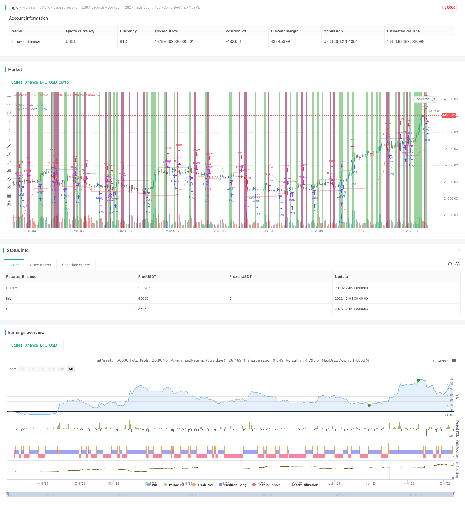

> Name

Breakout overlapping K-line high and low strategy Inside-Bar-Range-Breakout-Strategy
> Author

ChaoZhang

> Strategy Description



[trans]

## Overview
The overlapping K-line high-low breakout strategy is a price action strategy that makes trading decisions based on the overlapping K-line pattern. This strategy occurs when the price difference range of the current K line is smaller than the previous K line, indicating that the market is gaining momentum or is hesitant. When the price breaks above or below the previous candle's high or low price, this provides a possible entry signal.
## Strategy Principle
The strategy uses the following indicators and variables:
- Average true amplitude (ATR): The average true amplitude of the past N K-lines calculated using the ATR function.
- Price difference Range: the difference between the highest price and the lowest price of the current K line.  
- insideBar: Boolean variable, if the price difference Range of the current K line is smaller than the previous K line, it is true, indicating that an overlapping K line has occurred.
- Upward breakthrough: Boolean variable, if the closing price is higher than the highest price of the previous K line, it is true, indicating that an upward breakthrough has occurred.
- Downward breakthrough: Boolean variable, if the closing price is lower than the lowest price of the previous K line, it is true, indicating that a downward breakthrough has occurred.  
- Upward liquidity: the highest price among the past N K lines, representing the resistance position of möglich. 
- Downward liquidity: The lowest price among the past N K lines represents a possible support position.
The entry decision is based on the price difference Range and the breakthrough of the highest and lowest price of the previous K line. Specifically, when an upward breakthrough occurs and the lowest price of the current K-line is higher than the downward liquidity, a long entry signal is generated; when a downward breakthrough occurs and the highest price of the current K-line is lower than the upward liquidity, a short entry signal is generated.
Stop loss uses a multiple of ATR multiplied by the current spread stop loss. Take profit uses the ATR multiple multiplied by the current spread to take profit.
## Advantage Analysis
This strategy has the following advantages:
1. Use overlapping K lines to organize the market and prepare for trading opportunities to break through in one direction.
2. Combine the breakthrough direction and liquidity level to avoid being trapped. 
3. mStop loss and take profit are clear and easy to implement.
4. It has strong directionality and has a high probability of achieving profit targets in the market after the breakthrough.
## Risk Analysis
This strategy also has the following risks:
1. Failure to break through, trapped. Use reasonable stop loss levels to avoid large losses.
2. The market fluctuates violently and the stop loss is broken down. Adjust the ATR period to ensure that the stop loss distance is reasonable. 
3. Misjudge the liquidity level and choose the wrong direction to enter the market. Optimize liquidity level parameters and refine entry conditions.
4. The reversal fails and the profit target cannot be achieved. Appropriately reduce the take-profit multiple to ensure that the take-profit level is reasonable.
## Optimization direction
This strategy can be optimized from the following aspects:
1. Optimize ATR parameters and find the most suitable ATR cycle parameters.
2. Test different stop loss multiples and determine a reasonable stop loss distance.
3. Test different take-profit multiples to balance profit size and transaction probability.
4. Optimize liquidity level parameters to improve the accuracy of entry.
5. Add other filtering conditions, such as trading volume, to optimize entry timing.
6. Combine with trend indicators and adopt trend following methods.
## Summarize
The strategy of breaking through the high and low positions of overlapping K-lines uses market momentum preparation and breakthrough principles to enter the market when the price breaks through the price difference range of the previous K-line. Combine with liquidity position to avoid the risk of being trapped. The stop-loss and stop-profit settings are reasonable, and after a breakthrough, the market can run with the trend to achieve the profit target. This strategy is expected to achieve better trading performance during the intermediate period. Through parameter optimization and filtering condition optimization, the strategic advantages can be further expanded and the system stability can be improved.
||

## Overview  

The inside bar range breakout strategy is a price action strategy that makes trading decisions based on inside bar patterns. It occurs when the range of the current bar, measured by the difference between high and low, is smaller than that of the previous bar, indicating consolidation or indecision in the market. A breakout above or below the previous bar's high or low provides a potential entry signal in the direction of the breakout.   

## Strategy Logic

The strategy utilizes the following indicators and variables:  

- Average True Range (ATR): The average true range over the past N bars calculated using the ATR function.  
- Range: The difference between high and low of the current bar.
- insideBar: A boolean variable that is true if Range of current bar is smaller than previous bar, indicating an inside bar.
- breakoutUp: A boolean variable that is true if close is higher than previous bar's high, indicating an upward breakout. 
- breakoutDown: A boolean variable that is true if close is lower than previous bar's low, indicating a downward breakout.   
- liquidityUp: Highest high over past N bars, representing a potential resistance area.  
- liquidityDown: Lowest low over past N bars, representing a potential support area.
  
Entry decisions are based on Range breakouts beyond previous bar's high/low. Specifically, long entry when upward breakout happens and current low is above liquidityDown, and short entry when downward breakout happens and current high is below liquidityUp.
  
Stop loss uses ATR multiplied by Range. Take profit uses ATR multiplied by Range.
  
## Advantage Analysis

The advantages of this strategy include:
  
1. Captures trading opportunity from range expansion after inside bar consolidation. 
2. Prevents getting trapped combining breakout direction and liquidity levels.  
3. Clear stop loss and take profit rules, easy to implement.  
4. Strong directionality, high chance of reaching profit target after momentum breakout.
 
## Risk Analysis
  
Risks of this strategy:  

1. Failed breakout resulting in getting trapped. Use reasonable stop loss to limit loss amount.
2. Volatile market causing stop loss being hit. Adjust ATR period to ensure proper stop distance.  
3. Inaccurate liquidity level leading to wrong entry. Optimize lookback period to refine entry criteria.  
4. Failed reversal unable to reach profit target. Reduce take profit multiplier for sensible target. 
 
## Optimization Directions
 
Areas of optimization:  

1. Find optimum ATR period for maximum performance.  
2. Test different stop loss multipliers for ideal stop distance.
3. Test different take profit multipliers to balance size and probability.  
4. Optimize lookback period for better accuracy on liquidity levels.
5. Add filters like volume to improve entry timing.  
6. Incorporate trend indicators to add trend following.
 
## Summary

The inside bar range breakout strategy capitalizes on range expansion from consolidation by entering when price breaks out of previous bar's range. Liquidity levels avoid getting trapped. Reasonable stop loss and take profit settings allow riding the momentum after breakout to reach profit target. The strategy can yield good results on intermediate time frames. Further enhancing advantages and system robustness can be achieved through parameter optimization and improving entry filters.

[/trans]

> Strategy Arguments


|Argument|Default|Description|
|----|----|----|
|v_input_int_1|20|Lookback Period|
|v_input_float_1|1.5|ATR Multiplier|
|v_input_int_2|14|ATR Length|
|v_input_float_2|2|Stop Loss Multiplier|
|v_input_float_3|3|Take Profit Multiplier|


> Source (PineScript)

``` pinescript
/*backtest
start: 2022-12-04 00:00:00
end: 2023-12-10 00:00:00
period: 1d
basePeriod: 1h
exchanges: [{"eid":"Futures_Binance","currency":"BTC_USDT"}]
*/

// This source code is subject to the terms of the Mozilla Public License 2.0 at https://mozilla.org/MPL/2.0/
// © ilikelyrics560

//@version=5
strategy("Inside Bar Range Breakout Strategy", overlay=true)

// Inputs
lookback = input.int(20, "Lookback Period", minval=1)
atrMult = input.float(1.5, "ATR Multiplier", step=0.1)
atrLen = input.int(14, "ATR Length", minval=1)
slMult = input.float(2, "Stop Loss Multiplier", step=0.1)
tpMult = input.float(3, "Take Profit Multiplier", step=0.1)

// Variables
atr = ta.atr(atrLen)
Range = high - low 
insideBar = Range < Range[1]
breakoutUp = close > high[1]
breakoutDown = close < low[1]
liquidityUp = ta.highest(high, lookback)
liquidityDown = ta.lowest(low, lookback)
longEntry = breakoutUp and low > liquidityDown
shortEntry = breakoutDown and high < liquidityUp
longExit = close < low[1] 
shortExit = close > high[1]

// Plotting
plot(liquidityUp, "Liquidity Up", color.new(color.green, 30), 1)
plot(liquidityDown, "Liquidity Down", color.new(color.red, 30), 1)
bgcolor(longEntry ? color.new(color.green, 30) : na, title="Long Entry")
bgcolor(shortEntry ? color.new(color.maroon, 30) : na, title="Short Entry")

// Trading
if (longEntry)
    strategy.entry("Long", strategy.long)
    strategy.exit("Long Exit", "Long", stop=low - slMult * atr, limit=high + tpMult * atr)

if (shortEntry)
    strategy.entry("Short", strategy.short)
    strategy.exit("Short Exit", "Short", stop=high + slMult * atr, limit=low - tpMult * atr)
```

> Detail

https://www.fmz.com/strategy/434989

> Last Modified

2023-12-11 15:16:53
