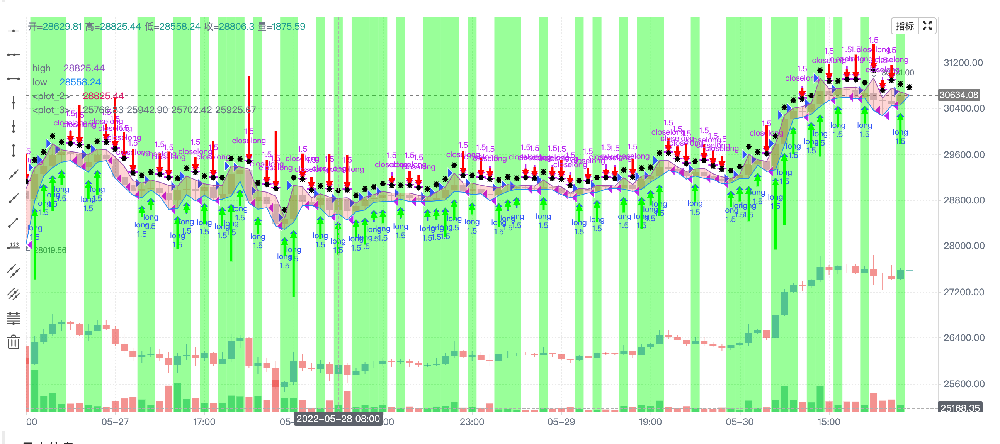

> Name

KLineChart-DemoKLineChart-Demo
> Author

inventor quantification
> Strategy Description

The platform (Javascript/Python language) activates KLineChart support, supports all drawing functions of Pine language (the parameters remain consistent), and supports customized buying and selling signals.
 Here is a demo example 
Reference document https://www.fmz.com/api#klinechart 
 
  
 
 
 


> Source (javascript)

``` javascript
/*backtest
start: 2022-05-31 00:00:00
end: 2022-06-29 23:59:00
period: 1h
basePeriod: 15m
exchanges: [{"eid":"Binance","currency":"BTC_USDT"}]
*/

function main() {
    let c = KLineChart({overlay: true})
    let bars = exchange.GetRecords()
    if (!bars) {
        return
    }
    bars.forEach(function(bar) {
        c.begin(bar)
        c.barcolor(bar.Close > bar.Open ? 'rgba(255, 0, 0, 0.2)' : 'rgba(0, 0, 0, 0.2)')
        if (bar.Close > bar.Open) {
            c.bgcolor('rgba(0, 255, 0, 0.5)')
        }
        let h = c.plot(bar.High, 'high')
        let l = c.plot(bar.Low, 'low')

        c.fill(h, l, {
            color: bar.Close > bar.Open ? 'rgba(255, 0, 0, 0.2)' : 'rgba(255, 0, 0, 0.2)'
        })
        c.hline(bar.High)
        c.plotarrow(bar.Close - bar.Open)
        c.plotshape(bar.Low, {
            style: 'diamond'
        })
        c.plotchar(bar.Close, {
            char: 'X'
        })
        c.plotcandle(bar.Open*0.9, bar.High*0.9, bar.Low*0.9, bar.Close*0.9)
        if (bar.Close > bar.Open) {
            // long/short/closelong/closeshort
            c.signal("long", bar.High, 1.5)
        } else if (bar.Close < bar.Open) {
            c.signal("closelong", bar.Low, 1.5)
        }
        c.close()
    })
}
```

> Detail

https://www.fmz.com/strategy/362951

> Last Modified

2022-07-01 17:57:22
