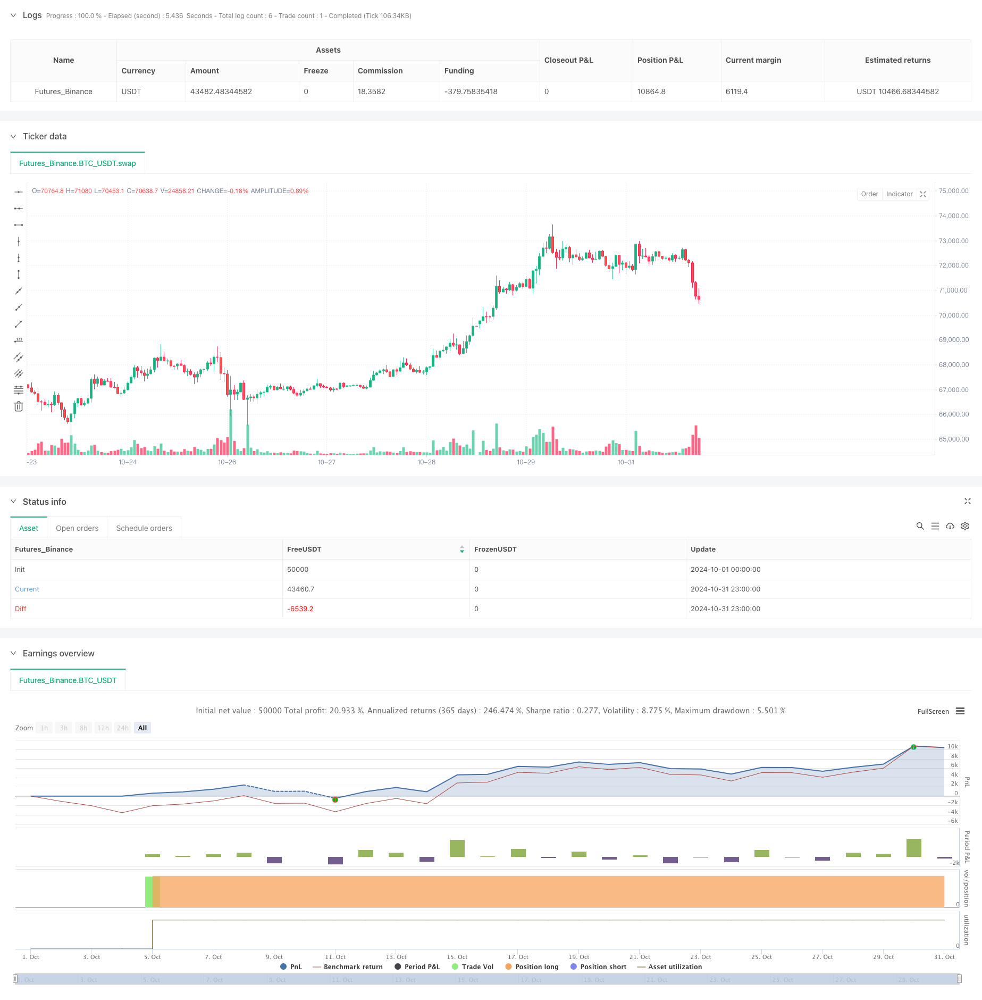

> Name

KNN Adaptive Parametric Trend Following Strategy-KNN-Based-Adaptive-Parametric-Trend-Following-Strategy
> Author

ChaoZhang

> Strategy Description



[trans]
#### Overview
This strategy is an adaptive parameterized trend tracking system based on the machine learning algorithm K-Nearest Neighbors (KNN). This strategy dynamically adjusts trend tracking parameters through the KNN algorithm and combines moving averages to generate trading signals. The system can automatically adjust strategy parameters according to changes in the market environment to improve the adaptability and stability of the strategy. This strategy uses machine learning methods to optimize traditional trend following strategies and is a combination of technology and innovation in the field of quantitative investment.
#### Strategy Principle
The core principle of the strategy is to use the KNN algorithm to analyze historical price data and predict price trends by calculating the similarity between the current market state and historical data. The specific implementation steps are as follows:
1. Set the observation window size and K value, and collect historical price data to form a feature vector
2. Calculate the Euclidean distance between the current price series and historical data
3. Select the K most similar historical price series as nearest neighbor samples
4. Analyze the subsequent price changes of these K nearest neighbor samples
5. Combined with the moving average, generate trading signals based on the average price changes of nearby samples
When the average price change of the K nearest neighbor samples is positive and the current price is above the moving average, the system generates a long signal; otherwise, a short signal is generated.
#### Strategic Advantages
1. Strong adaptability: The KNN algorithm can automatically adjust parameters according to changes in the market environment, making the strategy highly adaptable.
2. Multi-dimensional analysis: combines machine learning algorithms and technical indicators to provide a more comprehensive market analysis perspective
3. Reasonable risk control: Using the moving average as an auxiliary confirmation reduces the impact of false signals
4. Clear calculation logic: The execution process of the strategy is transparent and easy to understand and optimize.
5. Flexible and adjustable parameters: parameters such as K value and window size can be adjusted according to different market environments
#### Strategy Risk
1. High computational complexity: KNN algorithm needs to calculate a large amount of historical data, which may affect the efficiency of strategy execution.
2. Parameter sensitivity: The choice of K value and window size has an important impact on strategy performance
3. Dependence on market environment: In a volatile market environment, the reference value of historical similarity may be reduced.
4. Risk of over-fitting: Over-reliance on historical data may lead to over-fitting of the strategy
5. Delay risk: Due to the need to collect sufficient historical data, there may be signal lags
#### Strategy optimization direction
1. Feature engineering optimization:
- Add more technical indicators as features
-Introduction of market sentiment indicator
- Optimize feature standardization method
2. Improvement of algorithm efficiency:
- Optimize nearest neighbor search using data structures such as KD trees
- Implement parallel computing
- Optimize data storage and access methods
3. Enhanced risk control:
- Add stop loss and take profit mechanism
- Introduced volatility filter
- Design dynamic position management system
4. Parameter optimization plan:
- Implement adaptive K value selection
- Dynamically adjust the size of the observation window
- Optimize moving average period
5. Improvement of signal generation mechanism:
-Introduced signal strength scoring system
- Design signal confirmation mechanism
- Optimize entry and exit timings
#### Summary
This strategy innovatively applies the KNN algorithm to trend following trading and optimizes traditional technical analysis strategies through machine learning methods. The strategy has strong adaptability and flexibility, and can dynamically adjust parameters according to the market environment. Although there are risks such as high computational complexity and parameter sensitivity, the strategy still has good application value through reasonable optimization and risk control measures. It is recommended that investors pay attention to adjusting parameters according to market characteristics in practical applications, and combine other analysis methods to make trading decisions. ||
#### Overview
This strategy is an adaptive parametric trend following system based on the K-Nearest Neighbors (KNN) machine learning algorithm. The strategy dynamically adjusts trend following parameters through the KNN algorithm and generates trading signals in combination with moving averages. The system can automatically adjust strategy parameters based on changes in market conditions, improving strategy adaptability and stability. This strategy combines machine learning methods to optimize traditional trend following strategies, representing a fusion of technology and innovation in quantitative investment.

#### Strategy Principle
The core principle of the strategy is to analyze historical price data using the KNN algorithm and predict price trends by calculating the similarity between current market conditions and historical data. The specific implementation steps are:
1. Set observation window size and K value, collect historical price data to form feature vectors
2. Calculate Euclidean distance between current price sequence and historical data
3. Select K most similar historical price sequences as neighbor samples
4. Analyze subsequent price movements of these K neighbor samples
5. Generate trading signals based on average price changes of neighbor samples combined with moving averages
When the average price change of K neighbor samples is positive and current price is above the moving average, the system generates long signals; otherwise, it generates short signals.

#### Strategy Advantages
1. Strong adaptability: KNN algorithm can automatically adjust parameters based on market environment changes
2. Multi-dimensional analysis: Combines machine learning algorithms and technical indicators for more comprehensive market analysis
3. Reasonable risk control: Uses moving averages as auxiliary confirmation to reduce impact of false signals
4. Clear computational logic: Strategy execution process is transparent and easy to understand and optimize
5. Flexible parameters: K value and window size can be adjusted according to different market environments

#### Strategy Risks
1. High computational complexity: KNN algorithm requires calculating large amounts of historical data
2. Parameter sensitivity: Choice of K value and window size significantly impacts strategy performance
3. Market environment dependence: Reference value of historical similarity may decrease in volatile markets
4. Overfitting risk: Over-reliance on historical data may lead to strategy overfitting
5. Delay risk: Signal lag may exist due to need for sufficient historical data collection

#### Strategy Optimization Directions
1. Feature Engineering Optimization:
- Add more technical indicators as features
- Introduce market sentiment indicators
- Optimize feature standardization methods

2. Algorithm Efficiency Improvement:
- Optimize nearest neighbor search using KD-trees
- Implement parallel computing
- Optimize data storage and access methods

3. Risk Control Enhancement:
- Add stop-loss and take-profit mechanisms
- Introduce volatility filters
- Design dynamic position management system

4. Parameter Optimization Solutions:
- Implement adaptive K value selection
- Dynamically adjust observation window size
- Optimize moving average periods

5. Signal Generation Mechanism Improvement:
- Introduce signal strength scoring system
- Design signal confirmation mechanism
- Optimize entry and exit timing

#### Summary
This strategy innovatively applies the KNN algorithm to trend following trading, optimizing traditional technical analysis strategies through machine learning methods. The strategy possesses strong adaptability and flexibility, capable of dynamically adjusting parameters based on market conditions. Although risks such as high computational complexity and parameter sensitivity exist, the strategy still has good application value through reasonable optimization and risk control measures. It is recommended that investors adjust parameters according to market characteristics and combine other analysis methods for trading decisions in practical applications.[/trans]


> Source (PineScript)

``` pinescript
/*backtest
start: 2024-10-01 00:00:00
end: 2024-10-31 23:59:59
period: 1h
basePeriod: 1h
exchanges: [{"eid":"Futures_Binance","currency":"BTC_USDT"}]
*/

//@version=6
strategy("Trend Following Strategy with KNN", overlay=true,commission_value=0.03,currency='USD', commission_type=strategy.commission.percent,default_qty_type=strategy.cash)


// Input parameters
k = input.int(5, title="K (Number of Neighbors)", minval=1)  // Number of neighbors for KNN algorithm
window_size = input.int(20, title="Window Size", minval=1)  // Window size for feature vector calculation
ma_length = input.int(50, title="MA Length", minval=1)  // Length of the moving average

// Calculate moving average
ma = ta.sma(close, ma_length)

// Initialize variables
var float[] features = na
var float[] distances = na
var int[] nearest_neighbors = na

if bar_index >= window_size - 1  // Ensure there is enough historical data
    features := array.new_float(0)  // Keep only the current window data
    for i = 0 to window_size - 1
        array.push(features, close[i])

    // Calculate distances
    distances := array.new_float(0)  // Clear the array for each calculation
    for i = 0 to window_size - 1  // Calculate the distance between the current price and all prices in the window
        var float distance = 0.0
        for j = 0 to window_size - 1
            distance += math.pow(close[j] - array.get(features, j), 2)
        distance := math.sqrt(distance)
        array.push(distances, distance)

    // Find the nearest neighbors
    if array.size(distances) > 0 and array.size(distances) >= k
        nearest_neighbors := array.new_int(0)
        for i = 0 to k - 1
            var int min_index = -1
            var float min_distance = na
            for j = 0 to array.size(distances) - 1
                if na(min_distance) or array.get(distances, j) < min_distance
                    min_index := j
                    min_distance := array.get(distances, j)
            if min_index != -1
                array.push(nearest_neighbors, min_index)
                array.remove(distances, min_index)  // Remove the processed neighbor

    // Calculate the average price change of the neighbors
    var float average_change = 0.0
    if array.size(nearest_neighbors) > 0
        for i = 0 to array.size(nearest_neighbors) - 1
            var int index = array.get(nearest_neighbors, i)
            // Ensure index + 1 is within range
            if index + 1 < bar_index
                average_change += (close[index] - close[index + 1])
        average_change := average_change / array.size(nearest_neighbors)

    // Generate trading signals
    if average_change > 0 and close > ma
        strategy.entry("Long", strategy.long)
    else if average_change < 0 and close < ma
        strategy.entry("Short", strategy.short)


```

> Detail

https://www.fmz.com/strategy/473319

> Last Modified

2024-11-29 10:54:49
