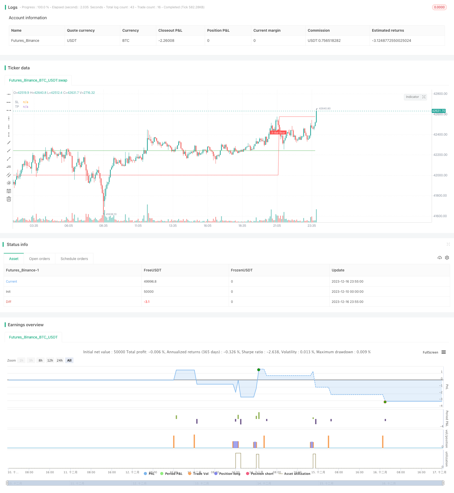

> Name

Three-Bar-and-Four-Bar-Breakout-Reversion-Strategy
> Author

ChaoZhang

> Strategy Description


 [trans]

### Overview
The three-four K-line breakthrough reversal strategy is a counter-trend trading strategy by identifying three K-lines or four K-lines with greater K-line upward momentum, and then conducting counter-trend trading when the reversal K-lines occur after several smaller K-lines form support or pressure.
### Strategy Principles
The core identification logic of this strategy mainly includes the following parts:
1. Identify the K line (Gap Bar) with increasing amplitude: breaking through 1.5 times the average ATR, and the real part is greater than 0.65. This K-line is considered to have a strong upward and downward momentum.
2. Identify the shrinking K-line (Collecting Bar): follow 1-2 K-lines with small fluctuations behind the Gap Bar, and the high point or low point is close to the Gap Bar. These K lines represent the slowdown and consolidation of the trend, forming support or pressure.
3. Identify the reversal signal K line: After consolidating the K line, if there is a K line with an entity that breaks through the high point or low point of the previous K lines, it can be considered a reversal signal. According to the direction of the entity, you can judge whether to go long or short, and open a position on this K line.
4. Stop loss and take profit: Stop loss is set below the low point or above the high point of the Gap K line; take profit is based on the stop loss point multiplied by the configured profit and loss ratio.
### Advantage Analysis
This strategy has several major advantages:
1. Use the characteristics of the K-line itself to determine trends and reversal points without relying on any indicators, achieving "self-contained indicators".
2. The filtering conditions of Gap Bar and Collecting Bar are strict and can effectively identify real trends and consolidations.
3. The reversal signal is judged based on the entity, which reduces the probability of false signals.
4. Only 3-4 K-line combinations are needed to complete a transaction, with a short time period and high frequency.
5. The take-profit and stop-loss settings are clear, and the retracement and profit-loss ratio are easy to control.
### Risk Analysis
This strategy also has the following risks:
1. Depends on the quality of parameter settings. If the parameter settings are too loose, it will increase the chances of false signals and losing trades.
2. It is susceptible to interference from high-frequency false breakthroughs and cannot effectively filter out all false signals.
3. There is a risk of being trapped. If the reversal is insufficient, it is easy to form an adjustment, making it impossible to stop the loss.
4. The stop loss range is relatively large, and individual trapped opportunities may cause large losses.
To reduce these risks, you can optimize from the following aspects:
1. Optimize parameters to make Gap Bar and Collecting Bar recognition more accurate.
2. Add a filter and open a position after reconfirming the reversal K line.
3. Optimize the stop loss algorithm to make the stop loss closer to the price and the loss more controllable.
### Optimization direction
This strategy also has the following main optimization directions:
1. Add a composite filter to avoid false breakthrough interference. For example, increase the trading volume indicator and only consider trading signals when the trading volume increases.
2. Combined with moving average indicators, only consider trading signals when the price breaks through important moving averages (such as the 20-day line, 60-day line).
3. Multi-time frame verification, open a position only when multiple periods give signals at the same time.
4. Optimize the profit-taking conditions and dynamically adjust the profit-loss ratio according to the degree of market volatility and risk preference.
5. Combined with the market long-short status judgment system, this strategy can only be used in trending market environments.
These optimizations can further improve the stability and profitability of the strategy.
### Summarize
The 3-4 K-line breakthrough reversal strategy trades by identifying high-quality trend potential segments and reversal signals. The operation cycle is short and the frequency is high, and it is expected to obtain generous excess returns. At the same time, there are certain risks and need to continue to be optimized to reduce risks and improve stability. In general, this strategy effectively uses the characteristics of the market outline itself to determine trends and reversal points, and is worthy of further research and application.
|| 

### Overview  

The Three Bar and Four Bar Breakout Reversion strategy identifies three or four K-line bars with strong momentum, and takes counter-trend trades after several small-range K-bars form support/resistance levels and reversal signals emerge. It belongs to mean-reversion strategy.

### Strategy Logic

The core identification logic of this strategy includes:  

1. Recognize large-range bars (Gap Bars): Break 1.5 x ATR, with a body percentage above 65%. They are considered to have strong momentum.

2. Recognize low-range bars (Collecting Bars): One or two subsequent small-range bars following Gap Bars, with high/low levels close to those of Gap Bars. They represent slowing momentum and consolidation, forming support/resistance levels.

3. Recognize reversal signal bars: If a bar breaks through the high/low of previous bars after consolidation, it can be considered a reversal signal. We take positions based on the direction of the signal bar.

4. Stop loss and take profit: Set stop loss below/above Gap Bar's low/high points. Take profit is determined by multiplying risk-reward ratio with stop loss distance.

### Advantage Analysis   

The main advantages of this strategy:

1. Identify trends and reversals using raw price action, no indicators needed. 

2. Strict rules on Gap Bars and Collecting Bars ensure accuracy in capturing real trends and consolidations.   

3. Judging reversal bars by bodies reduces false signals.  

4. Each trade only takes 3-4 bars. High frequency with short holding period.

5. Clear rules on stop loss and take profit makes risk management easier.

### Risk Analysis

The main risks:

1. Relying on parameter settings. Loose parameters increase false signals and losing trades.

2. Vulnerable to fake breakouts and unable to filter out all false signals.  

3. Risk of being trapped in consolidations after failed breakout attempts. Difficult to cut loss in such cases.

4. Wide stop loss range means large losses on occasion when trapped.

To reduce risks:

1. Optimize parameters for Gap Bars and Collecting Bars identification.  

2. Add filters such as confirmation bars before entering positions.

3. Optimize stop loss algorithms to make them more adaptive. 

### Optimization Directions

Main optimization directions:  

1. Add composite filters to avoid false breakouts, e.g. requiring increase in volume.

2. Combine with moving averages, only taking signals when key MA levels are broken.  

3. Require agreement across multiple timeframes before entering trades.  

4. Dynamically adjust profit targets based on market volatility and risk preference.

5. Combine with market regime identification system, only enable strategy in trending environments.

These optimizations can further improve stability and profitability.  

### Conclusion

The Three Bar and Four Bar Breakout Reversion strategy aims to capture high-quality trending moves and reversal trades. It has the advantage of short holding periods and high frequency. There are also inherent risks that need to be reduced through continued optimization. By effectively identifying self-contained trend and reversal signals from raw price action, this strategy warrants further research and application.

[/trans]

> Strategy Arguments


|Argument|Default|Description|
|----|----|----|
|v_input_1|true|From Month|
|v_input_2|true|From day|
|v_input_3|2021|From Year|
|v_input_4|12|To Month|
|v_input_5|31|To day|
|v_input_6|2100|To Year|
|v_input_7|1.5|Gap Bar Size|
|v_input_8|0.65|Gap Bar Body Size|
|v_input_9|0.1|Bull Top Bar Size|
|v_input_10|2|Profit Multiplier|
|v_input_11|true|Show Buy/Sell Labels?|


> Source (PineScript)

``` pinescript
/*backtest
start: 2023-12-10 00:00:00
end: 2023-12-17 00:00:00
period: 5m
basePeriod: 1m
exchanges: [{"eid":"Futures_Binance","currency":"BTC_USDT"}]
*/

//@version=4
strategy(title="Three (3)-Bar and Four (4)-Bar Plays Strategy", shorttitle="Three (3)-Bar and Four (4)-Bar Plays Strategy", overlay=true, calc_on_every_tick=true, currency=currency.USD, default_qty_value=1.0,initial_capital=30000.00,default_qty_type=strategy.percent_of_equity)

frommonth = input(defval = 1, minval = 01, maxval = 12, title = "From Month")
fromday = input(defval = 1, minval = 01, maxval = 31, title = "From day")
fromyear = input(defval = 2021, minval = 1900, maxval = 2100, title = "From Year")

tomonth = input(defval = 12, minval = 01, maxval = 12, title = "To Month")
today = input(defval = 31, minval = 01, maxval = 31, title = "To day")
toyear = input(defval = 2100, minval = 1900, maxval = 2100, title = "To Year")

garBarSetting1 = input(defval = 1.5, minval = 0.0, maxval = 100.0, title = "Gap Bar Size", type = input.float)
garBarSetting2 = input(defval = 0.65, minval = 0.0, maxval = 100.0, title = "Gap Bar Body Size", type = input.float)
TopSetting = input(defval = 0.10, minval = 0.0, maxval = 100.0, title = "Bull Top Bar Size", type = input.float)

profitMultiplier = input(defval = 2.0, minval = 1.0, maxval = 100.0, title = "Profit Multiplier", type = input.float)

// ========== 3-Bar and 4-Bar Play Setup ==========
barSize = abs(high - low)
bodySize = abs(open - close)

gapBar = (barSize > (atr(1000) * garBarSetting1)) and (bodySize >= (barSize * garBarSetting2))  // find a wide ranging bar that is more than 2.5x the size of the average bar size and body is at least 65% of bar size

bullTop = close > close[1] + barSize[1] * TopSetting ? false : true  // check if top of bar is relatively equal to top of the gap bar (first collecting bull bar)
bullTop2 = close > close[2] + barSize[2] * TopSetting ? false : true  // check if top of bar is relatively equal to top of the gap bar (first collecting bear bar)
bearTop = close < close[1] - barSize[1] * TopSetting ? false : true  // check if top of bar is relatively equal to top of the gap bar (second collecting bull bar)
bearTop2 = close < close[2] - barSize[2] * TopSetting ? false : true  // check if top of bar is relatively equal to top of the gap bar (second collecting bear bar)

collectingBarBull = barSize < barSize[1] / 2 and low > close[1] - barSize[1] / 2 and bullTop  // find a collecting bull bar
collectingBarBear = barSize < barSize[1] / 2 and high < close[1] + barSize[1] / 2 and bearTop  // find a collecting bear bar
collectingBarBull2 = barSize < barSize[2] / 2 and low > close[2] - barSize[2] / 2 and bullTop2  // find a second collecting bull bar
collectingBarBear2 = barSize < barSize[2] / 2 and high < close[2] + barSize[2] / 2 and bearTop2  // find a second collecting bear bar

triggerThreeBarBull = close > close[1] and close > close[2] and high > high[1] and high > high[2]  // find a bull trigger bar in a 3 bar play
triggerThreeBarBear = close < close[1] and close < close[2] and high < high[1] and high < high[2]  // find a bear trigger bar in a 3 bar play
triggerFourBarBull = close > close[1] and close > close[2] and close > close[3] and high > high[1] and high > high[2] and high > high[3]  // find a bull trigger bar in a 4 bar play
triggerFourBarBear = close < close[1] and close < close[2] and close < close[3] and high < high[1] and high < high[2] and high < high[3]  // find a bear trigger bar in a 4 bar play

threeBarSetupBull = gapBar[2] and collectingBarBull[1] and triggerThreeBarBull  // find 3-bar Bull Setup
threeBarSetupBear = gapBar[2] and collectingBarBear[1] and triggerThreeBarBear  // find 3-bar Bear Setup
fourBarSetupBull = gapBar[3] and collectingBarBull[2] and 
   collectingBarBull2[1] and triggerFourBarBull  // find 4-bar Bull Setup
fourBarSetupBear = gapBar[3] and collectingBarBear[2] and 
   collectingBarBear2[1] and triggerFourBarBear  // find 4-bar Bear Setup

labels = input(title="Show Buy/Sell Labels?", type=input.bool, defval=true)

plotshape(threeBarSetupBull and labels, title="3-Bar Bull", text="3-Bar Play", location=location.abovebar, style=shape.labeldown, size=size.tiny, color=color.green, textcolor=color.white, transp=0)
plotshape(threeBarSetupBear and labels, text="3-Bar Bear", title="3-Bar Play", location=location.belowbar, style=shape.labelup, size=size.tiny, color=color.red, textcolor=color.white, transp=0)
plotshape(fourBarSetupBull and labels, title="4-Bar Bull", text="4-Bar Play", location=location.abovebar, style=shape.labeldown, size=size.tiny, color=color.green, textcolor=color.white, transp=0)
plotshape(fourBarSetupBear and labels, text="4-Bar Bear", title="4-Bar Play", location=location.belowbar, style=shape.labelup, size=size.tiny, color=color.red, textcolor=color.white, transp=0)

alertcondition(threeBarSetupBull or threeBarSetupBear or fourBarSetupBull or fourBarSetupBear, title="3-bar or 4-bar Play", message="Potential 3-bar or 4-bar Play")
float sl = na
float tp = na
sl := nz(sl[1], 0.0)
tp := nz(tp[1], 0.0)
plot(sl==0.0?na:sl,title='SL', color = color.red)
plot(tp==0.0?na:tp,title='TP', color = color.green)
if (true)
    if threeBarSetupBull and strategy.position_size <=0
        strategy.entry("3 Bar Long", strategy.long, when=threeBarSetupBull)
        sl :=low[1]
    if threeBarSetupBear and strategy.position_size >=0
        strategy.entry("3 Bar Short", strategy.short, when=threeBarSetupBull)
        sl :=high[1]
    if fourBarSetupBull and strategy.position_size <=0
        strategy.entry("4 Bar Long", strategy.long, when=fourBarSetupBull)
        sl :=min(low[1], low[2])
    if fourBarSetupBear and strategy.position_size >=0
        strategy.entry("4 Bar Short", strategy.short, when=fourBarSetupBear)
        sl :=max(high[1], high[2])

if sl !=0.0
    if strategy.position_size > 0
        tp := strategy.position_avg_price + ((strategy.position_avg_price - sl) * profitMultiplier)
        strategy.exit(id="Exit", limit=tp, stop=sl)

    if strategy.position_size < 0
        tp := strategy.position_avg_price - ((sl - strategy.position_avg_price) * profitMultiplier)
        strategy.exit(id="Exit", limit=tp, stop=sl)
```

> Detail

https://www.fmz.com/strategy/435706

> Last Modified

2023-12-18 10:39:53
