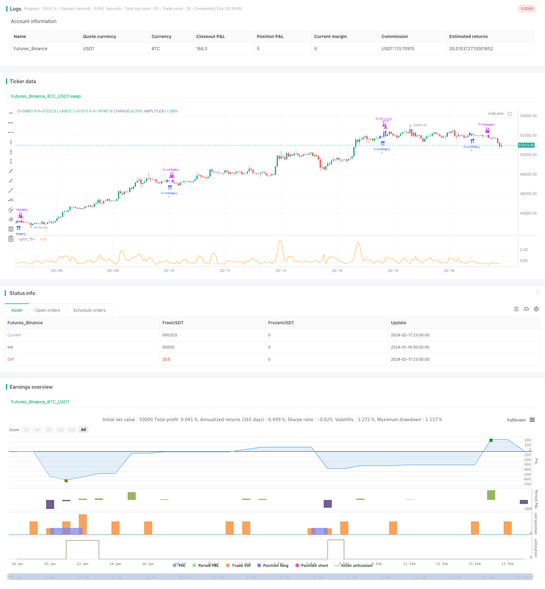

> Name

Three-High-Candle-Reversal-Strategy
> Author

ChaoZhang

> Strategy Description


[trans]
## Overview
The three-high K-line reversal strategy is a short-term trading strategy based on the K-line pattern. It takes advantage of the characteristics of three consecutive positive lines to obtain short-term trading opportunities with a high success rate during the session.
This strategy is mainly used for short-term trading. Its advantage is that the rules are simple and clear and easy to operate. At the same time, it combines stop-loss and take-profit mechanisms to control risks. However, this strategy also has certain risks, such as the continuous long market divergence in trending markets.
## Strategy Principle
This strategy determines whether the recent three K lines are all positive lines, and the daily closing price is higher than the opening price. If the conditions are met, you can go long and the target profit is 50% between the opening price and the closing price.
Specifically, the strategy determines whether the opening prices of the last three K lines, namely the 1st, 2nd and 3rd K lines, are lower than the closing price. If this condition is met, an opportunity may arise.
Additionally, the strategy calculates the percentage difference between the current price and the lowest open price and the highest close price in the last three days. If the percentage is higher than 20% but lower than 50%, it proves that there is not much room for reversal at present, and it is a suitable time to intervene.
When the above conditions are met, you can step in and do long. At this time, the stop-loss price is near the entry price, and the take-profit target is 1.5 times the entry price.
## Advantage Analysis
This strategy has the following advantages:
1. Rules are simple and clear, easy to understand and operate
2. Utilize the trading signals provided by K-line patterns
3. It also combines stop-loss and take-profit mechanisms to effectively control risks.
4. Have a certain winning rate and profit level
## Risk Analysis
This strategy also has the following risks:
1. In the trending market, K-line is prone to the characteristics of rising triple Yang. At this time, going long according to the strategy will deviate from the trend and the risk will be greater.
2. Failure to reverse is the biggest risk, and you will face a larger stop loss.
3. Improper parameter settings can also affect strategy performance
Corresponding risks can be optimized in the following ways:
1. Combine trend indicators to avoid deviation from the trend
2. Optimize the stop loss mechanism to reduce single loss
3. Test and optimize key parameters, such as profit target, stop loss width, etc.
## Optimization direction
This strategy can be optimized from the following directions:
1. Optimize opening conditions, avoid false signals, and improve winning rate
2. Combine with trend indicators to avoid opening positions against the trend
3. Optimize the stop loss mechanism to control single losses to the maximum extent
4. Optimize the profit-taking mechanism and pursue greater profits on the basis of ensuring the winning rate.
5. Parameter optimization, finding the optimal parameter combination
6. Combine with other factors, such as changes in trading volume, to improve system effects
## Summary
The three-high K-line reversal strategy is generally a simple and practical short-term trading strategy. It has the advantages of clear rules, easy operation, and the use of K-line patterns. It also has risks such as deviation from the trend and stop loss being triggered. We can optimize this strategy in a variety of ways to make the system more effective and suitable for short-term trading.
||

## Overview
The Three High Candle Reversal strategy is a short-term trading strategy based on candlestick patterns. It utilizes the features of three consecutive yang lines to obtain relatively high-success-rate short-term trading opportunities during the session.

This strategy is mainly used for short-term trading. Its advantage is that the rules are simple and clear, easy to operate. At the same time, it incorporates stop loss and take profit mechanisms to control risks. However, the strategy also has certain risks, such as divergence in consecutive bull markets in trend markets.   

## Principles  
The strategy judges whether the last three candlesticks are all yang lines, and whether the daily closing price is higher than the opening price. If the conditions are met, you can go long, with a target profit of 50% of the difference between the opening price and closing price.

Specifically, the strategy judges the latest 3 candlesticks, namely the 1st, 2nd and 3rd candlestick, whether their opening prices are lower than the closing prices. If this condition is met, it indicates a potential opportunity.  

In addition, the strategy also calculates the percentage difference between the current price and the lowest opening price and the highest closing price in the last three days. If this percentage is higher than 20% but lower than 50%, it proves that the current reversal space is not large and it is a suitable time to intervene.  

When all the above conditions are met, you can intervene to go long. At this point, the stop loss price is near the entry price, and the take profit target is 1.5 times the entry price.

## Advantage Analysis
The strategy has the following advantages: 

1. The rules are simple and clear, easy to understand and operate  
2. It utilizes the trading signals provided by candlestick patterns
3. It combines stop loss and take profit mechanisms to effectively control risks
4. It has a certain win rate and profit level  

## Risk Analysis
The strategy also has the following risks:   

1. In trend markets, candlesticks tend to show a pattern of three consecutive increases, so going long based on the strategy is contrary to the trend, with greater risk  
2. Failed reversal is the biggest risk, facing greater stop loss
3. Improper parameter settings also affect strategy performance  

To address the risks, optimization can be done in the following ways:  

1. Combine trend indicators to avoid reversals against the trend  
2. Optimize stop loss mechanism to reduce single loss  
3. Test and optimize key parameters such as profit targets, stop loss percentage, etc.  

## Optimization Directions
The strategy can be optimized in the following directions:  

1. Optimize entry conditions to avoid wrong signals and improve win rate  
2. Combine trend indicators to avoid opening positions against trends  
3. Optimize stop loss mechanism to maximize control over single losses  
4. Optimize take profit mechanism to pursue greater profits while ensuring win rate  
5. Parameter optimization to find the optimal parameter combination  
6. Incorporate other factors such as changes in volume to improve system performance   

## Summary  
In summary, the Three High Candle Reversal Strategy is a simple and practical short-term trading strategy. It has the advantages of clear rules, easy operation, use of candlestick patterns, as well as risks such as reversal against trends and stop loss trigger. We can optimize this strategy in many ways to make it perform better for short-term trading use.

[/trans]


> Source (PineScript)

``` pinescript
/*backtest
start: 2024-01-19 00:00:00
end: 2024-02-18 00:00:00
period: 1h
basePeriod: 15m
exchanges: [{"eid":"Futures_Binance","currency":"BTC_USDT"}]
*/

// This Pine Script™ code is subject to the terms of the Mozilla Public License 2.0 at https://mozilla.org/MPL/2.0/
// © nonametr

//@version=5
strategy("3 high candle test")
cond2 = open[3] < close[3]
cond1 = open[2] < close[2]
cond0 = open[1] < close[1]

targetPercent = 0.5
currentPercent = 100 -(( math.min(open[3],open[2],open[1]) / math.max(close[3],close[2],close[1])) * 100)

longExitPrice  = strategy.position_avg_price * ((100 + 1) * 0.01)
shortExitPrice = strategy.position_avg_price * ((100 - 0.4) * 0.01)
plot(currentPercent)

if cond2 == true and cond1 == true and cond0 == true and currentPercent > 0.2 and currentPercent < 0.5
    strategy.entry("Enter Long", strategy.long, qty=1)

if close <= shortExitPrice
    strategy.close("Enter Long")

closeToReduceRisk  = close[1] < open[1] and strategy.openprofit > 0.47

if closeToReduceRisk or close >= longExitPrice
    strategy.close("Enter Long")


```

> Detail

https://www.fmz.com/strategy/442082

> Last Modified

2024-02-19 10:51:40
