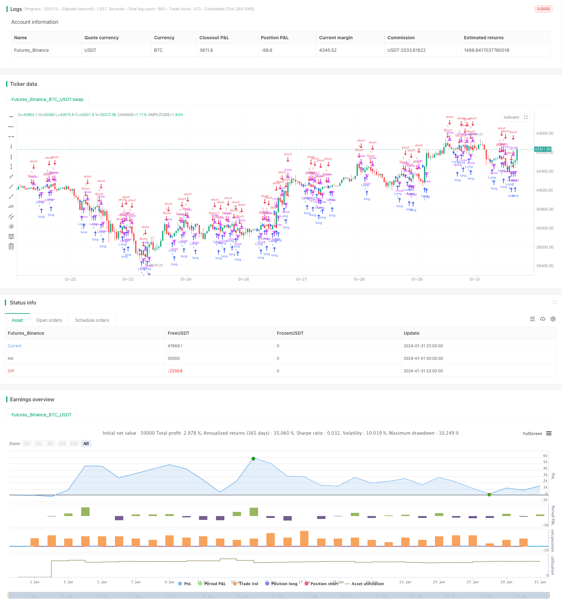

> Name

Trend-Following-Strategy-Based-on-Candlestick-Direction
> Author

ChaoZhang

> Strategy Description


[trans]

## Overview
This strategy is based on the relationship between the closing price and the opening price of the K-line to determine the current trend direction, thereby generating a long or short position signal. Specifically, if the closing price is higher than the opening price, a long signal is generated; if the closing price is lower than the opening price, a short signal is generated.
## Strategy Principle
This strategy is mainly based on the following two judgment conditions to generate trading signals:
1. Judgment of opening signals: If the closing price is higher than the opening price (close > open), and the opening time has been reached, a long signal is generated; if the closing price is lower than the opening price (close < open), and the opening time has been reached, a short signal is generated.
2. Closing conditions: Contrary to the opening signal, if you are long, the loss condition is that the closing price is lower than the opening price plus ATR, and the take-profit condition is that the closing price is higher than the opening price plus ATR times the take-profit ratio; if you are short, the opposite is true.
Through such a design, this strategy makes full use of the K-line direction information to determine the current trend direction and can track the trend in time to generate signals. At the same time, the stop loss and take profit standards are based on the dynamic indicator ATR, which avoids the problems caused by fixed points.
## Strategic Advantages
The biggest advantage of this strategy is its strong ability to use the K-line direction to judge trend tracking. The entry signal judgment is simple, clear and easy to understand. At the same time, combined with the opening time conditions, overnight risks are avoided. The stop-loss and take-profit standards change dynamically, and the position size can be automatically adjusted.
Overall, this strategy has sensitive response and strong tracking ability, and is suitable for trend capture in intermediate periods such as 1 hour and 4 hours.
## Strategy Risk
The main risks that may exist in this strategy are:
1. The number of transactions may be large and easily affected by transaction fees and slippage. The take-profit multiple can be appropriately adjusted for optimization.
2. If the K line diverges, etc., it may generate an error signal. Can be combined with other indicators for filtering.
3. ATR parameter setting will affect the effect of stop loss and take profit. The ATR length and take-profit multiple need to be adjusted according to the market.
4. The opening time setting will also affect the signal effect. Different markets require different opening times.
## Strategy optimization
Aspects that can be further optimized in this strategy include:
1. Use indicators such as moving averages to filter signals to deal with erroneous signals caused by price fluctuations.
2. Add a position management mechanism to control the size of a single investment through indicators such as volatility.
3. Use machine learning and other methods to dynamically optimize the parameters of stop loss and profit, so that they can be adjusted according to the real-time market.
4. Use methods such as sentiment indicators to determine market heat and control overall positions.
## Summarize
This strategy as a whole has been very responsive and can effectively capture trends. By simply comparing the K-line closing price and opening price, the direction is determined and a signal is generated. At the same time, the stop-profit and stop-loss standards adopt the dynamic ATR indicator, which can adjust positions according to volatility. There is still a lot of room for optimization, and other indicators can be further combined for filtering and parameter tuning.
||

## Overview

This strategy generates long or short signals based on the relationship between the closing price and opening price of candlesticks to determine the current trend direction. Specifically, if the closing price is higher than the opening price, a long signal is generated. If the closing price is lower than the opening price, a short signal is generated.

## Strategy Logic

The strategy mainly relies on the following two conditions to generate trading signals:

1. Entry signal logic: If the closing price is higher than the opening price (close > open) and it has reached the opening hour, a long signal is generated. If the closing price is lower than the opening price (close < open) and it has reached the opening hour, a short signal is generated.  

2. Exit conditions: Contrary to entry signals, if already long, the loss condition is closing price below opening price plus ATR value, profit condition is closing price higher than opening price plus ATR multiplied by profit ratio. Vice versa if already short.

With this design, this strategy leverages the directional information from candlesticks to determine trend direction and timely follows the trend. Also, the stop loss and take profit standards dynamically adapt based on ATR, avoiding issues with fixed values.   

## Advantages

The biggest advantage of this strategy is the strong trend following capability utilizing candlestick direction. Entry signals are simple and clear, combined with opening hour condition to avoid overnight risks. Stop loss and take profit standards change dynamically to auto adjust position sizing.

Overall, this strategy has quick reaction and strong tracking ability, suitable for catching trends on middle timeframes like 1H, 4H.

## Risks

Main risks of this strategy include:

1. High trading frequency, easily affected by transaction costs and slippage. Can optimize by adjusting profit ratio.

2. Wrong signals may happen if candlestick divergence occurs. Can filter with other indicators.

3. ATR parameter settings affect stop loss/take profit performance. ATR length and profit ratio need market adjustment.

4. Opening hour setting also impacts signal quality. Different markets need different opening hour.

## Optimization

Aspects that this strategy can further optimize on:

1. Add filters like moving averages to handle wrong signals from price fluctuations.  

2. Incorporate position sizing to control single bet size based on volatility.

3. Utilize machine learning to dynamically optimize stop loss/take profit parameters to adapt to the market.

4. Judge market sentiment using indicators to manage overall position.

## Conclusion

In summary, this strategy has quick reaction and effectively catches trends. It determines direction and generates signals simply based on relationship between candlestick closing and opening prices. Also, dynamic ATR is used for stop loss/take profit standards to adjust position sizing based on volatility. Huge potential to further optimize by adding filters and fine tuning parameters.

[/trans]

> Strategy Arguments


|Argument|Default|Description|
|----|----|----|
|v_input_1|9|Start Hour for Entries|
|v_input_2|true|Activate Long|
|v_input_3|true|Activate Short|
|v_input_4|1.5|Take Profit Ratio|


> Source (PineScript)

``` pinescript
/*backtest
start: 2024-01-01 00:00:00
end: 2024-01-31 23:59:59
period: 1h
basePeriod: 15m
exchanges: [{"eid":"Futures_Binance","currency":"BTC_USDT"}]
*/

//@version=5
strategy("Go with Trend Strategy", overlay=true)

// Input settings
startHour = input(9, title="Start Hour for Entries")
activateLong = input(true, title="Activate Long")
activateShort = input(true, title="Activate Short")
takeProfitRatio = input(1.5, title="Take Profit Ratio")

// Calculate ATR
atrLength = 14  // You can change this value as needed
atrValue = ta.atr(atrLength)

// Calculate entry conditions
enterLong = close > open and hour >= startHour
enterShort = close < open and hour >= startHour

// Strategy logic
if (activateLong and enterLong)
    strategy.entry("Long", strategy.long)

if (activateShort and enterShort)
    strategy.entry("Short", strategy.short)

// Stop loss and take profit conditions
strategy.exit("Exit Long", from_entry="Long", loss=close - atrValue, profit=close + takeProfitRatio * atrValue)
strategy.exit("Exit Short", from_entry="Short", loss=close + atrValue, profit=close - takeProfitRatio * atrValue)

```

> Detail

https://www.fmz.com/strategy/442076

> Last Modified

2024-02-19 10:36:00
