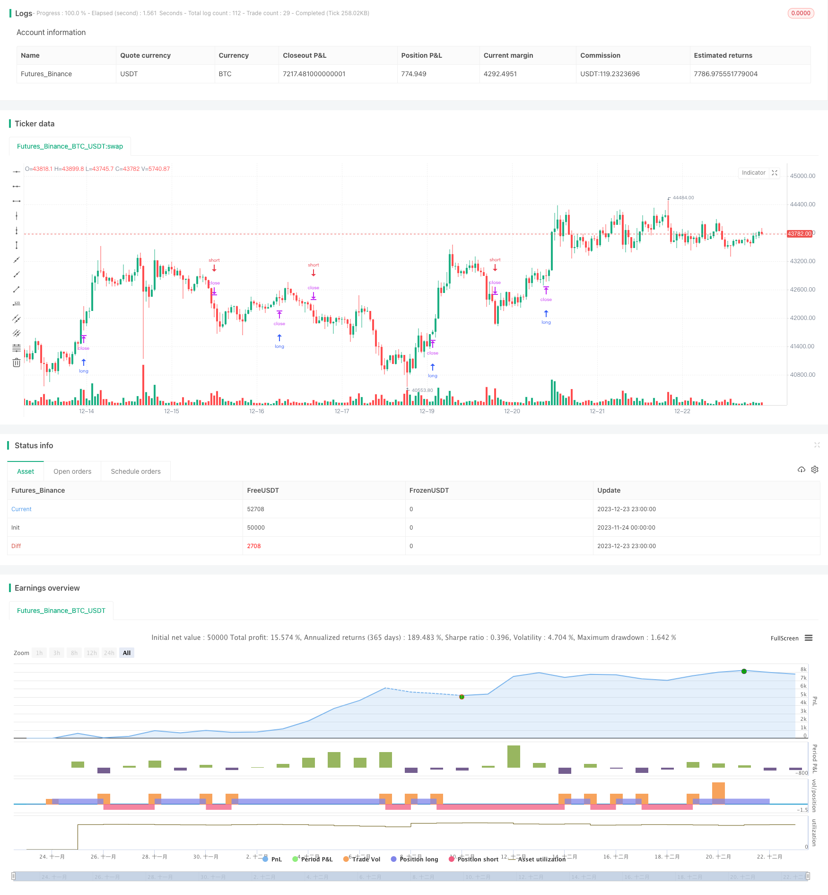

> Name

Momentum Channel Tracking Strategy Keltner-Channel-Tracking-Strategy
> Author

ChaoZhang

> Strategy Description



[trans]

### Overview
This strategy designs trading signals based on the momentum channel indicator, and generates buy and sell signals based on the price breaking through the upper and lower rails of the channel. The strategy only conducts long transactions. If a sell signal occurs, the position will be closed to a short position.
### Strategy Principles
This strategy uses the SMA average and the true fluctuation range of ATR to build a momentum channel. The upper rail and lower rail of the channel are:
Upper rail = SMA + ATR * coefficient
Lower Rail = SMA - ATR * Coefficient
When the price crosses the upper band, a buy signal is generated; when the price crosses the lower band, a sell signal is generated.
Since we only do long positions, if a sell signal occurs, the previous opening order will be canceled and the position will be closed to a short position.
Specifically, the strategy logic is as follows:
1. Use SMA and ATR to build momentum channels
2. When the price goes above the upper limit, set the opening price and place a long order
3. When the price falls below the lower track, close the previous long order and make the position short.
### Advantage Analysis
This strategy has the following advantages:
1. The strategy logic is simple and clear, easy to understand and implement
2. The momentum channel indicator is intuitive and accurate in judging market trends.
3. Only do long trades to avoid the risk of trailing stop loss
4. Conditional order placement is conducive to accurate entries
### Risk Analysis
This strategy also has some risks:
1. When the market fluctuates, positions may be opened and closed frequently.
2. Only do long positions and cannot take advantage of short positions.
3. There is no exit mechanism and manual judgment of the exit point is required.
Countermeasures:
1. Optimize channel parameters and reduce error signals
2. Add short module to do two-way trading
3. Add exit mechanisms such as trailing stop and trailing stop
### Optimization direction
This strategy can be optimized from the following aspects:
1. Optimize parameters, adjust channel period, volatility coefficient and other parameters
2. Add a short module to generate a sell signal when the price crosses the lower rail.
3. Add a stop loss mechanism and combine ATR trailing stop loss
4. Consider adding more filtering conditions to avoid false signals
5. Test the effects of different types of contracts
### Summarize
This strategy is based on the Momentum Channel indicator and captures market trends simply and effectively. The strategy logic is clear and easy to understand, and trading signals are generated by price breaking through the upper and lower rails of the channel. Although it has shortcomings such as only doing long positions and no exit mechanism, it can be improved by optimizing parameters, adding short modules, and adding stop losses. Overall, this strategy has a very large room for improvement and is a quantitative strategy worthy of in-depth study and application.

|| 

### Overview  

This strategy is designed based on the Keltner Channel indicator to generate trading signals when price breaks through the upper and lower bands of the channel. The strategy only goes long, if a sell signal appears, it will flatten the position to neutral.   

### Strategy Logic

The strategy uses SMA and ATR to build the Keltner Channel. The upper and lower bands are calculated as:  

Upper Band = SMA + ATR * Multiplier
Lower Band = SMA - ATR * Multiplier

When price breaks above the upper band, a buy signal is generated. When price breaks below the lower band, a sell signal is generated.  

Since it only goes long, if a sell signal appears, it will cancel previous orders and flatten the position.  

The logic is:

1. Build Keltner Channel with SMA and ATR  
2. When price breaks above upper band, set entry price and go long
3. When price breaks below lower band, flatten previous long position 

### Advantage Analysis   

The advantages of this strategy:

1. Simple and clear logic, easy to understand and implement
2. Keltner Channel is intuitive for trend identification  
3. Only go long avoids chasing stop loss risk
4. Conditional orders for precision entries 

### Risk Analysis

There are also some risks:

1. Frequent open/close trades during market fluctuation
2. Unable to take advantage of short opportunities 
3. Lack of exit mechanism, need manual intervention

Solutions:

1. Optimize channel parameters to reduce false signals
2. Add short module for two-way trading
3. Add exit mechanisms like moving stop loss, trailing stop

### Optimization Directions  

The strategy can be optimized in the following aspects:

1. Optimize parameters like channel period, ATR multiplier etc
2. Add short module based on lower band breakout   
3. Incorporate stop loss mechanisms like ATR trailing stop
4. Consider more filters to avoid false signals
5. Test effectiveness across different products  

### Conclusion   

This strategy effectively catches market trends with simple Keltner Channel rules. The logic is clear and easy to understand. Although the lack of exits and short module, it has great potential for improvements like parameter tuning, adding stops, going short etc. Overall a valuable quant strategy worth in-depth research and application.

[/trans]

> Strategy Arguments


|Argument|Default|Description|
|----|----|----|
|v_input_1|true|useTrueRange|
|v_input_2|20|length|
|v_input_3|true|mult|


> Source (PineScript)

``` pinescript
/*backtest
start: 2023-11-24 00:00:00
end: 2023-12-24 00:00:00
period: 1h
basePeriod: 15m
exchanges: [{"eid":"Futures_Binance","currency":"BTC_USDT"}]
*/

//@version=3
strategy("Keltner Channel Strategy", overlay=true)
source = close

useTrueRange = input(true)
length = input(20, minval=1)
mult = input(1.0)

ma = sma(source, length)
range = useTrueRange ? tr : high - low
rangema = sma(range, length)
upper = ma + rangema * mult
lower = ma - rangema * mult

crossUpper = crossover(source, upper)
crossLower = crossunder(source, lower)

bprice = 0.0
bprice := crossUpper ? high+syminfo.mintick : nz(bprice[1])

sprice = 0.0
sprice := crossLower ? low -syminfo.mintick : nz(sprice[1]) 

crossBcond = false
crossBcond := crossUpper ? true 
 : na(crossBcond[1]) ? false : crossBcond[1]

crossScond = false
crossScond := crossLower ? true 
 : na(crossScond[1]) ? false : crossScond[1]

cancelBcond = crossBcond and (source < ma or high >= bprice )
cancelScond = crossScond and (source > ma or low <= sprice )

if (cancelBcond)
    strategy.cancel("KltChLE")

if (crossUpper)
    strategy.entry("KltChLE", strategy.long, stop=bprice, comment="KltChLE")

if (cancelScond)
    strategy.cancel("KltChSE")

if (crossLower)
    strategy.entry("KltChSE", strategy.short, stop=sprice, comment="KltChSE")

//plot(strategy.equity, title="equity", color=red, linewidth=2, style=areabr)
```

> Detail

https://www.fmz.com/strategy/436498

> Last Modified

2023-12-25 13:14:24
